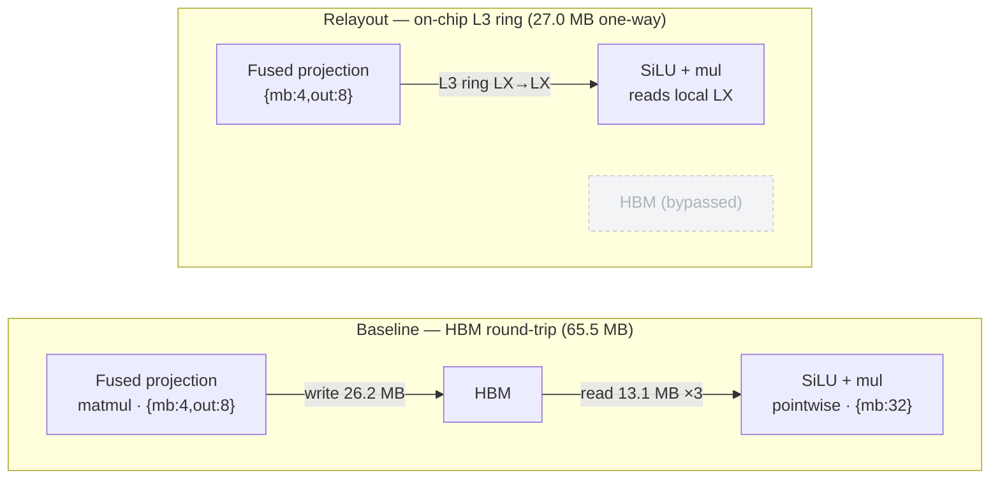
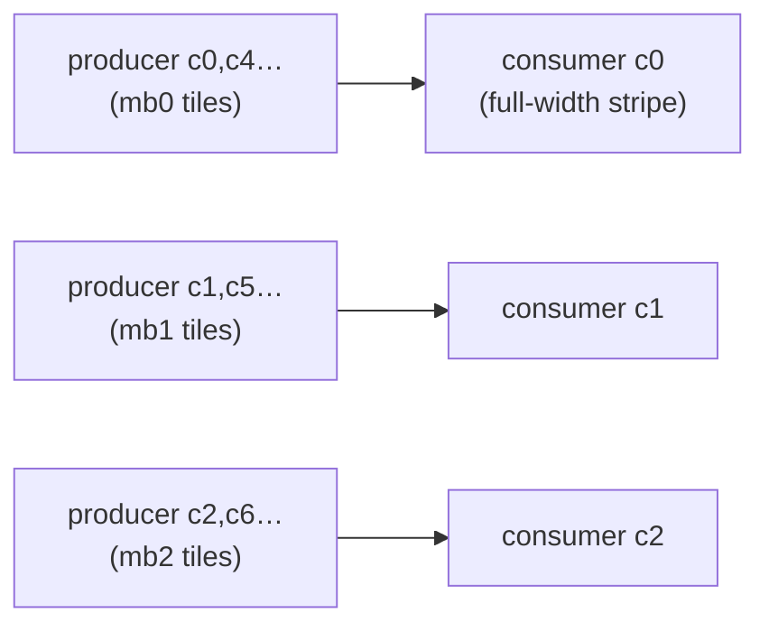
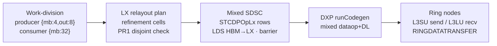

# Trading an HBM round-trip for an on-chip ring move — the LX relayout pass

Companion to `lx_relayout_stcdp_first_principles.html` (the visually-rich version). This is the
portable markdown with the same content, the bandwidth math worked out, and GitHub-rendered diagrams.

On Spyre, a producer matmul and the pointwise op that consumes it usually want **different per-core
ownership of the same physical LX sticks**. The baseline reconciles that mismatch the only way it can
move data between arbitrary cores: it bounces the activation through HBM — producer writes it out,
consumer reads it back. The **LX relayout pass** detects the ownership mismatch in Inductor and inserts
an **on-chip LX→LX movement over the L3 ring**, so the consumer reads from local LX and the HBM
round-trip disappears. The data rides the *existing* `STCDPOpLx` op through a range-encoded payload — no
new deeptools op class is introduced.

| Workload | Baseline | Relayout | Kernel win |
| --- | ---: | ---: | ---: |
| Granite causal prefill **block** | 16.333 ms | 13.838 ms | **15.3%** (−2.495) |
| ↳ Attention kernel in block | 3.412 ms | 2.918 ms | **14.5%** (−0.494) |
| ↳ MLP / SwiGLU kernel in block | 11.025 ms | 9.021 ms | **18.2%** (−2.004) |
| Standalone fused FMS SwiGLU `[1,512,4096]` | 12.561 ms | 10.179 ms | **19.0%** (−2.382) |

Block **wall** time also drops 23.062→20.490 ms (11.2%). Memory time rises 0.220→0.286 ms (+0.066), the
ring/relay cost surfacing. Structurally the full block gains 6 `OnChipMoveSTCDPOpLx` rows, drops
`ReStickifyOpHBM` 5→4, `neg` 1→0, `mul` 13→10.

> **Independently reproduced on this pod.** A freshly-built patched `dxp_standalone` (the STCDP range patch
> on local deeptools master + harvest runtime) was A/B'd on the fused SwiGLU `[1,512,4096]` with
> `SPYRE_ONCHIP_MOVE_CARRIER=stcdp_range`. It emitted exactly **2** `OnChipMoveSTCDPOpLx` mixed SDSCs
> (baseline: 0) — matching the 0→2 signature — and saved **~2.40 ms** of device time (full-forward
> wall-clock 19.11→16.71 ms), in line with the reported 2.382 ms kernel-time win. The fractional wall-clock
> delta is smaller (12.6%) only because the wall harness carries a constant H2D/D2H/Python overhead that
> cancels in the A/B.

## Why — two good layouts, an HBM tax at the boundary

Spyre's 8×8 PT array (the matmul engine) is **weight-stationary**: the weight tile `[K,N]` sits resident in the array and
tokens (the M dimension) stream past. A matmul keeps the array filled by tiling **N** (output width) and
**M** (tokens) across the 32 cores — for the fused SwiGLU projection that is `{mb:4, out:8}`, where each
core owns a `(mb_i, out_j)` **tile** (4 rows × ⅛-width of the fused buffer).

The pointwise SiLU+mul chain has no weight and no cross-core dependency; the SFP engines want each core to
own a contiguous **full-width row-stripe**, so the consumer picks pure-M `{mb:32}` (16 rows × full `2H`
width per core). Each layout is individually optimal for its engine. The problem is the **handoff**: for
any physical stick, the producer's owner core (a 2-D tile) and the consumer's owner core (a row-stripe)
are **different cores**. Same sticks, no arithmetic — only the `PerCoreView` owner changes. The baseline's
only cross-core path is HBM.



For `[1,512,4096]`: a 26.214 MB projection write plus three 13.107 MB half-reads = **65.536 MB of HBM
round-trip traffic that exists purely to re-shuffle ownership.** The relayout replaces it with a 27.034 MB
one-way ring move — 2.42× fewer bytes, on a fabric ~5–6× faster than the *realized* HBM rate.

## What — refinement cells, a disjoint contract, an existing carrier

The pass runs per producer→consumer read edge. It reads both `PerCoreView`s; if they are identical it
defers to the regular LX planner, and if the producer's write is a K-split partial it bails. Otherwise it
computes a **common refinement** (`common_splits[dim] = lcm(producer, consumer)`, refined to whole-stick
128-byte cells). Each **cell** resolves its owning **source core** (producer) and **dest core** (consumer)
plus per-core LX byte offsets.

This is a strict **PR1 = disjoint** contract — one-to-one whole-stick relayout, gather/scatter *without
duplication*:

- **No fan-out / multicast** — two cores mapping to the same owner key → `duplicate-owner`, edge rejected.
- **No K-split partials** — reduction-split producers rejected (no partial-sum gather).
- **Exact tiling proven** — coverage check: no gaps, no overlapping destinations, no out-of-bounds.
- **Whole-stick / 128-byte aligned** — every cell stick-sized; per-dest-core ranges sorted-contiguous.

The **carrier** is the key engineering choice. The *identical* cells can ship two ways: a bespoke new
`LXCoordinateRemapOp`, or — what this branch uses — the `stcdp_range` carrier, which re-nests the same
movement ranges under `op.rangedLxRemap` on the **existing `STCDPOpLx`** op. The planner builds one
carrier-neutral payload; the swap is purely in codegen. The whole feature rides existing op vocabulary and
the existing L3 ring path. (For the carrier trade-off vs `coordinate_remap`, see
`ATTN_ALLGATHER_PR_PLACEMENT.md`.)

The ownership change, concretely — each consumer row-stripe is reassembled from several producer tiles
that lived on different cores:



13,200 stick-movements in 10 chunks — a pure ownership permutation over whole sticks.

## How — frontend planner → mixed SDSC → ring nodes

**Frontend (torch-spyre / Inductor).** `plan_onchip_moves` walks the graph; `plan_onchip_move_edge` plans
each read edge into refinement cells. Cells split into **cross-core** moves (the real ring traffic) and
**same-core** moves. A core cannot ring-transfer to itself, so same-core cells use a **two-leg
neighbor-scratch relay** (`relay_core = (source_core+1) % sencores`): write the stick into a scratch window
on the neighbor, read it back. This relay is shared by both carriers (not a differentiator) and is the ~3%
byte overhead (and the +0.066 ms memory-time bump). The pass retargets the producer output LDS and the
matching consumer input LDS from HBM to **LX**, and emits a per-core **sequential mixed schedule**:
`producer LX write → STCDPOpLx rows → consumer reads its LX base` (a barrier — no overlap with consumer
compute in PR1).

**Backend (deeptools).** The `STCDPOpLx` op carries a `rangedLxRemap` payload, parsed in
`dsc/dataOpDsc.cpp` (`rangeModeEnabled = true`, producer/consumer LX bases, compact `movementRanges[]`
expanded into N movements). PCFG generation lowers each movement into **two L3 ring nodes**: a source-side
`L3SU` send (LX→ring) and a dest-side `L3LU` receive (ring→LX), each a `RINGDATATRANSFER` node with
whole-stick alignment and a stick-loop nest for multi-stick moves. `dxp` permits the mixed
`dataOpdscs_ + dscs_ + schedule` case and routes it through `runDcgForDataOpsDlOps`. **No
SFP/PT/arithmetic node is ever emitted** — the lowering is pure data movement on the existing ring path,
reusing `STCDPOpLx` (`static_cast<STCDPOpLx*>`), not a new op.



One stick's path: `LX → [L3SU send] → (( ring )) → [L3LU recv] → LX`.

## The math — why removing 65.5 MB buys ~19%

**Peak BW cannot explain the win.** At HBM peak (166 GB/s), removing 65.536 MB would save only
`65.536e6 / 166e9 = 0.395 ms`. The measured standalone SwiGLU win is **2.382 ms — ~6× larger**. A kernel
cannot save more wall time than the removed traffic costs at peak *unless it was running far below peak*.
So these kernels are **HBM-bandwidth-bound at a realized BW well below peak** — the array-under-fill regime
(PT-util ~30%, strided / partial-stick HBM access).

**Solve for the realized BW** as `eliminated_bytes / win`:

```
standalone SwiGLU:  65.536e6 / 2.382e-3 = 27.5 GB/s   (16.6% of peak)
block MLP/SwiGLU:   65.536e6 / 2.004e-3 = 32.7 GB/s   (19.7% of peak)
```

Both land at **~27–33 GB/s ≈ 16–20% of peak**. Crucially this *fell out of* (bytes ÷ time) — it was not
fitted — and it independently agrees with the known ~30% array-under-fill HBM utilization. That agreement
is the consistency check that the mechanism is real.

**Ring add-back.** The pass moves **27.034 MB one-way** over the ring (`remap_bytes = 27,033,600`). At ring
peak: `27.034e6 / 166e9 = 0.163 ms` — one-way 27 MB vs a round-trip 65.5 MB (2.42× fewer bytes), on a
fabric that is *not* the bottleneck, so it overlaps with compute. Even charged fully at peak, 0.163 ms is
<7% of the win.

**Net model:**

```
win ≈ E_HBM / BW_realized  −  R_ring / BW_ring
    = 65.536e6 / 30e9  −  27.034e6 / 166e9
    = 2.185 − 0.163  =  2.02 ms
```

Predicted ~2.0 ms vs measured 2.382 / 2.004 ms — the model brackets the measurement without tuning. (At
27.5 GB/s the eliminated term alone is 2.38 ms; ring overlap pushes net toward the measured value.) The
byte accounting also cross-checks: packed payload `2 × (512 × 200 × 128 B) = 26.214 MB`; `remap_bytes` is
27.034 MB = **1.031×** — the extra 0.82 MB (+3.125%) is exactly the same-core neighbor-scratch double-move.

| Workload | Eliminated MB | Win (ms) | Implied realized HBM | % of peak |
| --- | ---: | ---: | ---: | ---: |
| Standalone fused SwiGLU | 65.536 | 2.382 | 27.5 GB/s | 16.6% |
| Block MLP/SwiGLU (1-handoff basis) | 65.536 | 2.004 | 32.7 GB/s | 19.7% |
| Block attention (inferred) | ~14–16 | 0.494 | 27.5–32.7 | 16.6–19.7% |

**Limits of the model.** The realized-BW assumption (~27–33 GB/s) is the dominant error term — a
consistency argument with the known ~30% array-under-fill, not a measured BW; ±20% there moves the
prediction ±20%. The ring term is charged at peak with zero compute overlap (conservative). The +0.066 ms
block memory-time rise is the ring/relay cost surfacing in the memory bucket. And block **wall** win (11.2%)
< **kernel** win (15.3%) because wall carries fixed host/dispatch overhead the relayout never touches.

## Attention — same primitive, smaller tensors

Attention has the same **matmul→pointwise→matmul** shape: `QK^T` (2-D `{mb,out}`) → softmax (pure-M
`{mb:32}`) → `probs@V` (2-D). Both the **QK^T→softmax** and **softmax→probs@V** edges are one-to-one
cross-core ownership changes over the same physical scores/probs sticks — exactly the disjoint relayouts
PR1 covers. The block gains 6 `OnChipMoveSTCDPOpLx` rows split across MLP and attention; the attention
bucket improves 3.412→2.918 ms (**14.5%, −0.494 ms**).

Inverting at the same realized-BW band gives `0.494e-3 × 27.5e9 = 13.6 MB` to `16.2 MB` eliminated —
**~14–16 MB**, roughly ¼ of the SwiGLU handoff, consistent with attention's smaller tensors (scores
`[512,512]`, ctx `[512,128]` vs the `2H=25600`-wide SwiGLU buffer). Same model, fewer bytes — the more
conservative case. This explicitly does **not** include the multicast/all-gather K-replication case
(duplicate-owner fan-out), which is out of PR1 scope.

## Scope & what's next

PR1 ships the disjoint case only — one-to-one, whole-stick, no duplication — and deliberately rejects
everything that needs new semantics. The follow-ups widen the planner contract additively rather than
redesigning it:

- **Fan-out / all-gather** — multicast (one source stick → many dest cores), e.g. attention K-replication.
  Needs duplicate-owner support and a multicast ring primitive.
- **K-split partial gather** — relaying partial-sum outputs of a reduction-split producer instead of
  HBM-accumulating.
- **Weight preload** — the same LX-residency idea applied to stationary weights (the remaining
  `ReStickifyOpHBM` rows).
- **Decode** — PR1 evidence is prefill (`M=512`); decode (`M=1`/padded) has a different fill regime.
- **Warp-specialization / overlap** — PR1's mixed schedule is a strict sequential barrier; overlapping the
  ring transfer with consumer compute would recover the ring add-back term entirely.

The mechanism is proven on the cheapest legal case and rides existing op vocabulary; that is what makes the
`stcdp_range` carrier the lower-risk path to landing in the gated deeptools repo.

---

*Sources: Codex design doc "LX Planner Relayout with STCDPOpLx" (commit `cbdbd538`), SDSC tables and
measured wins; `remap_bytes = 27,033,600` from the coordinate-remap snapshot (same planner/edges).
Frontend: `torch_spyre/_inductor/onchip_move.py`, `.../codegen/onchip_move.py`, `config.py`,
`tests/inductor/test_onchip_move.py`. Backend:
`third_party/deeptools/patches/lx-relayout-stcdp-range-deeptools.patch` (base `621bb9fad8`, head
`29254c37d3`) touching `dsc/dataOpDsc.{cpp,h}`, `dcg/dcg_fe/pcfg_gen/pcfg_gen.cpp`, `transfer_compute.cpp`,
`dxp/SdscTree.cpp`, `dxp/dxp.cpp`. Draft research via a 6-agent study+math workflow; numbers
cross-checked against the design doc and snapshot.*
