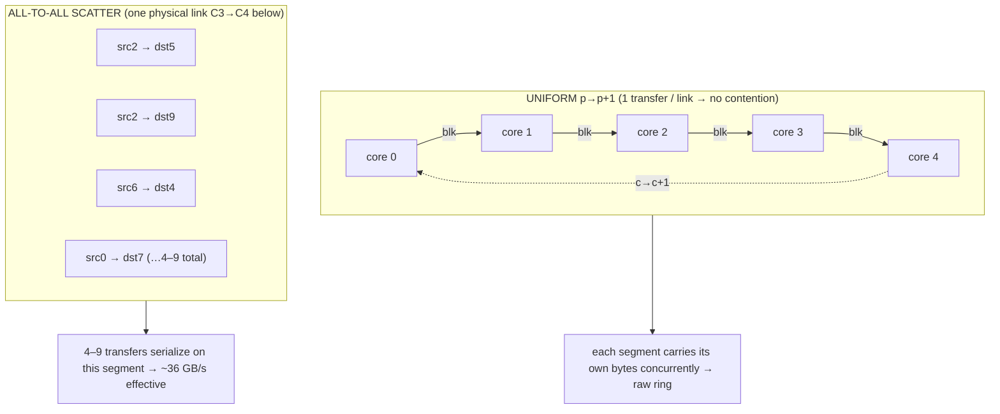

# AIU Ring Speed: What the L3/RIU Ring Actually Delivers

## The Question

The AIU datasheet and the compiler's own cost model both say the on-chip ring moves data at **128–166 GB/s per direction**. Yet the one on-chip relayout we actually measured on device — the production core-to-core "shuffle" — runs at **~36 GB/s**, about a fifth of that. So which is true? Is the ring a ~36 GB/s wire that the model wildly over-promises, or does it deliver its rated bandwidth and we happened to measure a pathological pattern?

This document answers that from first principles and from device measurement. The short version: **~36 GB/s is a contention floor for one specific traffic pattern (all-to-all scatter), not a property of the ring.** For uniform / ring-pipelined patterns the same hardware delivers **130 GB/s effective and ~250 GB/s aggregate** — the rated raw bandwidth. The distinguishing variable is *per-link transfer count*, not burst size and not a hidden hardware cap.

---

## The Hardware and the Contention Mechanism

The AIU has **32 cores on an L3/RIU BiRing** — bidirectional, with independent bandwidth per direction. When a tensor must change *which core owns which piece* (a relayout / SHUFFLE), the data moves core-to-core over this ring via the `STCDPOpLx` op.

Two numbers define the raw wire:

- **`ringBw = 128` GB/s/dir** — hardcoded default (`dsc/sysdef.cpp:216`), consumed by `perfmodel.cpp`.
- **166 GB/s/dir** — the dd2 JSON `RIU-To-RIU-Link` value, matching the BiRing spec sheet.

Both are per-direction and duplex. Critically, the cost model's **per-hop latency term λ is 0** — there is no fixed ns/hop penalty. Multi-hop cost emerges *only* from **per-link occupancy**: if several transfers must cross the same ring segment, they serialize on that segment.

That single fact is the whole story. Effective bandwidth on this fabric is governed by **how many transfers share each ring link**:



There is exactly one other knob in the model that touches ring bandwidth: the **`BurstEfficiency.def`** table (`dcg/dcg_fe/scheduler/BurstEfficiency.def`), a closed-form 32×32 lookup

```
eff(burst b, degree m) = 0.1000 + (b-1)·0.025 − (m-1)·0.0005   (max 0.875)
```

It is tempting to read the ~4× derate off this table (`eff(8-stick burst) ≈ 0.275 → 0.275·128 ≈ 35 GB/s`, a near-exact match to the measured 36). **But this is a coincidence of levels, not the mechanism.** `BurstEfficiency` is **never** multiplied into ring bandwidth in the latency model — in `perfmodel.cpp` (lines 1889/1897/1987/1997) every ring link is assigned raw `ringBw = 128` with no efficiency factor. The table is consumed *only* by the scheduler (`L3DlOpsScheduler`) as a **chunk-selection objective** — it steers which chunk parameters get picked; it emits no bandwidth and no time. So the model, read honestly, predicts the ring runs at raw 128 for **every** pattern, and the only thing that can pull effective bandwidth down is per-link contention. Finding 2 below tests — and confirms — that burst is not the lever, exactly as the model's structure implies.

---

## The Measurement Method (additive-differential slope + honor control)

Every number here is device-measured with one method, chosen because the isolated relayout SDSC faults on device (it needs its live LX context) and because the profiler's finest granularity is a whole fused bundle (it cannot expose a single `STCDPOpLx` event).

1. **Fire a real relayout** on device from a live SwiGLU compile; monkeypatch `launch_kernel` to **capture the relayout's actual device-tensor args**.
2. **Splice K extra copies** of that relayout's `sdsc_execute` line into the compiled `bundle.mlir`; recompile with the patched dxp.
3. **Replay per-iteration-synced** (wall + device), for K ∈ {0, 8, 16, …}.
4. **Fit `slope = Δtime / ΔK`.** The slope is the *marginal* cost of one move — it cancels all fixed program and host overhead. Then **ρ = bytes_moved / slope**, defined on the **logical tensor bytes** read live from the SDSC.

**The honor control makes the method trustworthy.** The additive-differential slope is only meaningful if the swept knob actually moves bytes. So we independently **sweep the moved byte volume** and require the slope to change with it. When we cut the moved bytes ~12.6× (via `movementRanges`), the per-move slope collapsed 192 → 80 µs — proving the runtime genuinely consumes the movement, so a *null* result (Finding 2) is real device physics, not a cosmetic edit that the compiler silently discarded. Fit quality was **R² ≥ 0.998** on every sweep, ≥ 0.9999 on the strided baselines.

---

## Finding 1 — The All-to-All Scatter Is Slow: ~36 GB/s (~22% of raw)

This is the **production relayout pattern** — a permutation of core-ownership. Its geometry is inherently contended: **524 movement descriptors**, each source core feeding **7–9** destination cores and each destination gathering from **4** sources ⇒ every ring link carries **4–9** transfers ⇒ they serialize.

Measured effective ρ (two sizes, same pattern, slope method):

| shape | bytes / move | slope µs/move | R² | ρ_eff (GB/s) |
|---|---:|---:|---:|---:|
| S=512 | 13,107,200 | 362.40 | 0.99990 | **36.17** |
| S=256 | 6,553,600 | 184.86 | 0.99997 | **35.45** |

**Decomposition.** A same-pattern two-size fit isolates a small per-execute constant **F ≈ 7 µs** and an effective ring rate of ~37 GB/s. An honor-control fit that *also* removes descriptors (strided 6.758 MB vs a sparse 0.537 MB control) attributes more to setup — **~70 µs fixed per-move + ~55 GB/s marginal (contended) streaming**. The two decompositions split cost along different axes (per-execute vs per-descriptor), and agree on the essential point: **even the pure streaming rate, all fixed overhead removed, is only ~55 GB/s — about one-third of raw.** The scatter is contention-bound, not overhead-bound.

**The production `dl-dsc` path hits the same floor.** The `dl-dsc` scatter frontend records producer/consumer coordinate metadata; the backend reads the coordinate mismatch and **auto-synthesizes the identical `STCDPOpLx`**, sized to the resident piece. It is the same op on the same ring moving the same 13.1 MB, so it carries the same **~36 GB/s** effective rate (modeled by op-equivalence; the fused move has no standalone execute line to slope-isolate). Its end-to-end value on a fused SwiGLU is **−147 µs device / 1.017×** (13.1 MB activation kept on-chip instead of round-tripping HBM) — **~1.4× at the moved edge**, but only **~1.7% of the layer**, because the ring move is the minority of the HBM cost it displaces.

---

## Finding 2 — Burst Size Is NOT the Lever

The `BurstEfficiency` table predicts that enlarging the per-descriptor burst from 8 sticks to 32 should lift a contiguous move ~2.9× (0.875 / 0.275) — to ~112–145 GB/s. We tested it directly on the same all-to-all scatter, enlarging the burst **~50–100×** (8 → ~800 sticks) while holding bytes and topology fixed:

| variant | per-move slope | ρ_eff (GB/s) | note |
|---|---:|---:|---|
| **strided** (as-emitted, burst = 8 sticks) | 192.4 µs (min 185.6) | 34.1 / 35.3 | reproduces the ~36 baseline |
| **contig** (same bytes + topology, burst up to ~50× larger) | 197.7 / 196.4 µs | 33.1 / 33.4 | **no change** |
| **sparse** (honor control, ~12.6× fewer bytes) | 80.3 / 77.9 µs | — | slope collapsed ✔ |

**ρ_contig / ρ_strided = 0.958× (median), 1.004× (min) → zero improvement.** The honor control (slope 192 → 80 µs when bytes were cut) proves the runtime really moved the bytes, so this null is real. Enlarging the burst bought **1.0×**. The `BurstEfficiency` table is a scheduler *selection* heuristic; it is not a bandwidth multiplier, and it does not govern the device rate. The ~36 is contention, not a burst derate.

---

## Finding 3 — The Uniform p→p+1 Shift Is FAST: It Reaches Raw Ring

A uniform single-hop unicast rotation — each core `c` sends one contiguous block to neighbor `c+1` — is **33 descriptors** (vs 524) with **exactly one transfer per link → zero contention**. Same slope method, same ρ definition that pinned the scatter at 36:

| bytes / move | total moved | slope µs | **ρ_eff (GB/s)** | R² |
|---:|---:|---:|---:|---:|
| 131,072 | 4.06 MB | 75.28 | **54.0** | 0.99993 |
| 262,144 | 8.13 MB | 89.79 | **90.5** | 0.99984 |
| 524,288 | 16.25 MB | 124.78 | **130.3** | 0.99850 |

(Min-clock corroboration: 53.2 / 92.8 / 131.5 GB/s — not a tail artifact.)

The effective rate **rises with move size** because the fixed per-move setup amortizes. The linear decomposition:

```
slope_µs = 57.8 µs (fixed per-move) + bytes × 4.096e-6      (R² = 0.998)
⇒ ρ_stream ≈ 244 GB/s (median) … 254 GB/s (min)
```

The ~250 GB/s streaming asymptote is the **contention-free aggregate of 31 concurrent ring segments** carrying their bytes at once — above a single raw link, as expected.

**Head-to-head, the distinguishing variable is per-link transfer count:**

| pattern | ρ (GB/s) | transfers / link | descriptors | kind |
|---|---:|---:|---:|---|
| All-to-all scatter | **34–36** | 4–9 | 524 | measured |
| Uniform p→p+1 @ 4.06 MB | 54.0 | **1** | 33 | measured |
| Uniform p→p+1 @ 8.13 MB | 90.5 | **1** | 33 | measured |
| Uniform p→p+1 @ 16.25 MB | **130.3** | **1** | 33 | measured |
| Uniform streaming asymptote | ~244–254 | **1** | 33 | measured (extrapolated) |
| Model: raw 128 ÷ contention = 1 | 100–145 | 1 | — | modeled |
| Raw ring, single link | 128–145 (166 peak/dir) | — | — | spec |

At byte-volume matched to the scatter (~8 MB): **90.5 vs 36 = 2.5×**. At 16 MB: **130 / 36 = 3.6×**, landing **dead center of the model's 100–145 raw-ring band** (~1.02× the raw single link). Removing contention — and nothing else — moved effective ρ from 36 to 130. **The contention model was right.**

---

## The Verdict

**~36 GB/s is an all-to-all contention floor, not a ring limit.**

The L3/RIU ring delivers its raw bandwidth — **~130 GB/s effective, ~250 GB/s aggregate** — for **uniform / ring-pipelined** patterns, and chokes to **~36 GB/s** on **all-to-all scatter**, where 4–9 transfers serialize on each shared link. Burst size is not the lever (measured 1.0×); per-link transfer count is the lever (measured 2.5–3.6×). The bandwidth ladder:

| level | ρ | pattern | evidence |
|---|---:|---|---|
| Raw ring, spec | 128–166 GB/s/dir | contiguous single-arc | spec / model |
| **Uniform streaming aggregate** | **~250 GB/s** | p→p+1, 31 segments | measured (extrapolated) |
| **Uniform effective @ 16 MB** | **130 GB/s** | p→p+1, one transfer/link | measured |
| **Uniform effective @ 4 MB** | **54 GB/s** | p→p+1, overhead-dominated | measured |
| Scatter marginal streaming | ~55 GB/s | all-to-all, contended | measured (decomposed) |
| **All-to-all scatter effective** | **~36 GB/s** | 524 descriptors, 4–9/link | measured |

---

## Implications

**(a) Weight-carousel rotation transport is fast — the ring is not its bottleneck.** Carousel rotation *is* a uniform p→p+1 single-hop shift, the exact zero-contention pattern measured at 130 GB/s effective / ~250 GB/s aggregate. The earlier worry that rotation would be dragged to the 36 GB/s scatter floor is **refuted**. Size the carousel against ~128 GB/s per link, and keep rotated tiles large to amortize the ~58 µs per-move setup (ρ is 54 at 4 MB but 130 at 16 MB).

**(b) Ring-pipelined all-gather / LSE-fold (bucket-brigade) is viable and fast.** Each stage is a nearest-neighbor p→p+1 hop → the same one-transfer-per-link regime → the same 130 → ~250 GB/s. The pipeline cost is `#hops × (≈58 µs setup + bytes/ρ_stream)`, so keep per-hop payloads large enough to stay overhead-amortized; a well-sized brigade runs at ring speed, not the scatter floor.

**(c) The production comms-collectives scatter is genuinely stuck at ~36 — and the lever is placement, not burst.** It inherently oversubscribes shared links (each source → 7–9 dests, each dest ← 4 sources). Burst enlargement bought 1.0×; eliminating contention bought 2.5–3.6×. So the way off 36 is **ring-distance-aware placement / decomposition**: assign core-ownership so fewer transfers cross-cut the same links, or restructure the collective as a *sequence of neighbor shifts* (each contention-free). Topology-aware scheduling, not bigger bursts.

**(d) The cost model's ring term should be pattern-aware, not a single ρ.** A flat `bytes / 128` under-costs the scatter by ~4× — biasing the planner toward on-chip relayout precisely where it is slowest. The ring-occupancy term should scale by **per-link transfer count (contention degree)**: budget **~36 GB/s for all-to-all scatter** and **~130+ GB/s for uniform / ring-pipelined** patterns, plus a fixed **~7 µs per STCDP execute** (λ per-hop stays 0, consistent with the backend). Hardcoding one ρ across regimes is the failure mode these measurements exist to prevent.
