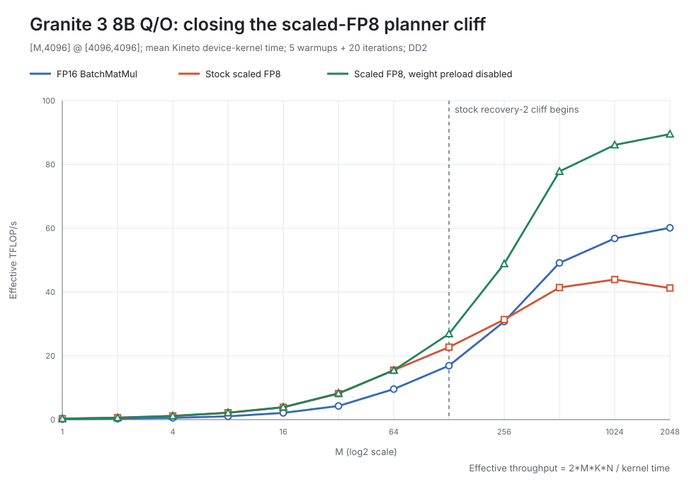

# Q/O scaled-FP8 planner PoC

## Bottom line

For the Granite 3 8B Q/O projection, `[M,4096] @ [4096,4096]`, one
experimental DeepTools switch closes the large-M scaled-FP8 regression:

```text
DT_OPT=autopilot=1,weipreload=0
```

It leaves the small-M results effectively unchanged and raises scaled FP8 from
slower than FP16 to `1.49-1.58x` FP16 throughput at `M=512-2048`. This proves
the gap is recoverable in compilation; the switch is a diagnostic whole-graph
hack, not the proposed production fix. At `M=2048`, the observed `1.489x` is
93.1% of the optimistic `1.599x` stream-only byte ceiling for this shape.



## Condensed result

Each latency is the mean of 20 Kineto `cat=="kernel"` events after five
warmups on DD2. The three variants were freshly measured in a rotating order.

| M | FP16 | Stock scaled FP8 | PoC scaled FP8 | Stock FP8 / FP16 | PoC FP8 / FP16 | PoC / stock FP8 |
|---:|---:|---:|---:|---:|---:|---:|
| 1 | 232.145 us | 112.256 us | 112.977 us | 2.068x | 2.055x | 0.994x |
| 512 | 349.637 us | 414.814 us | 220.793 us | 0.843x | 1.584x | 1.879x |
| 2048 | 1142.804 us | 1665.736 us | 767.702 us | 0.686x | 1.489x | 2.170x |

The full twelve-point table is in
[`qo_weipreload_poc_summary.md`](qo_weipreload_poc_summary.md).

The timed scaled-FP8 kernel includes:

- FP16-to-FP8 `Qfp8` conversion and packing;
- inserted relayout work;
- FP8 BatchMatMul;
- both scale-recovery stages; and
- FP16 output production.

Scale derivation is excluded. The standalone graph supplies fixed unit
per-row activation scales and per-output-channel weight scales so that the
planner issue can be isolated while preserving the production scaled-matmul
structure.

All 36 fresh cases passed the CPU-reference correctness gate. For the
large-M cases, the PoC and stock paths have the same recorded numerical error.

## Exact mechanism

This is a core-fanout problem in the second scale-recovery operation, not a
loss of corelet capability in FP8:

| Stage at M=512 | Stock scaled FP8 | PoC scaled FP8 |
|---|---:|---:|
| `Qfp8` | 32 cores, 2 corelets | 32 cores, 2 corelets |
| FP8 BatchMatMul | 32 cores, 2 corelets | 32 cores, 2 corelets |
| Scale recovery 1 | 32 cores, 2 corelets | 32 cores, 2 corelets |
| Scale recovery 2 | **1 core, 2 corelets** | **32 cores, 2 corelets** |

The exact M=512 planner-decision trace shows stock DeepTools classifying the
tiny static scale input as preload-favorable and adding the hard work-division
constraint:

```text
product({MB,X,Y,OUT}) <= 1
```

At M=512, the second recovery stage initially inherits the parent
`MB=8, OUT=4` split. The constraint rejects it and leaves `MB=1, OUT=1`,
serializing an `M x N` recovery over one core. With `weipreload=0`, that
constraint is absent and the same 32-core split is accepted. The all-M
structural audit shows the same one-core recovery collapse for every
`M=128-2048`, and the all-M timing cure is consistent with the same cause;
the exact constraint-level interposer trace was collected at M=512.

Both programs use two corelets. Mudhakar's corelet intuition was directionally
useful because work division determines compute parallelism, but the observed
cliff is specifically **32 cores to one core**, not two corelets to one.

The source-to-decision chain is documented in
[`structural_audit/decision_evidence/SOURCE_MECHANISM.md`](structural_audit/decision_evidence/SOURCE_MECHANISM.md).

## Production takeaway

Do not ship `weipreload=0`: it disables a global optimization and can discard
beneficial weight preloading elsewhere. The production-shaped fix should:

1. identify this small broadcast-scale recovery pattern narrowly;
2. exclude or soften its static-reuse split cap when the dynamic `M x N`
   output dominates;
3. preserve useful FP8-matmul weight preload;
4. co-plan recovery ownership with the preceding matmul where legal; and
5. validate the precision-aware policy on non-Granite shapes.

That same semantic distinction belongs in torch-spyre's eventual scaled-matmul
planner: model FP8 conversion and recovery stages separately instead of
applying FP16 BatchMatMul assumptions to the entire pipeline.

## Evidence and reproduction

- Canonical measurements:
  [`qo_weipreload_poc_summary.json`](qo_weipreload_poc_summary.json)
- Machine-readable comparison:
  [`qo_weipreload_poc_comparison.csv`](qo_weipreload_poc_comparison.csv)
- Raw result JSON and pinned provenance:
  [`raw/`](raw/)
- Stock/treatment emitted artifacts at `M=512` and `M=2048`:
  [`structural_audit/emitted_artifacts/`](structural_audit/emitted_artifacts/)
- Instrumented planner decisions:
  [`structural_audit/decision_evidence/`](structural_audit/decision_evidence/)
- Sweep runner:
  [`../../../../benchmarks/sendnn_fp8_matmul/run_qo_weipreload_poc.sh`](../../../../benchmarks/sendnn_fp8_matmul/run_qo_weipreload_poc.sh)
- Validator, summarizer, and SVG chart generator:
  [`../../../../benchmarks/sendnn_fp8_matmul/summarize_qo_weipreload_poc.py`](../../../../benchmarks/sendnn_fp8_matmul/summarize_qo_weipreload_poc.py)

The recorded stack is:

```text
torch        2.10.0+aiu.kineto.1.1.1
torch_sendnn 1.3.0+main.1.1bef083.0
DeepTools    +1401 (ee2f97a)
Flex         +388 (81385a4)
Senlib DD2   +194 (951e4c4)
```

This package is DD2-only and rejects provenance containing `1p5`.
