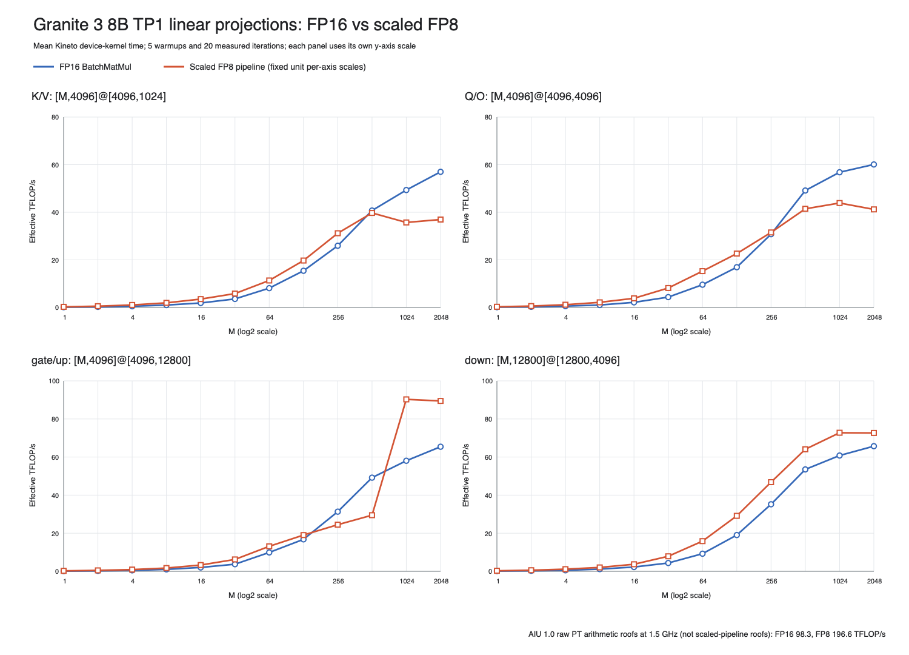

# SenDNN scaled-FP8 versus FP16 Granite linear M sweeps

This is a standalone AIU 1.0 measurement of all unique Granite 3 8B TP1
transformer-block linear shapes:

| Projection | Logical operation |
|---|---|
| K/V | `[M,4096] @ [4096,1024]` |
| Q/O | `[M,4096] @ [4096,4096]` |
| gate/up | `[M,4096] @ [4096,12800]` |
| down | `[M,12800] @ [12800,4096]` |

Every shape uses `M=1,2,4,...,2048`. The four panels below use independent
y-axis scales.



## Main result

The FP8 result is strongly shape- and schedule-dependent. It is approximately
2x faster at very small M for every shape, but that does not predict prefill
behavior.

| Projection | M | FP16 TFLOP/s | Scaled FP8 TFLOP/s | FP8 / FP16 |
|---|---:|---:|---:|---:|
| K/V | 512 | 40.726 | 39.718 | 0.975x |
| K/V | 1024 | 49.341 | 35.724 | 0.724x |
| K/V | 2048 | 56.991 | 36.947 | 0.648x |
| Q/O | 512 | 49.136 | 41.451 | 0.844x |
| Q/O | 1024 | 56.811 | 43.883 | 0.772x |
| Q/O | 2048 | 60.082 | 41.211 | 0.686x |
| gate/up | 512 | 49.178 | 29.471 | 0.599x |
| gate/up | 1024 | 58.050 | 90.290 | 1.555x |
| gate/up | 2048 | 65.420 | 89.459 | 1.367x |
| down | 512 | 53.502 | 64.081 | 1.198x |
| down | 1024 | 60.804 | 72.756 | 1.197x |
| down | 2048 | 65.709 | 72.647 | 1.106x |

The complete 48-pair table is in
[`linear_shape_m_sweep_summary.md`](linear_shape_m_sweep_summary.md). CSV and
JSON versions retain all event statistics and correctness fields.

## Gate/up M=512 to M=1024 transition

The large gate/up FP8 jump was independently repeated with fresh compilation
and 20 new Kineto events per point:

| M | Mode | Baseline mean | Repeat mean | Repeat delta |
|---:|---|---:|---:|---:|
| 512 | FP16 | 1091.694 us | 1091.641 us | -0.005% |
| 512 | scaled FP8 | 1821.687 us | 1823.063 us | +0.076% |
| 1024 | FP16 | 1849.673 us | 1849.015 us | -0.036% |
| 1024 | scaled FP8 | 1189.208 us | 1188.051 us | -0.097% |

The FP8 BatchMatMul itself stays on 32 cores, two corelets per core, and the
same `IN:1, OUT:4, MB:8` work grid. The surrounding fused plan changes:

- At M=512, both scale-recovery stages use one core and an LX relayout is
  inserted.
- At M=1024, both recovery stages use all 32 cores and the Qfp8-to-matmul
  handoff becomes in-place, removing that relayout.

The compiler's ideal-cycle model doubles only the FP8 BatchMatMul estimate and
assigns zero cycles to Qfp8, relayout, and scale recovery, so it does not model
this cliff. See
[`validation/mlp_up_m512_m1024_repeat/AUDIT.md`](validation/mlp_up_m512_m1024_repeat/AUDIT.md)
for the timing and emitted-program evidence.

## What the FP8 timing contains

This is a fixed-scale scaled-FP8 pipeline, not a raw FMA8 benchmark, production
dynamic quantization, or an end-to-end model result:

```text
FP16 activation
  -> Qfp8 cast and packing
  -> ownership-changing relayout when required
  -> FP8 BatchMatMul
  -> activation-scale recovery
  -> weight-scale recovery
  -> FP16 output
```

Activation scales have shape `[1,1,M,1]`, and weight scales have shape
`[1,1,1,N]`. Both are fixed unit-valued FP32 tensors. The measured Kineto
kernel contains Qfp8, relayouts, matmul, and both recovery stages. It excludes
per-row scale derivation, activation normalization/clamping, static weight and
scale preparation, compilation, device initialization, and separate H2D/D2H
trace events.

Effective throughput is:

```text
2 * M * K * N / mean Kineto device-kernel time
```

The AIU ISA-derived 98.304 FP16 and 196.608 FP8 TFLOP/s figures at a nominal
1.5 GHz are raw PT arithmetic roofs. They are context, not directly comparable
roofs for this scaled pipeline.

## Validation

- 96/96 accepted sweep cases passed CPU-reference correctness.
- Every compile, load, parse, prepare, initialization, and execution status was
  `Status OK`.
- Every case has exactly 20 positive Kineto events with the expected kernel
  name: 1,920 accepted sweep events total.
- The analyzer recomputes event means and totals and checks the exact shape,
  graph contract, validation policy, and helper hashes.
- All roots use Torch `2.10.0+aiu.kineto.1.1.1`, torch_sendnn
  `1.3.0+main.1.1bef083.0`, DeepTools `+1401 (ee2f97a)`, Flex
  `+388 (81385a4)`, and SenLib DD2 `+194 (951e4c4)`.
- Provenance must contain `ibm-senlib-dd2`; the analyzer rejects anything
  labeled `1p5`.

The K=12800 down projection passed the unchanged FP16 elementwise
`rtol=0.02`, `atol=0.25` gate but required an aggregate relative-L2 ceiling of
0.06 instead of the original K/V-only 0.03 ceiling. This affects validation
only; the timed graph is unchanged.

## Multi-pod execution

Shapes ran in parallel, but every individual pod ran cases serially:

| Shape | Pod | Accepted run root |
|---|---|---|
| K/V | `adnan-spyre-current-pf` | `granite_kv_m_sweep_20260729_040508` |
| Q/O | `adnan-cdx-spyre-dev-pf` | `granite_qo_m_sweep_20260729_043441` |
| gate/up | `adnan-clc-spyre-dev-pf` | `granite_mlp_up_m_sweep_20260729_040527` |
| down | `adnan-spyre-dev-pf` | `granite_mlp_down_m_sweep_20260729_040532` |

The cdx pod did not initially contain the pinned venv. Its accepted Q/O run
uses an isolated, checksum-verified copy of the exact production environment.
Absolute throughput across different shapes therefore also spans different
physical pods, while every FP16/FP8 ratio is paired on the same pod and stack.

One partial Q/O attempt was excluded after a complete M=16 FP16 result was
followed by an interpreter/runtime teardown hang. The process was terminated,
VFIO release was verified, and the entire Q/O sweep was rerun successfully in
the accepted root above. An incomplete focused gate/up repeat was excluded for
the same teardown behavior; the successful process-isolated repeat is archived.

## Files

- `linear_shape_m_sweep_tflops.{png,svg}`: combined four-panel chart
- `{kv,qo,mlp_up,mlp_down}_m_sweep_tflops.{png,svg}`: individual charts
- `linear_shape_m_sweep_rows.csv`: all 96 mode-specific rows
- `linear_shape_m_sweep_pairs.csv`: all 48 FP16/FP8 comparisons
- `linear_shape_m_sweep_summary.{json,md}`: validated machine/human summaries
- `run_manifest.json`: accepted/excluded run roots and archive/helper hashes
- `raw/<shape>/`: provenance, status, and 24 result JSONs per shape
- `validation/mlp_up_m512_m1024_repeat/`: independent repeat and plan audit
