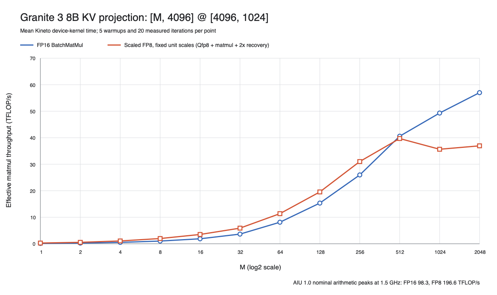

# SenDNN scaled-FP8 versus FP16 Granite KV M sweep

This is a standalone device measurement of one Granite 3 8B KV projection:

```text
[M, 4096] @ [4096, 1024]
M = 1, 2, 4, ..., 2048
```

The shape comes from the `granite-e2e` branch constants in
[`benchmarks/granite_block_probe.py`](../../../../benchmarks/granite_block_probe.py):
`EMB=4096`, `KVHEADS=8`, and `HEAD_DIM=128`, so the KV output width is
`8 * 128 = 1024`.



## Result

The scaled-FP8 advantage is strongly M-dependent. It is about 2x for the
smallest M values, falls to 1.40x at M=64 and 1.20x at M=256, reaches parity
near M=512, and is slower than FP16 at M=1024 and M=2048.

| M | FP16 kernel (us) | Scaled FP8 kernel (us) | FP16 TFLOP/s | Scaled FP8 TFLOP/s | FP8 / FP16 |
|---:|---:|---:|---:|---:|---:|
| 1 | 62.772 | 30.816 | 0.134 | 0.272 | 2.037x |
| 2 | 64.599 | 30.906 | 0.260 | 0.543 | 2.090x |
| 4 | 64.947 | 31.575 | 0.517 | 1.063 | 2.057x |
| 8 | 65.542 | 33.963 | 1.024 | 1.976 | 1.930x |
| 16 | 71.511 | 38.266 | 1.877 | 3.508 | 1.869x |
| 32 | 73.663 | 45.530 | 3.644 | 5.896 | 1.618x |
| 64 | 66.055 | 47.240 | 8.128 | 11.365 | 1.398x |
| 128 | 69.964 | 54.900 | 15.347 | 19.558 | 1.274x |
| 256 | 82.702 | 69.225 | 25.967 | 31.022 | 1.195x |
| 512 | 105.845 | 108.175 | 40.578 | 39.704 | 0.978x |
| 1024 | 174.177 | 240.931 | 49.317 | 35.653 | 0.723x |
| 2048 | 301.347 | 464.971 | 57.010 | 36.948 | 0.648x |

This does **not** reproduce a uniform 1.5x result. The previously reported
1.5x raw-matmul figure remains a team-reported number, not a measurement from
this sweep.

## Measurement boundary

FP16 executes:

```text
FP16 PrimaryInput -> BatchMatMul
```

Scaled FP8 executes:

```text
FP16 PrimaryInput
  -> Qfp8 cast and packing
  -> LX relayout
  -> FP8 BatchMatMul
  -> activation-scale recovery
  -> LX relayout
  -> weight-scale recovery
```

The scale inputs match Granite's axes:

```text
activation scale: [1, 1, M, 1]
weight scale:     [1, 1, 1, 1024]
```

Both are unit-valued FP32 tensors. Per-row scale derivation, activation
normalization, and clamping before the FP8 cast are upstream operations and
are not present in this standalone graph. The FP8 weight is converted on the
host and static weight/scale preparation occurs before profiling.

The chart uses:

```text
effective TFLOP/s = 2 * M * K * N / device-kernel-seconds / 1e12
```

This is effective logical-matmul throughput for the complete measured kernel,
not isolated FMA8 throughput. Kineto H2D, D2H, memset, compilation, model
preparation, and device initialization are excluded. Each plotted point is the
mean of 20 positive-duration Kineto `kernel` events after five warmups.

All 24 mode/shape cases passed the CPU-reference tolerance, graph lifecycle
checks, exact-shape checks, expected kernel-name check, and the requirement of
exactly 20 kernel events. The per-case p05, p50, p95, standard deviation, and
correctness errors are in [`m_sweep_summary.csv`](m_sweep_summary.csv).

## Structural evidence

The exact M=512 compiler audit in
[`m512_artifact_audit.md`](m512_artifact_audit.md) establishes the core
matmul facts:

- FP16 and FP8 both use 32 cores and two corelets per core.
- Both matmuls use `M:8, N:4, K:1`, with `M:32+32` across the two corelets.
- FP16 emits `FMA`; FP8 emits `FMA8`.
- FP8 adds Qfp8, an ownership-changing LX relayout, and two scale-recovery
  stages.

That audit used broadcast unit scales, so its scale-recovery placement is
structural context rather than proof of the per-axis-scale timing behavior.
The measured timing and correctness data in this directory use the per-axis
scale tensors described above.

The final per-axis export logs for M=512, 1024, and 2048 all contain the same
Qfp8, FP8 BatchMatMulV2, and two-recovery semantic chain. M=512 has two
compiler-inserted LX relayouts, while M=1024 and M=2048 have only one.
Consequently, the large-M regression is not explained by an additional
relayout appearing at M=1024. The compiler's modeled FP8 matmul ideal cycles
scale from 32,768 to 65,536 to 131,072 as M doubles. Those are modeled values,
and the single fused Kineto event cannot apportion measured time among Qfp8,
matmul, recovery, relayout, and output movement.

## AIU 1.0 arithmetic reference

The local `AIU_1_0_Rapid_Core_ISA_Spec_v1.0_260121.pdf` states:

- 32 active Rapid Cores and two corelets per core (page 22);
- 512 MAC lanes per corelet (page 30);
- `FMA8` computes two products per lane and returns a DL16 result (page 443).

At a nominal 1.5 GHz, exact lane arithmetic gives 98.304 FP16 TFLOP/s and
196.608 FP8 TFLOP/s. The 2021
[RaPiD paper](https://doi.org/10.1109/ISCA52012.2021.00021) reports rounded
figures that correspond to about 96 and 192 TFLOP/s for a 32-core chip.
These are arithmetic references, not measured device frequency or utilization
for this scaled pipeline.

## Production-contract caveat

A separate rank-2 `torch.compile(backend="sendnn")` smoke containing the real
per-row min/max, scale derivation, activation normalization, clamp, FP8 cast,
and `_scaled_mm` did not compile on this stack. DeepTools stopped in
`graphOptimizer.cpp:11050` because the selected minibatch FP8 padding path
required a `BatchMatMulV2` child while fission had produced `MatMul`.

That failed smoke has no timing and is not part of this chart. The working
rank-4 direct-SenDNN graph is therefore the current standalone starting point;
end-to-end Granite remains a separate next measurement.

## Reproduction and data

Device run root:

```text
/home/adnan/codex-isolated/fp8_sendnn_kineto_current_20260729/runs/granite_kv_m_sweep_20260729_021824
```

The executable helpers are under
[`benchmarks/sendnn_fp8_matmul`](../../../../benchmarks/sendnn_fp8_matmul).
The runner sets the pinned production environment, alternates FP16/FP8 order
by M, and runs every case serially:

```bash
bash benchmarks/sendnn_fp8_matmul/run_granite_kv_m_sweep.sh
```

The result directory contains:

- `provenance.txt` and `status.tsv`;
- machine-readable CSV and JSON summaries;
- SVG and PNG charts;
- 24 unmodified per-case `result.json` files under `raw/`;
- the M=512 artifact audit.

Kineto traces and compiler exports remain in the remote run root and are not
committed because the summarized files and per-case JSONs contain the plotted
source data.
