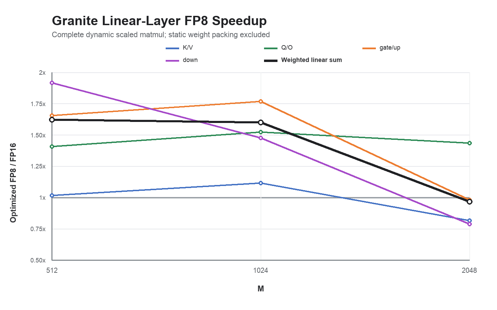

# DD2 Torch-Spyre FP8 Granite linear-layer sweep

## Outcome

The Q/O proof-of-concept method was applied to every unique Granite 3 8B TP1
linear-layer shape at `M=512, 1024, 2048`. The complete timed FP8 operation
includes dynamic per-row activation-scale derivation, activation
normalization/clipping/packing, FP8 matmul, and both FP16 output-scale
applications. Static weight packing is excluded because model weights are
prepared once.



| Projection family | K | N | M | FP16 us | Baseline FP8 us | Optimized FP8 us | Baseline / FP16 | Optimized / FP16 | Selected grid |
|---|---:|---:|---:|---:|---:|---:|---:|---:|---:|
| K/V | 4096 | 1024 | 512 | 97.80 | 159.96 | 96.28 | 0.61x | 1.02x | 8x4 |
| K/V | 4096 | 1024 | 1024 | 193.52 | 299.33 | 173.73 | 0.65x | 1.11x | 8x4 |
| K/V | 4096 | 1024 | 2048 | 327.26 | 638.73 | 401.68 | 0.51x | 0.81x | 8x4 |
| Q/O | 4096 | 4096 | 512 | 318.48 | 287.60 | 226.47 | 1.11x | 1.41x | 8x4 |
| Q/O | 4096 | 4096 | 1024 | 652.59 | 579.53 | 428.79 | 1.13x | 1.52x | 8x4 |
| Q/O | 4096 | 4096 | 2048 | 1329.64 | 1163.70 | 927.84 | 1.14x | 1.43x | 8x4 |
| gate/up | 4096 | 12800 | 512 | 996.37 | 669.44 | 601.80 | 1.49x | 1.66x | 8x4 |
| gate/up | 4096 | 12800 | 1024 | 2003.17 | 1258.70 | 1133.15 | 1.59x | 1.77x | 8x4 |
| gate/up | 4096 | 12800 | 2048 | 4024.24 | 4972.75 | 4100.45 | 0.81x | 0.98x | 8x4 + 16 MiB relayout limit |
| down | 12800 | 4096 | 512 | 1141.85 | 799.19 | 596.36 | 1.43x | 1.91x | 4x8 |
| down | 12800 | 4096 | 1024 | 1704.44 | 1584.63 | 1154.39 | 1.08x | 1.48x | 4x8 |
| down | 12800 | 4096 | 2048 | 3802.40 | 5862.55 | 4822.53 | 0.65x | 0.79x | 4x8 |

Full precision values are in
[`granite_linear_shape_sweep.csv`](granite_linear_shape_sweep.csv).

## Linear-layer-only weighted estimate

One Granite layer has two K/V projections, two Q/O projections, two gate/up
projections, and one down projection. Summing the seven standalone kernel
times gives:

| M | FP16 linear sum us | Baseline FP8 sum us | Optimized FP8 sum us | Baseline / FP16 | Optimized / FP16 |
|---:|---:|---:|---:|---:|---:|
| 512 | 3967.13 | 3033.19 | 2445.45 | 1.31x | 1.62x |
| 1024 | 7403.00 | 5859.76 | 4625.74 | 1.26x | 1.60x |
| 2048 | 15164.67 | 19412.91 | 15682.48 | 0.78x | 0.97x |

This is a serial sum of standalone complete scaled-matmul measurements, not a
Granite end-to-end result. It excludes attention, normalization, collectives,
graph launch interactions, and any future sharing of Q/K/V or gate/up
activation quantization.

## What generalized and what did not

The reusable wins are real:

- the specialized `quantscalepertokenfp8` activation-scale program;
- QFP8MB activation packing and QFP8WT static weights;
- FP8-aware M/N work division rather than the FP16 planner's choices;
- LX handoff of the large matmul and scale intermediates; and
- 32-core distribution of both output-scale applications.

The best grid is shape-dependent. Q/O and gate/up use M8 x N4. Down improves
from M8 x N4 to M4 x N8 because its large weight benefits from less replication
across M owners. K/V's tested M4 x N8 and M16 x N2 candidates were within 1%
of or slower than M8 x N4, so M8 x N4 is retained. Gate/up cannot use the
theoretically attractive M4 x N8 grid: N=12800 has 100 indivisible QFP8WT
physical groups, which cannot be divided over eight N owners without cutting a
group.

The relayout decision is also shape-dependent. At gate/up M=2048, the packed
activation is 8 MiB and exceeded the original 4 MiB profitability guard. That
removed the explicit M32-to-M8xN4 LX ownership shuffle. Raising the experimental
limit to 16 MiB restores it and improves the full operation from 4.72 ms to
4.10 ms. The same expansion hurts K/V M=2048 (0.40 ms to 0.60 ms) and is neutral
for down, so an unconditional larger limit is not a production policy.

## M=2048 diagnosis

A controlled gate/up pair keeps activation packing and the raw FP8 matmul
identical and changes only whether the two output-scale applications run:

| M | Packing + raw FP8 matmul us | Plus two output scales us | Added scale-path cost us |
|---:|---:|---:|---:|
| 1024 | 896.09 | 1312.27 | 416.18 |
| 2048 | 2480.66 | 4695.02 | 2214.37 |

The raw FP8 path remains 2.24x faster than FP16 at M=1024 and 1.62x faster at
M=2048. The large-M gate/up regression therefore sits primarily in applying
the row and column scales to the 52.4 MiB FP16 output, not in FMA8 itself.
Increasing `DXP_LX_FRAC_AVAIL` from 0.2 to 0.4 changes the full M=2048 result
only from 4.72 ms to 4.67 ms on a sensitivity pod, so a larger scratchpad
reservation alone does not close the gap.

K/V has the opposite aspect ratio: its matmul is small enough that dynamic
activation conversion and two output-scale programs dominate, especially at
M=2048. Down combines a long K with the same large-M scale-path cliff.

## Measurement and correctness

Times are mean aggregate Kineto `cat == "kernel"` durations per iteration:
all kernel-event durations across 20 launches divided by 20 after five warmups.
Compilation, host/device copies, CPU reference work, and separate static-weight
packing are excluded. Effective throughput uses `2*M*K*N` even though the FP8
timing also contains quantization and scaling work.

Every selected case passes the numerical gate. FP8 relative L2 error is
4.72-4.79%, with finite output and peak-normalized maximum error below 10%.
For the long-K down projection, deterministic synthetic weights use exactly
representable multiples of 1/32 rather than 1/8; the larger 1/8 range can
overflow the intermediate FP16 matmul output before scales are applied. This
changes operand values only, not shape, graph, work division, or data movement,
and is recorded in every result. The FP16 long-K acceptance limit is 2%
relative L2 plus elementwise allclose; observed error is about 1.07%.

Pinned target and stack:

```text
target:             DD2 / Spyre 1.0 (SENARCH=rcudd1a)
cores/corelets:     32 / 2
torch:              2.11.0+aiu.kineto.1.1.2
DXP LX fraction:    0.2 (0.4 only for the labeled sensitivity run)
```

No 1p5 target, source path, or artifact was used.

Main device roots:

```text
/home/adnan/codex-isolated/fp8_lx_relayout_poc_20260801/runs/granite_linear_all_shapes_20260801_v2
/home/adnan/codex-isolated/fp8_lx_relayout_poc_20260801/runs/granite_linear_all_shapes_20260801_v3
/home/adnan/codex-isolated/fp8_lx_relayout_poc_20260801/runs/granite_linear_all_shapes_20260801_v4
/home/adnan/codex-isolated/fp8_lx_relayout_poc_20260801/runs/granite_linear_candidate_grids_20260801
/home/adnan/codex-isolated/fp8_lx_relayout_poc_20260801/runs/granite_linear_expanded_relayout_20260801
/home/adnan/codex-isolated/fp8_lx_relayout_poc_20260801/runs/gate_up_phase_isolation_20260801
```

## Next production steps

1. Teach the FP8 cost model to choose the M/N grid from activation/weight
   replication, physical-group legality, and scale-stage cost.
2. Replace the fixed relayout byte window with a benefit model that prices the
   shuffle against avoided HBM/feed work.
3. Specialize or fuse the two full-output scale applications; this is the
   dominant M=2048 problem.
4. Investigate an alternative QFP8WT partition/layout that permits more N
   owners for N=12800 without cutting a physical group.
5. Re-run all shapes on the integration stack, then measure one-layer and full
   Granite end to end.

No public issue or pull request was created.
