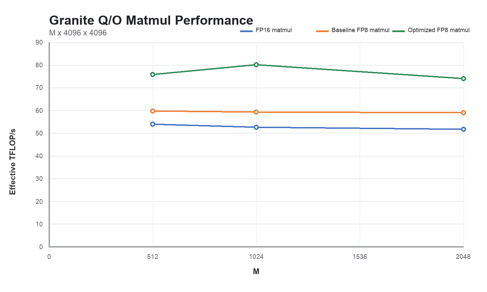

# DD2 Torch-Spyre dynamic FP8 Q/O LX PoC

## Outcome

The complete timed FP8 path is now faster than the matched FP16 matmul for the
Granite Q/O projection at `M=512, 1024, 2048`. The optimized path reaches
`1.41x`, `1.52x`, and `1.43x` FP16 respectively. This timing includes dynamic
per-row activation-scale derivation, activation normalization/clipping/packing,
the FP8 matmul, and both output-scale applications. Static weight packing is
excluded because model weights are prepared once rather than on every token.



| M | FP16 us | Baseline FP8 us | Optimized FP8 us | Baseline / FP16 | Optimized / FP16 | Optimized / baseline |
|---:|---:|---:|---:|---:|---:|---:|
| 512 | 318.48 | 287.60 | 226.47 | 1.11x | 1.41x | 1.27x |
| 1024 | 652.59 | 579.53 | 428.79 | 1.13x | 1.52x | 1.35x |
| 2048 | 1329.64 | 1163.70 | 927.84 | 1.14x | 1.43x | 1.25x |

These are mean aggregate Kineto `cat == "kernel"` durations per iteration:
the duration of every kernel event across 20 measured launches, divided by 20,
after five warmups. Effective throughput uses `2*M*K*N`. Compilation, host/device
copies, CPU reference work, and the separate static-weight prepack graph are
excluded. Full values are in
[`qo_dynamic_scaled_mm.csv`](qo_dynamic_scaled_mm.csv).

This is a focused DD2/Spyre 1.0 proof for `[M,4096] @ [4096,4096]`, not an
end-to-end Granite result or a production-wide planner policy. No 1p5 target or
stack was used.

## What changed

The PoC makes five controlled changes to the existing FP8 path:

1. **Use the measured Q/O compute grid.** The FP8 matmul is forced to
   `M:8 x N:4 x K:1` after the compiler identifies the real tensor roles. The
   legality checks still reject grids that cut an FP8 physical group.
2. **Pack, then redistribute inside the chip.** DD2's `qfp8mb` conversion uses
   all 32 cores along M. The matmul needs the same activation divided over
   eight M groups and replicated across four N groups. An explicit LX shuffle
   performs that ownership change without writing the packed activation to
   HBM.
3. **Keep the large scale intermediates in LX.** The FP8 matmul's FP16 result
   feeds the row-scale program from LX; that program's FP16 output feeds the
   column-scale program from LX; only the final output is written to HBM.
4. **Distribute both scale applications like the output.** Each scale program
   uses all 32 cores as `M:8 x N:4`, matching the matmul's output ownership and
   avoiding the one-core/fanout behavior that dominated the earlier path.
5. **Use DD2's specialized scale derivation.** The new
   `quantscalepertokenfp8` lowering combines each row's absolute maximum,
   division by the E4M3 range, and clamping into one reduction program. It
   emits the exact one-input/one-output DDL operand contract instead of the
   generic reduction-accumulator ABI.

The LX relayout stack needed two supporting fixes discovered by this graph:

- explicit allocation ownership now follows dimensions when layout
  normalization removes a leading unit dimension; and
- a direct LX `SHUFFLE` is promoted into its original execute slot as one
  data-only `STCDPOpLx`, rather than adding a redundant identity compute
  program after the copy.

The 64 KiB to 4 MiB source-size window is an experimental profitability guard.
It retains the medium activation ownership change while avoiding a standalone
32-core shuffle for tiny scale vectors or oversized transfers. It is not the
proposed production cost model.

## Final emitted program proof

The post-DXP M=1024 bundle establishes the following final schedule:

| Stage | Cores | Corelets | Final evidence |
|---|---:|---:|---|
| activation scale derivation | 32 | 1 | `quantscalepertokenfp8` |
| activation packing | 32 | 2 | `qfp8mb` |
| activation ownership change | 32 | data path | one `STCDPOpLx` |
| FP8 matmul | 32 | 2 | `M:8 x N:4`; `PTOP_FMA8`, no `PTOP_FMA16` |
| row scale application | 32 | 2 | `M:8 x N:4`; corelet M split `64/64` |
| column scale application | 32 | 2 | `M:8 x N:4`; corelet M split `64/64` |

The final allocations are:

```text
FP8 matmul output  LX
  -> row scaling   LX input, LX output
  -> column scale  LX input, HBM final output
```

Only the static weight, compact scale vectors/constants, and final output use
HBM. Neither large intermediate edge has an external-pool operand. These are
final emitted bundle/allocation facts, not planner telemetry. The `14,208`
textual `PTOP_FMA8` tokens in the generated SMC establish code presence, not a
dynamic instruction count.

Artifact root:

```text
/home/adnan/codex-isolated/fp8_lx_relayout_poc_20260801/runs/post_dxp_debug_dynamic_qo_m1024_20260801_2315_clc_retry1
```

Main graph:

```text
<artifact-root>/cache/inductor-spyre/c24bbf03_sdsc_fused__scaled_mm__to_copy_clamp_mul_qfp8mb_quant_scale_per_token_fp8_reciprocal_0_waltwogh
```

`PERFDSC_DEBUG` produced no files because Torch invokes DXP directly and
bypasses DSM. The authoritative post-DXP evidence was therefore captured with
`DXP_DEBUG=1 --dump-bundle-module`.

## Why the target is below 2x

`FMA8` offers twice the inner reduction work of FP16 `FMA`, but this operation
still writes FP16 output and reads activation and weight scales. Even an
optimistic model in which each tensor is streamed exactly once gives:

```text
FP16 bytes = 2 * (M*K + K*N + M*N)
FP8 bytes  = M*K + K*N + 2*M*N + 4*(M + N)
```

| M | Arithmetic ideal | Stream-only ceiling | Observed optimized | Fraction of ceiling |
|---:|---:|---:|---:|---:|
| 512 | 2.00x | 1.817x | 1.406x | 77.4% |
| 1024 | 2.00x | 1.713x | 1.522x | 88.8% |
| 2048 | 2.00x | 1.599x | 1.433x | 89.6% |

The byte ceiling is optimistic because it excludes the work and traffic needed
to derive and apply dynamic activation scales. At M=1024 and M=2048 this PoC is
already within roughly 10-11% of that ceiling, so the remaining distance to
2x is not all recoverable compiler inefficiency. M=512 retains more fixed-cost
and scheduling headroom.

## Correctness and rejected epilogue path

The timed FP8 cases all passed with relative L2 error between `0.04719` and
`0.04723`; the worst absolute error normalized by the reference output range
was below 4.6%. FP8 acceptance requires finite output, relative L2 at most 10%,
and peak-normalized maximum error at most 10%. Elementwise `allclose` is kept as
a diagnostic because cancellation makes near-zero outputs unsuitable as the
only FP8 gate.

The performance sweep uses real non-unit dynamic activation scales and a unit
static weight scale. Separate device tests cover non-unit row and column scales,
bias, and FP8 `scale_result` semantics.

The former late first-scale epilogue experiment is deliberately removed. DD2's
BMM DDL can carry one `batchnormfwd` epilogue, while the public operation needs
two scale applications. More importantly, the late rewrite changed the compact
row-scale address after work division without redistributing each scale block
to all four N owners. Non-unit scale testing exposed a relative L2 error above
1.0. The safe PoC therefore uses three compute programs—FP8 matmul, row scale,
column scale—but keeps both large handoffs in LX.

## Validation

Focused validation for this branch includes:

- complete matmul cost-model suite: 110 tests;
- LX relayout suite: 12 tests;
- scratchpad boundary-clone origin regression;
- specialized qscale device numerical test and emitted operand-contract test;
- `_scaled_mm` device tests with non-unit row/column scales, bias, and FP8
  result scaling; and
- DeepTools direct-copy, in-place direct-shuffle, and stale-owner regression
  tests.

The matched timing root is:

```text
/home/adnan/codex-isolated/fp8_lx_relayout_poc_20260801/runs/fused_qscale_matched_20260801
```

Pinned measurement stack:

```text
target:             DD2 / Spyre 1.0 (SENARCH=rcudd1a)
cores/corelets:     32 / 2
torch:              2.11.0+aiu.kineto.1.1.2
DXP LX fraction:    0.2
```

Published private branches:

```text
Torch implementation: ah/fp8-lx-relayout-poc @ 680e4cb
DeepTools patch:   adnan/fp8-lx-relayout-poc-patch @ e856fae07
DeepTools tested:  3b5d123a11e43c69177fa9a86172bf4b0fcf54a1
DeepTools base:    a74a581a85315ea8860250b831996a3a65745a67
```

The user fork's DeepTools `master` is 608 commits behind the tested base. An
exact branch push would require importing 164 unrelated LFS objects, including
1p5 artifacts, so the fork branch intentionally carries an apply-ready patch
instead. The patch was verified with `git apply --check` against the exact base
above.

## Next steps

1. Replace the private fixed grid and byte window with a precision-aware cost
   model calibrated across all Granite projections and non-Granite shapes.
2. Remove the remaining compact scale FP16/FP32 conversion programs and test a
   scale-aware normalize/clip/pack implementation.
3. Generalize the safe LX ownership handoffs beyond Q/O, including the M=1
   QFP8CH decode path.
4. Revalidate on the intended integration stack, then run one-layer and full
   Granite numerical/performance gates.

No public issue or pull request was created.
