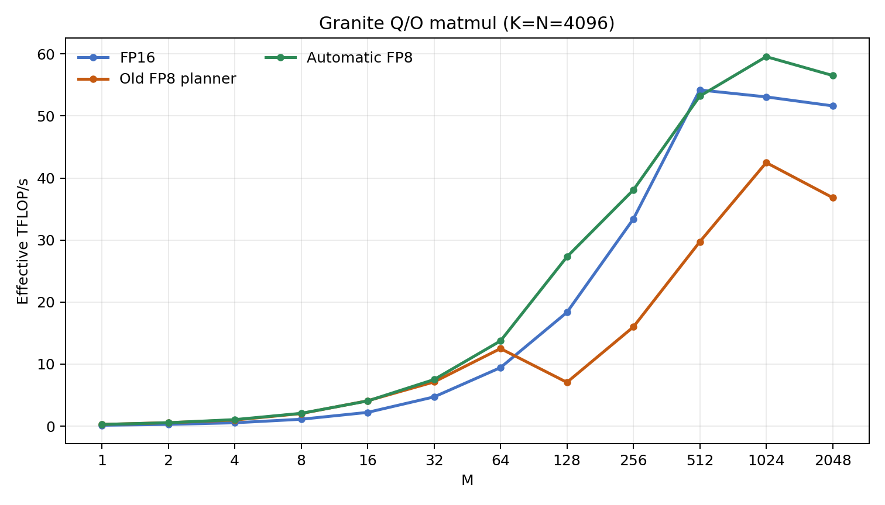
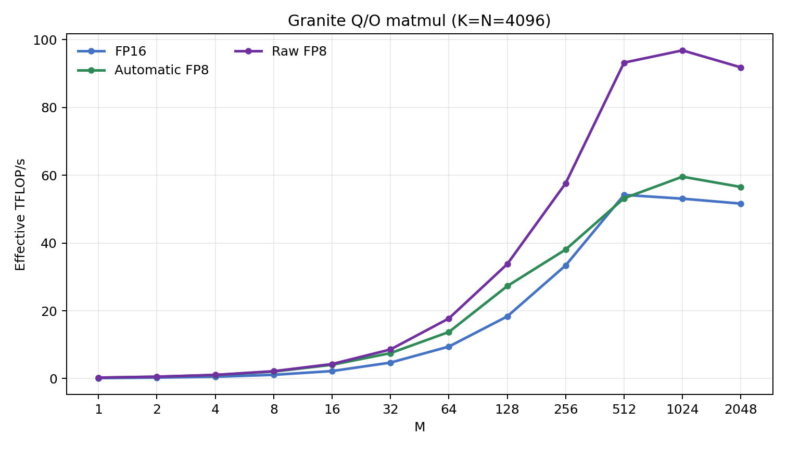

# DD2 Torch-Spyre FP8 Q/O planner PoC

## Outcome

The Q/O projection now selects a measured-good FP8 work division automatically;
no `spyre_hint(work_div=...)` override is required. At `M=512, K=N=4096`, the
old unhinted FP8 path used `M:32 x N:1` and delivered 29.72 TFLOP/s. The new
planner emits `M:4 x N:8` and delivers 53.19 TFLOP/s with dynamic activation
conversion, or 93.20 TFLOP/s when activation and weight are already FP8.

This is a private DD2 proof of concept. It is not an end-to-end Granite result,
not a production `_scaled_mm` implementation, and contains no Sentient 1.5
work.





## Measurement contract

Shape:

```text
[M, 4096] @ [4096, 4096]
M = 1, 2, 4, ..., 2048
```

All reported times are the mean of 20 Kineto `cat == "kernel"` events after
five warmups. Effective throughput is `2*M*K*N / kernel_time`.

- `FP16` is the matched DL16 matmul.
- `Old FP8 planner` prepackages the static weight but includes supplied-scale
  activation conversion and packing in the timed graph.
- `Automatic FP8` has the same timed contract as old FP8; only the automatic
  work-division implementation changed.
- `Raw FP8` prepackages both activation and weight outside the timed graph. It
  isolates the FP8 matmul and is a diagnostic control, not the model contract.

Scale derivation is excluded and unit FP16 quantization scales are supplied.
Every case passed the benchmark CPU-reference tolerance. Full data are in
[`qo_automatic_sweep.csv`](qo_automatic_sweep.csv); the exhaustive legal-split
search is in [`qo_candidate_oracle.csv`](qo_candidate_oracle.csv).

| M | FP16 TFLOP/s | Old FP8 | Automatic FP8 | Raw FP8 | Auto / old | Raw / FP16 | Auto split |
|---:|---:|---:|---:|---:|---:|---:|---:|
| 1 | 0.143 | 0.276 | 0.274 | 0.285 | 0.99x | 2.00x | 1 x 32 |
| 128 | 18.34 | 7.06 | 27.29 | 33.78 | 3.86x | 1.84x | 4 x 8 |
| 512 | 54.19 | 29.72 | 53.19 | 93.20 | 1.79x | 1.72x | 4 x 8 |
| 1024 | 53.07 | 42.48 | 59.56 | 96.82 | 1.40x | 1.82x | 8 x 4 |
| 2048 | 51.63 | 36.83 | 56.52 | 91.82 | 1.53x | 1.78x | 8 x 4 |

## Why the old planner was wrong

The FP8 operation did not reach the matmul cost model at all:

1. `_cost_model_divide_op` accepted only `batchmatmul`, not
   `batchmatmulfp8` or `batchmatmulfp8mb`.
2. QFP8MB makes M atomic in two-row physical sticks. The model identified N as
   "the stick dimension" using the union of every operand's stick dimensions,
   so it saw both M and N and declined to score the operation.
3. Stick adjustment changed logical M to a count of two-row sticks. The scorer
   did not restore logical element counts before estimating MACs and bytes.
4. The generic fallback distributes cores along one dimension. It selected
   `1 x 32` through M=64 and flipped to `32 x 1` at M=128, causing the measured
   cliff.
5. Pre-scheduling can run more than once. A prior optional split survived into
   the next span pass and was then misread as a mandatory hardware constraint.

## What changed

- Route all three matmul reduction types through the cost-model pass.
- Identify N from the output tensor's own terminal stick coordinate, leaving
  QFP8MB's packed M as a legal row dimension.
- Enumerate splits in physical-stick units but restore logical M/K/N extents
  for the byte and compute model.
- Add an FP8 cost profile: one-byte activation and weight, two-byte output, and
  two FMA8 products per PT lane. The FP8 tile targets are explicitly marked as
  calibrated only on this Q/O oracle.
- Clear stale optional work divisions before recomputing mandatory span splits.
- Preserve QFP8MB's physical `[K:8, M:2, K:8]` coordinate and base-stride
  contract. The latter was required for numerical correctness before planner
  timing was meaningful.

The automatic choices are `1x32` at M=1-2, `2x16` at M=4, `4x8` at M=8-512,
and `8x4` at M=1024-2048. At M=256, the measured `2x16` oracle winner is about
2.2% faster than `4x8` in the same candidate sweep; that is the largest
remaining oracle-selection error.

## Corelet read

Corelets are relevant, but they were not the root cause of this planner cliff.
The earlier forced `8x4` experiment improved when a private DeepTools override
made the M-direction corelet split legal. With the new winning `4x8` outer
division at M=512, the override/no-override A/B is flat:

| M=512 path | With override | Without override |
|---|---:|---:|
| dynamic activation | 322.96 us | 322.73 us |
| prepacked activation | 184.32 us | 180.87 us |

Therefore the corelet override is not performance-relevant for the selected
outer grid. The emitted Torch SuperDSC records one corelet before DeepTools;
final corelet use must be established from a post-DeepTools dump, not inferred
from `SENCORELETS=2` or this pre-DeepTools JSON.

## Remaining gap

The raw FP8 path now reaches 1.72-1.82x FP16 at M=512-2048. The remaining
dynamic-path difference is activation conversion and packing: 138.64 us at
M=512, 222.03 us at M=1024, and 467.36 us at M=2048. Those deltas include any
resulting schedule difference, so they are path-level costs rather than a
standalone QFP8 operator timing.

Torch-Spyre's production scaled operation is still missing. The current
diagnostic applies row and column scales as FP32 conversions plus two pointwise
multiplies. At M=512 that path is 513.01 us / 33.49 TFLOP/s, about 190 us slower
than the dynamic raw-output path. It also does not implement the complete
`_scaled_mm` bias, `scale_result`, or `use_fast_accum` contract.

The next production-shaped work is therefore:

1. implement and validate the real scaled-matmul semantics with non-unit scales;
2. fuse or reuse activation quantization and packing;
3. implement an efficient scale-application epilogue;
4. validate the FP8 cost profile on every Granite projection family and on
   shapes outside Granite; and
5. only then run the model-level FP8 comparison.

## Provenance

```text
branch:             ah/fp8-planner
implementation:     d931296
base FP8 branch:    a01c627d57ba18bc442d8b5f73086b2778fdc9d4
torch:              2.11.0+aiu.kineto.1.1.2
DeepTools source:   ee2f97a86c609eeb20ea3ad2d48040259d67ded3
target:             DD2 / Spyre 1.0
```

The branch declares a newer Torch dependency than the available DD2 device
environment. Commit `2585822` is an isolated Torch 2.11 compatibility shim;
the PoC must be repeated on the intended exact integration stack before a
production contribution.

Remote result roots:

```text
/home/adnan/codex-isolated/torch_spyre_fp8_planner_20260731/results/raw_candidate_oracle_20260731_v1
/home/adnan/codex-isolated/torch_spyre_fp8_planner_20260731/results/automatic_m_sweep_20260731_v1
/home/adnan/codex-isolated/torch_spyre_fp8_planner_20260731/results/automatic_prepacked_m_sweep_20260731_v1
/home/adnan/codex-isolated/torch_spyre_fp8_planner_20260731/results/automatic_scaled_m512_20260731_v1
```

No public issue or pull request was created.

Diagnostic source retained with the handoff:

- [`source/deeptools_fold_probe.cpp`](source/deeptools_fold_probe.cpp) is the
  `LD_PRELOAD` interposer used to isolate the original compound-fold failure.
- [`patches/deeptools_dd2_fp8mb_corelet_poc.patch`](patches/deeptools_dd2_fp8mb_corelet_poc.patch)
  is the private corelet legality/preference A/B; it is not required for the
  selected M=512 `4x8` result.
