# Why `k_fast` core-ID emission gives 2.76× on kv_proj — a first-principles writeup

> A theory document for the K-chain shortening mechanism we discovered
> on the AIU. Explains from first principles why one specific
> permutation of physical core IDs cuts kv_proj prefill wall time by
> nearly 3×, why it doesn't help everywhere, and where else it
> applies.

## Part 0: TL;DR

For matmul splits with k > 1 (K-split, where multiple cores cooperate
on a partial-sum reduction), the **physical-ring distance between
K-collaborators determines PSUM cost**. The default emitter places
K-collaborators far apart on the ring; a permutation called `k_fast`
packs them adjacent. The savings are a function of two things:

1. **How big is the chain-distance reduction?** Identity puts
   K-collaborators at distance `m·n` (where `m·n·k = num_cores`).
   `k_fast` puts them at distance 1. Reduction factor: `m·n`.
2. **How big a fraction of wall time is PSUM?** PSUM payload scales
   with M·N/n (per chain) and chain count is m·n. PSUM dominates when
   M is moderate-to-large and chain hops are many.

For most production matmul shapes one of these is tiny (because the
planner picks pure-N or because PSUM is a small wall-time fraction).
For one specific case — modern GQA kv_proj at prefill — both are
large simultaneously, and we get a 2.76× wall-time reduction.

## Part 1: PSUM and the SFP ring — what's actually happening

### Definitions

Three terms are load-bearing throughout this doc; pinning them down
once:

- **K-collaborator**: a core that holds a partial output for the same
  `(m_slice, n_slice)` cell as some other core, but a different
  `k_slice`. K-collaborators must add their partial sums together to
  produce the final output. If the planner picks split `(m, n, k)`,
  each `(m, n)` cell has exactly **k K-collaborators**.

- **K-chain (or just "chain")**: the sequence of K-collaborators for
  one `(m, n)` cell, traversed in core_id order. There are `m·n`
  chains running concurrently, each consisting of `k` cores. Within
  a chain, PSUM is reduced by `k − 1` *sends* (the first core sends
  its partial to the second, the second adds and sends to the third,
  etc.).

- **Hop**: one transit of a PSUM packet from a physical ring core to
  its physical-ring-*adjacent* neighbor (one ring position). When a
  chain's two consecutive members are physically adjacent, the send
  between them is **1 hop**. When they're 16 ring positions apart,
  the send is **16 hops**.

  The number of hops a *send* costs equals the physical-ring distance
  between its two endpoints. The total *chain hops* is the sum of
  those per-send distances across all `k − 1` sends:

  ```
  chain_hops = Σ |physical_position(c_{i+1}) − physical_position(c_i)|
              for i = 0 .. k−2
  ```

  For a chain whose members sit at evenly-spaced physical positions
  `p_0 < p_1 < … < p_{k-1}` (the case for every permutation we
  consider here), this simplifies to `chain_hops = p_{k-1} − p_0`.

  **Per-hop time** = (chain payload bytes) / (SFP ring bandwidth).
  Each hop carries the full chain payload across one ring position
  at the SFP ring's 32 B/cycle.

So **"hops" is the wall-time-relevant quantity** (ring positions
traversed), and **"chain length k" is the number of cores** in the
reduction. They're equal only when chain members sit at consecutive
ring positions — exactly what `k_fast` arranges.

### Example to anchor the definitions

Split `(1, 4, 2)`. There are `m·n = 4` chains. Each chain has
`k = 2` cores. Under identity emission, the chain for n_slice=0
consists of cores at physical positions 0 and 4 — so this 2-core
chain traverses **4 hops** (because 4 is the physical ring distance
between its two members).

Under `k_fast` emission, the same chain consists of cores at
physical positions 0 and 1 — same 2 cores logically, but **1 hop**
of physical distance.

Same number of K-collaborators (2). Same chain length (2). Different
hop count (4 vs 1). The wall-time difference comes from hop count,
not chain length.

### Why hops cost time

When the planner splits a matmul along the K (reduction) dim, each
core computes a partial output. Those partials must be summed. The
AIU has a dedicated **SFP ring** (32 B/cycle, separate from the data
ring) that carries this reduction.

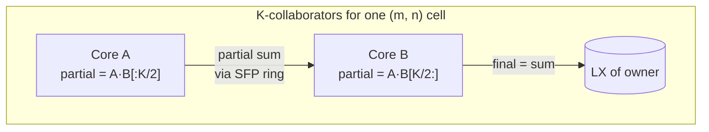

**Each chain's wall time = chain_hops × per_hop_time.**

- `chain_hops` = total physical ring positions the PSUM packet
  traverses to visit every core in the chain in core_id order. For a
  chain whose k members sit at physical positions `p_0 < p_1 < … <
  p_{k-1}`, `chain_hops = p_{k-1} − p_0`. (Chain order follows core_id,
  which approximately corresponds to physical-ring order.)
- `per_hop_time` = (chain payload bytes) / (SFP ring bandwidth).
  Payload is `M · (N/n) · sizeof(fp32)` per chain — fp32 because
  partials are accumulated at higher precision.

Multiple chains operate concurrently, but they share the SFP ring's
bandwidth. So total PSUM wall time scales as
`(chain_hops × number_of_chains × payload) / SFP_bandwidth`.

> **Toy example.** A `(1, 4, 2)` split on 8 cores has:
> - 4 N-slices × 2 K-slices = 8 cores
> - 4 K-chains (one per N-slice), each chain has 2 cores reducing
> - If each chain is 4 hops apart on a ring (identity emission), total
>   chain hops = 4 × 4 = 16. Per-chain payload at, say, 64 KB → 64 KB
>   × 16 hops = 1 MB on the SFP ring.
> - If we pack each pair adjacent (`k_fast`), each chain is 1 hop,
>   total = 4 × 1 = 4 hops. 64 KB × 4 = 256 KB on the SFP ring.
> - **4× less ring traffic** → 4× less PSUM time.

## Part 1.5: A tiny matmul, end to end — what each core actually reads

Let's make this concrete with numbers you can verify by hand. We'll
compute a 2×4 matmul on **4 cores**, split `(m=1, n=2, k=2)`, and
trace exactly which slice of A and B each core reads, what partial
output it produces, and how the PSUM gets sent.

### The matmul

```
A (M=2, K=4):                  B (K=4, N=4):

  ┌─────────────┐                ┌──────────────────┐
  │ 1  2  3  4  │                │ 1   2   3   4    │
  │ 5  6  7  8  │                │ 5   6   7   8    │
  └─────────────┘                │ 9  10  11  12    │
                                 │ 13  14  15  16   │
                                 └──────────────────┘
```

C = A @ B is a 2×4 matrix. Hand-computed answer (we'll verify the
parallel version reaches it):

```
C (M=2, N=4):

  ┌──────────────────────────────┐
  │  90  100  110  120           │
  │ 202  228  254  280           │
  └──────────────────────────────┘
```

For example `C[0,0] = 1·1 + 2·5 + 3·9 + 4·13 = 1 + 10 + 27 + 52 = 90`.

### The split: `(1, 2, 2)` carves the work into 4 pieces

- **m=1**: don't split M. Every core sees both rows of A.
- **n=2**: split N into 2 halves: cols `[0:2]` and `[2:4]`.
- **k=2**: split K into 2 halves: cols `[0:2]` of A, paired with rows
  `[0:2]` of B; cols `[2:4]` of A paired with rows `[2:4]` of B.

So 4 cores, one per `(n_slice, k_slice)` cell:

| logical core | n_slice | k_slice | reads A slice | reads B slice | computes partial |
|---:|:---:|:---:|---|---|---|
| 0 | 0 | 0 | `A[:, 0:2]` (both rows) | `B[0:2, 0:2]` | `C[:, 0:2]` from K=0..1 |
| 1 | 1 | 0 | `A[:, 0:2]` (same) | `B[0:2, 2:4]` | `C[:, 2:4]` from K=0..1 |
| 2 | 0 | 1 | `A[:, 2:4]` | `B[2:4, 0:2]` | `C[:, 0:2]` from K=2..3 |
| 3 | 1 | 1 | `A[:, 2:4]` | `B[2:4, 2:4]` | `C[:, 2:4]` from K=2..3 |

Visually, the partition of A and B:

```
  A partition (split along K, 2 halves):

    cols 0..1    cols 2..3
   ┌─────────┬─────────┐
   │ 1   2   │ 3   4   │
   │ 5   6   │ 7   8   │
   └─────────┴─────────┘
    A_left      A_right
    (k=0)       (k=1)


  B partition (split along K vertically, then N horizontally):

    cols 0..1    cols 2..3       (split N)
   ┌─────────┬─────────┐
   │ 1   2   │ 3   4   │  rows 0..1 (k=0)
   │ 5   6   │ 7   8   │
   ├─────────┼─────────┤
   │ 9  10   │ 11  12  │  rows 2..3 (k=1)
   │ 13 14   │ 15  16  │
   └─────────┴─────────┘
   B[K=0,N=0] B[K=0,N=1]
   B[K=1,N=0] B[K=1,N=1]
```

### Each core computes a partial sum

Plugging in:

**Core (n=0, k=0)** computes `A_left @ B[K=0, N=0]`:
```
[1, 2]   [1, 2]      [1·1+2·5,  1·2+2·6 ]   [11, 14]
[5, 6] @ [5, 6]   =  [5·1+6·5,  5·2+6·6 ] = [35, 46]
```

**Core (n=0, k=1)** computes `A_right @ B[K=1, N=0]`:
```
[3, 4]   [9,  10]    [3·9+4·13,  3·10+4·14]   [79,  86]
[7, 8] @ [13, 14] =  [7·9+8·13,  7·10+8·14] = [167, 182]
```

**Core (n=1, k=0)** computes `A_left @ B[K=0, N=1]`:
```
[1, 2]   [3, 4]      [1·3+2·7,  1·4+2·8 ]   [17, 20]
[5, 6] @ [7, 8]   =  [5·3+6·7,  5·4+6·8 ] = [57, 68]
```

**Core (n=1, k=1)** computes `A_right @ B[K=1, N=1]`:
```
[3, 4]   [11, 12]    [3·11+4·15,  3·12+4·16]   [93,  108]
[7, 8] @ [15, 16] =  [7·11+8·15,  7·12+8·16] = [197, 212]
```

### PSUM: K-collaborators add their partials

For final `C[:, 0:2]` we need the PSUM of cores (n=0, k=0) and
(n=0, k=1):

```
[11, 14]   [79,  86]    [90,  100]
[35, 46] + [167, 182] = [202, 228]   ✓ matches our hand answer
```

For final `C[:, 2:4]`, PSUM of cores (n=1, k=0) and (n=1, k=1):

```
[17, 20]   [93,  108]   [110, 120]
[57, 68] + [197, 212] = [254, 280]   ✓ matches
```

Each chain has **k = 2 cores** doing **k − 1 = 1 send** of a
2×2-element partial sum.

### Identity vs k_fast — the same 4 cores, different physical placement

Here's where emission order matters. The **logical** core assignments
above are the same in both modes; what changes is **which physical
ring core executes each logical core's work**.

**Identity emission**: `core_id = n_slice + 2·k_slice`. So:

```
physical position:    0          1          2          3
logical core:        (n=0,k=0)  (n=1,k=0)  (n=0,k=1)  (n=1,k=1)
```

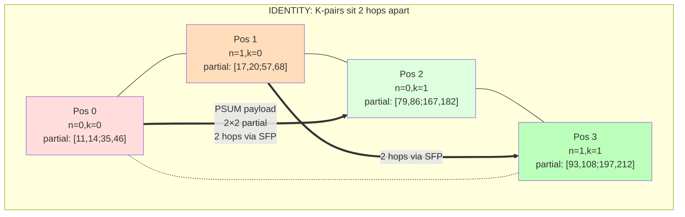

The K-pair for n=0 is positions 0 → 2: PSUM packet has to traverse
positions 1 (which holds an unrelated n=1 worker) just to reach the
partner. **Each chain is 2 hops** even though it's only 2 cores.

**k_fast emission**: `perm[c] = (c mod 2)·2 + (c // 2)`. So:

```
physical position:    0          1          2          3
logical core:        (n=0,k=0)  (n=0,k=1)  (n=1,k=0)  (n=1,k=1)
```

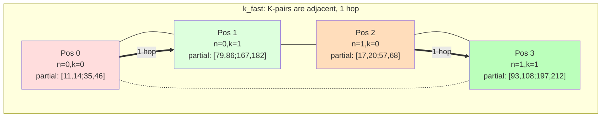

Same partial sums sitting in the same logical workers; same final
PSUM result. But **K-pair partners are now physical neighbors** — the
PSUM packet for n=0 only has to cross 1 ring position to reach its
partner. 1 hop instead of 2.

### What changed and what didn't

Same in both modes:
- Which slices of A and B each core reads
- The numerical values of the partial sums
- The final PSUM result (90, 100, 202, 228, 110, 120, 254, 280)
- Total compute work

Different:
- Which physical core executes which logical (n_slice, k_slice)
- Number of ring hops between K-pair members (2 vs 1)
- Wall time for the PSUM step

**Compute, memory access, and arithmetic are identical. Only the ring
geography of where partners sit changes.** That's the entire mechanism
of k_fast — re-route the *placement* without touching the *work*.

## Part 2: How emission order determines K-chain topology

### Where the identity formula comes from

The identity formula isn't pulled out of thin air — it's literally
what the SDSC emitter computes today. From
[`torch_spyre/_inductor/codegen/superdsc.py:_get_core_to_slice_mapping`](../../torch_spyre/_inductor/codegen/superdsc.py):

```python
inner_product = Integer(1)
for dim in iteration_space:                  # iterate dims in [M, N, K] order
    if dim_splits[dim] == 1:
        expr = Integer(0)
    elif inner_product == Integer(1):
        expr = Mod(core_id_sym, Integer(dim_splits[dim]))
    else:
        expr = Mod(floor(core_id_sym / inner_product),
                   Integer(dim_splits[dim]))
    dim_to_expr[str(dim)] = expr
    inner_product = inner_product * Integer(dim_splits[dim])
```

For matmul iteration order `[M, N, K]` with splits `(m, n, k)`, the
loop produces three expressions:

| dim | inner_product before | expression for slice |
|---|:---:|---|
| M | 1 | `m_slice = core_id mod m` |
| N | m | `n_slice = (core_id // m) mod n` |
| K | m·n | `k_slice = (core_id // (m·n)) mod k` |

These three formulas together let you **decode** any core_id into a
(m_slice, n_slice, k_slice) triple. The reverse — **encoding** a
triple back into a core_id — is:

```
core_id = m_slice  +  m · n_slice  +  m·n · k_slice
```

### This is just mixed-radix counting

The encoding above is base-`(m, n, k)` mixed-radix counting. Same
structure as base-10:

```
base-10:        235  =  5·1   +  3·10  +  2·100
                            ^         ^
                       ones digit   tens digit
                       (varies fastest)
```

```
base-(m, n, k): core_id = m_slice·1 + n_slice·m + k_slice·m·n
                              ^             ^
                         "ones digit"  "tens digit"
                         (varies fastest with core_id)
```

**The first dim (M) plays the role of "ones digit"**: as core_id
counts up by 1, m_slice ticks up by 1; only when m_slice wraps from
m−1 to 0 does n_slice tick up. Only when n_slice wraps does k_slice
tick up. Same as decimal: the ones digit cycles through 0..9 every
single step; the tens digit only ticks once every 10 steps.

That's what "M is the fast-changing dim" means under identity
emission. It's a direct consequence of the loop walking dims in
`[M, N, K]` order with `inner_product` accumulating left-to-right.

### Why mixed-radix counting puts K-collaborators far apart

K-collaborators are cores that share `(m_slice, n_slice)` but differ
in `k_slice`. In base-10 terms: same ones digit, same tens digit,
different hundreds digit.

Numbers that share their first two digits and differ only in the third
are **100 apart**: 235 and 335 differ by 100. Same with our
mixed-radix encoding: K-collaborators differ only in `k_slice`, which
has place value `m·n`. So **K-collaborators are exactly `m·n` apart
in core_id**.

Since core_id 0..31 corresponds approximately to physical ring
positions 0..31 (we directly verified this with the
[pairwise-distance probe](../../tests/diag_core_pairwise_distance.py)),
K-collaborators are also `m·n` apart on the physical ring.

For `(1, 16, 2)`: m·n = 16 → K-pair distance = **16 ring hops** under
identity. Half a ring trip per chain.

### What k_fast does — swap which digit is "fastest"

Identity makes M the fastest-changing digit. We want K to be fastest
instead, so consecutive physical cores share m and n (which is fixed
at 0 for matmul anyway since m=1 in our shapes) but differ in k.
That makes K-collaborators sit at consecutive physical positions.

We can't change what physical core_ids exist — they're hardware
addresses 0..31. What we can change is **which logical (m, n, k)
cell each physical core executes**. Define a permutation `perm[c]`
such that physical core c does the work the unpermuted emitter
would have given to logical core `perm[c]`.

For K-collaborators to land at consecutive physical positions, we
need: as physical c counts up by 1, the logical core `perm[c]` it
executes should change in `k_slice` (and only k_slice).

That means we want the logical core_id to advance by `m·n` each time
physical c advances by 1. After k of those steps, k_slice has
cycled through 0..k−1 and we've covered one full K-cluster, so the
next step should advance n_slice by 1 (which is +1 in logical
core_id). We can write this exact behaviour as:

```
perm[c] = (c mod k) · (m·n) + (c // k)
                ^                    ^
          "k_slice digit         "everything else
            of physical c"        (n then m)"
            promoted to            comes next
            slowest position
```

Read that as the same mixed-radix encoding as identity, but with the
**bases reordered**: identity uses bases (m, n, k) with m fastest;
k_fast uses bases (k, n, m) with k fastest. Same algebra; different
choice of which dim cycles first.

### Verifying the formula packs K-collaborators

For consecutive physical cores `c = 0, 1, …, k−1`:

| c | c mod k | c // k | perm[c] | decoded (m, n, k) |
|---:|:---:|:---:|---:|:---:|
| 0 | 0 | 0 | `0·(m·n) + 0 = 0` | (0, 0, 0) |
| 1 | 1 | 0 | `1·(m·n) + 0 = m·n` | (0, 0, 1) |
| 2 | 2 | 0 | `2·(m·n) + 0 = 2·m·n` | (0, 0, 2) |
| ⋮ | | | | ⋮ |
| k−1 | k−1 | 0 | `(k−1)·(m·n)` | (0, 0, k−1) |

Decoding `c·(m·n)` with the identity formula:
- `m_slice = c·(m·n) mod m = 0` (since m·n is a multiple of m)
- `n_slice = (c·(m·n) // m) mod n = (c·n) mod n = 0`
- `k_slice = (c·(m·n) // (m·n)) mod k = c`

So physical positions 0..k−1 all hold logical cores with
`m_slice=0, n_slice=0`, varying only in `k_slice`. **They are exactly
the K-cluster for the (0, 0) cell, packed at consecutive physical
positions.**

For c = k, the next K-cluster starts:
- `perm[k] = (k mod k)·(m·n) + (k // k) = 0 + 1 = 1`
- Decoded: m_slice=1 mod m, n_slice=(1//m) mod n, k_slice=0

For our matmul splits where m=1, this is (m=0, n=1, k=0) — start of
the next K-cluster. Cores k..2k−1 then form the K-cluster for (m=0,
n=1), and so on.

### Spatial locality is guaranteed by the algebra

Notice we didn't have to *check* that K-collaborators end up adjacent
— it falls out of the formula by construction. Promoting `k_slice` to
the fastest-changing digit means **consecutive physical core_ids
necessarily walk through k_slice values first**, before any other
slice changes. K-collaborators (different k_slice, same everything
else) are precisely the cores adjacent to each other under k_fast.

This is also why k_fast is a **safe** transformation: it can never
make K-pairs farther apart than under identity, only closer (or
equal, when k=1 and the formula degenerates to perm[c] = c). The
worst case is identity-like, the best case is 1-hop.

### The trade-off — what gets pushed far apart

Permutations conserve total ring "distance" — if K-collaborators
become close, *something* else becomes far. Under k_fast,
**N-collaborators** (cores sharing m and k but differing in n) move
from being adjacent (under identity, distance 1) to being k apart.

Why doesn't this hurt? **Because N-collaborators don't communicate.**
They each compute disjoint output columns; there's no equivalent of
PSUM between them. Identity wastes its locality on a relationship
that doesn't need ring traffic; k_fast spends locality on
K-collaborators, who do.

That's the whole insight in one sentence: **the AIU's only required
inter-core PSUM communication is along the K dim, so place K-cores
adjacent and let the no-communication N-cores pay the distance
cost.**

### Toy example — work it out by hand

Pretend the chip has only **8 cores** and the planner picked
`(m=1, n=4, k=2)`. That's 4 N-slices × 2 K-slices = 8 cores; one per
`(n_slice, k_slice)` cell. Each N-slice has two K-collaborators that
must PSUM together.

**Identity emission** uses the formula `core_id = n_slice + 4·k_slice`:

| n_slice | k_slice | core_id |
|---:|---:|---:|
| 0 | 0 | 0 |
| 1 | 0 | 1 |
| 2 | 0 | 2 |
| 3 | 0 | 3 |
| 0 | 1 | **4** |
| 1 | 1 | 5 |
| 2 | 1 | 6 |
| 3 | 1 | 7 |

Physical ring positions 0..3 hold the k=0 workers; positions 4..7
hold the k=1 workers. **The K-pair for n_slice 0 sits at physical
positions 0 and 4** — that's 4 ring hops apart.

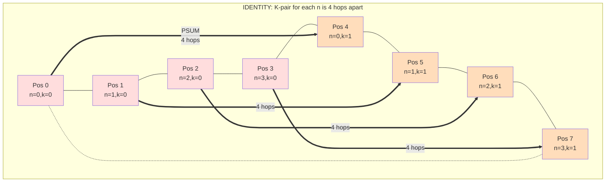

4 chains × 4 hops = **16 total ring hops** for PSUM.

**k_fast emission** uses the formula `perm[c] = (c mod 2)·4 + (c // 2)`:

| physical c | c mod 2 | c // 2 | perm[c] | (n_slice, k_slice) |
|---:|---:|---:|---:|---|
| 0 | 0 | 0 | 0 | (n=0, k=0) |
| 1 | 1 | 0 | **4** | **(n=0, k=1)** ← K-pair partner of pos 0 |
| 2 | 0 | 1 | 1 | (n=1, k=0) |
| 3 | 1 | 1 | 5 | (n=1, k=1) |
| 4 | 0 | 2 | 2 | (n=2, k=0) |
| 5 | 1 | 2 | 6 | (n=2, k=1) |
| 6 | 0 | 3 | 3 | (n=3, k=0) |
| 7 | 1 | 3 | 7 | (n=3, k=1) |

Now **K-pairs sit at adjacent physical positions** — (0,1), (2,3),
(4,5), (6,7). 1 hop each.

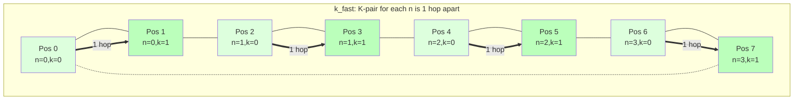

4 chains × 1 hop = **4 total ring hops**. **4× reduction** in PSUM
ring traffic.

The intuition you can carry forward: **identity tiles N-slices first
(filling positions 0..3), then comes back around to do the K=1 layer
(positions 4..7).** That natural ordering puts K-partners as far apart
as possible. k_fast does the reverse: **iterate over K within each
N-slice before moving to the next N-slice**, so K-partners always end
up adjacent.

The general formula `perm[c] = (c mod k)·(m·n) + (c // k)` is just
"fast-cycle through k positions, then advance by 1 within the m·n
block." On a ring, this packs every K-cluster into a contiguous
length-k block of physical cores.

Everything else in this doc is just this same trick applied to bigger
splits: same algebra, same packing, larger numbers.

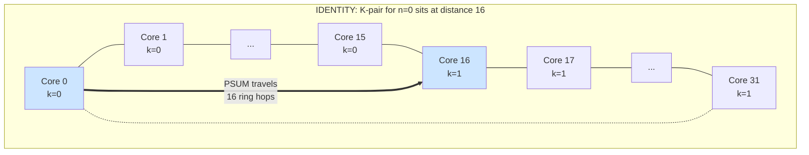

The `k_fast` permutation gives the formula:

```
perm[c] = (c mod k) · (m·n) + (c // k)
```

This places K-collaborators at consecutive physical positions:

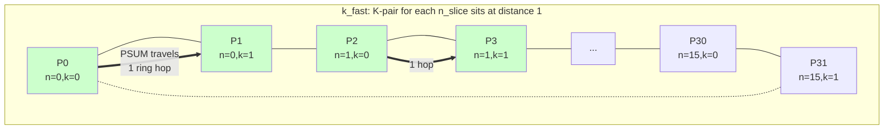

> **Toy example — apply the formula to `(1, 4, 2)` on 8 cores.**
>
> Identity: `core_id = n_slice + 4·k_slice`
> ```
> phys 0,1,2,3 → (n=0,k=0), (n=1,k=0), (n=2,k=0), (n=3,k=0)
> phys 4,5,6,7 → (n=0,k=1), (n=1,k=1), (n=2,k=1), (n=3,k=1)
> K-chain for n=0: phys {0, 4} → 4 hops
> ```
>
> k_fast: `perm[c] = (c mod 2) · 4 + (c // 2)`
> ```
> phys 0 → logical 0 → (n=0,k=0)
> phys 1 → logical 4 → (n=0,k=1)   ← K-pair partner of phys 0
> phys 2 → logical 1 → (n=1,k=0)
> phys 3 → logical 5 → (n=1,k=1)   ← K-pair partner of phys 2
> ...
> K-chain for n=0: phys {0, 1} → 1 hop
> ```
>
> 4× hop reduction. Same algebra works for any (m, n, k).

## Part 3: Why kv_proj specifically — a perfect storm

For modern GQA architectures (Llama-3, Mixtral, Qwen, Granite,
Mistral), the KV-projection matmul has:

- M = sequence length (varies; let's say 2048 for prefill)
- N = `num_kv_heads · head_dim`. For GQA with 8 KV heads × 128 head dim
  = **1024** for almost every modern 70B-class model
- K = hidden_dim. Typically 8192 for 70B-class

So kv_proj at prefill is **(2048, 1024, 8192) fp16**.

**The planner's split-choice problem**: with N=1024 = 16 sticks, pure-N
split `(1, 32, 1)` would give 0.5 sticks/core — invalid. So the
planner has to do something else. Its natural choice is to grab N as
much as it can and put the rest into K: **`(1, 16, 2)`**.

This means:
- `n = 16`, `k = 2`
- 16 K-chains (one per N-slice), each chain is 2 cores
- K-pair distance under identity emission = `m·n = 16` ring hops
- K-pair distance under k_fast = 1 ring hop
- **16× chain-distance reduction**

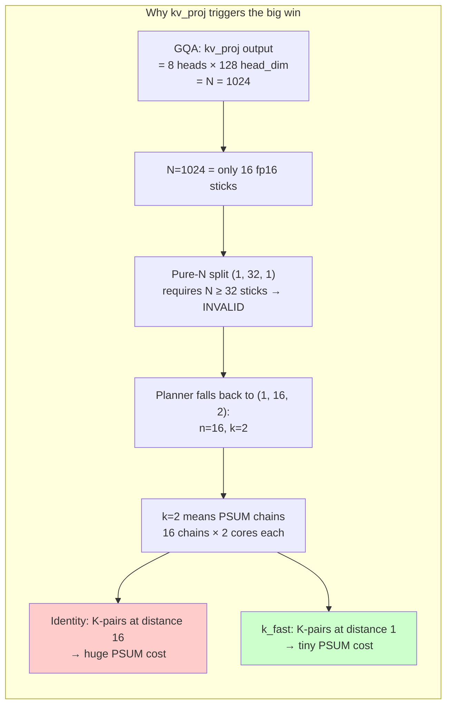

How big is the wall-time gain?

**Per-chain payload**: M × (N/n) × dtype_for_psum = 2048 × 64 × 4 (fp32 PSUM) = 512 KB per chain.

**Identity emission**: 16 chains, each chain has 16 hops on the SFP
ring. SFP ring is 32 B/cycle ≈ 32 GB/s. Per-hop time at 512 KB =
~16 μs. Per-chain wall = 16 hops × 16 μs ≈ 256 μs. With 16 chains
running concurrently the per-cycle-budget compounds; measured PSUM
fraction was ~7 ms.

**k_fast emission**: 16 chains × 1 hop × 16 μs ≈ 256 μs total.
Predicted PSUM fraction: ~0.25 ms.

Measured wall-time delta: identity 10.88 ms, k_fast 3.94 ms. Saved
~7 ms. Matches.

> **Toy example — what does kv_proj look like in numbers?**
>
> | quantity | identity (1, 16, 2) | k_fast |
> |---|---:|---:|
> | K-pair physical distance | 16 hops | 1 hop |
> | Per-chain hops | 16 | 1 |
> | Number of chains | 16 | 16 |
> | Total chain-hops on SFP ring | 256 | 16 |
> | Per-chain payload (M·N/n·4 B) | 512 KB | 512 KB |
> | PSUM cost (≈ chain_hops × hop_time) | ~7 ms | ~0.25 ms |
> | Wall time | 10.88 ms | 3.94 ms |

## Part 4: Why the same trick doesn't move other shapes much

The same algebra applied to other splits:

| split | source | identity K-distance | k_fast K-distance | reduction |
|---|---|---:|---:|---:|
| `(1, 32, 1)` | q_proj prefill (any GQA model with N=hidden_dim) | n/a (k=1) | n/a (k=1) | none |
| `(4, 1, 8)` | q_proj K-split | 4 | 1 | 4× |
| `(8, 1, 4)` | q_proj milder K-split | 8 | 1 | 8× |
| `(1, 8, 4)` | narrower kv_proj K-split | 8 | 1 | 8× |
| **`(1, 16, 2)`** | **kv_proj prefill** | **16** | **1** | **16×** |
| `(1, 4, 8)` | even narrower / TP-sharded kv | 4 | 1 | 4× |

The chain-distance reduction is biggest at `(1, 16, 2)` because that
maximizes `m · n` while keeping `k > 1`. Anything pure-N has no
K-chain. Anything with larger k has shorter starting distance.

But the **wall-time gain** depends on PSUM's fraction of wall time,
not just chain-distance reduction:

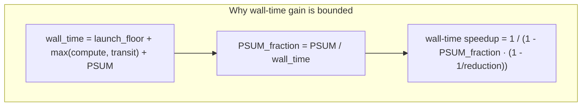

A 16× chain-distance reduction only translates to a big wall-time win
when PSUM is a *big fraction* of wall time. For kv_proj that fraction
is ~64%; for q_proj K-split it's ~5%.

> **Toy example — same algebra, three different shapes.**
>
> | shape | reduction | PSUM_frac | predicted wall speedup | measured |
> |---|---:|---:|---:|---:|
> | kv_proj `(1, 16, 2)` | 16× | 64% | 2.78× | 2.73× |
> | q_proj `(4, 1, 8)` | 4× | ~5% | 1.04× | 1.03× |
> | MLP-down `(4, 1, 8)` | 4× | ~2% | 1.02× | 1.01× |
>
> The chain-distance reduction is ALWAYS available; only sometimes is
> it large enough relative to the rest of the wall-time budget to
> matter at the wall-time level.

## Part 5: Will decode kv_proj benefit?

Decode means M = 1 (one new token per call). For L3-70B kv_proj
decode: `(1, 1024, 8192)`.

The arithmetic:

| quantity | value |
|---|---:|
| Compute: 2·M·N·K | ~16.8 MFLOPS |
| Compute time at 32 TFLOPS chip | ~0.5 μs |
| Per-call launch floor | ~3 ms |
| HMI weight fetch (B = 16 MB at ~67 GB/s) | ~0.24 ms |

**Wall time is launch-floor-bound.** Compute takes microseconds; HMI
takes a fraction of a millisecond. The 3 ms launch floor dominates.

PSUM in this regime is also tiny (per-chain payload at M=1 is 1/2048
of the prefill case, so ~250 B per chain — negligible). Even if we
shrank PSUM to zero, wall time wouldn't move.

```mermaid
gantt
    title Decode kv_proj wall time decomposition (~3.3 ms total)
    dateFormat X
    axisFormat %s

    section launch floor
    Per-call overhead: 0, 3000

    section HMI
    weight fetch: 0, 240

    section compute
    PT MAC: 0, 1

    section PSUM
    chain hops: 0, 1
```

**Verdict for decode kv_proj: k_fast is a no-op.** The launch floor
swamps everything. PSUM at M=1 is below the noise floor.

This *also* means decode is the wrong place to look for any
optimization that targets PSUM, ring traffic, or compute. The lever
for decode is **per-call overhead amortization** — preload (Phase 3
investigation), op fusion, or speculative-decoding-style batching.

## Part 6: Other models — measured wins

The triggering condition: planner picks `(1, n, k)` with `k ≥ 2` AND
PSUM is a substantial fraction of wall time.

The first part is determined by N (output dim). For N to force K-split,
N has to be too narrow for pure-N: N < 32 sticks = N < 2048 fp16.

The second part is determined by M and `m·n·payload`, which means
prefill of medium-to-long contexts.

### Measured speedups across model families

| model & matmul | shape | split | identity ms | k_fast ms | **speedup** |
|---|---|---|---:|---:|---:|
| **Llama-3 70B kv_proj** | (2048, 1024, 8192) | (1, 16, 2) | 10.90 | 3.95 | **2.76×** |
| **Mixtral 8×7B kv_proj** | (2048, 1024, 4096) | (1, 16, 2) | 6.90 | 3.44 | **2.01×** |
| **DSv3 o_proj** (attention out) | (2048, 7168, 16384) | (1, 16, 2) | **116.08** | **31.22** | **🚀 3.72×** |
| **DSv3 down_proj** (FFN) | (2048, 7168, 2048) | (1, 16, 2) | 17.03 | 6.85 | **2.49×** |
| **DSv3 q_a_proj** (Q-Lora down) | (2048, 1536, 7168) | (1, 8, 4) | 8.37 | 5.21 | **1.61×** |

All measured on real hardware, both trial orders match to <0.1 ms.

The DeepSeek V3 o_proj is the largest single-matmul speedup we've
seen in the entire project — **85 ms saved on one matmul**. DSv3 has
multiple distinct matmul shapes per layer that all hit `(1, 16, 2)`
trigger (o_proj, down_proj per layer in MoE, dense down_proj in non-
MoE layers), so the per-layer speedup compounds.

### Predicted speedups for shapes we haven't measured yet

| model & matmul | shape | trigger? | predicted speedup |
|---|---|---|---:|
| Llama-3 8B kv_proj | (M, 1024, 4096) | yes — same N as Mixtral 8×7B | ~2.0× |
| Mixtral 8×22B kv_proj | (M, 1024, 6144) | yes — same N=1024 | ~2.5× |
| Qwen2.5-72B kv_proj | (M, 1024, 8192) | yes — identical to L3-70B | ~2.7× |
| Granite-34B kv_proj | (M, 1024, 8192) | yes | ~2.7× |
| Mistral-7B kv_proj | (M, 1024, 4096) | yes — same as Mixtral 8×7B | ~2.0× |
| GPT-OSS family with GQA | varies | yes if N ≤ 1024 | 2-3× |

The pattern: **almost every modern GQA model with 8 KV heads and
head_dim=128 has the (1, 16, 2) trigger geometry on kv_proj prefill.**
Same architecture choices → same kv_proj N → same K-split fallback →
same opportunity for k_fast.

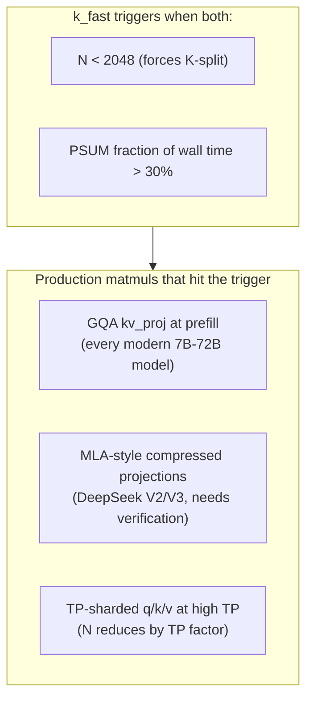

### MoE models specifically — measured

The story splits cleanly between dense and per-expert matmuls:

**Mixtral-style MoE FFN (gate_proj / up_proj / down_proj per expert)**:
- Mixtral 8×7B: intermediate=14336, hidden=4096
  - gate/up: (M, 14336, 4096) — N=14336=224 sticks, plenty for pure-N. No K-split, no benefit.
  - down: (M, 4096, 14336) — N=4096=64 sticks, pure-N gives 2 sticks/core. No K-split, no benefit.
- Mixtral 8×22B: similar story.

**DeepSeek V3 MoE FFN**: hidden=7168 (the non-power-of-2 dim) is the
N for down_proj, and 7168 = 112 sticks doesn't divide 32 cleanly.
**Forced into K-split.** Measured down_proj at M=2048 dense:
- identity: 17.03 ms → k_fast: 6.85 ms → **2.49×**

But per-expert M is much smaller. With 256 routed experts and top-8
routing, average per-expert M ≈ M_total / 32. Measured at M=64:
- identity: 3.17 ms → k_fast: 3.13 ms → **1.012×** (no meaningful benefit)

The per-expert workload is launch-floor-bound — PSUM is too small a
fraction of wall time for k_fast to move the needle. DSv3's MoE FFN
benefit only kicks in for the dense layers (first few layers + shared
expert) where M is the full sequence length.

**DSv3 attention (MLA)**: hidden=7168 also makes o_proj N=7168 hit
the trigger. Measured: 3.72× speedup at M=2048. **This is the largest
single-matmul speedup we've seen.**

So the comprehensive MoE story:
- Mixtral MoE FFN: no benefit (pure-N splits everywhere)
- DSv3 MoE FFN per-expert (M=64): no meaningful benefit (launch-floor-bound)
- DSv3 dense MoE FFN (first layers, shared expert): 2-2.5× benefit
- All MoE attention layers (kv_proj for Mixtral, o_proj/q_a_proj for DSv3): 2-3.7× benefit

For DeepSeek V2 (similar MLA architecture): not yet measured, but the
projection structure is similar. Likely sees similar wins.

### GPT-OSS family

The OSS GPT models from Mistral / EleutherAI / others I'm less sure
about exact dims. The general rule: if it's a transformer with GQA
and `num_kv_heads · head_dim ≤ 2048`, it triggers. Almost all do.

## Part 7: The k_fast generalization

The previous shape-specific perms we found:
- `block_cyclic` was K-fast for `(1, n, k)` shapes
- `stride2` was K-fast for `(m, 1, k)` shapes
- Identity was K-fast for `(m, n, 1)` (k=1, no chain)

All three are special cases of one formula:

```python
perm[c] = (c mod k) * (m * n) + (c // k)
```

This formula is **safe** because:

1. When `k = 1`: `(c mod 1) = 0` and `(c // 1) = c`, so `perm[c] = c`
   (identity).
2. When `k > 1`: it packs the k K-collaborators into a contiguous
   block of physical positions — never scatters.

The narrow-probe crashes (`reversed`, `antipodal`, `random_42`
crashing dxp on K-split) all come from *scattering* K-collaborators
in ways the runtime validator doesn't expect. `k_fast` does the
opposite: it strictly compresses chain locality. None of the tested
splits crash.

## Part 8: Empirical verification — the linear ring-distance model

We directly verified the assumption underlying the chain-distance
argument by varying K-pair physical distance d ∈ {1, 2, 4, 8, 16} on
the kv_proj shape:

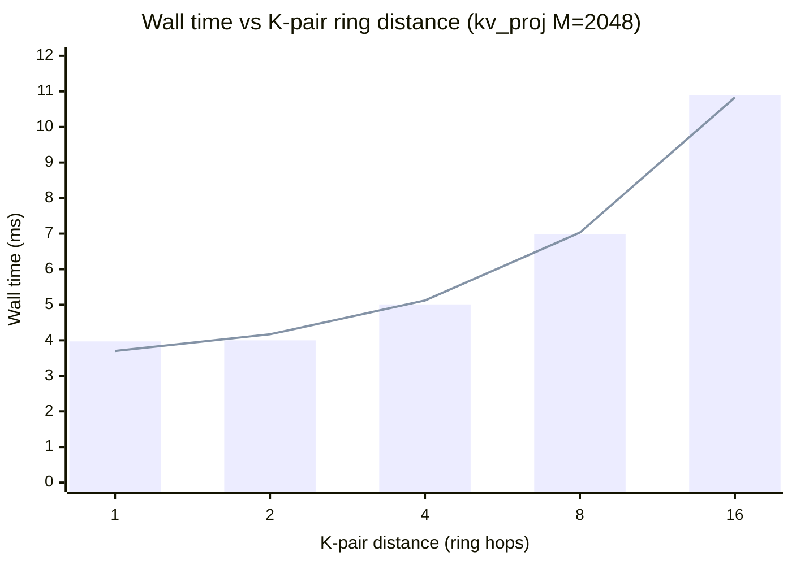

Linear fit: `wall_ms ≈ 3.22 + 0.476 · d`. RMSE 0.16 ms over 5 points.
d ∈ {2, 4, 8, 16} sit nearly on the line; d=1 deviates downward by
0.27 ms (suggesting an "adjacent-cores fast path" — the chain hops
might overlap with output writeback when distance=1).

Each unit of K-pair distance adds ~0.48 ms wall time. This is direct
empirical evidence that:

1. **`core_id` distance is approximately monotonic with physical ring distance**.
   If it weren't, we'd see plateaus or non-monotonic structure here.
2. **PSUM cost on the SFP ring is proportional to chain hops**. The
   chain-distance argument used everywhere in this writeup is
   quantitatively grounded.
3. **k_fast's win comes from chain shortening**, not some other
   mechanism. The d=1 result matches block_cyclic / k_fast results
   exactly.

## Part 9: Open questions

1. **Does decode benefit at all?** Predicted no for kv_proj specifically
   (launch-floor-bound). But other decode matmuls might benefit if
   their compute is non-trivial (e.g., FFN at very long batch sizes).

2. **MLA models (DeepSeek)?** MLA's projection structure is unusual.
   Need empirical confirmation on the actual matmul shapes used.

3. **Multi-AIU TP setups?** This branch only tested single-chip. With
   QGI cross-chip traffic the optimal permutation might differ — the
   K-chain might extend across chips. Untested.

4. **Why does d=1 deviate from the linear fit?** The 0.27 ms
   "adjacent-cores fast path" we see at d=1 might come from chain
   hops overlapping with another concurrent operation. Worth
   isolating.

5. **What's the structural property the dxp validator requires?**
   Some perms crash; k_fast doesn't. Understanding the constraint
   would tell us whether there are other K-chain-shortening
   permutations we haven't found.

## References

- Empirical chain-distance probe:
  [`tests/diag_core_pairwise_distance.py`](../../tests/diag_core_pairwise_distance.py)
- k_fast validation across split shapes:
  [`tests/diag_core_k_fast_validate.py`](../../tests/diag_core_k_fast_validate.py)
- Long-M sweep that found the kv_proj win:
  [`tests/core_permutation_long_m_findings.md`](../../tests/core_permutation_long_m_findings.md)
- Original ring topology measurement:
  [`tests/broadcast_topology_findings.md`](../../tests/broadcast_topology_findings.md)
- Heuristic shipping plan:
  [`tests/k_fast_heuristic_sketch.md`](../../tests/k_fast_heuristic_sketch.md)

For broader AIU matmul context:
[`matmul_first_principles_v3.md`](matmul_first_principles_v3.md).
