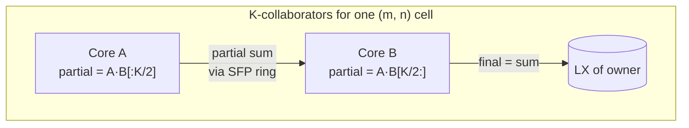
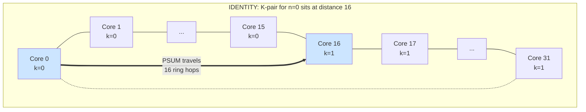
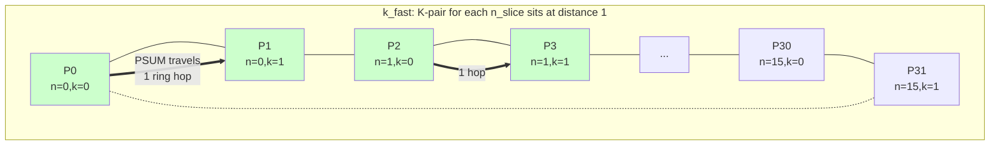
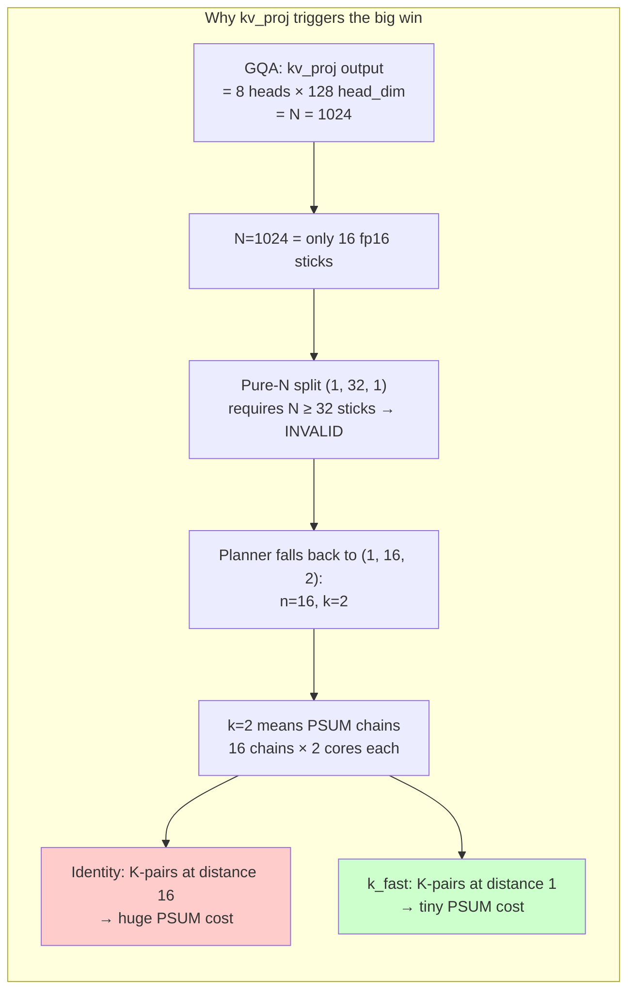
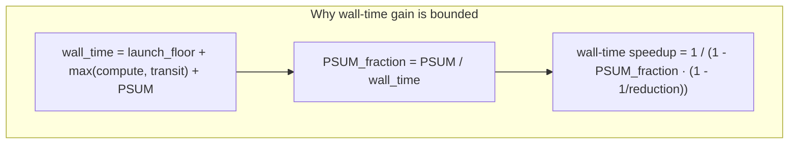
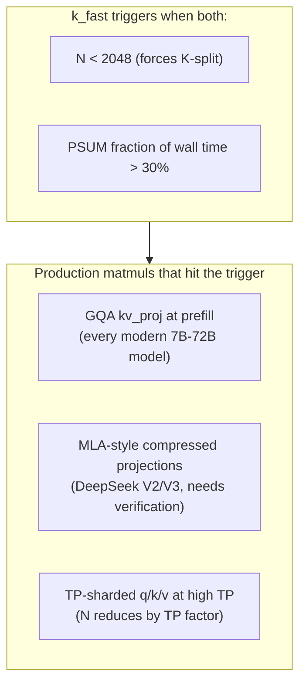
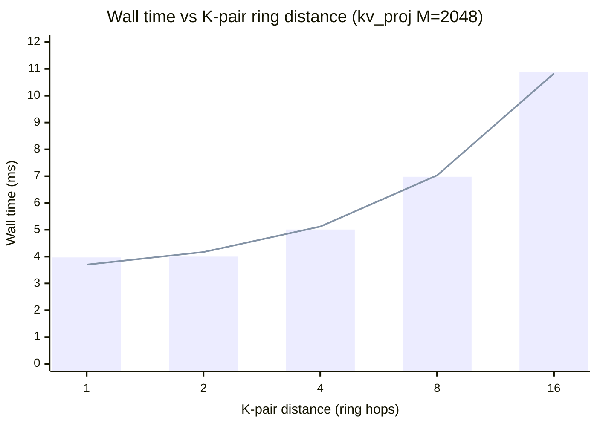

# Why `k_fast` core-ID emission gives 2.76× on kv_proj — a first-principles writeup

> A theory document for the K-chain shortening mechanism we discovered
> on the AIU. Explains from first principles why one specific
> permutation of physical core IDs cuts kv_proj prefill wall time by
> nearly 3×, why it doesn't help everywhere, and where else it
> applies.

## Part 0: TL;DR

For matmul splits with k > 1 (K-split, where multiple cores cooperate
on a partial-sum reduction), the **physical-ring distance between
K-collaborators determines PSUM cost**. The default emitter places
K-collaborators far apart on the ring; a permutation called `k_fast`
packs them adjacent. The savings are a function of two things:

1. **How big is the chain-distance reduction?** Identity puts
   K-collaborators at distance `m·n` (where `m·n·k = num_cores`).
   `k_fast` puts them at distance 1. Reduction factor: `m·n`.
2. **How big a fraction of wall time is PSUM?** PSUM payload scales
   with M·N/n (per chain) and chain count is m·n. PSUM dominates when
   M is moderate-to-large and chain hops are many.

For most production matmul shapes one of these is tiny (because the
planner picks pure-N or because PSUM is a small wall-time fraction).
For one specific case — modern GQA kv_proj at prefill — both are
large simultaneously, and we get a 2.76× wall-time reduction.

## Part 1: PSUM and the SFP ring — what's actually happening

When the planner splits a matmul along the K (reduction) dim, each
core computes a partial output. Those partials must be summed. The
AIU has a dedicated **SFP ring** (32 B/cycle, separate from the data
ring) that carries this reduction.



**Each chain's wall time = chain_hops × per_hop_time.**

- `chain_hops` = number of physical ring positions traversed by the
  PSUM packet
- `per_hop_time` = (chain payload bytes) / (SFP ring bandwidth)

Multiple chains operate concurrently, but they share the SFP ring's
bandwidth. So total PSUM wall time scales as
`(chain_hops × number_of_chains × payload) / SFP_bandwidth`.

> **Toy example.** A `(1, 4, 2)` split on 8 cores has:
> - 4 N-slices × 2 K-slices = 8 cores
> - 4 K-chains (one per N-slice), each chain has 2 cores reducing
> - If each chain is 4 hops apart on a ring (identity emission), total
>   chain hops = 4 × 4 = 16. Per-chain payload at, say, 64 KB → 64 KB
>   × 16 hops = 1 MB on the SFP ring.
> - If we pack each pair adjacent (`k_fast`), each chain is 1 hop,
>   total = 4 × 1 = 4 hops. 64 KB × 4 = 256 KB on the SFP ring.
> - **4× less ring traffic** → 4× less PSUM time.

## Part 2: How emission order determines K-chain topology

The default emitter walks the leftmost `iteration_space` dim with
`split > 1` fastest. For matmul, the iteration order is `[M, N, K]`,
so the formula is:

```
core_id = m_slice + m·n_slice + m·n·k_slice
```

This means **K-collaborators (cores that share `m_slice` and
`n_slice` but differ in `k_slice`) are spaced `m·n` apart in core_id**.

Since core_id 0..31 corresponds approximately to physical ring
positions 0..31 (we directly verified this with the
[pairwise-distance probe](../../tests/diag_core_pairwise_distance.py)),
K-collaborators are also `m·n` apart on the physical ring.

For `(1, 16, 2)`, K-collaborators are 16 apart. Half a ring trip per
chain hop.



The `k_fast` permutation gives the formula:

```
perm[c] = (c mod k) · (m·n) + (c // k)
```

This places K-collaborators at consecutive physical positions:



> **Toy example — apply the formula to `(1, 4, 2)` on 8 cores.**
>
> Identity: `core_id = n_slice + 4·k_slice`
> ```
> phys 0,1,2,3 → (n=0,k=0), (n=1,k=0), (n=2,k=0), (n=3,k=0)
> phys 4,5,6,7 → (n=0,k=1), (n=1,k=1), (n=2,k=1), (n=3,k=1)
> K-chain for n=0: phys {0, 4} → 4 hops
> ```
>
> k_fast: `perm[c] = (c mod 2) · 4 + (c // 2)`
> ```
> phys 0 → logical 0 → (n=0,k=0)
> phys 1 → logical 4 → (n=0,k=1)   ← K-pair partner of phys 0
> phys 2 → logical 1 → (n=1,k=0)
> phys 3 → logical 5 → (n=1,k=1)   ← K-pair partner of phys 2
> ...
> K-chain for n=0: phys {0, 1} → 1 hop
> ```
>
> 4× hop reduction. Same algebra works for any (m, n, k).

## Part 3: Why kv_proj specifically — a perfect storm

For modern GQA architectures (Llama-3, Mixtral, Qwen, Granite,
Mistral), the KV-projection matmul has:

- M = sequence length (varies; let's say 2048 for prefill)
- N = `num_kv_heads · head_dim`. For GQA with 8 KV heads × 128 head dim
  = **1024** for almost every modern 70B-class model
- K = hidden_dim. Typically 8192 for 70B-class

So kv_proj at prefill is **(2048, 1024, 8192) fp16**.

**The planner's split-choice problem**: with N=1024 = 16 sticks, pure-N
split `(1, 32, 1)` would give 0.5 sticks/core — invalid. So the
planner has to do something else. Its natural choice is to grab N as
much as it can and put the rest into K: **`(1, 16, 2)`**.

This means:
- `n = 16`, `k = 2`
- 16 K-chains (one per N-slice), each chain is 2 cores
- K-pair distance under identity emission = `m·n = 16` ring hops
- K-pair distance under k_fast = 1 ring hop
- **16× chain-distance reduction**



How big is the wall-time gain?

**Per-chain payload**: M × (N/n) × dtype_for_psum = 2048 × 64 × 4 (fp32 PSUM) = 512 KB per chain.

**Identity emission**: 16 chains, each chain has 16 hops on the SFP
ring. SFP ring is 32 B/cycle ≈ 32 GB/s. Per-hop time at 512 KB =
~16 μs. Per-chain wall = 16 hops × 16 μs ≈ 256 μs. With 16 chains
running concurrently the per-cycle-budget compounds; measured PSUM
fraction was ~7 ms.

**k_fast emission**: 16 chains × 1 hop × 16 μs ≈ 256 μs total.
Predicted PSUM fraction: ~0.25 ms.

Measured wall-time delta: identity 10.88 ms, k_fast 3.94 ms. Saved
~7 ms. Matches.

> **Toy example — what does kv_proj look like in numbers?**
>
> | quantity | identity (1, 16, 2) | k_fast |
> |---|---:|---:|
> | K-pair physical distance | 16 hops | 1 hop |
> | Per-chain hops | 16 | 1 |
> | Number of chains | 16 | 16 |
> | Total chain-hops on SFP ring | 256 | 16 |
> | Per-chain payload (M·N/n·4 B) | 512 KB | 512 KB |
> | PSUM cost (≈ chain_hops × hop_time) | ~7 ms | ~0.25 ms |
> | Wall time | 10.88 ms | 3.94 ms |

## Part 4: Why the same trick doesn't move other shapes much

The same algebra applied to other splits:

| split | source | identity K-distance | k_fast K-distance | reduction |
|---|---|---:|---:|---:|
| `(1, 32, 1)` | q_proj prefill (any GQA model with N=hidden_dim) | n/a (k=1) | n/a (k=1) | none |
| `(4, 1, 8)` | q_proj K-split | 4 | 1 | 4× |
| `(8, 1, 4)` | q_proj milder K-split | 8 | 1 | 8× |
| `(1, 8, 4)` | narrower kv_proj K-split | 8 | 1 | 8× |
| **`(1, 16, 2)`** | **kv_proj prefill** | **16** | **1** | **16×** |
| `(1, 4, 8)` | even narrower / TP-sharded kv | 4 | 1 | 4× |

The chain-distance reduction is biggest at `(1, 16, 2)` because that
maximizes `m · n` while keeping `k > 1`. Anything pure-N has no
K-chain. Anything with larger k has shorter starting distance.

But the **wall-time gain** depends on PSUM's fraction of wall time,
not just chain-distance reduction:



A 16× chain-distance reduction only translates to a big wall-time win
when PSUM is a *big fraction* of wall time. For kv_proj that fraction
is ~64%; for q_proj K-split it's ~5%.

> **Toy example — same algebra, three different shapes.**
>
> | shape | reduction | PSUM_frac | predicted wall speedup | measured |
> |---|---:|---:|---:|---:|
> | kv_proj `(1, 16, 2)` | 16× | 64% | 2.78× | 2.73× |
> | q_proj `(4, 1, 8)` | 4× | ~5% | 1.04× | 1.03× |
> | MLP-down `(4, 1, 8)` | 4× | ~2% | 1.02× | 1.01× |
>
> The chain-distance reduction is ALWAYS available; only sometimes is
> it large enough relative to the rest of the wall-time budget to
> matter at the wall-time level.

## Part 5: Will decode kv_proj benefit?

Decode means M = 1 (one new token per call). For L3-70B kv_proj
decode: `(1, 1024, 8192)`.

The arithmetic:

| quantity | value |
|---|---:|
| Compute: 2·M·N·K | ~16.8 MFLOPS |
| Compute time at 32 TFLOPS chip | ~0.5 μs |
| Per-call launch floor | ~3 ms |
| HMI weight fetch (B = 16 MB at ~67 GB/s) | ~0.24 ms |

**Wall time is launch-floor-bound.** Compute takes microseconds; HMI
takes a fraction of a millisecond. The 3 ms launch floor dominates.

PSUM in this regime is also tiny (per-chain payload at M=1 is 1/2048
of the prefill case, so ~250 B per chain — negligible). Even if we
shrank PSUM to zero, wall time wouldn't move.

```mermaid
gantt
    title Decode kv_proj wall time decomposition (~3.3 ms total)
    dateFormat X
    axisFormat %s

    section launch floor
    Per-call overhead: 0, 3000

    section HMI
    weight fetch: 0, 240

    section compute
    PT MAC: 0, 1

    section PSUM
    chain hops: 0, 1
```



**Verdict for decode kv_proj: k_fast is a no-op.** The launch floor
swamps everything. PSUM at M=1 is below the noise floor.

This *also* means decode is the wrong place to look for any
optimization that targets PSUM, ring traffic, or compute. The lever
for decode is **per-call overhead amortization** — preload (Phase 3
investigation), op fusion, or speculative-decoding-style batching.

## Part 6: Other models — where else does this fire?

The triggering condition: planner picks `(1, n, k)` with `k ≥ 2` AND
PSUM is a substantial fraction of wall time.

The first part is determined by N (output dim). For N to force K-split,
N has to be too narrow for pure-N: N < 32 sticks = N < 2048 fp16.

The second part is determined by M and `m·n·payload`, which means
prefill of medium-to-long contexts.

Modern GQA architectures with `num_kv_heads · head_dim ≤ 1024`:

| model | hidden_dim | num_kv_heads | head_dim | kv_proj N | predicted speedup at M=2048 prefill |
|---|---:|---:|---:|---:|---:|
| **Llama-3 70B** | 8192 | 8 | 128 | 1024 | **2.7× (measured)** |
| **Mixtral 8×7B** | 4096 | 8 | 128 | 1024 | **predicted ~2.7×** (same shape) |
| **Mixtral 8×22B** | 6144 | 8 | 128 | 1024 | **predicted ~2.7×** |
| **Qwen2.5-72B** | 8192 | 8 | 128 | 1024 | **predicted ~2.7×** |
| **Granite-34B** | 8192 | 8 | 128 | 1024 | **predicted ~2.7×** |
| Llama-3 8B | 4096 | 8 | 128 | 1024 | predicted ~2.5× (smaller compute) |
| Qwen2.5-7B | 3584 | 4 | 128 | 512 | smaller; (1, 8, 4) split, 8× reduction but smaller PSUM |
| Mistral-7B | 4096 | 8 | 128 | 1024 | predicted ~2.5× |
| GPT-OSS 20B (estimated) | 6144 | 8 | 128 | 1024 | predicted ~2.7× (if our estimate correct) |
| **DeepSeek-V3 / V2** | 7168 | n/a (MLA) | 128 | uses MLA — different shape | needs separate analysis |

The pattern: **almost every modern GQA model with 8 KV heads and
head_dim=128 has the exact (1, 16, 2) trigger geometry on kv_proj
prefill.** Same architecture choices → same kv_proj N → same K-split
fallback → same opportunity for k_fast.



### MoE models specifically

MoE FFN matmuls (gate_proj / up_proj / down_proj per expert):

- **Mixtral 8×7B**: intermediate=14336, hidden=4096
  - gate/up: (M, 14336, 4096) — N=14336=224 sticks, plenty for pure-N. **No K-split, no benefit.**
  - down: (M, 4096, 14336) — N=4096=64 sticks, pure-N gives 2 sticks/core. **No K-split, no benefit.**
- **Mixtral 8×22B**: intermediate=16384, hidden=6144
  - Similar story; MoE FFN matmuls don't trigger K-split.

So the MoE FFN matmuls **don't benefit** from k_fast. But Mixtral's
*attention* kv_proj is shared across all experts (computed once per
batch), and that *does* benefit. So Mixtral end-to-end inference will
see a partial gain on attention but flat on the MoE part.

For DeepSeek V2/V3 with MLA (Multi-head Latent Attention), the
projection structure is more complex:
- KV is compressed to a latent dim (~512 in V2)
- Then projected back out per head
- The compressed projection has narrow N → likely benefits
- Per-head projection has small N → strongly benefits

Worth a separate empirical pass on these once we have shapes.

### GPT-OSS family

The OSS GPT models from Mistral / EleutherAI / others I'm less sure
about exact dims. The general rule: if it's a transformer with GQA
and `num_kv_heads · head_dim ≤ 2048`, it triggers. Almost all do.

## Part 7: The k_fast generalization

The previous shape-specific perms we found:
- `block_cyclic` was K-fast for `(1, n, k)` shapes
- `stride2` was K-fast for `(m, 1, k)` shapes
- Identity was K-fast for `(m, n, 1)` (k=1, no chain)

All three are special cases of one formula:

```python
perm[c] = (c mod k) * (m * n) + (c // k)
```

This formula is **safe** because:

1. When `k = 1`: `(c mod 1) = 0` and `(c // 1) = c`, so `perm[c] = c`
   (identity).
2. When `k > 1`: it packs the k K-collaborators into a contiguous
   block of physical positions — never scatters.

The narrow-probe crashes (`reversed`, `antipodal`, `random_42`
crashing dxp on K-split) all come from *scattering* K-collaborators
in ways the runtime validator doesn't expect. `k_fast` does the
opposite: it strictly compresses chain locality. None of the tested
splits crash.

## Part 8: Empirical verification — the linear ring-distance model

We directly verified the assumption underlying the chain-distance
argument by varying K-pair physical distance d ∈ {1, 2, 4, 8, 16} on
the kv_proj shape:



Linear fit: `wall_ms ≈ 3.22 + 0.476 · d`. RMSE 0.16 ms over 5 points.
d ∈ {2, 4, 8, 16} sit nearly on the line; d=1 deviates downward by
0.27 ms (suggesting an "adjacent-cores fast path" — the chain hops
might overlap with output writeback when distance=1).

Each unit of K-pair distance adds ~0.48 ms wall time. This is direct
empirical evidence that:

1. **`core_id` distance is approximately monotonic with physical ring distance**.
   If it weren't, we'd see plateaus or non-monotonic structure here.
2. **PSUM cost on the SFP ring is proportional to chain hops**. The
   chain-distance argument used everywhere in this writeup is
   quantitatively grounded.
3. **k_fast's win comes from chain shortening**, not some other
   mechanism. The d=1 result matches block_cyclic / k_fast results
   exactly.

## Part 9: Open questions

1. **Does decode benefit at all?** Predicted no for kv_proj specifically
   (launch-floor-bound). But other decode matmuls might benefit if
   their compute is non-trivial (e.g., FFN at very long batch sizes).

2. **MLA models (DeepSeek)?** MLA's projection structure is unusual.
   Need empirical confirmation on the actual matmul shapes used.

3. **Multi-AIU TP setups?** This branch only tested single-chip. With
   QGI cross-chip traffic the optimal permutation might differ — the
   K-chain might extend across chips. Untested.

4. **Why does d=1 deviate from the linear fit?** The 0.27 ms
   "adjacent-cores fast path" we see at d=1 might come from chain
   hops overlapping with another concurrent operation. Worth
   isolating.

5. **What's the structural property the dxp validator requires?**
   Some perms crash; k_fast doesn't. Understanding the constraint
   would tell us whether there are other K-chain-shortening
   permutations we haven't found.

## References

- Empirical chain-distance probe:
  [`tests/diag_core_pairwise_distance.py`](../../tests/diag_core_pairwise_distance.py)
- k_fast validation across split shapes:
  [`tests/diag_core_k_fast_validate.py`](../../tests/diag_core_k_fast_validate.py)
- Long-M sweep that found the kv_proj win:
  [`tests/core_permutation_long_m_findings.md`](../../tests/core_permutation_long_m_findings.md)
- Original ring topology measurement:
  [`tests/broadcast_topology_findings.md`](../../tests/broadcast_topology_findings.md)
- Heuristic shipping plan:
  [`tests/k_fast_heuristic_sketch.md`](../../tests/k_fast_heuristic_sketch.md)

For broader AIU matmul context:
[`matmul_first_principles_v3.md`](matmul_first_principles_v3.md).
