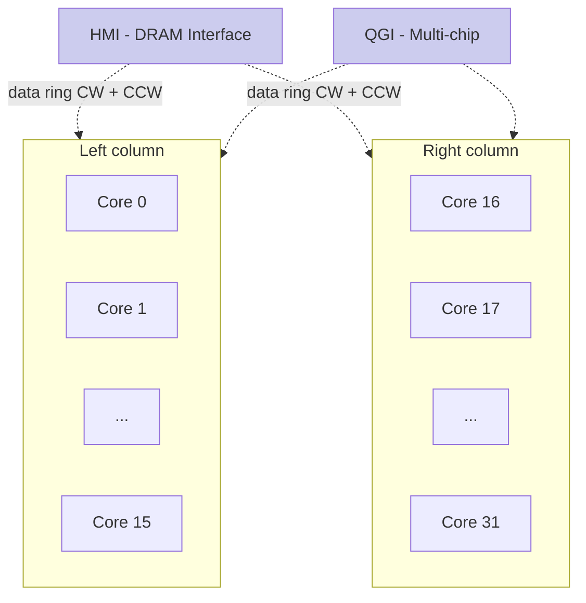
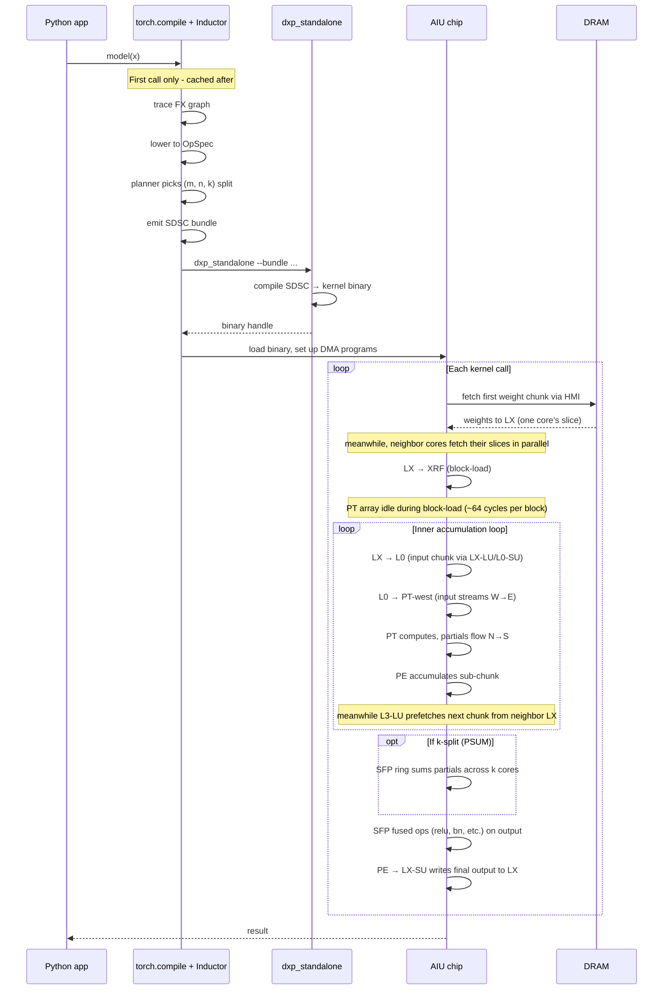
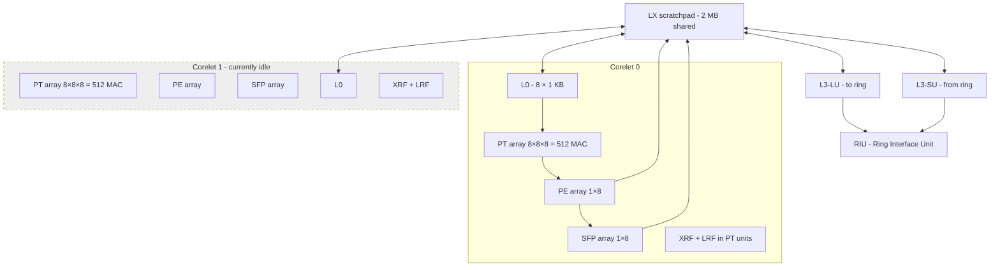
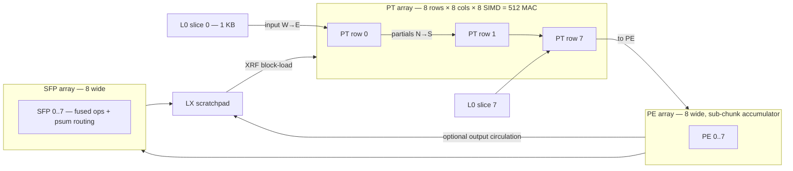
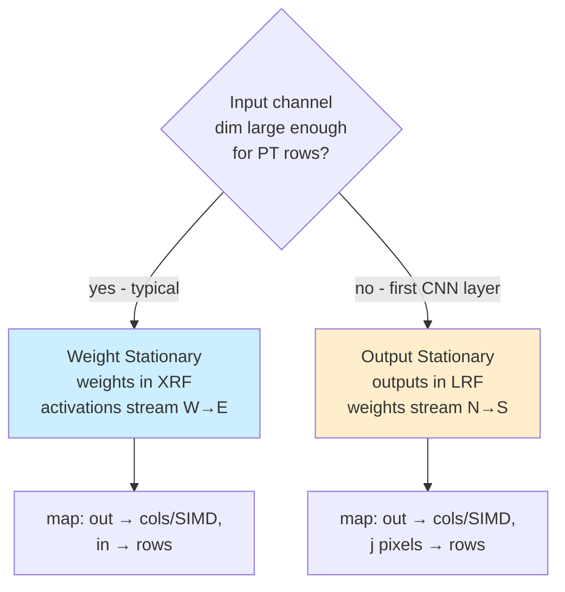
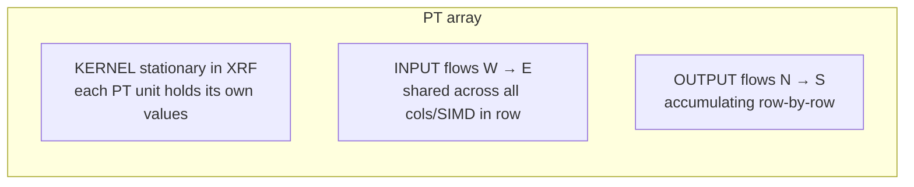
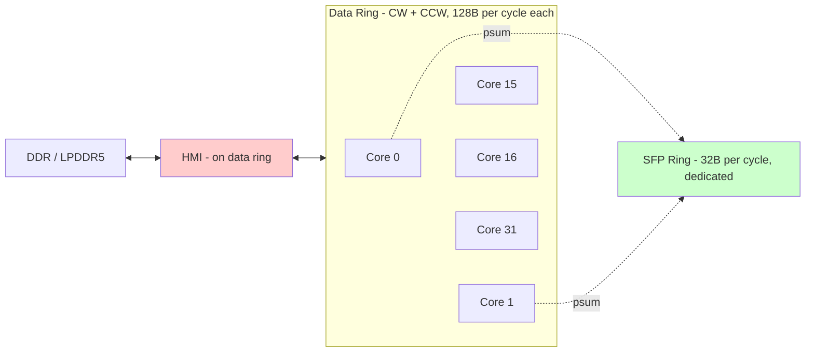
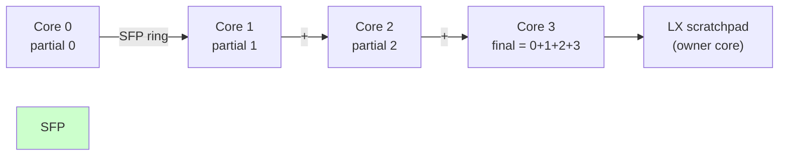

# Matrix Multiplication on the IBM AIU — A First-Principles Reference (v2)

> A standalone, visual reference for how matmul executes on the IBM
> AIU (Spyre) accelerator. Designed so that a GPU-literate reader can
> reason about AIU matmul performance without leaving this document.

## At a glance — the numbers you need

Everything below is either a hardware spec from the AIU architecture
documentation or a value we measured directly. Numbers we measured
are **bold**. All bandwidths assume ~1 GHz chip clock.

### Chip-level

| quantity | value | source |
|---|---|---|
| RaPiD cores | 32 | spec |
| Corelets per core | 2 (CL0 + CL1) | spec |
| **Active corelets per core today** | **1** (the other is idle) | code reading |
| MACs per corelet | 512 (8 rows × 8 cols × 8 SIMD) | spec |
| fp16 peak per corelet | ~1 TFLOPS | derived |
| **fp16 chip throughput (current stack)** | **~32 TFLOPS** | derived |
| fp16 chip throughput (if both corelets engaged) | ~65 TFLOPS | derived |
| INT8 chip throughput | ~130 TFLOPS (sub-SIMD double pump) | derived |
| **Per-call launch floor** | **~3 ms** | measured |

### Memory hierarchy

| level | capacity | per-cycle bandwidth | typical contents |
|---|---|---|---|
| DDR (off-chip) | model-dependent | ~tens of GB/s via HMI | model weights, activations |
| LX scratchpad (per core) | 2 MB | 128 B per cycle to/from ring | working set for the active op |
| L0 scratchpad (per corelet) | 8 × 1 KB | 16 B/cycle per slice → PT row | input streaming buffer |
| XRF (per PT unit) | 64 × 16 B = 1 KB | 1 entry/cycle | weight-stationary block |
| LRF (per PT unit) | small | local | output-stationary partials |

Chip totals:

| | total | comparison: H100 |
|---|---|---|
| LX scratchpad | 64 MB (32 × 2 MB) | 50 MB L2 |
| XRF + LRF + L0 | ~6 MB total | 80 × 256 KB = 20 MB SMEM/L1 |

### Interconnect

| network | width | direction(s) | purpose | **measured BW** |
|---|---|---|---|---|
| Data ring | 128 B/cycle | CW + CCW (2 rings) | LX↔LX, LX↔HMI, LX↔QGI | **~88 GB/s pure ring**, **~67 GB/s with HMI contention** |
| SFP ring | 32 B/cycle | CW (CL0) + CCW (CL1) | partial-sum reduction across cores | not directly measured |
| HMI | shared with data ring | — | DRAM ↔ chip | **77–671 GB/s effective** (sharing-dependent) |

### Per-link ring cost

| operand size | per-hop cost (combined) | per-hop cost (pure ring) |
|---|---|---|
| 0.5 MB | ~6 μs | ~6 μs |
| 1 MB | ~15 μs | ~12 μs |
| 2 MB | ~30 μs | ~23 μs |

Source: [`broadcast_topology_findings.md`](../../tests/broadcast_topology_findings.md),
[`diag_broadcast_lx_resident_results.md`](../../tests/diag_broadcast_lx_resident_results.md).
"Combined" includes the HMI traffic concurrent with broadcast in
that probe.

### Atomic memory unit — the stick

| dtype | elements per stick |
|---|---|
| fp16 | 64 |
| int8 | 128 |

A stick is **128 bytes**. Every memory transfer between LX, ring,
and HMI is in stick units. Tensor inner dimensions get padded to
stick boundaries.

## Chip map



The 32 cores are arranged 16×2. Two data rings (CW and CCW) wrap the
perimeter, with HMI and QGI as nodes on the rings. Adjacent core IDs
are physically adjacent on the ring. **Ring bandwidth is shared
between cross-core sharing and DRAM streaming** — this is the
single most important fact for reasoning about bottlenecks.

## A matmul, end to end

This is what happens when you call a `torch.compile`-d matmul
function on a `spyre` device, from Python invocation to result.



### What dominates wall time

For a typical Llama-70B q-projection prefill `(M=128, N=8192, K=8192)`
with the `output_element_priority` split `(1, 32, 1)`:

```
Total wall ≈ 4.0 ms  (measured)

  ├─ Launch floor              ~3.0 ms     (per-call fixed)
  ├─ Per-core compute          ~1.5 ms     (134 MFLOPs/core @ ~0.1 TFLOPS/core)
  └─ Per-core data transit     ~1.5 ms     (4 MB B per core via HMI ring)

(compute and data transit overlap due to overlapped input fetch;
launch floor sets the lower bound; the slowest of compute or
transit determines the rest)
```

For decode `(M=1, N=4096, K=4096)`:

```
Total wall ≈ 3.1 ms  (measured)

  ├─ Launch floor              ~3.0 ms     ← dominates
  ├─ Per-core compute          ~10 μs      (negligible)
  └─ Per-core data transit     ~50 μs      (negligible)
```

Decode shapes are launch-floor-bound. Prefill shapes are
compute-and-data-bound.

## Inside one core



Each core has two corelets sharing one 2 MB LX scratchpad. **Today
torch_spyre uses only one corelet per core** — this is a 2× compute
parallelism opportunity blocked by multi-repo coordination
(see [`per_corelet_findings.md`](../../tests/per_corelet_findings.md)).

## Inside one corelet



Each PT row has its own L0 slice for input. Inputs flow west-to-east
across each row (all 8 columns × 8 SIMD see the same input element).
Partial sums flow north-to-south, accumulating as they descend.

## The dataflow templates

The AIU compiles each matmul into one of two **dataflow templates**.
The template is a coordinated specification of register-file
residency, data flow direction, scratchpad use, and outer loop
structure. Picking the right template is mostly automatic based on
shape characteristics; understanding which one applies is essential.



For LLM matmul, **WS is essentially always used** — input channel
dim (K, or sometimes Nin) is much larger than 8.

### WS template — what's stationary, what flows



- **Kernel** — block-loaded into XRF, stays put for many cycles
- **Input** — streams from L0 (which reads from LX) across the array
- **Output** — accumulates downward, leaves the PT array via PE → LX

PT row 0 starts accumulation at zero; row 7 sends the final
intra-array partial to PE. PE further accumulates "sub-chunks" in
its register file before writing to LX.

## The kernel loop nest — what the PT actually does

The full WS-FP16 loop nest is built up to keep the PT array fed and
pipelined. Each layer of nesting solves a specific stall problem.

```
For chunk_dimensions:                      # outer: D/B loops, walks all the work
  block-load kernel into XRF               # PT idle for ~8 cycles per row × 8 rows
  For staging_dimensions:                  # mid: data-staging
    fetch input chunk from neighbor LX     # async via L3-LU, overlaps with compute
    For By, Bmb, Bi, Bj/Tj:                # batched
      LX → L0 input transfer
      For Tin/Pin, Tki, Tkj:               # per-block accumulations
        For Pin,row/2:                     # 2 in-channels per send-south
          For LoopPtw=2:                   # output-update spacing for 4-cycle MAC
            For Tj=4:                      # 4-way PT interleaving
              PT MAC                       # send south
            PE sub-chunk accumulate
        PE write output to LX
        SFP psum across cores              # if k > 1
        SFP fused op + write LX            # at end of last block
```

Each inner loop has a specific reason:

- **`Tj=4`** — covers the 4-cycle MAC latency by interleaving 4
  outputs through each PT unit
- **`LoopPtw=2`** — forces 2 accumulations per output before sending
  south, so PE can keep up
- **`Pin,row/2`** — exhausts all 8 in-channels in the L0 slice
- **`Tin/Pin/Tki/Tkj`** — accumulates inside one block-load before
  output circulation
- **`By/Bmb/Bi/Bj`** — amortizes block-load cost across many compute
  cycles
- **chunk loops** — drives the entire work assigned to this core
  with double-buffered DDR fetch

For shapes where total per-block-load compute ≈ block-load cost,
the PT array is well-utilized. For shapes where it's much smaller,
the PT array idles during block-load.

## Cross-core data movement



### Two distinct kinds of "ring traffic"

1. **HMI streaming** — when a core fetches weights from DRAM, the
   transfer goes DRAM → HMI → ring → that core's LX. For shapes
   with weights too large to fit on-chip, this happens every kernel
   call and dominates ring bandwidth.

2. **Cross-core sharing** — when multiple cores need the same operand,
   one core can fetch from DRAM (or already have it in LX) and
   broadcast across the ring to neighbors. For operands that fit in
   LX scratchpad (~ MB scale), this is cheap.

**Both traffic types share the same ring**, so they compete for
bandwidth. This is why the work-division choice matters so much:
choosing a split that puts the 32× redundancy on a small operand
(via element_priority's pure-N pick) reduces total HMI traffic
dramatically.

### Partial-sum reduction (PSUM) on the SFP ring

When `k > 1` (K-split), each core produces a partial output that
must be summed with its k-1 neighbors before the output is final.



Each SFP unit receives the running sum from its neighbor, adds the
local partial, forwards to the next neighbor. The "psum owner" core
at the chain's end writes the final result.

**PSUM cost ≈ (chain length) × (per-core partial size) / SFP
bandwidth**. Both factors matter — a short chain with small
partials is much cheaper than a long chain with large partials.
This is why `(2, 1, 16)` beats pure-K `(1, 1, 32)` empirically:
half the chain length × half the partial size = ~4× cheaper PSUM.

## Performance reasoning — how to estimate

Given a shape `(M, N, K)` and a split `(m, n, k)`, the rough wall
time is:

```
T_wall ≈ max(
  3 ms,                                                 # launch floor
  max(T_compute, T_transit)  +  T_psum
)

T_compute = (M·N·K / 32) / 0.1 TFLOPS         # per-core, empirical
T_transit = per_core_bytes / effective_BW             # per-core
T_psum    = (k - 1) × per_core_C_bytes / 32 GB/s     # if k > 1, else 0
```

where `per_core_bytes ≈ M/m·K + K·N/n + M/m·N/n` (in bytes), and
`effective_BW` depends on whether HMI is contended (~67 GB/s with
contention, ~88 GB/s pure ring).

### Reasoning in 3 questions

For any new shape:

1. **What's the per-core compute time?** If << 3 ms → launch-floor
   bound, no split or heuristic helps.
2. **Does per-core operand size fit LX scratchpad?** If yes →
   sharing fires, you're ring-bandwidth-bound. If no → HMI
   streaming dominates.
3. **Is K very large compared to N (K > 3·N) AND total compute
   escapes the launch floor?** If yes → consider K-split with
   slight m. If no → pure-N is correct.

## Pitfalls observed in practice

| pitfall | symptom | mitigation |
|---|---|---|
| Default planner ranks output dims by stick count, deflating N below M | `(32, 1, 1)` chosen for prefill matmul | `OUTPUT_ELEMENT_PRIORITY=1` (shipped) |
| Pure K-split saturates SFP ring | `(1, 1, 32)` slower than pure-N | use `(m, 1, k)` with small m if K-split needed |
| Non-power-of-2 stick counts | regressions on N=14336, K=28672 shapes | upstream stack issue — flag affected shapes |
| `DXP_LX_FRAC_AVAIL` default of 0.2 is conservative | leaves 20% on the table on big-weight shapes | `DXP_LX_FRAC_AVAIL=0.8` opt-in (not safe globally) |
| Cross-call weight preload not firing for `torch.compile` | first iter == median across all configs | open project — wire `_OUT_IS_STATIC=1` annotations |
| Span pre-split on huge weight tensors | forces mixed split before priority runs | usually picks well by accident on production shapes |
| 3 ms launch floor | decode shapes don't move regardless of split | op fusion or batching to amortize |

See [`session_summary.md`](../../tests/session_summary.md) for the
full project history.

## Comparison with NVIDIA Hopper / Blackwell

| concept | NVIDIA Hopper / Blackwell | IBM AIU |
|---|---|---|
| Per-clock matmul unit | warpgroup MMA via tensor cores | full PT array (8×8×8) |
| Per-corelet/per-SM compute | ~1 TFLOPS fp16 | ~1 TFLOPS fp16 |
| Per-chip compute | ~990 TFLOPs (H100, sparse) | ~32 TFLOPS (current AIU stack) |
| On-chip storage | 256 KB SMEM/SM + 50 MB L2 | 2 MB LX/core, no L2 |
| Cross-block reuse | L2 cache | data ring + LX (explicit) |
| Async copy | TMA | L3-LU / L3-SU |
| Cross-block reduction | global memory + barriers | dedicated SFP ring |
| Launch overhead | ~1-10 μs | ~3 ms |
| Persistent state | persistent kernels | preload mechanism (not yet wired in our stack) |

The two architectures agree on principle (tile, reuse hot operands,
async copy with overlap) but diverge on mechanism: AIU makes
everything explicit, GPU hides things in caches. Both have similar
on-chip storage scale; AIU's distribution is per-core scratchpad
rather than chip-wide L2.

## Glossary

- **Corelet** — independent compute engine; PT + PE + SFP + L0
- **HMI** — Host Memory Interface; on-chip block that talks to DRAM
- **LX** — 2 MB scratchpad shared by a core's two corelets
- **L0** — 8 × 1 KB streaming buffer per corelet
- **PE** — Primitive Element units; sub-chunk accumulation
- **PSUM** — Partial sum; cross-core reduction needed when k > 1
- **PT** — Primary Tensor; the systolic-style MAC array (8×8×8)
- **RaPiD core** — one of 32 compute cores, contains 2 corelets
- **RCU** — Reconfigurable Compute Unit; the AIU chip
- **SFP** — Special Function units; also the dedicated PSUM ring
- **Stick** — 128 B atomic memory unit; 64 fp16 elements
- **WS / OS** — Weight Stationary / Output Stationary dataflow templates
- **XRF / LRF** — register files inside PT units; XRF holds blocks
  of weights, LRF holds output partials

## References

For depth on any topic above, see the per-project investigation docs:

- [`element_priority_theory.md`](../../tests/element_priority_theory.md) —
  the planner bug and the shipping fix
- [`broadcast_topology_findings.md`](../../tests/broadcast_topology_findings.md) —
  ring topology and bandwidth measurements
- [`lx_scratchpad_budget_findings.md`](../../tests/lx_scratchpad_budget_findings.md) —
  `DXP_LX_FRAC_AVAIL` impact characterization
- [`psum_split_findings.md`](../../tests/psum_split_findings.md) —
  K-split / PSUM characterization
- [`per_corelet_findings.md`](../../tests/per_corelet_findings.md) —
  the unused second corelet per core
- [`bidirectional_ring_findings.md`](../../tests/bidirectional_ring_findings.md) —
  dual-ring lever (closed)
- [`preload_investigation_plan.md`](../../tests/preload_investigation_plan.md) —
  cross-call weight preload (open)
- [`session_summary.md`](../../tests/session_summary.md) — meta-pattern
  across all projects

For the existing repo documentation:

- [`dataflow_architecture.md`](dataflow_architecture.md) — AIU dataflow
  model overview
- [`spyre_accelerator.md`](spyre_accelerator.md) — Spyre device
  characteristics
