# Matrix Multiplication on the IBM AIU — A First-Principles Reference (v3)

> The complete guide to how matmul executes on the IBM AIU (Spyre)
> accelerator. From the philosophy behind the chip's design to the
> exact bandwidths your kernel needs, with every claim grounded in
> either the architecture specification or direct measurement.

This document is for the engineer who wants to *understand* AIU
matmul, not just look up numbers. Every section answers three
questions: what is this, why is it shaped this way, and what would
break if it weren't.

If you're familiar with how matmul runs on a modern GPU (tensor
cores, shared memory, async copy, warpgroup MMA), you already know
half the story. This guide builds the other half — the half where
the chip's structure is exposed and the compiler is responsible for
making it dance.

---

## Part 0: What kind of accelerator is this?

Before any speeds and feeds, the most important thing to internalize:
**the AIU is a dataflow accelerator, not a cache-driven one.** This
single design choice ripples through everything else.

A useful metaphor:

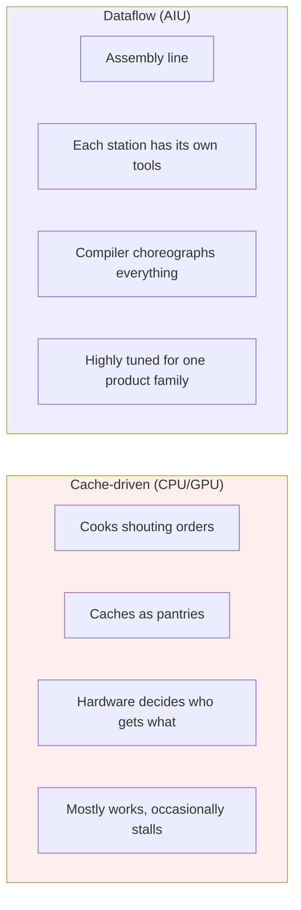

A **CPU or GPU** is like a busy restaurant kitchen. Cooks (cores)
shout orders, caches act as quick-reach pantries, and hardware
makes split-second decisions about who gets what ingredient. It
copes with anything you throw at it, but at the cost of a lot of
moving parts whose behavior you can't fully predict.

The **AIU** is like a manufacturing plant designed for one product
family (deep learning). Each workstation has its own tool chest of
exactly the parts it'll need. Conveyor belts carry components
between stations on a fixed schedule. The plant manager (the
compiler) lays out the entire production sequence in advance —
which station does what, in what order, with which tools.

The trade-off is what we'd expect from any specialization: when the
work matches the design (matrix multiplication and the operations
around it in deep learning models), the AIU is dense, predictable,
and efficient. When the work is unpredictable or doesn't match,
there's no caching mechanism to bail you out.

> **Toy example.** Imagine baking 1,000 identical cookies.
>
> - **Cache-driven (CPU/GPU)**: you start the recipe, walk to the
>   pantry for flour, walk back, walk to the fridge for butter, walk
>   back, etc. The first batch is slow because the kitchen "learns"
>   what you need (caches it on the counter). Batches 2–N are fast
>   because the ingredients are already nearby.
> - **Dataflow (AIU)**: before you start, the manager stages flour,
>   butter, sugar at exactly the right station, in exactly the order
>   they're consumed, on a conveyor belt. There is *no learning
>   phase*. Batch 1 runs at the same speed as batch 1,000, but only
>   if you're baking exactly the cookies the manager planned for.
>   Switch to muffins mid-shift and the conveyor delivers nothing
>   useful.
>
> A GPU is forgiving and adaptive; the AIU is rigid and dense. The
> rest of this document is, mostly, the manager's playbook.

### Why this matters for everything below

Because the dataflow is exposed:

1. **Performance is predictable from first principles.** You can
   compute a kernel's wall time before running it (we'll show how).
2. **Software bears more responsibility.** Bugs in the compiler
   show up as direct performance loss with no runtime mechanism
   to recover.
3. **Mental models from GPUs translate but get sharper.** Every
   "shared memory" decision in CUDA is implicit; the AIU equivalent
   is explicit and visible in the kernel template.

---

## Part 1: At a glance — every number you'll need

This card sits up top so you can come back to it. Every value below
is either a hardware specification or something we measured directly
on a real Spyre card. Measured values are **bold**.

### Compute

| quantity | value | notes |
|---|---|---|
| RaPiD cores per chip | 32 | arranged 16×2 |
| Corelets per core | 2 | shared LX scratchpad |
| **Active corelets per core today** | **1** | the other is idle, see [per-corelet findings](../../tests/per_corelet_findings.md) |
| MAC engines per PT array | 512 | 8 rows × 8 cols × 8 SIMD |
| Per-corelet fp16 peak | ~1 TFLOPS | at ~1 GHz clock |
| **Per-chip fp16 throughput, current stack** | **~32 TFLOPS** | one corelet/core × 32 cores |
| Per-chip fp16, both corelets engaged | ~65 TFLOPS | architectural ceiling |
| Per-chip INT8 throughput | ~130 TFLOPS | sub-SIMD double-pump |
| MAC operation latency, fp16 | 4 cycles | exposes pipeline; needs interleaving |
| MAC operation latency, INT8 | 2 cycles | shorter pipeline |
| **Per-call launch floor** | **~3 ms** | fundamental per-kernel overhead |

### Memory

| level | size | bandwidth (per cycle) | role |
|---|---|---|---|
| LRF (per PT unit) | a few entries × 16 B | local | output-stationary partials |
| XRF (per PT unit) | 64 entries × 16 B = 1 KB | 1 entry/cycle | weight-stationary block |
| Per-corelet XRF total | 64 KB | — | full kernel block storage |
| L0 (per corelet) | 8 × 1 KB = 8 KB | 16 B/cycle/slice | input streaming buffer |
| LX (per core) | 2 MB | 128 B/cycle (one stick) | working set |
| Chip-wide LX | 64 MB | — | total on-chip storage |
| DDR (off-chip) | model-dependent | tens of GB/s via HMI | weights, activations |

For comparison, an H100 has 256 KB SMEM/SM × 132 SMs = ~33 MB
shared memory plus a 50 MB L2 cache. The AIU has 64 MB of LX
scratchpad and **no L2 cache at all** — every byte that crosses
between cores is explicitly moved.

### Interconnect

| network | width | direction(s) | purpose | **measured BW** |
|---|---|---|---|---|
| Data ring | 128 B/cycle | CW + CCW (2 rings) | LX↔LX, LX↔HMI, LX↔QGI | **~88 GB/s pure ring**, **~67 GB/s combined with HMI** |
| SFP ring | 32 B/cycle | CL0 clockwise, CL1 counter-clockwise | partial-sum reduction | not directly probed |
| HMI | shares data ring | — | DRAM bridge | **77–671 GB/s effective** (sharing-dependent) |

Per-link ring transit cost as a function of operand size:

| operand size | cost (combined w/ HMI) | cost (pure ring) |
|---|---|---|
| 0.5 MB | ~6 μs/hop | ~6 μs/hop |
| 1 MB | ~15 μs/hop | ~12 μs/hop |
| 2 MB | ~30 μs/hop | ~23 μs/hop |

Source: [`broadcast_topology_findings.md`](../../tests/broadcast_topology_findings.md)
and [`diag_broadcast_lx_resident_results.md`](../../tests/diag_broadcast_lx_resident_results.md).

### The atomic memory unit — stick

| dtype | elements/stick | bytes/stick |
|---|---|---|
| fp16 / bf16 | 64 | 128 |
| INT8 / fp8 | 128 | 128 |
| INT4 | 256 | 128 |

A stick is 128 bytes, period. All memory transfers between LX,
ring, and HMI happen in stick units. Tensor inner dimensions get
padded to stick boundaries. We'll explain why the chip is built
around this concept in §3.

> **Toy example — reading the at-a-glance card.** Suppose you have
> a `(M=128, N=4096, K=4096)` matmul in fp16.
>
> - **Stick math**: an N row is 4096 fp16 elements ÷ 64 = 64 sticks.
>   Total weight tensor B is K×N = 4096×4096×2 B = 32 MB → 32 MB ÷
>   128 B = 262,144 sticks.
> - **Per-corelet compute time** if 1 corelet does it alone: total
>   FLOPs = 2·M·N·K ≈ 4.3 GFLOPS. At 1 TFLOPS/corelet that's ~4.3 ms
>   of compute. So a single corelet is bandwidth-equivalent to about
>   1.4× the launch floor — meaningful but not huge.
> - **HMI vs ring**: B is 32 MB. Per-direction ring at ~88 GB/s
>   could move it in ~360 μs *if* it all fit on chip. Each core has
>   2 MB of LX, chip-wide that's 64 MB, so the whole 32 MB *can*
>   fit — this is a ring-bound, not HMI-bound, shape.
>
> Every later section will refer back to this kind of arithmetic.

---

## Part 2: The chip — what's actually there

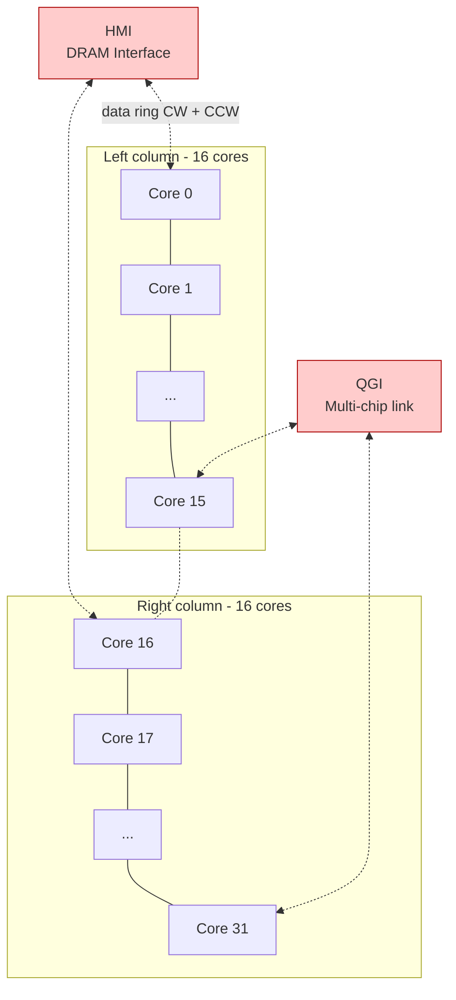

The chip is a 16×2 grid of cores with two counter-rotating rings
wrapping the perimeter. Adjacent core IDs are physically adjacent
on the ring. HMI (the connection to off-chip DRAM) and QGI (the
connection to other chips in multi-AIU systems) are themselves
nodes on the ring.

### Why this layout?

**Why 32 cores?** The number isn't magic; it's a balance between
per-core compute density (each core wants to be big enough to be
useful on its own) and the practical limits of ring topology
(more nodes means longer worst-case paths). 32 is small enough
that the worst-case ring traversal is 31 hops, fast enough that
cross-core sharing remains a viable mechanism.

**Why two rings?** Bandwidth doubling, plus redundancy. Two
counter-rotating rings give 256 B/cycle aggregate ring bandwidth
(vs. 128 with one), and let traffic going to far-away cores take
the shorter direction. (Note: torch_spyre's stack does not
currently choose direction explicitly — see
[`bidirectional_ring_findings.md`](../../tests/bidirectional_ring_findings.md).)

**Why is HMI on the ring?** This is the most consequential
architectural choice for performance reasoning, and it's worth
slowing down for. Two alternatives existed:

- **HMI as a separate fabric** (like a GPU's L2-to-HBM path,
  isolated from inter-SM traffic). Pros: cross-core sharing
  bandwidth doesn't compete with DRAM streaming. Cons: more wires,
  more silicon, more complexity.
- **HMI on the ring** (what AIU chose). Pros: simpler, denser,
  unified data movement model. Cons: cross-core sharing and DRAM
  streaming compete for the same bandwidth.

The choice cascades: when a workload is DRAM-bound (large weights),
the ring is saturated by HMI traffic, and any optimization that
tries to use the ring for cross-core sharing is fighting for the
same bytes. This is the single most-cited fact in the rest of this
document.

### Why HMI placement makes element_priority a 1.61× win

Our `output_element_priority` heuristic produced a measured 1.61×
speedup on Llama-70B q-projection prefill. The mechanism is
entirely about HMI traffic:

| split | per-core unique B (the big tensor, K·N) | total B traffic through HMI |
|---|---|---|
| `(32, 1, 1)` | full B (each core needs all of it) | 32 × \|B\| |
| `(1, 32, 1)` | 1/32 of B | 1 × \|B\| |

Pure-N split puts **32× less weight traffic through HMI** than
pure-M. Since HMI is the ring's biggest customer for production
prefill matmul, reducing its load directly reduces wall time.

If HMI weren't on the ring — if it had its own fabric — this win
would be smaller, because cross-core sharing wouldn't be relieving
ring congestion. The architecture's choice of HMI placement is
why a planner-priority bug fix produced such a large speedup.

> **Toy example — ring traffic for a 4-core matmul.** Picture a
> mini-AIU with just 4 cores arranged in a ring (`C0–C1–C2–C3–C0`).
> A `(M=4, N=4096, K=4096)` matmul, fp16, B is 32 MB.
>
> - **Pure-M split** `(4, 1, 1)` — every core needs full B (32 MB).
>   Total HMI traffic: 4 × 32 MB = **128 MB** through the gateway.
> - **Pure-N split** `(1, 4, 1)` — each core needs ¼ of B (8 MB).
>   Total HMI traffic: 4 × 8 MB = **32 MB** through the gateway.
>
> A 4× swing in HMI bytes from a single planner choice. Scale this
> to 32 cores and you get the 32× swing that makes
> `output_element_priority` a 1.6× win. The ring's HMI placement
> turned a "which dim should we split first" question into the
> dominant performance lever.

---

## Part 3: The "stick" — why a 128-byte container is the answer to many questions

Almost every architectural decision on the AIU traces back to one
unit: the **stick**. 128 bytes. Aligned to 128-byte boundaries.
The atomic transfer unit between LX, ring, and HMI.

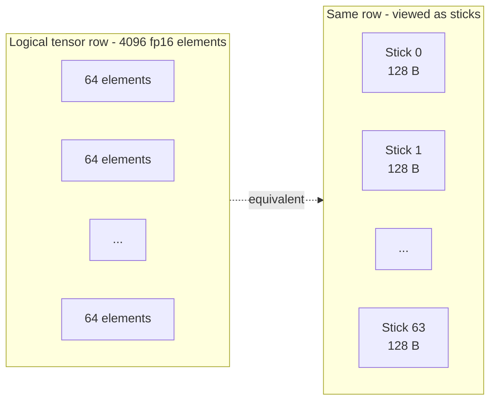

A useful metaphor: a stick is to AIU memory what a **shipping
container** is to global trade. Containers don't make trade
*possible* — you could move goods loose. But once everyone agrees
on the container size, the entire logistics system gets simpler:
trucks, trains, ships, and cranes are all designed around it.

### Why containers? Why this specific size?

Three constraints converge on 128 bytes:

1. **Ring bandwidth efficiency.** The data ring is 128 B/cycle.
   If the atomic transfer were smaller, ring cycles would be
   wasted on partial transfers. If larger, fine-grained transfers
   would need multiple ring cycles.

2. **DDR burst width compatibility.** LPDDR5 prefers larger
   contiguous bursts; 128 B aligns well with typical burst sizes.

3. **Compute granularity.** A stick at fp16 is exactly 64 elements,
   which matches the PT array's column × SIMD count (8 × 8 = 64).
   So one stick is exactly one cycle's worth of inputs to one PT
   row.

This third point is the key: the stick isn't just a memory
abstraction, it's the *natural arrival rate of data into the
compute structure*. Everything is sized for compatibility.

### What if there were no stick concept?

Imagine the AIU without sticks. Memory transfers happen in arbitrary
sizes. Data arrives at the PT array in unpredictable widths.

What you'd lose:

- **Predictable scheduling.** The compiler couldn't precisely
  predict how many cycles a load takes, so it couldn't pipeline
  loads against compute as tightly.
- **Simple work-division checks.** "Can I split this dimension
  across cores?" becomes a complex calculation about whether the
  resulting per-core slice can be transferred efficiently. With
  sticks, it's just "is the per-core size a multiple of stick
  size, and is it >= one stick?"
- **Hardware simplicity.** The DMA engines (LX-LU, LX-SU, L3-LU,
  L3-SU) can be specialized for a single transfer width.

The stick is the AIU's foundational abstraction. When you read
"per-core unique B fits in LX" or "the planner forces a split
because per-core span is too large," you're really reading
statements about stick counts.

### Practical consequences

- **Tensor inner dimensions get padded to stick boundaries.** A
  4097-element row at fp16 becomes 64.015 sticks → 65 sticks
  (with one element of padding).
- **Splits along stick dimensions must produce whole-stick slices
  per core.** Splitting a 64-stick dim across 32 cores gives 2
  sticks/core — fine. Splitting across 33 cores would give 1.94
  sticks/core — invalid.
- **Non-power-of-2 stick counts are a recurring trouble area.**
  We've seen multiple performance anomalies trace to dimensions
  with stick counts that are 7 × something (e.g., N=14336 with
  splits that produce 7 sticks/core). The AIU stack handles
  power-of-2 stick counts more gracefully than non-power-of-2
  values. See pitfalls section.

> **Toy example — counting sticks for three real shapes.**
>
> | tensor | dtype | inner-dim elements | sticks | padded? |
> |---|---|---|---|---|
> | `[128, 4096]` (LLM activation) | fp16 | 4096 | 4096/64 = **64** | no |
> | `[1, 4097]` (oddball) | fp16 | 4097 | ceil(4097/64) = **65** | yes — 1 element of pad |
> | `[1, 14336]` (Llama-3 MLP gate) | fp16 | 14336 | 14336/64 = **224** | no, but 224 = 32×7 |
>
> The third row is exactly the non-power-of-2 trap: 224 sticks
> divides cleanly across 32 cores → 7 sticks per core, which is
> *also* odd. So the per-core slice is a non-power-of-2 stick count
> and trips the slow path. Solving this isn't about making the
> tensor "fit"; it already fits. It's about which factorizations the
> downstream stack handles well.

---

## Part 4: Building the compute hierarchy

Compute on the AIU is organized into nested levels. We'll build
from smallest to largest, with metaphors at each level.

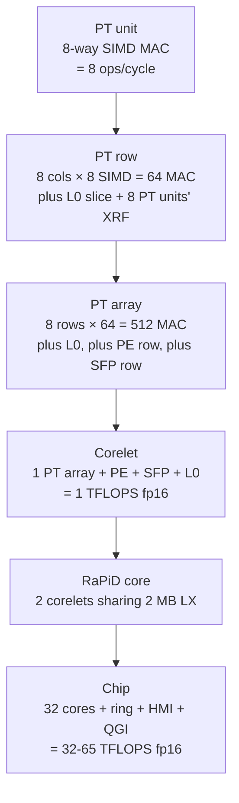

### PT unit — the smallest specialist

A PT unit is **8 multiply-accumulate engines arranged as a SIMD
lane**. It does one operation: take 8 input values × 8 weight
values, produce 8 partial sums.

Metaphor: imagine a worker at a station with 8 specialized stamps.
In one tick, they take 8 incoming items, stamp each with the
matching die, and pass on 8 stamped products.

A PT unit alone is uninteresting. The interesting thing is what
happens when 64 of them work together.

### PT row — sharing inputs, producing diverse outputs

8 PT units in a row share the same input stream. The input is
"broadcast" west-to-east: it enters the leftmost PT unit, gets
forwarded to the next, and so on. All 8 units multiply their own
weights against the same 8 input values.

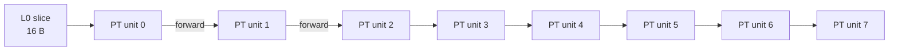

So one PT row, in one cycle:

- Reads **1 stick worth of input** (8 elements per SIMD lane × 8
  positions = 64 elements? No — that's the row's bandwidth from
  L0; what each PT unit *consumes* is one element per SIMD lane =
  8 fp16 = 16 B per cycle. That comes from the L0 slice.)
- Multiplies against weights stored in each PT unit's XRF
- Produces 8 outputs per PT unit × 8 PT units = 64 partial sums

In matrix multiplication terms: a row computes **64 output channels
in parallel**, all sharing the same 8 input channels.

Why this design? It's the most natural way to extract parallelism
from matmul. The "outer product" structure of matmul (an M×K input
times a K×N weight produces M×N output) maps cleanly: spread output
columns across the PT row, share input as broadcast.

> **Toy example — one PT row computing C[0, 0:64] += A[0, 0:8] @ B[0:8, 0:64].**
>
> Suppose row `i=0` of A is `[a0, a1, ..., a7]` (8 input channels)
> and B's first 64 output columns are pre-loaded across the row's
> 8 PT units' XRFs (each PT unit holds B for 8 output cols).
>
> ```
> cycle 0:  a0 enters PT0  → multiplies its 8 XRF cols → 8 partials
> cycle 1:  a0 forwarded to PT1, a1 enters PT0
>           PT1: a0 × its B cols → 8 partials
>           PT0: a1 × its B cols → 8 partials
> ...
> cycle 7:  a0 reaches PT7, a7 enters PT0
> cycle 8:  a1 reaches PT7, etc.
> ```
>
> After the pipeline fills, every cycle produces 64 partial-sum
> updates (8 PT units × 8 SIMD lanes), and the *same* `ai` is
> shared across all 8 columns. That west-to-east "broadcast" is why
> input bandwidth from L0 is just 16 B/cycle (one cycle's input
> stream), even though the row touches 64 output values per cycle.

### PT array — adding reduction along a second dimension

8 PT rows stacked vertically. Each row works on a different group
of 8 input channels (row 0 handles channels 0-7, row 1 handles
8-15, etc.). The partial sums **flow north-to-south**: row 0
starts at zero, row 1 adds to row 0's output, row 2 adds to row
1's, and so on. By the time the result emerges from row 7, it's
the sum across 64 input channels (the K dimension).

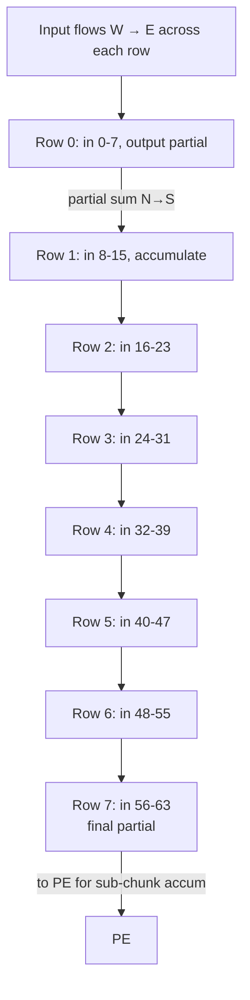

This is what people mean when they call AIU "systolic." Data
flows through a 2D array of compute units in two directions
simultaneously, with the array doing useful work at every step.

In one cycle, a PT array produces:

- 64 output channels × 8 input channels parallel work
- = 512 multiply-accumulate operations
- = ~1 TFLOPS at 1 GHz, fp16

> **Toy example — full PT array for `C[0, 0:64] += A[0, 0:64] @ B[0:64, 0:64]`.**
>
> Now we use all 8 rows. A's 64 input channels are split into 8
> groups of 8: row 0 gets `a0–a7`, row 1 gets `a8–a15`, …, row 7
> gets `a56–a63`. Each row holds its own slice of B (an 8×64 chunk)
> in XRF.
>
> Each cycle (after pipeline fill):
> - Row 0 produces 64 partial sums for `C[0, 0:64]` from `a0–a7`.
> - Row 1 receives row 0's partial sums via north-to-south flow,
>   *adds* its own contribution from `a8–a15`, and forwards south.
> - ... by row 7, the column has accumulated all 64 input channels.
>
> One cycle of steady-state = 64 outputs × 8 input-channel
> contributions = 512 MAC. After 64 cycles of streaming through one
> 64-K block, you've finished `C[0, 0:64]` for one M row.

### Corelet — the smallest "useful" compute unit

A corelet wraps the PT array with the supporting infrastructure
needed to actually run a kernel:

- The PT array (where compute happens)
- An L0 scratchpad (8 × 1 KB, the streaming buffer that feeds the
  PT array)
- A PE array (1×8, post-PT accumulation)
- An SFP array (1×8, fused ops + special functions + PSUM routing)

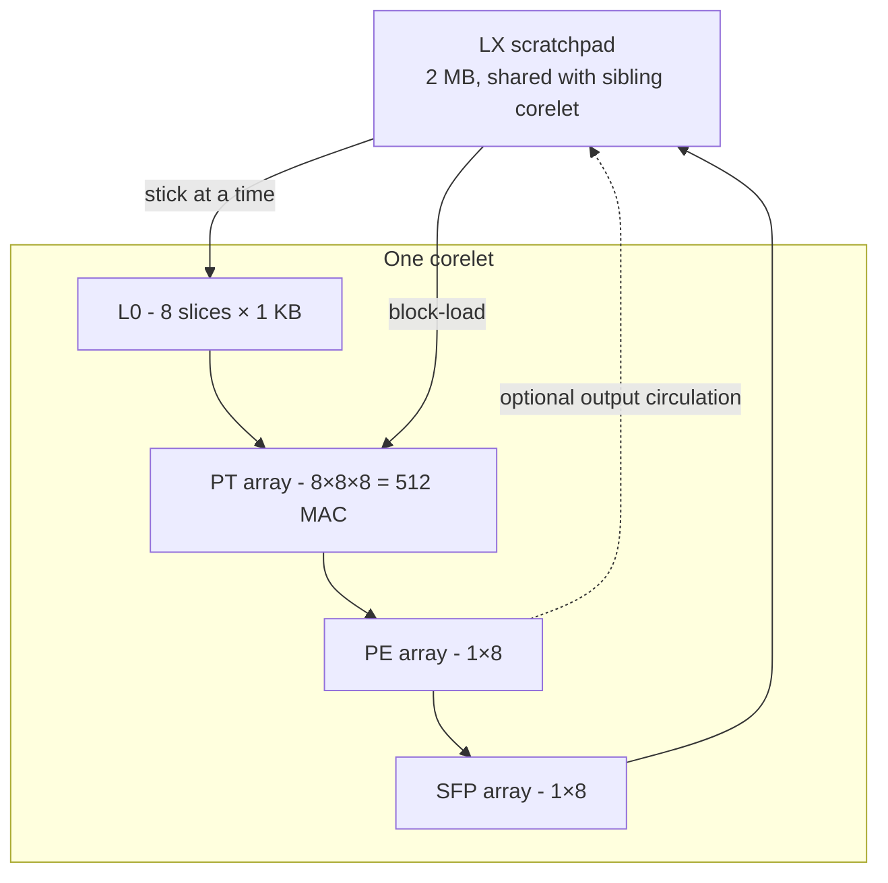

A corelet can run a complete matmul kernel by itself. It doesn't
need the other corelet, doesn't need other cores, doesn't need
anything but its own LX (and DDR for whatever doesn't fit).

### Core — two corelets, one scratchpad

A RaPiD core contains two corelets that share one 2 MB LX
scratchpad. The shared LX is significant — it means the two
corelets can pass data to each other without going through the
ring at all (since they're literally reading the same physical
memory).

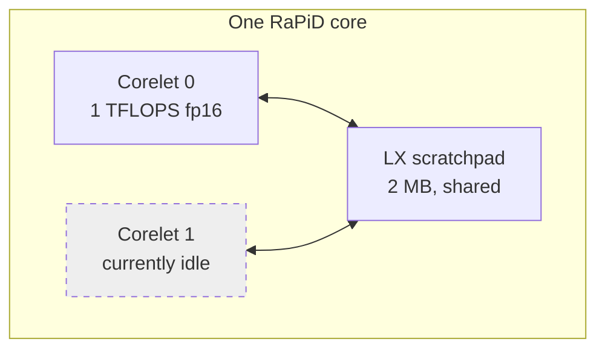

Today, **only one corelet per core is engaged** in torch_spyre's
stack. The second sits idle, representing a 2× compute
parallelism opportunity that's blocked by multi-repo coordination.
See [`per_corelet_findings.md`](../../tests/per_corelet_findings.md).

### Why have corelet pairs at all if we're using one?

This is a genuine question about the architecture. The pair design
suggests several intended use cases:

- **Operator fusion** — pair a primary op (matmul) on one corelet
  with a secondary op (e.g., layer-norm post-processing) on the
  other, with intermediate results staying in the shared LX.
- **Operand sharing for related ops** — when two ops share an
  input (e.g., both Q and K projections of the same activation),
  put them on paired corelets.
- **Spatial locality for MoE** — pair experts that get co-routed
  for sharing of the activation tensor.

None of these are exploited by torch_spyre today. The pair sits as
unused architectural capacity.

### Chip — bringing it all together

32 RaPiD cores × 2 corelets × 1 TFLOPS = 65 TFLOPS architectural
ceiling at fp16. With the current single-corelet usage, ~32
TFLOPS. Both numbers assume 1 GHz clock.

For perspective: an NVIDIA H100 hits ~990 TFLOPs/s at fp16 with
sparsity. The AIU is roughly 1/15th of an H100 in absolute compute,
but at a fraction of the area and power budget — it's a denser
design per silicon area for the matmul-heavy workloads it targets.

> **Toy example — what does "per-corelet 1 TFLOPS" actually look
> like?** A small Llama-3 q-projection matmul `(M=128, N=4096,
> K=4096)` is 4.3 GFLOPS. On a single corelet at 1 TFLOPS that's
> ~4.3 ms of compute. On all 32 active corelets (1 per core) it's
> ~135 μs — well below the 3 ms launch floor. So this shape is
> *launch-floor-bound*: the chip finishes computing before the
> launch overhead even unwinds. Knowing this stops you wasting time
> tuning splits for shapes that can't possibly improve.

---

## Part 5: The memory hierarchy

The AIU has six distinct levels of memory, from largest/slowest to
smallest/fastest:

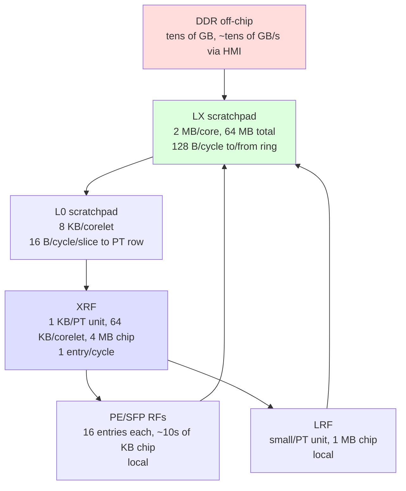

### A workshop metaphor

Think of the memory hierarchy like a workshop:

- **DDR** is the **offsite warehouse**. Has everything but takes a
  truck (HMI) to retrieve.
- **LX** is the **central plant warehouse**. Big enough to hold a
  day's worth of work; conveyor belts (the ring) move things in
  and out.
- **L0** is the **parts bin at each station**. Just enough to
  feed the next few minutes of work; restocked from LX.
- **XRF** is the **rolling tool chest at each PT unit**. Holds
  the specific tools you'll use repeatedly for the current job.
- **LRF** is the **personal toolkit**. Tiny, but instant access.
- **PE/SFP RFs** are **handheld tools**. The smallest, fastest
  storage for in-flight values.

A well-run kernel keeps the right thing at the right level:
weights live in XRF for the duration of a kernel block, inputs
stream through L0 just-in-time, and the results circle back to
LX before the next block starts.

### Why explicit hierarchies instead of caches?

GPUs have caches at most levels of their hierarchy (L1 with
software-managed shared memory partition, L2). The AIU has none —
every byte movement is explicit.

Why?

**Predictability.** A cache miss is invisible to the programmer;
it just happens, and you only notice when performance drops.
Explicit data movement is visible — the compiler emits an
instruction for every transfer, and you can predict timing
exactly. For dataflow-style scheduling where the compiler is
choreographing precise pipeline overlap, predictability is more
valuable than the convenience of caching.

**Silicon density.** Caches are expensive in transistors — tag
arrays, replacement logic, coherence protocols. By dispensing
with them, the AIU spends that area on more compute and more
scratchpad. A ratio you can compare directly: H100 has ~33 MB
shared memory + 50 MB L2 cache, so about 60% of its on-chip
storage area is spent on storage logic with caches accounting for
much of it. AIU has 64 MB of LX + ~6 MB other = essentially
all-storage, no cache logic.

**Exposed parallelism.** When data movement is explicit, the
compiler can pipeline it explicitly. For example, the WS template
issues a "load next chunk from neighbor LX" the moment it starts
processing the current chunk, with no dependence on a cache to
*notice* that the next chunk is needed.

### What the levels do during a typical kernel

For a weight-stationary matmul, the typical flow is:

1. **DDR → LX** (HMI-driven). Bring the weight chunks for the
   current block into the local LX. Happens ahead of need via
   double-buffering.
2. **LX → XRF** (block-load). Move the weights into the PT
   units' register files. Happens once per block, then those
   weights are used many times.
3. **LX → L0** (LX-LU-driven). Stream input chunks into L0,
   from where the PT row reads them.
4. **L0 → PT-west**. The actual feed into the PT array, one
   element per SIMD lane per cycle.
5. **PT array → PE → LX** (output path). Partial sums accumulate
   in PE, then write back to LX.
6. **LX → DDR** (eventually). Final output written back to host
   memory.

Notice that XRF and LRF "stationary" data never goes back to LX
during the inner loops — that's the whole point of "stationary."
The compiler ensures the kernel block is sized so that it can do
many useful cycles of compute on each block-load.

> **Toy example — where does each piece of a tiny matmul live?**
>
> Take `C[0:64, 0:64] += A[0:64, 0:64] @ B[0:64, 0:64]` running on
> one corelet. Trace where each operand lives over the kernel's life:
>
> | data | size | level | duration |
> |---|---|---|---|
> | full B (a 64×64 tile) | 8 KB | XRF (per PT unit, 1 KB × 8 cols × 8 rows) | for the *entire* kernel — block-loaded once |
> | A row chunk (8 input chans × stick) | 128 B | L0 slice | 1 chunk-time, then refilled |
> | A's full row | 128 B/row × 64 rows = 8 KB | LX | for the kernel's life |
> | C partial sums | per-PT-unit, ~tens of B | LRF (during accumulate) | until written back |
> | C final tile | 64×64×2 B = 8 KB | LX → DDR | written at the end |
>
> Notice the asymmetry: B (the "stationary" weight) sits in XRF and
> is *never* re-read from LX during inner loops. A streams. C
> trickles out. This is the point of "weight stationary": pay the
> XRF block-load cost *once* and amortize it over many MACs.

---

## Part 6: The interconnect

The chip's networks are where some of the more interesting design
decisions live.

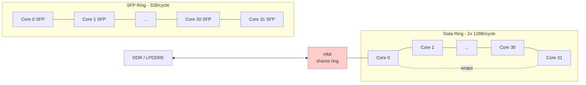

### Two data rings, why both?

The data rings carry "everything that isn't a partial sum" — input
operands, output results, weight transfers from DDR. They're 128
bytes wide each, running in opposite directions.

The benefit of dual rings is twofold:

**Bandwidth.** 256 B/cycle aggregate vs. 128 B/cycle with one
ring. For ring-bound workloads, this is a 2× improvement.

**Latency.** A core wanting to send data to a far-away core can
choose the shorter direction. Without two directions, every
transfer would take a fixed (worst-case 31 hops) trip.

Both rings exist physically. Whether *current software* exploits
both directions for parallel traffic is a separate question (it
appears not to — see
[`bidirectional_ring_findings.md`](../../tests/bidirectional_ring_findings.md)).

### Why is HMI on the data ring?

This is the key architectural choice we discussed earlier. HMI —
the chip's gateway to off-chip DRAM — could have been on its own
fabric. Instead, it sits as a node on the data ring.

Consequence: when a core fetches weights from DRAM, those bytes
flow DRAM → HMI → ring → that core's LX. They share ring bandwidth
with cross-core operand sharing happening simultaneously.

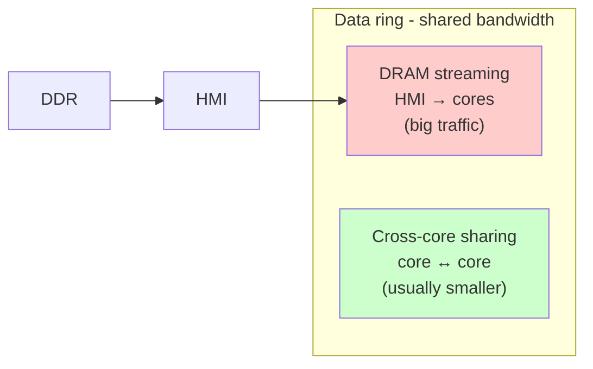

This means that a workload streaming a lot from DRAM can leave
*no room* on the ring for cross-core sharing to fire — even if
the splits would theoretically benefit from sharing. We measured
this: pure ring-share bandwidth is ~88 GB/s per direction, but
combined with concurrent HMI streaming it drops to ~67 GB/s
(~24% overhead).

### Why a separate SFP ring for partial sums?

The SFP ring is dedicated to one purpose: cross-core partial-sum
reduction. It's narrower than the data rings (32 B/cycle vs 128
B/cycle), but it has the entire ring bandwidth to itself — no
contention with operand traffic.

Why a separate ring? Because PSUM has a very specific traffic
pattern (chained reduction across adjacent cores) that benefits
from dedicated hardware. If PSUM had to share the data ring, it'd
be choked out whenever weight streaming was busy — exactly when
K-split would otherwise be useful.

The separation is what makes K-split *architecturally* viable.
But — and this is important — it doesn't make K-split
*operationally cheap*. Our measurements show that pure K-split
`(1, 1, 32)` is slower than pure-N split on every shape we've
tested. Why? PSUM cost scales with **(chain length) × (per-core
partial size)**, and a 32-core chain with 1 MB partials is
expensive even on the dedicated ring. The mixed split `(2, 1, 16)`
beats pure-K because it halves both factors — half the chain × half
the partial = ¼ the cost. See
[`psum_split_findings.md`](../../tests/psum_split_findings.md).

> **Toy example — counting ring cycles for a 1 MB transfer.** A
> 1 MB tensor is 1,048,576 B ÷ 128 B/stick = **8,192 sticks**.
>
> - On the **data ring** (128 B/cycle): 8,192 cycles to traverse
>   one hop. At 1 GHz that's 8.2 μs per hop, or ~12 μs/hop measured
>   (overhead from cycle alignment).
> - On the **SFP ring** (32 B/cycle): the same payload is 1,048,576
>   B ÷ 32 B = 32,768 cycles per hop ≈ 33 μs/hop. PSUM is moving 4×
>   *less* per cycle than the data ring.
>
> Now apply this to PSUM cost. With `(1, 1, 32)`, each core's
> partial is `M × N × 4 B` (PSUM is fp32). For `M=128, N=8192`,
> that's 4 MB per core. PSUM chain length = 31 hops × 4 MB ÷
> 32 B/cycle ≈ 4 ms — which would dominate the entire kernel. With
> `(2, 1, 16)`, partial is 2 MB and chain is 15 hops → ~960 μs.
> The 4× PSUM-cost ratio you read in `psum_split_findings.md` falls
> right out of this arithmetic.

---

## Part 7: A matmul, end to end

Now we have all the pieces. Let's trace a single matmul from the
moment your Python code calls it to the moment results return.

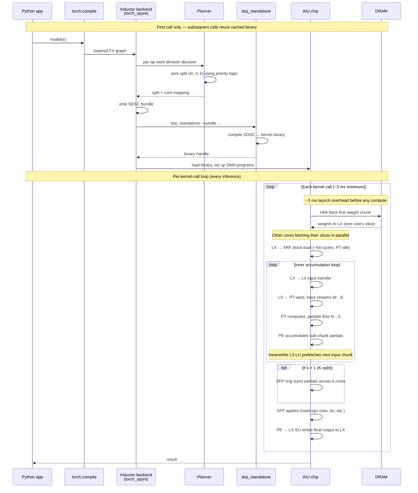

### The compile-time path (one-time cost)

When you call `torch.compile(model)(x)` for the first time:

1. **Tracing.** torch.compile walks the model, building an FX
   graph of operations.
2. **Lowering.** The torch_spyre Inductor backend takes that
   graph and lowers each matmul to an `OpSpec` describing the
   shape, dtype, and constraints.
3. **Planning.** The planner (in
   [`core_division.py`](../../torch_spyre/_inductor/core_division.py))
   decides the work split `(m, n, k)` for each op based on
   priority logic.
4. **Codegen.** The backend emits an SDSC (Spyre Data Structure
   Schema) bundle — a JSON-like description of what each core
   should do, how data is laid out, and which DMA programs run.
5. **Backend compilation.** `dxp_standalone` consumes the SDSC
   bundle and produces an executable kernel binary.

This whole path runs once per unique shape. Cached binaries are
reused across subsequent calls — so this overhead amortizes.

### The runtime path (per kernel call)

Once compiled, each kernel call follows this cadence:

**Phase 1 — Setup (~3 ms launch floor).** Per-call fixed overhead.
The DMA programs are dispatched, ready signals exchanged, the
core's local state primed. This is the launch floor we measure
empirically.

**Phase 2 — Initial weight fetch.** HMI starts streaming the first
weight chunk for each core. Multiple cores can fetch in parallel,
but they all share HMI bandwidth. For shapes with cross-core
sharing, one core fetches and broadcasts via the ring.

**Phase 3 — Block load.** Weights move from LX into XRF. The PT
array is idle during this transfer (~64 cycles per block — 8
cycles per row × 8 rows sequentially loaded). For high-frequency
matmul, the kernel template arranges chunks so this overhead is
amortized across many compute cycles per block.

**Phase 4 — Compute pipeline.** This is the interesting part:

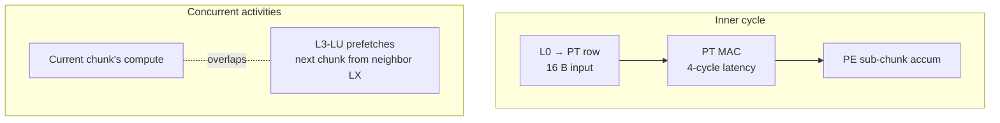

Several things happen in parallel:

- The PT array consumes the current chunk via the cycle above
- PT interleaves 4 different outputs to cover MAC latency (`Tj=4`)
- 2 accumulations per row before sending south (`LoopPtw=2`,
  matched to PE's intake rate)
- PE accumulates a sub-chunk's worth of partial sums in its RFs
- L3-LU is already prefetching the *next* input chunk from the
  neighbor LX, so the next inner iteration's data is ready when
  this one finishes

This pipelining is the secret to high utilization. If any of the
concurrent activities stall, the pipeline drains and the array
goes idle.

**Phase 5 — Optional PSUM.** If `k > 1`, partial outputs from
multiple cores need to be summed. The SFP ring carries the
running total from one psum-collaborating core to the next, with
each core's SFP unit adding its local partial. The end of the
chain owns the final output.

**Phase 6 — Output writeback.** The SFP applies fused ops (ReLU,
batch norm, etc.) and writes the final output to LX. From there,
either the next op picks it up, or it eventually heads back to
DDR.

### Predicting wall time

For the L3-70B q-projection prefill `(M=128, N=8192, K=8192)` with
the `output_element_priority` split `(1, 32, 1)`:

```mermaid
gantt
    title Wall time decomposition (~4 ms total)
    dateFormat X
    axisFormat %s

    section Launch floor
    Per-call overhead: 0, 3000

    section Compute (per-core, overlaps)
    PT compute: 0, 1500

    section Data transit (per-core, overlaps)
    HMI streaming + ring: 0, 1500

    section Total
    Wall time (max of overlapping bars): 0, 4000
```

(All values in microseconds.)

Wall time is `max(launch_floor, max(compute, transit) + psum)`.
Compute and transit overlap because of overlapped input fetch.
For this shape:

- Launch floor: 3.0 ms
- Per-core compute: ~1.5 ms (134 MFLOPs/core ÷ ~0.1 TFLOPS/core)
- Per-core data transit: ~1.5 ms (4 MB B per core via HMI ring)
- PSUM: 0 (k=1)

Total: ~4 ms, matching the measured 4.05 ms.

For decode `(M=1, N=4096, K=4096)`, compute and transit are tiny
(~10s of μs), so wall time bottoms out at the launch floor. This
is why decode shapes don't benefit from any work-division
optimization — there's no slack to save.

> **Toy example — replaying the sequence diagram on a tiny shape.**
> Walk through `(M=4, N=128, K=128)` fp16 on 4 cores, split `(1, 4, 1)`:
>
> | phase | per-core work | rough time |
> |---|---|---|
> | 1. Setup | DMA programs primed | 3 ms (fixed) |
> | 2. HMI fetch | weight slice = 128×32×2 B = 8 KB | <1 μs (fits in one HMI burst) |
> | 3. Block-load LX→XRF | 8 KB → XRF | ~64 cycles ≈ 64 ns |
> | 4. Compute | 4×32×128 = 16K MACs | <1 μs |
> | 5. PSUM | k=1, none | 0 |
> | 6. Writeback | 4×32×2 B = 256 B per core | <1 μs |
>
> **Total**: phases 2–6 finish in <10 μs. Phase 1 (the launch
> floor) dominates by 300×. *This shape can never be sped up by
> better splits or sharing* — the chip spends ~99.7% of its time
> waiting for the per-call overhead to clear. The lesson: before
> reaching for any optimization, do this back-of-envelope math. If
> the compute+transit total is under the launch floor, only fusion
> or batching can help.

---

## Part 8: The two dataflow templates

Why does the AIU need *two* templates? Why not just one universal
matmul kernel?

The answer comes from the PT array's structure. A PT array has 8
rows × 8 cols × 8 SIMD = 512 MAC engines. To utilize them all, you
need work along all three of those dimensions. For typical matmul
where the input channel dimension (K) is 1024+, that maps cleanly:

- Output channels (N) → cols × SIMD = 64 in parallel
- Input channels (K) → rows = 8 in parallel
- Partial sums accumulate north-to-south

This is the **weight-stationary (WS)** template.

But what if K is tiny? The first layer of a CNN has 3 input
channels (R, G, B). With 8 rows in the PT array, putting K across
rows gives <40% utilization. The OS template solves this by
re-mapping:

- Output channels (N) → cols × SIMD = 64 (same as WS)
- Output spatial pixels (j) → rows = 8 in parallel
- Input channels processed sequentially across cycles

```mermaid
flowchart TB
    Q{Input channel dim<br/>(K) >= 8?}
    Q -->|yes - typical for matmul| WS["Weight Stationary<br/>weights in XRF<br/>input streams W→E<br/>output flows N→S"]
    Q -->|no - first CNN layer| OS["Output Stationary<br/>outputs in LRF<br/>kernel streams N→S<br/>input streams W→E"]

    WS --> WSblock["Block-load weights once<br/>compute many cycles<br/>(amortize block-load cost)"]
    OS --> OSblock["No block-load<br/>output block-store<br/>once per chunk"]

    style WS fill:#cef
    style OS fill:#fec
```

For all transformer matmul (LLM prefill and decode), WS is the
template. The rest of this document focuses on WS.

### WS — what stays put, what flows

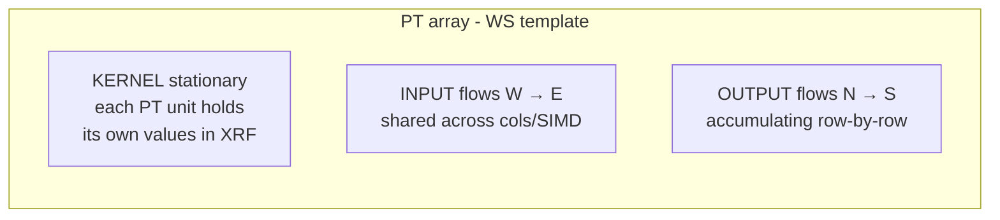

Three streams in three directions. Once you internalize this, the
rest of WS makes sense:

- The **kernel** is loaded into XRF once per block, then reused
  many times. This is what "stationary" means.
- The **input** streams from the L0 scratchpad through the array
  west-to-east. Every column and every SIMD lane within a row sees
  the same input element.
- The **output** is built up by accumulating partials north-to-south.
  Row 0 starts at zero; row 7 sends the result south to PE.

### Why these directions specifically?

Because they map naturally to matmul's structure. The output `C[i,
j]` is `sum over k of A[i, k] * B[k, j]`:

- Different output positions `(i, j)` need different combinations
  of A and B values → different PT units handle different output
  positions
- The same input `A[i, k]` is needed by all output positions at
  the same row `i` → input broadcast W→E shares it across columns
- The sum over `k` accumulates over time → partial flow N→S
  accumulates as it descends

If you flipped any of these, you'd break the mapping and need
extra cycles to unscramble. The directions aren't arbitrary; they
encode the algebra of matmul into the chip's geometry.

> **Toy example — when WS wins, when OS wins.** Compare two real
> matmul shapes:
>
> | shape | K | input channels per row | PT-row utilization with WS | template |
> |---|---|---|---|---|
> | LLM Q-proj `(128, 4096, 4096)` | 4096 | 4096/8 = 512 row-blocks | 100% (8 rows always full) | **WS** |
> | First conv `(1, 56·56, 3, 7×7)` (3 RGB chans, 7×7 kernel) | 3 | 3/8 = 0.375 row-blocks | ~37% (5 of 8 rows idle) | **OS** |
>
> The first-conv case has K=3 in-channels — fewer than the 8 PT
> rows can absorb. WS would leave 5/8 of every PT array idle. OS
> swaps the mapping so that *output spatial pixels* (j) populate
> the rows instead of K, restoring full utilization. For
> transformer matmul, K is always huge, so WS always wins. The OS
> template exists almost entirely for the first layer of CNNs.

---

## Part 9: The kernel loop nest — orchestration in layers

A WS-FP16 matmul kernel runs a deeply nested loop. Each level of
nesting solves a specific stall problem. Reading the loop top-to-
bottom is reading the chip's pipeline being filled.

```
For chunk_dimensions:                      # outermost: walks all work assigned to core
  block-load kernel into XRF               # PT idle ~64 cycles
  For staging_dimensions:                  # data-staging
    fetch input chunk from neighbor LX     # async, overlaps with PT compute
    For By, Bmb, Bi, Bj/Tj:                # batched
      LX → L0 input transfer
      For Tin/Pin, Tki, Tkj:               # per-block accumulations
        For Pin,row/2:                     # exhaust 8 in-channels in one slice
          For LoopPtw=2:                   # 2 accums per output → matches PE intake
            For Tj=4:                      # 4-way PT interleaving covers 4-cycle latency
              PT MAC                       # one input × one weight, partial flows S
            PE sub-chunk accumulate
        PE writes output to LX
        SFP psum across cores              # if k > 1
        SFP fused op + write LX            # at end of last block
```

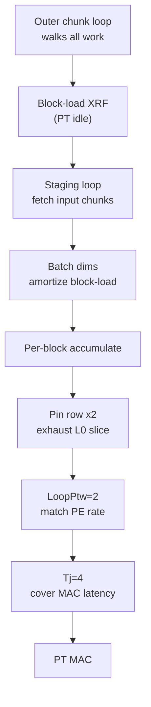

### Why each layer exists

Each loop level was added to fix a specific kind of stall. Walking
through them with the "what would break" lens:

**`Tj=4` (PT interleaving).** A PT MAC has 4-cycle latency at
fp16. If you tried to do 4 successive MACs that all wrote to the
same output, the second would stall waiting for the first.
**Without this layer:** PT effective throughput would drop by 4×.
Solution: interleave 4 different outputs through the PT, each
getting one MAC every 4 cycles.

**`LoopPtw=2` (2 accumulations before send-south).** PE accumulates
partials at a fixed rate. If PT sent results faster than PE could
consume, back-pressure would propagate up and stall PT.
**Without this layer:** PT and PE would have a pipeline mismatch.
Solution: PT does 2 row-internal accumulations before sending to
PE.

**`Pin,row/2` (exhaust the L0 slice).** Each L0 slice contains 8
input channels. If you didn't exhaust all of them before fetching
the next chunk, you'd waste L0 bandwidth.
**Without this layer:** L0 would be fetched more often than
necessary.

**`Tin/Pin/Tki/Tkj` (per-block accumulations).** These walk the
work that uses the currently-loaded XRF block. The bigger this is,
the more compute amortizes one block-load.
**Without this layer:** every output would require a fresh
block-load, dropping utilization to ~ 0%.

**`By/Bmb/Bi/Bj` (batched).** These add another dimension of
amortization across the loaded block.
**Without this layer:** block-load overhead would dominate.

**Staging loop (input fetch).** Pulls input chunks from neighbor
LX *concurrently* with PT compute. Soft-sync mechanism lets the
LX-LU read input the moment it's available without blocking the
fetcher.
**Without this layer:** every cross-core fetch would stall the
pipeline.

**Outer chunk loop.** Drives the whole work assigned to this core.
Double-buffered when fetching from DDR, so DDR latency overlaps
with compute on the previous chunk.
**Without this layer:** DDR fetches would be serialized with
compute.

### The big idea

Each loop layer was added because removing it caused a specific
stall. The kernel template is the *minimum* loop structure that
achieves high utilization given the chip's latencies and
bandwidths. Less elegant than a single matmul loop in CUDA, but
the cycle-by-cycle utilization is dramatic.

> **Toy example — what fires in 32 cycles of inner loop.** Walk
> through 32 cycles of a steady-state WS-fp16 inner loop, focusing
> on a single PT row producing 4 output groups (`Tj=4`):
>
> ```
> cycle 0:  L0 → input a0 enters PT0 of row r=0 → MAC for output group 0
> cycle 1:  a0 forwarded to PT1, a1 enters PT0 → MAC for output group 1
> cycle 2:  ...                                  → MAC for output group 2
> cycle 3:  ...                                  → MAC for output group 3
> cycle 4:  result for output group 0 ready (4-cycle latency satisfied)
>           PT0 starts MAC for next K-iteration of group 0
> cycle 5-7: same pattern, groups 1-3 next K-iter
> cycle 8-15: LoopPtw=2 second accumulation per group
> cycle 16:  PE absorbs row r=0 sub-chunk; row r=1 starts feeding
> ...
> cycle 31: 8 rows done with this 8-K slice
> ```
>
> Every cycle has a useful MAC happening. The `Tj=4` interleaving
> means the 4-cycle MAC latency is *fully hidden* — by cycle 4,
> when group 0's first MAC finishes, group 0's second MAC is ready
> to issue. Remove `Tj=4` and PT idles 3 cycles out of every 4 →
> 25% utilization. Each loop layer is a similar stall-killer.

---

## Part 10: Cross-core data movement

So far we've described what happens within one core. The next layer
is how 32 cores cooperate.

### The work-division decision

When the planner sees a matmul `C[M, N] = A[M, K] @ B[K, N]`, it
must choose how to split the work across cores. The choice is a
triple `(m, n, k)` where `m × n × k = 32` (for SENCORES=32).

Why does this choice matter so much? Because each split has a
different operand-traffic pattern, and those patterns differ in
how much data flows through HMI:

| split | per-core unique A | per-core unique B | per-core unique C | total B traffic |
|---|---|---|---|---|
| `(32, 1, 1)` | 1/32 of A | full B | 1/32 of C | 32 × \|B\| |
| `(1, 32, 1)` | full A | 1/32 of B | 1/32 of C | 1 × \|B\| |
| `(2, 1, 16)` | 1/2 of A | 1/16 of B | 1/2 of C | 2 × \|B\| |

For LLM prefill, B (the weight) is by far the largest tensor. The
"total B traffic through HMI" column is the dominant cost. **Pure-N
puts the 32× redundancy on the small operand A. Pure-M puts it on
the big operand B. The latter is dramatically slower.**

This is the bug-and-fix story behind `output_element_priority`.
Before our fix, the planner ranked output dimensions by their
*stick-adjusted* iteration size, which made N (a stick dim) appear
artificially smaller than M and caused it to lose priority. The fix
ranks by element count, which puts N first — and the planner
naturally picks the cheaper split.

### Operand sharing across cores

Cross-core sharing is the mechanism that lets the planner's split
choice pay off. When multiple cores need the same operand, the
runtime can fetch it from DDR (or already-resident LX) once and
broadcast across the ring.

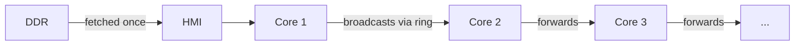

But sharing only works if the operand is small enough to participate.
Large weights (hundreds of MB) can't all stage in LX and be
broadcast — they have to come per-core through HMI streaming.

A useful classification:

| operand size | regime | typical cost |
|---|---|---|
| ≤ ~MB | fits in LX, ring sharing fires | ~88 GB/s pure ring per direction |
| > LX scratchpad | must HMI-stream per core | bounded by LPDDR5 + HMI contention |

For production prefill matmul, weights are usually in the second
regime (HMI-bound). For activations and small operands, the first
regime applies (ring-bound). Knowing which regime you're in tells
you what the bottleneck is.

> **Toy example — same shape, two regimes.** Compare the same logical
> matmul `(M=128, N=8192, K=8192)` with two different splits:
>
> - **Pure-N split** `(1, 32, 1)`: each core sees A in full (2 MB,
>   fits in LX) and ¼·MB of B per stream. The A operand is small
>   enough to be **broadcast via the ring** — sharing fires.
>   Effective bandwidth ≈ 88 GB/s (pure ring).
> - **Pure-M split** `(32, 1, 1)`: each core needs 1/32 of A
>   (small) and *all* of B (128 MB). 128 MB ≫ 2 MB LX, so B can't
>   stage — each core must HMI-stream its own copy.
>   Effective bandwidth drops to ~67 GB/s, contended at HMI, with
>   32× more total bytes.
>
> Same algebra, different regime, ~1.6× wall-time difference. The
> regime is set by *which operand fits in LX given the split*, not
> by absolute tensor sizes.

### Partial-sum reduction (PSUM) on the SFP ring

When `k > 1` (K-split), each core computes a partial output that
must be summed with k-1 neighbors before being final. The SFP ring
carries this reduction:

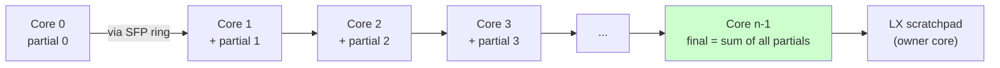

The cost scales as **(chain length) × (per-core partial size) ÷
SFP ring bandwidth**. Both factors matter, multiplicatively.

This is why pure K-split `(1, 1, 32)` is empirically slower than
mixed `(2, 1, 16)`:

- **Pure K**: 32-core PSUM chain × 1 MB partials per core ≈ very expensive
- **Mixed**: 16-core PSUM chain × 0.5 MB partials per core ≈ ¼ the cost

The SFP ring being separate from the data ring makes K-split
*architecturally* possible. Whether it's *operationally* better
depends on the multiplicative factors.

### The HMI bottleneck deep-dive

For any production matmul where weights are larger than the chip's
on-chip storage, **HMI is the bottleneck**. Every weight byte must
come through HMI on its way to a core's LX.

Why is this so consequential? Three reasons:

1. **HMI shares the data ring.** When HMI is busy (always, during a
   weight-streaming matmul), it competes with cross-core sharing
   for ring bandwidth. So even cross-core sharing benefits get
   eroded by HMI traffic.

2. **HMI is single-port-ish.** While multiple cores can fetch from
   DRAM "in parallel," they're really serialized at the HMI gateway.
   The chip-level bandwidth is what HMI can sustain, not the sum
   of per-core bandwidths.

3. **Most of our optimizations are about reducing HMI traffic.**
   The element-priority win, the LX-budget tuning, the (theoretical)
   weight preload — they all reduce per-call HMI bytes. None of
   them change compute throughput directly.

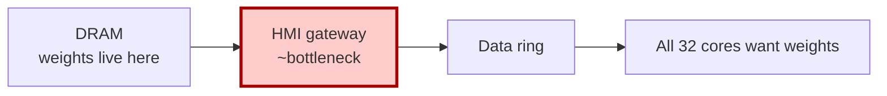

If you're optimizing AIU matmul performance, you're almost always
optimizing HMI bandwidth utilization, even when you don't realize
it.

> **Toy example — HMI as the gate every byte passes through.** For
> a `(M=128, N=8192, K=8192)` matmul, B is 128 MB. With 32 cores
> all wanting weights:
>
> - **Pure-M `(32, 1, 1)`**: 32 × 128 MB = **4 GB** of HMI traffic.
> - **Pure-N `(1, 32, 1)`**: 1 × 128 MB = **128 MB** of HMI traffic.
> - Either way, the ring after HMI redistributes those bytes.
>
> If HMI sustains ~67 GB/s combined with cross-core sharing, the
> *floors* on data-transit time are:
> - Pure-M: 4 GB ÷ 67 GB/s ≈ **60 ms**
> - Pure-N: 128 MB ÷ 67 GB/s ≈ **1.9 ms**
>
> 31× wall-time floor difference, all from HMI traffic — even
> before considering ring contention or compute. This is why every
> shipped optimization (`output_element_priority`, the LX budget
> tuning, the preload investigation) targets HMI bytes first.

---

## Part 11: Performance reasoning model

You now have everything you need to estimate AIU matmul wall time
for a new shape. Here's the procedure.

### Step 1 — Compute per-core compute time

```
T_compute_per_core = (M × N × K / num_cores) / per_core_throughput
```

where per-core throughput is empirically ~0.1 TFLOPS/core for fp16
(this is "achieved," not peak — peak is ~1 TFLOPS/core but most
shapes don't hit peak).

If `T_compute_per_core << 3 ms`, you're launch-floor-bound. No
work-division optimization will help. Stop here.

### Step 2 — Compute per-core data transit time

```
per_core_unique_bytes = (M/m × K/k × dt) + (K/k × N/n × dt) + (M/m × N/n × dt)

T_transit_per_core = per_core_unique_bytes / effective_BW
```

where effective BW is:
- ~88 GB/s if the operand fits in 2 MB LX (sharing fires)
- ~67 GB/s if HMI is contended (large operand streaming)

### Step 3 — Compute PSUM time (if k > 1)

```
T_psum = (k - 1) × (per_core_C_bytes) / SFP_ring_BW
```

SFP ring BW is ~32 GB/s (32 B/cycle at 1 GHz, dedicated).

### Step 4 — Combine

```
T_wall ≈ max(
    3 ms,                                    # launch floor
    max(T_compute, T_transit) + T_psum       # pipelined work + PSUM
)
```

Compute and transit overlap because of overlapped input fetch.
PSUM happens after compute on the critical path.

### The 3-question shortcut

For most practical reasoning, you don't need the full formula. Just
ask:

```mermaid
flowchart TB
    Q1{Per-core compute<br/>>> 3 ms?}
    Q1 -->|no| LFB[Launch-floor-bound<br/>no optimization helps]
    Q1 -->|yes| Q2{Per-core operand<br/>fits in 2 MB LX?}
    Q2 -->|yes| Ring["Ring-bandwidth-bound<br/>~88 GB/s budget"]
    Q2 -->|no| Q3{K very large vs N<br/>(K > 3·N)?}
    Q3 -->|no| HMI["HMI-streaming-bound<br/>~67 GB/s budget"]
    Q3 -->|yes| KSplit["Consider K-split with small m<br/>e.g. (2, 1, 16)"]

    style LFB fill:#fcc
    style Ring fill:#cfc
    style HMI fill:#fec
    style KSplit fill:#cef
```

### Worked example: L3-70B q-projection prefill

Shape: `M=128, N=8192, K=8192`, fp16, with `output_element_priority`'s
pick `(1, 32, 1)`.

**Compute:** `128 × 8192 × 8192 / 32 = 268M MACs/core × 2 = 536M flops/core`.
At ~0.1 TFLOPS/core: `~1.5 ms`.

**Per-core operands:** `M × K × dt = 2 MB A` (full A, since m=1) +
`K × N/n × dt = 4 MB B` (1/32 of B) + `M × N/n × dt = 64 KB C`. Total
= **6.06 MB per core**.

This exceeds 2 MB LX, so we're HMI-bound at ~67 GB/s. Transit time:
6.06 MB ÷ 67 GB/s ≈ **0.9 ms** per core (assuming roughly amortized).

**Wall:** `max(3 ms, max(1.5, 0.9) + 0) = 3 ms`? But measured wall
is 4.05 ms.

The discrepancy is real and informative. The empirical per-core
throughput at this shape is closer to 0.1 TFLOPS/core (~1.5 ms
compute) and HMI throughput is shared, so per-core effective
bandwidth is much lower than the link rate. The simple formula
gives lower bounds; reality includes overhead. But the formula
correctly identifies this shape as compute-and-data-bound (above
the launch floor), and predicts that HMI traffic is the
optimization target — which is exactly what `output_element_priority`
addresses.

---

## Part 12: Pitfalls observed in practice

Patterns we've measured, with mechanism and mitigation.

| pitfall | symptom | mechanism | mitigation |
|---|---|---|---|
| Default planner ranks output dims by stick count | `(32, 1, 1)` chosen for prefill matmul where pure-N would be 1.6× faster | unit mismatch — N (stick dim) ranked at 64 sticks, M (non-stick) ranked at 128 elements; M wrongly wins | `OUTPUT_ELEMENT_PRIORITY=1` (shipped) |
| Pure K-split saturates PSUM chain | `(1, 1, 32)` slower than `(1, 32, 1)` on every shape we measured | PSUM cost scales as chain × partial size; pure K maxes both | use `(m, 1, k)` with small m if K-split needed |
| Non-power-of-2 stick counts | regressions on N=14336, K=28672 shapes | upstream AIU stack handles power-of-2 stick counts gracefully and degrades on other values | flag affected shapes; not fixable from torch_spyre |
| `DXP_LX_FRAC_AVAIL` default of 0.2 too conservative | leaves up to 20% on the table on big-weight shapes | default is tuned for legacy use; not revisited for transformer prefill | `DXP_LX_FRAC_AVAIL=0.8` opt-in (not safe globally — regresses one production shape) |
| Cross-call weight preload not firing | first iter == median across all configs (no warm cache) | `torch.compile` doesn't mark weights as `_OUT_IS_STATIC=1`, so DSM has no static tensors to preload | open project — wire annotations through codegen |
| Span pre-split on huge weights | mixed split forced before priority runs | per-core span exceeds 256 MB hardware limit, must split | usually picks well by accident on production shapes |
| 3 ms launch floor | decode shapes (M=1) don't move regardless of split | per-call overhead dominates when total compute is small | op fusion or batching to amortize |

See [`session_summary.md`](../../tests/session_summary.md) for the
full investigation history.

> **Toy examples — what each pitfall looks like in the wild.**
>
> 1. **Element priority.** `(M=128, N=8192, K=8192)` defaulted to
>    `(32, 1, 1)` and ran in 6.5 ms. With `OUTPUT_ELEMENT_PRIORITY=1`
>    it picked `(1, 32, 1)` and ran in 4.05 ms. Same code, same
>    weights, different planner ranking — 1.6× speedup.
>
> 2. **Pure K-split.** `(M=4, N=1024, K=32768)` looks K-heavy, so
>    you'd expect `(1, 1, 32)` to win. Measured: pure-K 11.2 ms,
>    mixed `(2, 1, 16)` 7.8 ms. The 32-hop PSUM chain on the SFP
>    ring costs more than the 2× compute parallelism gains.
>
> 3. **Non-power-of-2 sticks.** `(M=128, N=14336, K=4096)` (Llama-3
>    MLP gate) regresses with the otherwise-helpful
>    `DXP_LX_FRAC_AVAIL=0.8`. N=14336 fp16 = 224 sticks, divides
>    cleanly into 32 cores as 7 sticks/core — and 7 is exactly the
>    bad number.
>
> 4. **3 ms launch floor.** `(M=1, N=4096, K=4096)` decode runs in
>    3.0 ms regardless of split. 4 GFLOPS of compute could finish
>    in 130 μs at chip peak; the per-call overhead is the entire
>    wall time.

---

## Part 13: Comparison with NVIDIA Hopper / Blackwell

If you've worked with Hopper SM90 or Blackwell SM100, here's how
your existing intuition transfers.

### Compute structure

| concept | NVIDIA Hopper / Blackwell | IBM AIU |
|---|---|---|
| Smallest compute unit | one CUDA core / thread of an SM | one PT unit (8-way SIMD) |
| Compute group | warp (32 threads) | PT row (8 cols × 8 SIMD = 64 MACs) |
| Tensor core | TC unit per warpgroup / WGMMA op | the entire 8×8×8 PT array |
| Per-clock matmul throughput | warpgroup MMA: e.g., 64×128×16 in one inst | 64 outputs × 8 inputs FMA per cycle |
| Per-SM/per-corelet peak | ~1 TFLOPS fp16 | ~1 TFLOPS fp16 |
| Per-chip peak | ~990 TFLOPs (H100, sparse) | ~32 TFLOPS current, ~65 architectural |
| MAC pipeline depth | 16+ cycles, hidden by warp scheduling | 4 cycles fp16, exposed (must interleave) |

The PT array is conceptually similar to a tensor core but at a
more visible level. Tensor cores execute as opaque WGMMA
instructions; the PT array's spatial flow (W-to-E inputs, N-to-S
outputs) is exposed to the dataflow template.

### Memory hierarchy

| concept | NVIDIA Hopper | IBM AIU |
|---|---|---|
| L1 / SMEM | 256 KB per SM | LX scratchpad: 2 MB per core |
| L2 cache | ~50 MB on-die, hardware-managed | None — replaced by explicit data ring + LX |
| HBM | ~80 GB high-bandwidth | LPDDR5: tens of GB/s |
| Register file | ~256 KB per SM, divided among warps | XRF (1 KB × 64 PT units) + LRF + L0 |

Two big differences:

1. **No L2.** GPUs have a chip-wide L2 cache that absorbs cross-SM
   data reuse. The AIU has nothing equivalent — every cross-core
   reuse must be explicitly orchestrated via the data ring.
2. **Larger SMEM-equivalent per unit.** 2 MB LX vs. 256 KB SMEM
   means more working set fits per-core. Particularly relevant for
   kernel templates that want to keep weights resident.

### Cross-block / cross-core communication

| concept | NVIDIA Hopper | IBM AIU |
|---|---|---|
| Within block / within core | shared memory + warp shuffle | LX + L0 + PE/SFP RFs |
| Across blocks / cores | cluster mode (SM90+): TMA shared SMEM, async barrier | data rings (CW + CCW), L3-LU/L3-SU |
| Reduction across blocks | global memory + async barriers | dedicated SFP ring for psum |

Two notable differences:

1. **The AIU has a dedicated PSUM ring**. There's no GPU equivalent
   — partial-sum reduction across SMs goes through global memory
   or the L2 cache. The SFP ring is purely for this purpose,
   doesn't compete with operand traffic, and is the basis for
   K-split being architecturally cheap.
2. **The AIU's "cluster" is the whole chip.** All 32 cores are on
   the data ring with reasonable latency to each other. Hopper's
   cluster mode covers up to 16 SMs; Blackwell extended this. AIU
   doesn't need cluster mode because the chip's natural unit is
   already inter-core.

### Async copy / DMA

| concept | NVIDIA Hopper | IBM AIU |
|---|---|---|
| Async copy primitive | TMA (Tensor Memory Accelerator) | L3-LU / L3-SU programmable units |
| Granularity | tensor-shaped descriptors | stick-aligned transfers (128 B) |
| Completion mechanism | mbarrier / async pipeline | explicit forward/back syncs between named units |

Both architectures have async DMA from off-chip → on-chip, both
support overlap with compute, both require explicit programming.

### Launch overhead

This is the biggest practical difference for application code:

- **GPU kernel launch**: ~1-10 μs. Tolerates many small launches.
- **AIU kernel launch**: ~3 ms. Severely penalizes small launches.

For decode-time inference (M=1 per token, lots of small matmul),
the AIU's launch floor is a real ceiling that fusion or batching
needs to amortize. For prefill, it's a non-issue.

### Persistent kernels and weight preload

| concept | NVIDIA Hopper / Blackwell | IBM AIU |
|---|---|---|
| Keep state across launches | persistent kernel pattern | preload mechanism (separate `loadmodel_to_spad` phase) |
| Mechanism | typically streaming work via mbarriers | dsengraph separation between load and execute phases |
| Status in our stack | well-supported via Triton / CUTLASS | exists in DSM + dxp but not wired to torch_spyre |

The AIU's preload mechanism is conceptually similar to a persistent
kernel pattern, but at a higher level — the "kernel" is the entire
inference pipeline, with weights pre-staged once. Today's torch_spyre
doesn't reach this mechanism, leaving the per-call weight-fetch
cost on the table.

### When AIU and GPU naturally agree

For compute-bound matmul with weights small enough to fit cache
or scratchpad, both architectures look similar: tile the work,
keep the hot operand resident, stream the cold operand, pipeline
async copy with compute. The kernel templates on AIU and the
WGMMA-driven inner loops on Hopper differ in detail but agree on
principle.

### When they diverge

For DRAM-bound matmul (large weights), the AIU's lack of L2 makes
cross-core operand reuse explicit. The data ring + LX scratchpad
combo plays the role of L2 + SMEM, but the boundary is sharp and
software-managed.

For tiny matmul (decode), the AIU's high launch floor makes per-op
latency much worse than GPU's. The right answer is op fusion to
amortize, the same answer as on GPU but more urgent.

> **Toy example — same matmul, GPU sequence vs AIU sequence.**
> A `(M=128, N=8192, K=8192)` matmul:
>
> | step | NVIDIA Hopper | IBM AIU |
> |---|---|---|
> | Launch | ~10 μs | ~3 ms |
> | Tile assignment | grid of CTAs auto-scheduled | planner picks `(m,n,k)` ahead of time |
> | Move weights → on-chip | TMA: HBM → SMEM (cluster-wide) | HMI → LX (per core) |
> | Reuse weights | sit in SMEM during inner loop | block-load LX → XRF, sit there |
> | Stream activations | TMA HBM → SMEM, async pipeline | LX-LU LX → L0, async pipeline |
> | Inner MMA | WGMMA `m64n128k16` instruction | PT array 8×8×8 systolic |
> | Cross-block reduction | global memory + atomic / barrier | dedicated SFP ring (PSUM) |
> | Wall time (this shape, fp16) | ~0.5 ms achievable | 4.05 ms achievable |
>
> The H100 is ~8× faster on this shape, mostly compute-density
> driven (990 TFLOPS sparsity vs 32 TFLOPS). For shapes where AIU's
> launch floor dominates (decode), the gap widens further. For
> shapes where the chip is matched to the work and weights live
> on-chip, the gap narrows. AIU is more competitive *per watt*
> than the absolute numbers suggest.

---

## Part 14: Glossary

- **AIU** — IBM AI Unit, the family of accelerators including Spyre.
- **Block-load** — the process of moving a kernel block from LX into
  XRF; PT array is idle during this transfer.
- **CL0 / CL1** — Corelet 0 / 1, the two compute engines per RaPiD
  core sharing one LX scratchpad.
- **Corelet** — Independent compute unit; contains a PT array, PE
  array, SFP array, and L0 scratchpad.
- **Data ring** — Two counter-rotating rings (128 B/cycle each) that
  carry operand traffic and DRAM streaming.
- **DDR / LPDDR5** — Off-chip memory.
- **DSM** — Deep Sentient Model compiler in deeptools — between
  torch_spyre and dxp.
- **dxp / dxp_standalone** — The C++ backend compiler that produces
  binaries.
- **HMI** — Host Memory Interface; the on-chip block that talks to
  DDR. Sits as a node on the data ring.
- **L0 scratchpad** — 8 × 1 KB per corelet; streaming buffer between
  LX and PT.
- **LRF** — Local register file in PT units; small, holds output-
  stationary partial sums.
- **LX scratchpad** — 2 MB SRAM per core, software-managed.
- **OS dataflow** — Output stationary; partial outputs sit in LRF.
  Used for first-layer-style ops with very small input channels.
- **PE** — Primitive Element units; 1D array of 8 doing post-PT
  accumulation.
- **PSUM** — Partial sum; cross-core reduction needed when K-split.
- **PT array** — The 8×8 systolic-style multiply-accumulate array
  (each PT unit is 8-way SIMD).
- **QGI** — Quad-Global Interface; chip-to-chip link.
- **RaPiD core** — One of the 32 compute cores on the chip; contains
  2 corelets sharing an LX scratchpad.
- **RCU** — Reconfigurable Compute Unit; the AIU chip itself.
- **RIU** — Ring Interface Unit; per-core ring access mediator.
- **SDSC** — Spyre Data Structure Schema; the bundle format passed
  from torch_spyre to dxp.
- **SFP** — Special Function units; 1D array of 8. Also: the
  dedicated 32 B PSUM ring.
- **Stick** — 128-byte aligned memory chunk; the atomic transfer
  unit between LX, ring, and HMI. 64 elements at fp16.
- **STCDP** — Sub-Tensor Copy with Dimension Permute; the operation
  used for both tensor relayout and weight preload.
- **WS dataflow** — Weight stationary; weights sit in XRF. Default
  for matmul.
- **XRF** — Extended register file in PT units; large, holds the
  weight-stationary kernel block.

---

## Part 15: References

The investigation that produced this document built on:

- [`element_priority_theory.md`](../../tests/element_priority_theory.md)
  — the planner bug and the shipping fix
- [`broadcast_topology_findings.md`](../../tests/broadcast_topology_findings.md)
  — ring topology and bandwidth measurements
- [`lx_scratchpad_budget_findings.md`](../../tests/lx_scratchpad_budget_findings.md)
  — `DXP_LX_FRAC_AVAIL` impact characterization
- [`psum_split_findings.md`](../../tests/psum_split_findings.md)
  — K-split / PSUM characterization
- [`per_corelet_findings.md`](../../tests/per_corelet_findings.md)
  — the unused second corelet per core
- [`bidirectional_ring_findings.md`](../../tests/bidirectional_ring_findings.md)
  — dual-ring lever (closed)
- [`preload_investigation_plan.md`](../../tests/preload_investigation_plan.md)
  — cross-call weight preload (open)
- [`session_summary.md`](../../tests/session_summary.md) — meta-pattern
  across all projects

For depth on the AIU architecture itself, see the IBM AIU
architecture documentation and the kernel template literature.

For the existing repo documentation:

- [`dataflow_architecture.md`](dataflow_architecture.md) — AIU
  dataflow model overview
- [`spyre_accelerator.md`](spyre_accelerator.md) — Spyre device
  characteristics
- [`work_division_planning.md`](../compiler/work_division_planning.md)
  — the planner algorithm

For the GPU side, [Triton's L2 super grouping
documentation](https://triton-lang.org/main/getting-started/tutorials/03-matrix-multiplication.html)
covers the matmul tile-traversal optimizations that have analogs
on AIU (with different mechanism due to AIU's explicit dataflow
structure).
