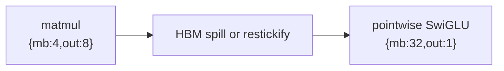
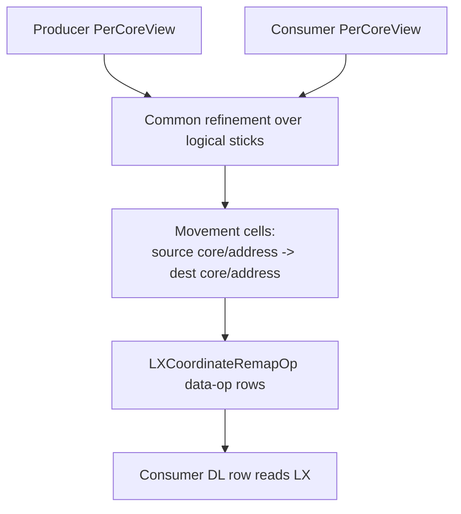
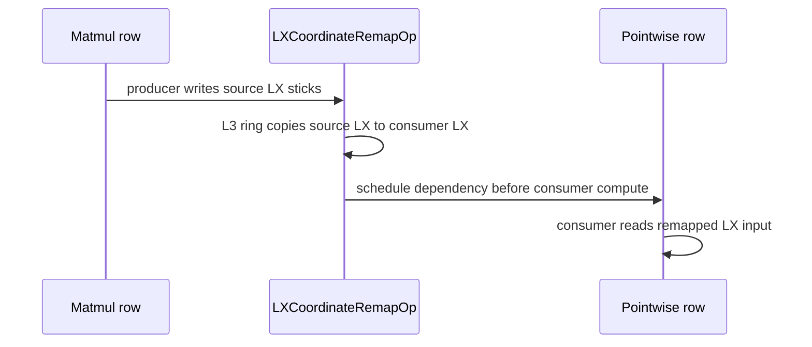

# LX Coordinate Remap Design

This document explains the first production slice of AIU LX-to-LX relayout for
Torch-Spyre. The feature is an explicit, opt-in movement pass for cases where a
producer leaves data in LX on one set of cores and a consumer needs the same
logical sticks on a different set of cores.

## Problem

AIU kernels often choose different core ownership for different operations:

- matmul prefers a 2-D split, commonly `{mb: 4, out: 8}`;
- pointwise chains such as SwiGLU prefer a pure-M split, commonly
  `{mb: 32, out: 1}`;
- main's `LX_PLANNER` keeps same-core producer/consumer values resident in LX,
  but it does not move a value from one core's LX to another core's LX.

Without cross-core movement, the compiler must materialize the producer value
through HBM or insert a restickify-style fallback when the next operation wants
a different `PerCoreView`.



The goal of this pass is to replace that HBM round trip with exact on-chip
movement for the communication class where every logical 128-byte stick has one
producer owner and one consumer owner.

## Model

The planner reasons about `PerCoreView` ownership. A `PerCoreView` tells us
which logical slice of a tensor each AIU core owns. The feature is deliberately
separate from same-view LX persistence:

- same producer and consumer view: handled by `LX_PLANNER`;
- different producer and consumer view: candidate for coordinate remap;
- K-split partials, reductions, multicast/fan-out, and stick-transpose relayout:
  rejected with explicit fallback reasons.

Movement is planned at 128-byte stick granularity because that is the stable
unit shared by Torch codegen, Deeptools, and AIU L3 ring transfers.



## Implemented Solution

When `SPYRE_ONCHIP_MOVE_PLANNER=1`, the pass runs after work distribution and
before scratchpad planning. For each producer-to-consumer edge, it:

1. Checks that both sides are same-stick LX-capable tensor views.
2. Leaves same-view edges to `LX_PLANNER`.
3. Builds a common refinement between producer ownership and consumer
   ownership.
4. Emits exact movement cells that cover the consumer slice with no overlap or
   gaps.
5. Records fallback reasons for unsupported communication classes.

When `SPYRE_ONCHIP_MOVE_REALIZE=1`, codegen realizes planned edges using the
coordinate-remap carrier. The carrier:

1. patches the producer output to remain in LX;
2. patches the consumer input to read from the consumer LX region;
3. emits `LXCoordinateRemapOp` data-op rows in a mixed SDSC;
4. schedules those data-op rows before the consumer DL row.



## Communication Class

PR 1 supports exact non-reducing relayout:

- one-to-one cross-core movement;
- disjoint scatter, where one producer-owned region is split across unique
  consumer owners;
- disjoint gather/concat, where multiple producer owners provide unique logical
  pieces to one consumer owner.

PR 1 does not support:

- fan-out or multicast, where the same stick must be copied to multiple
  consumer cores;
- reductions or split-K partial accumulation;
- layout-changing restickify or stick transpose;
- streaming/tiled handoff for regions that do not fit in LX;
- weight preload or weight restickify removal.

Those cases need separate communication primitives or scheduling work.

## Runtime Interface

The feature is default-off.

```bash
export SPYRE_ONCHIP_MOVE_PLANNER=1
export SPYRE_ONCHIP_MOVE_REALIZE=1
export SPYRE_ONCHIP_MOVE_CARRIER=coordinate_remap
```

Optional diagnostics:

```bash
export SPYRE_ONCHIP_MOVE_JSONL=/path/to/onchip_move.jsonl
export SPYRE_ONCHIP_MOVE_DEBUG_DIR=/path/to/onchip_move_debug
export SPYRE_ONCHIP_MOVE_DEBUG_CELLS=0
```

Important tuning and safety knobs:

- `SPYRE_ONCHIP_MOVE_MAX_CELLS`: maximum raw movement cells before fallback;
- `SPYRE_ONCHIP_MOVE_COORDINATE_REMAP_CHUNK_CELLS`: max cells per data-op
  chunk;
- `SPYRE_ONCHIP_MOVE_RANGE_ENCODING`: compact contiguous cells into movement
  ranges;
- `SPYRE_ONCHIP_MOVE_PRODUCER_LX_BASE` and
  `SPYRE_ONCHIP_MOVE_CONSUMER_LX_BASE`: LX regions used by the realized carrier.

## Deeptools Contract

Torch emits a mixed SDSC containing DL rows plus `datadscs_` rows whose op is
`LXCoordinateRemapOp`. Deeptools must:

1. import scheduled mixed SDSCs containing both `dscs_` and `datadscs_`;
2. parse `LXCoordinateRemapOp` movement ranges;
3. lower each range to L3 ring send/receive movement;
4. preserve `coreIdToDscSchedule` so data-op rows execute before consumer
   compute.

The Torch-side contract is intentionally explicit. Deeptools should not infer
the relayout; it should lower the source core/address, destination core/address,
and byte count already planned by Torch.

## Validation

Required Torch tests:

- 1-D and 2-D coverage has no gaps or overlaps;
- fused SwiGLU subviews are normalized to physical sticks;
- unsupported partial-stick and duplicate-owner cases fail closed;
- emitted mixed SDSCs contain `LXCoordinateRemapOp` rows;
- schedules order movement before consumer compute;
- region overlap and LX overflow are rejected.

Required backend gates:

- DXP accepts a coordinate-remap mixed SDSC;
- Deeptools lowers the remap to L3 ring traffic;
- generated schedules preserve the consumer dependency;
- hardware smoke runs match the HBM baseline within dtype tolerance.

Performance claims must use trace-derived kernel time. Wall time, memory time,
compile time, and CPU time should be reported separately.

## PR 1 Boundary

The pass is not a complete on-chip communication system. It is the first exact
relayout primitive: move each logical stick from its current LX owner to its
next unique LX owner. That is enough to remove important HBM round trips in
prefill SwiGLU and some attention subgraphs, while keeping fan-out, streaming,
and weight-layout work out of this PR.
