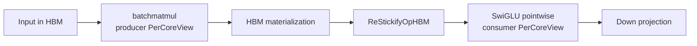
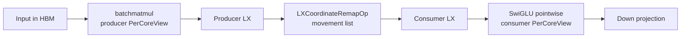
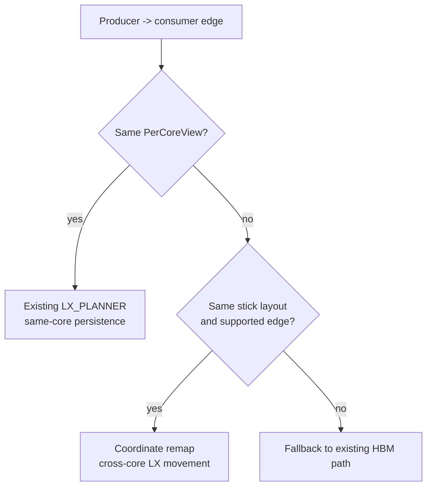
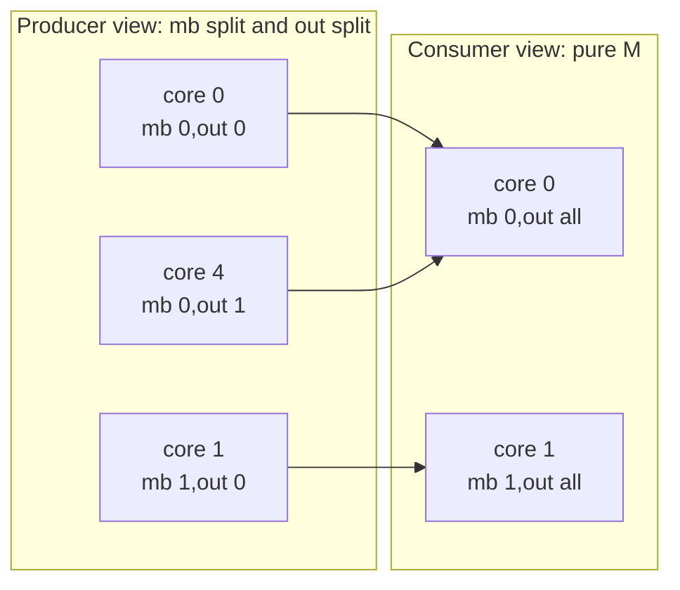
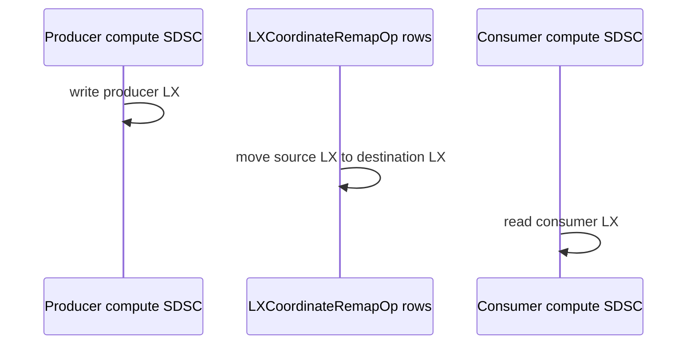
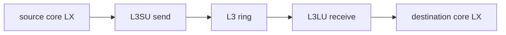

# LX Coordinate Remap for SwiGLU

This document explains the SwiGLU LX-to-LX coordinate-remap work from first
principles. It is meant to be enough context for a new engineer, or another
LLM, to reimplement the technique without reading the earlier branch history.

The current value-correct prototype lives on Torch branch `swiglu-ws-co-remap`
at `22be984` and uses the lean Deeptools coordinate-remap branch at
`69275dee`. The important result is not just that one SwiGLU shape works. The
important result is that the compiler now has a scalable way to move tensor
pieces between different LX core ownership views without falling back to HBM
when the producer and consumer already live on the same physical stick layout.

## The Problem

SwiGLU has a shape mismatch between the operations that produce values and the
operations that consume them:

```python
gate_out = x @ gate
up_out = x @ up
swiglu = up_out * silu(gate_out)
out = swiglu @ down
```

The matmuls want a two-dimensional core split so the PT work has enough
parallelism across both the M-like and output-like dimensions. A typical split
is `{mb:4,out:8}` across 32 cores. The pointwise operations inside `silu` and
the final elementwise multiply are SFP-heavy and naturally want pure-M
ownership: one output stripe per core, effectively `{mb:32,out:1}`.

Those two choices are individually reasonable. The old compiler problem was
the edge between them. If a matmul writes logical element `(m, n)` to core 7
but the consumer pointwise op expects `(m, n)` on core 19, same-core LX
persistence cannot help. The conservative fallback is to materialize through
HBM, restickify or relayout, then feed the consumer. That is value-correct but
expensive.

Baseline SDSC summaries show the signature:

| Pattern | Meaning |
| --- | --- |
| `batchmatmul` output in HBM | Matmul result leaves the chip-local path. |
| `ReStickifyOpHBM` between matmul and pointwise | Ownership/layout mismatch is solved through HBM. |
| `neg`, `exp`, `add`, `realdiv`, `mul` as separate rows | SiLU and multiply are pointwise consumers. |
| Some `lx` tensors in pointwise chain | Main's LX planner keeps same-view values in LX when ownership already matches. |

The prize is to keep the matmul split and the pointwise split, but insert an
on-chip movement plan at the edge where their `PerCoreView`s differ.

## First-Principles Model

An AIU program is built from SuperDSC descriptions. Each SDSC row describes an
operation, its participating cores, tensor memory locations, layouts, and the
mapping from logical work slices to physical cores.

The minimum model needed for this optimization is:

- **HBM**: off-core device memory. Correct, general, and expensive compared
  with local reuse.
- **LX**: per-core scratchpad memory. Fast, but owned by a specific core.
- **Stick**: the physical 128-byte movement granularity that Deeptools and the
  hardware can move efficiently.
- **L3 ring**: the on-chip path that can carry data from one core's LX to
  another core's LX.
- **`PerCoreView`**: the compiler's description of which logical tensor slice
  belongs to each core for a given operation.
- **`LX_PLANNER`**: mainline planner logic that keeps values in LX when the
  producer and consumer views already match.

The baseline flow is:



The coordinate-remap flow is:



Main's `LX_PLANNER` is still the right owner for same-view edges:



The new code is deliberately additive. It does not replace `LX_PLANNER`; it
fills the cross-core gap that `LX_PLANNER` should not be forced to solve.

## Coordinate-Remap Design

The core abstraction is a movement cell:

| Field | Meaning |
| --- | --- |
| source core | Core whose LX currently owns the value. |
| destination core | Core whose LX must own the value for the consumer. |
| logical slice | Logical tensor interval covered by the movement. |
| source LX address | Byte address in producer core LX. |
| destination LX address | Byte address in consumer core LX. |
| byte count | Whole-stick byte count moved on chip. |

The planner computes a common refinement of producer and consumer views. In a
small schematic, the matmul split and pointwise split overlap like this:



Each arrow is not an entire tensor. It is a collection of whole-stick movement
cells that exactly cover the consumer slice with no gaps and no overlapping
destination ranges.

The v1 constraints are intentionally narrow:

- Only mismatched same-stick LX-to-LX edges are planned.
- Same-view edges remain under `LX_PLANNER`.
- K-split partials are rejected because they need accumulation semantics, not
  just movement.
- Indirect tensors and layout-changing restickify cases are rejected.
- Planner cells are 128-byte sticks; emitted `LXCoordinateRemapOp` movements
  may coalesce adjacent cells into larger byte counts.
- Destination ranges must be non-overlapping.
- The implementation keeps the HBM fallback for unsupported edges.

The mixed SDSC schedule has the shape:



For each participating core, `coreIdToDscSchedule` must list the remap data-op
rows before the consumer compute row. Otherwise the consumer may read stale or
uninitialized LX.

The Deeptools lowering for a cross-core movement is:



Local same-core copies are handled conservatively in v1 by the Torch-side relay
path that was validated with the current prototype.

## Torch Implementation Recipe

Enable the path only when all three primary flags are set:

```bash
export SPYRE_ONCHIP_MOVE_PLANNER=1
export SPYRE_ONCHIP_MOVE_REALIZE=1
export SPYRE_ONCHIP_MOVE_CARRIER=coordinate_remap
```

Useful diagnostics and controls:

```bash
export SPYRE_ONCHIP_MOVE_JSONL=/tmp/onchip_move.jsonl
export SPYRE_ONCHIP_MOVE_DEBUG_DIR=/tmp/onchip_move_debug
export SPYRE_ONCHIP_MOVE_COORDINATE_REMAP_CHUNK_CELLS=512
export SPYRE_ONCHIP_MOVE_MAX_CELLS=65536
export SPYRE_ONCHIP_MOVE_PRODUCER_LX_BASE=0
export SPYRE_ONCHIP_MOVE_CONSUMER_LX_BASE=1048576
```

Implementation steps:

1. After work distribution, inspect producer-consumer buffer edges.
2. Build the producer and consumer `PerCoreView`.
3. Skip edges that are same-view, unsupported, K-split, indirect, or too large.
4. For supported mismatched same-stick edges, compute the common-refinement
   movement cells.
5. Validate exact consumer coverage: no gaps, no overlapping destination byte
   ranges, whole-stick alignment.
6. Patch the producer output to stay in LX at the producer base.
7. Patch the consumer input to read from LX at the consumer base.
8. Emit a mixed SDSC with `datadscs_`, `dscs_`, and
   `coreIdToDscSchedule`.
9. Chunk large movement lists deterministically.
10. Record planned and skipped edges in JSONL metadata.

The expected mixed SDSC signature is:

- root name such as `1_OnChipMoveCoordinateRemap`;
- `datadscs_` entries whose op is `LXCoordinateRemapOp` (Deeptools imports
  these into its internal data-op DSC representation);
- the original consumer compute op under `dscs_`, such as `neg` or `mul`;
- `coreIdToDscSchedule` rows with remap entries before consumer compute;
- `onchipMove_` metadata with cell count, bytes, producer base, and consumer
  base.

## Deeptools Implementation Recipe

The Deeptools delta is deliberately thin. The Torch front-end computes the
movement list; Deeptools imports and lowers it.

Backend requirements:

1. Add `OpFuncs::LXCoordinateRemapOp`.
2. Import scheduled mixed SDSCs when `datadscs_`, `dscs_`, and
   `coreIdToDscSchedule` are all present.
3. Route mixed data-op plus DL-op SDSCs through the existing
   `runDcgForDataOpsDlOps` path.
4. Treat `LXCoordinateRemapOp` as a movement-list data-op with:
   source core, destination core, source LX address, destination LX address,
   byte count, and logical coverage metadata.
5. Lower cross-core movements to existing L3 ring transfer nodes.
6. Preserve strict ordering from `coreIdToDscSchedule`.

The v1 schema records enough to debug value errors without reverse-engineering
the compiler:

```json
{
  "op": {"name": "LXCoordinateRemapOp"},
  "schemaVersion": 0,
  "producerLxBase": 0,
  "consumerLxBase": 1048576,
  "coverage": {"status": "complete", "device_sizes": [8, 256, 64]},
  "lowering": {"strategy": "explicit_lx_copy_via_l3"},
  "movements": [
    {
      "bytes": 128,
      "source": {"core": 0, "lxAddress": 0},
      "destination": {"core": 1, "lxAddress": 1048576}
    }
  ]
}
```

## Runtime Pinning

The runtime must use the same Deeptools checkout that built the coordinate-remap
support. A typical smoke environment is:

```bash
export PYTHONPATH=/tmp/torch-spyre-co-remap-native:/tmp/torch-spyre-co-remap-native/tests/inductor
export DEEPTOOLS_PATH=/tmp/deeptools-coordinate-remap-mainport-lean
export PATH=/tmp/deeptools-coordinate-remap-mainport-lean/build-swiglu-dxp-main-lean/dxp:$PATH
export LD_LIBRARY_PATH=/tmp/deeptools-coordinate-remap-mainport-lean/build-swiglu-dxp-main-lean/dsm:/tmp/deeptools-coordinate-remap-mainport-lean/build-swiglu-dxp-main-lean/dsm/translators/perfDscToSdsc:/tmp/deeptools-coordinate-remap-mainport-lean/build-swiglu-dxp-main-lean/dvs:/tmp/deeptools-coordinate-remap-mainport-lean/build-swiglu-dxp-main-lean/deeprt:/opt/ibm/spyre/runtime/lib:/opt/ibm/spyre/deeptools/lib:/opt/ibm/spyre/senlib/lib:/opt/ibm/spyre/sentinyexec/lib
export TORCH_DEVICE_BACKEND_AUTOLOAD=0
export TORCHINDUCTOR_FX_GRAPH_CACHE=0
export TORCHINDUCTOR_CACHE_DIR=/tmp/torchinductor_swiglu_coordinate_remap_smoke
```

If the Python side is from the coordinate-remap branch but `dxp_standalone` or
`libperfdsc_to_sdsc.so` comes from an older Deeptools install, the failure mode
usually looks like an unknown op, rejected mixed SDSC, missing data-op routing,
or value corruption.

## Validation Matrix

| Layer | Test | Expected result |
| --- | --- | --- |
| Torch unit | `tests/inductor/test_onchip_move.py` | `18 passed` |
| DXP gate | emitted whole-stick coordinate-remap bundle | `RC=0` |
| AIU micro | row-pattern `negmm` | exact match, `max_abs=0.0` |
| AIU micro | random `negmm` | matches CPU/HBM tolerance |
| AIU SwiGLU | `B=1,S=256,E=128,H=512` | targeted mismatched edges do not fallback, no runtime failure, correct output |

A successful generated small SwiGLU artifact has three planned remap edges. In
the current H512 smoke, two edges are realized as mixed
`OnChipMoveCoordinateRemap` SDSCs around pointwise consumers (`neg` and `mul`),
while the additional planned edge is satisfied through the compiler's reuse and
patching path. The current smoke showed `2048` planner cells and `262144` bytes
per planned edge. Emitted data-op rows were coalesced into fewer movements; the
artifact records both source cell count and coalesced movement count. Remap rows
must appear before the consumer compute rows.

## Artifact and Benchmark Recipe

Correctness comes before timing. For every timing row, archive the artifacts
that prove what actually ran:

- `env.txt` with Torch SHA, Deeptools SHA, env flags, and runtime paths;
- raw benchmark output;
- Kineto trace JSON;
- `trace_summary.json`;
- `onchip_move.jsonl`;
- generated `sdsc_*.json` files;
- `sdsc_table.md` and `sdsc_table.csv`;
- `sdsc_diff.md`;
- `senprog/summary.json`, `senprog_status.md`, and per-SDSC `.senprog.txt`
  outputs when Deeptools `dcc_standalone` is available.

Use `tools/sdsc_artifact_summary.py` after each run:

```bash
/home/adnan-cdx/dt-inductor/.venv/bin/python tools/sdsc_artifact_summary.py \
  --sdsc-dir "$TORCHINDUCTOR_CACHE_DIR/inductor-spyre" \
  --baseline-sdsc-dir /path/to/baseline/inductor-spyre \
  --trace-dir logs/tsp-stack/mlp \
  --active-iters 6 \
  --emit-senprog \
  --sdsc-senprog-summary \
    /home/adnan-cdx/dt-inductor-mixed/torch-spyre-tier1-on-chip-handoff-planner/tools/sdsc_senprog_summary.py \
  --dcc dcc_standalone \
  --output-dir /tmp/swiglu_bench_artifacts/coordinate-remap
```

This emits both views:

- `sdsc_table.md`, `sdsc_table.csv`, `sdsc_diff.md`, `trace_summary.json`,
  `senprog_status.md`, and `senprog/summary.json` from the new artifact tool;
- `sdsc_senprog_summary/summary.json`, `stdout.txt`, and `stderr.txt` from the
  legacy `sdsc_senprog_summary.py` helper.

The `--emit-senprog` mode is the artifact-flow replacement for the older
standalone `sdsc_senprog_summary.py` workflow. It emits the same kind of
senprog text and opcode/unit summary, plus the Jamie-style SDSC table and
structural diff. Treat senprog as best-effort unless using a DCC build that can
import mixed SDSCs with data ops. On the current pod image, the system
`/opt/ibm/spyre/deeptools/bin/dcc_standalone` emits pure DL SDSCs but can fail
on mixed coordinate-remap SDSCs; those failures are captured in
`senprog_status.md` and `senprog/summary.json`.

The primary performance number is trace-derived kernel time:

- Sum Kineto events where `cat == "kernel"`.
- Divide by the active iteration count.
- Report wall time separately.
- Report memory transfer time separately.
- Reconcile `kernel_ms` with profiler `Spyre-kernel_times` before publishing.

Run variants:

| Variant | Purpose |
| --- | --- |
| upstream main baseline | Measure current main behavior with default `LX_PLANNER`. |
| branch baseline | Same branch with `SPYRE_ONCHIP_MOVE_PLANNER=0`. |
| planned only | `SPYRE_ONCHIP_MOVE_PLANNER=1`, realization off, for metadata/debug overhead. |
| coordinate remap | Planner and realization on with carrier `coordinate_remap`. |

Start with the cases that already proved correctness:

- row-pattern `negmm`;
- random `negmm`;
- small SwiGLU `B=1,S=256,E=128,H=512`.

Then expand to synthetic edges:

- `mm -> neg`;
- `mm -> mul`;
- `mm -> decomposed_silu -> mul`;
- hidden sizes `128`, `256`, `512`, `1024`.

Finally run Jamie's fused and unfused SwiGLU/MLP cases from
`spyre-perf-suite` branch `jamie/dev`, starting with `1x512x4096` to match the
baseline SDSC screenshots. Before official perf-suite numbers, confirm the
checkout is the exact slash branch and that imports point at
`/tmp/torch-spyre-co-remap-native`, not an older Torch checkout.

The pod-visible remote branch is `refs/heads/jamie/dev` at
`d73ea9b9d653f28c4391184eaf84e45e3b6fdfb5`. Fetch it explicitly so the local
underscore ref `origin/jamie_dev` is not mistaken for the slash branch:

```bash
cd /home/adnan-cdx/spyre-perf-suite
git fetch origin refs/heads/jamie/dev:refs/remotes/origin/jamie/dev
git checkout -B jamie/dev refs/remotes/origin/jamie/dev
git rev-parse HEAD
```

The current benchmark entrypoint has a built-in `mlp` op whose body is the
SwiGLU MLP pattern:

```python
gate_out = x @ gate
up_out = x @ up
swiglu_out = up_out * silu(gate_out)
return swiglu_out @ down
```

Use this for the first `1x512x4096` perf-suite run:

```bash
/home/adnan-cdx/dt-inductor/.venv/bin/python benchmark.py \
  --stack torch-spyre \
  --op mlp \
  --shape 1 512 4096 \
  --runs 7 \
  --without-compilation \
  --with-profiling \
  --output /tmp/swiglu_bench_artifacts/perf.txt
```

As of the inspected checkout, separate fused and unfused SwiGLU entrypoints are
not exposed as built-ins. Add or select custom `--op-file` entrypoints for that
split after the slash branch is checked out and rechecked.

For repeatable branch-variant runs, use the harness:

```bash
cd /tmp/torch-spyre-co-remap-native
/home/adnan-cdx/dt-inductor/.venv/bin/python tools/run_coordinate_remap_bench.py \
  --output-root /tmp/swiglu_coordinate_remap_bench \
  --torch-root /tmp/torch-spyre-co-remap-native \
  --deeptools-root /tmp/deeptools-coordinate-remap-mainport-lean \
  --perf-suite-root /home/adnan-cdx/spyre-perf-suite \
  --op mlp \
  --shape 1 512 4096 \
  --runs 7 \
  --emit-senprog \
  --emit-sdsc-senprog-summary
```

Add the upstream-main baseline by pointing `--main-torch-root` at a clean
Torch-Spyre main checkout and selecting the `upstream-main` variant:

```bash
/home/adnan-cdx/dt-inductor/.venv/bin/python tools/run_coordinate_remap_bench.py \
  --output-root /tmp/swiglu_coordinate_remap_bench_main \
  --torch-root /tmp/torch-spyre-co-remap-native \
  --main-torch-root /tmp/torch-spyre-main \
  --deeptools-root /tmp/deeptools-main \
  --perf-suite-root /home/adnan-cdx/spyre-perf-suite \
  --variant upstream-main \
  --op mlp \
  --shape 1 512 4096 \
  --runs 7 \
  --emit-senprog \
  --emit-sdsc-senprog-summary
```

## Reading the Before and After

The before/after claim should be made from artifacts, not from intent.

A useful before table has:

- `ReStickifyOpHBM` rows between matmul and pointwise;
- pointwise inputs or outputs materialized in HBM;
- no `LXCoordinateRemapOp` rows;
- schedules that do not include data-op rows before pointwise consumers.

A useful after table has:

- fewer or no HBM restickify rows on the targeted edges;
- `LXCoordinateRemapOp` data-op rows in mixed SDSCs;
- pointwise consumer inputs in LX;
- movement bytes and chunk counts in the summary;
- schedules that put remap rows before consumer compute.

Do not claim a performance win from wall time alone. The first publishable win
needs all of these to be true:

1. correctness still passes;
2. the targeted edge does not fall back to HBM;
3. trace-derived `kernel_ms` improves over the value-correct baseline;
4. the SDSC table proves the intended remap path ran.

## Future Work

Warp specialization is intentionally secondary here. Once the movement path has
stable performance numbers, audit whether SiLU is emitted as separate SFP-heavy
pointwise work or folded into a matmul epilogue. If it is separate, evaluate
scheduling PT-heavy matmul rows and SFP-heavy pointwise rows so data remains in
LX without sacrificing the matmul's preferred split. If it is already in the
epilogue, measure whether the epilogue creates enough SFP pressure to justify a
scheduling change.
