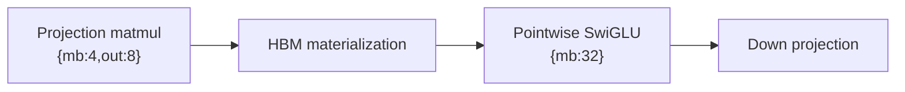
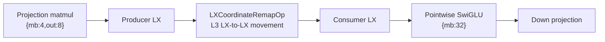

# SwiGLU LX Coordinate Remap Snapshot - 2026-06-20

This is the current first-principles snapshot for the SwiGLU coordinate-remap
work. It explains how the speedup was produced, which HBM trips were removed,
what evidence proves it, and what is still not solved.

The short version: the compiler now keeps the fused projection output in LX,
moves the needed projection halves between producer-owned and consumer-owned
cores with `LXCoordinateRemapOp`, and lets the pointwise SwiGLU consumers read
from local LX instead of reloading those inputs from HBM.

## Source Artifacts

The key archived run is:

- [FMS fused SwiGLU prefill relay-fix run](lx_coordinate_remap_benchmarks/2026-06-20/fms_swiglu_prefill_relayfix/README.md)
- Shape: `B=1 S=512 E=4096`
- Torch branch: `swiglu-ws-co-remap`
- Torch SHA for the relay-fix run: `3ac4c1ed1d3564969fcfd15f07a0c7a5b9645d0b`
- Deeptools coordinate-remap SHA: `83f9320cd6924833950c1aa362dfdb9abe0c29d7`
- `spyre-perf-suite` branch: `jamie/dev`
- `spyre-perf-suite` SHA: `d73ea9b9d653f28c4391184eaf84e45e3b6fdfb5`
- Primary metric: archived Kineto trace-derived `kernel_ms_per_iter`

Jamie-style SDSC artifacts:

- [Prefill baseline summary](lx_coordinate_remap_benchmarks/2026-06-20/fms_swiglu_prefill_relayfix/branch-baseline/sdsc_jamie_summary.md)
- [Prefill baseline table](lx_coordinate_remap_benchmarks/2026-06-20/fms_swiglu_prefill_relayfix/branch-baseline/sdsc_jamie_table.md)
- [Prefill coordinate-remap summary](lx_coordinate_remap_benchmarks/2026-06-20/fms_swiglu_prefill_relayfix/coordinate-remap/sdsc_jamie_summary.md)
- [Prefill coordinate-remap table](lx_coordinate_remap_benchmarks/2026-06-20/fms_swiglu_prefill_relayfix/coordinate-remap/sdsc_jamie_table.md)
- [Prefill HBM round-trip comparison](lx_coordinate_remap_benchmarks/2026-06-20/fms_swiglu_prefill_relayfix/coordinate-remap/sdsc_hbm_roundtrip_comparison.md)
- [Decode control HBM comparison](lx_coordinate_remap_benchmarks/2026-06-20/fms_swiglu_decode_relayfix/coordinate-remap/sdsc_hbm_roundtrip_comparison.md)

The branch-baseline variant is the same Torch branch with coordinate remap
disabled. That isolates the pass delta. A pristine current-main comparison for
this exact FMS empty-weight wrapper was attempted, but current main hit the
documented fake-tensor `to_empty`/Dynamo issue in this pod.

## First Principles

SwiGLU has two different good layouts:

```text
gate = x @ W_gate
up = x @ W_up
hidden = up * silu(gate)
out = hidden @ W_down
```

The projection matmul wants a 2-D split, typically like `{mb:4,out:8}`, so PT
work spreads across all 32 cores. The pointwise SiLU and multiply chain wants a
pure-M split, effectively `{mb:32,out:1}`, because it is SFP-heavy and each
core can own a stripe of rows.

Both choices are good. The expensive part is the ownership change between them.
A value can be physically present in LX on the producer core, but the consumer's
`PerCoreView` may assign that same logical stick to a different core.

Main's `LX_PLANNER` handles the easy case where producer and consumer ownership
already match. It does not solve cross-core ownership mismatch. Before this
work, the safe fallback was:



Coordinate remap keeps the good layouts and inserts only the missing movement:



The remap planner computes common-refinement cells between producer and
consumer `PerCoreView`s. Each cell says:

- source core
- destination core
- source LX address
- destination LX address
- logical slice coverage
- byte count

Cells must cover the consumer slice exactly, with no gaps and no overlapping
destination byte ranges. Unsupported cases fall back to the old HBM path.

## What Changed

The first working coordinate-remap path handled simple adjacent edges such as a
custom BMM projection feeding an immediately adjacent pointwise op. FMS fused
SwiGLU needed three additional fixes.

### Fused Subviews

FMS fused SwiGLU emits a single 2x-wide projection buffer. The first half feeds
the SiLU branch, and the second half feeds the gate/up multiply. Planning the
full buffer for each consumer is wrong. The pass now infers the consumer's
device-coordinate subview:

```text
full fused projection: [512, 400, 1, 64]
first half:            [512, 200, 1, 64] at starts [0,   0, 0, 0]
second half:           [512, 200, 1, 64] at starts [0, 200, 0, 0]
```

The subview is part of the movement key, so first-half and second-half remaps
cannot alias the same LX reuse record.

### Nonadjacent Consumers

The useful consumers are not all adjacent to the projection:

```text
projection -> neg -> exp -> add -> realdiv
projection ---------------------------> mul second input
```

The realization pass now handles:

- adjacent remap before `neg`
- same remapped first-half reuse by `realdiv`
- backward producer lookup for the later `mul` consumer

This is why the coordinate-remap prefill SDSC has mixed data-op rows before
both `neg` and `mul`.

### Same-Core Local Relay

Some common-refinement cells have the same source and destination core. The v1
carrier lowers coordinate remap through the L3 ring path, so same-core copies
need a conservative relay. The implementation sends same-core cells through a
neighbor core scratch region and batches the relay moves so scratch capacity is
reused safely.

This local relay is the fix that made the FMS fused prefill run pass and emit
the expected remap rows.

## Baseline Artifact Signature

The branch-baseline prefill summary matches Jamie's original style:

```text
batchmatmul - INPUT (hbm), INPUT (hbm), OUTPUT (hbm)
neg         - INPUT (hbm), OUTPUT (hbm)
realdiv     - INPUT (hbm), INPUT (lx), OUTPUT (hbm)
mul         - INPUT (hbm), INPUT (hbm), OUTPUT (hbm)
```

The important baseline rows are:

| edge | baseline SDSC proof |
| --- | --- |
| projection output | `sdsc_1 batchmatmul 2_hbm OUTPUT` |
| SiLU first-half input | `sdsc_2 neg 0_hbm INPUT` |
| SiLU first-half reuse | `sdsc_5 realdiv 0_hbm INPUT` |
| gate/up second-half input | `sdsc_6 mul 1_hbm INPUT` |
| final pointwise output | `sdsc_6 mul 2_hbm OUTPUT` |

That means the fused projection-to-pointwise handoff is still HBM-backed before
the pass fires.

## Coordinate-Remap Artifact Signature

The coordinate-remap prefill summary changes the key rows:

```text
batchmatmul         - INPUT (hbm), INPUT (hbm), OUTPUT (lx)
LXCoordinateRemapOp - MOVE (lx->lx)
neg                 - INPUT (lx), OUTPUT (hbm)
realdiv             - INPUT (lx), INPUT (lx), OUTPUT (hbm)
LXCoordinateRemapOp - MOVE (lx->lx)
mul                 - INPUT (hbm), INPUT (lx), OUTPUT (hbm)
```

Direct before/after proof from the generated comparison:

| edge | baseline | coordinate remap | result |
| --- | --- | --- | --- |
| Projection output | `2_hbm @ 0xc800000..0xdacaf00` | `2_lx @ 0x0` | HBM projection output removed |
| `neg` first-half input | `0_hbm @ 0xc800000..0xe038000` | `0_lx @ 0x100000` | HBM read removed |
| `realdiv` first-half input | `0_hbm @ 0xc800000..0xe038000` | `0_lx @ 0x100000` | HBM read removed |
| `mul` second-half input | `1_hbm @ 0xc806400..0xe03e400` | `1_lx @ 0x100000` | HBM read removed |
| `mul` output | `2_hbm @ 0x0..0xf800` | `2_hbm @ 0x0..0xf800` | still HBM-backed |

Structural counters:

| metric | branch baseline | coordinate remap |
| --- | ---: | ---: |
| SDSCs | 9 | 9 |
| table rows | 23 | 33 |
| mixed SDSCs with data ops | 0 | 2 |
| `LXCoordinateRemapOp` chunks | 0 | 10 |
| remap movements | 0 | 13,200 |
| remap bytes | 0 | 27,033,600 |

The 10 chunks are not 10 independent logical optimizations. They are the two
useful fused subviews split into cross-core chunks plus local-relay chunks.

## Performance Impact

Prefill FMS fused SwiGLU:

| variant | kernel ms / iter | memory ms / iter | remap chunks | remap bytes |
| --- | ---: | ---: | ---: | ---: |
| branch baseline | 15.141168 | 0.192624 | 0 | 0 |
| coordinate remap | 12.183793 | 0.284598 | 10 | 27,033,600 |

The prefill kernel-time speedup is:

```text
(15.141168 - 12.183793) / 15.141168 = 19.53%
```

Decode-shaped FMS fused SwiGLU:

| variant | kernel ms / iter | remap chunks | interpretation |
| --- | ---: | ---: | --- |
| branch baseline | 9.395363 | 0 | control |
| coordinate remap | 9.368277 | 0 | no pass-driven win |

The decode control is useful because it shows the pass does not invent work
when no eligible remap is found. Its small timing delta is not the performance
claim.

## What We Did Not Eliminate

The pass does not remove every HBM interaction in fused SwiGLU.

Still present:

- weight/input HBM reads
- weight `ReStickifyOpHBM` rows
- the final pointwise `mul` output to HBM
- the downstream matmul's HBM input path
- pointwise intermediate outputs that are already handled by main's same-view
  LX planner only when ownership matches

So the current win comes specifically from removing the projection-to-pointwise
HBM reads for the two fused halves. It is not the theoretical maximum possible
SwiGLU optimization.

## Why This Is The Right Shape

The pass is deliberately not a naive co-assignment trick. Co-assignment would
force the matmul into the pointwise layout or force pointwise into the matmul
layout. That can hide the HBM trip but damages one side of the computation.

Coordinate remap preserves:

- PT-friendly matmul split
- SFP-friendly pointwise split
- mainline `LX_PLANNER` ownership for same-view reuse
- fallback safety for unsupported edges
- explicit SDSC evidence for every byte moved

That makes the approach scalable beyond one handwritten SwiGLU shape. The
implementation can be broadened by adding more supported edge classes without
changing the basic contract.

## Next Gaps

The next performance work should be measured against this artifact baseline.

1. Extend final-output persistence into the down projection so `mul` output can
   avoid HBM when the downstream matmul can consume an on-chip view.
2. Replace same-core local relay with a cheaper direct local LX copy primitive
   once Deeptools/runtime support is clear.
3. Reduce remap chunk overhead by improving range grouping and schedule
   compactness.
4. Broaden support for eligible FMS graph variants without relaxing the exact
   coverage and no-overlap invariants.
5. Only after the movement baseline is stable, evaluate warp specialization for
   PT matmul work versus SFP pointwise work.

## Regenerating The Jamie-Style Reports

The repeatable report emitter is:

```bash
python3 tools/sdsc_jamie_report.py \
  --sdsc-dir docs/source/compiler/lx_coordinate_remap_benchmarks/2026-06-20/fms_swiglu_prefill_relayfix/coordinate-remap/sdsc_json \
  --output-dir docs/source/compiler/lx_coordinate_remap_benchmarks/2026-06-20/fms_swiglu_prefill_relayfix/coordinate-remap \
  --title "FMS Fused SwiGLU Prefill Coordinate-Remap Jamie-Style SDSC" \
  --baseline-sdsc-dir docs/source/compiler/lx_coordinate_remap_benchmarks/2026-06-20/fms_swiglu_prefill_relayfix/branch-baseline/sdsc_json \
  --baseline-summary docs/source/compiler/lx_coordinate_remap_benchmarks/2026-06-20/fms_swiglu_prefill_relayfix/branch-baseline/artifacts/sdsc_summary.json \
  --current-summary docs/source/compiler/lx_coordinate_remap_benchmarks/2026-06-20/fms_swiglu_prefill_relayfix/coordinate-remap/artifacts/sdsc_summary.json
```

It writes:

- `sdsc_jamie_summary.md`
- `sdsc_jamie_table.md`
- `sdsc_jamie_table.csv`
- `sdsc_hbm_roundtrip_comparison.md` when a baseline is provided
