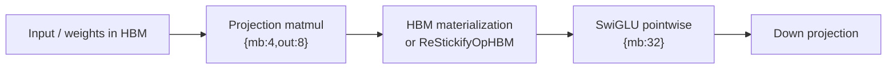
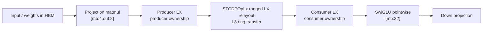
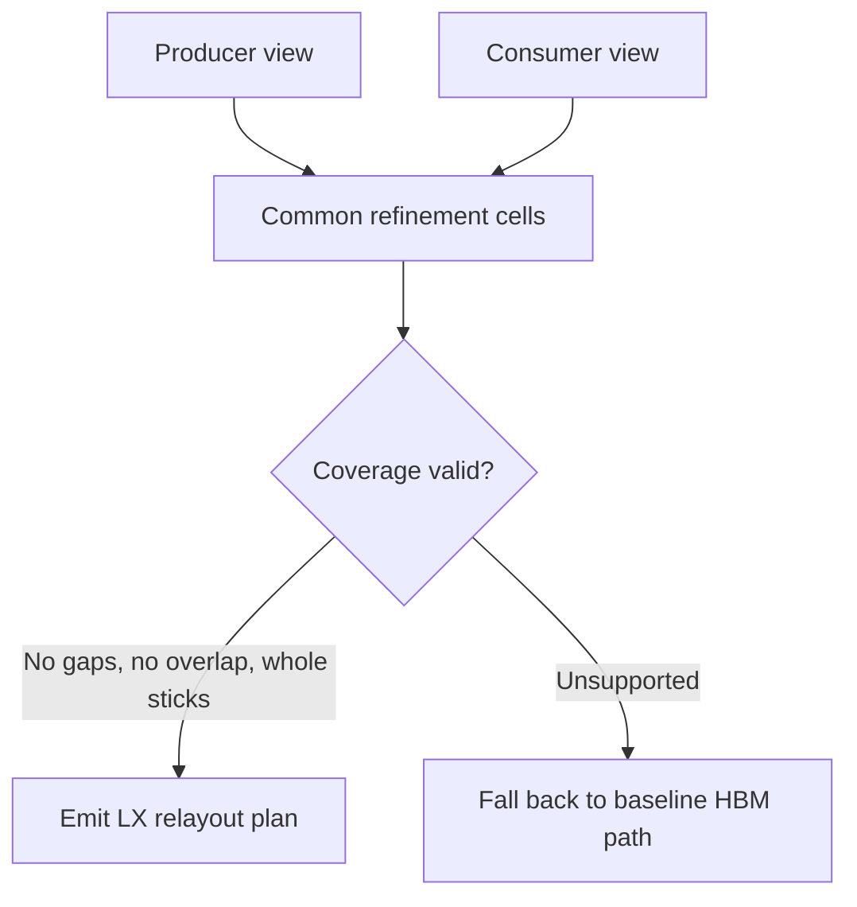
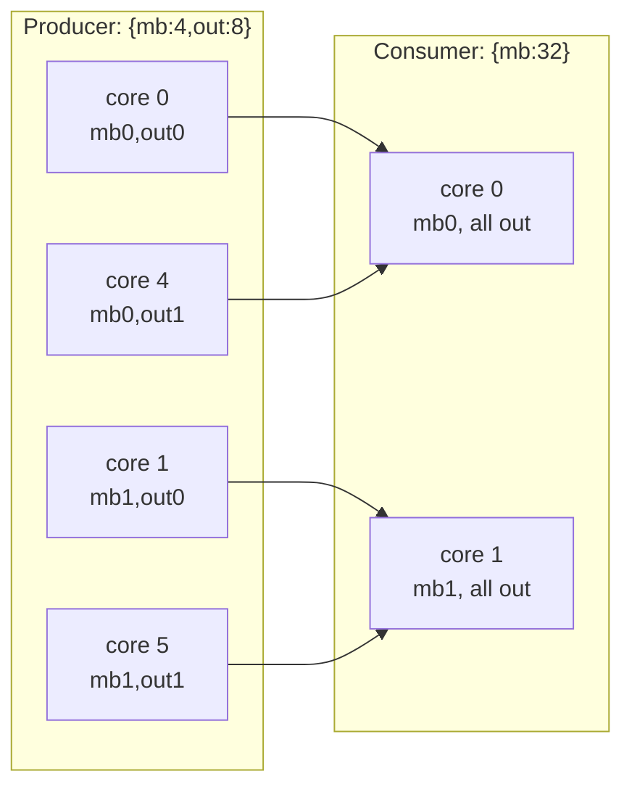
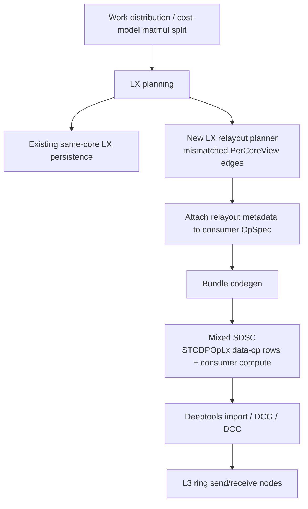
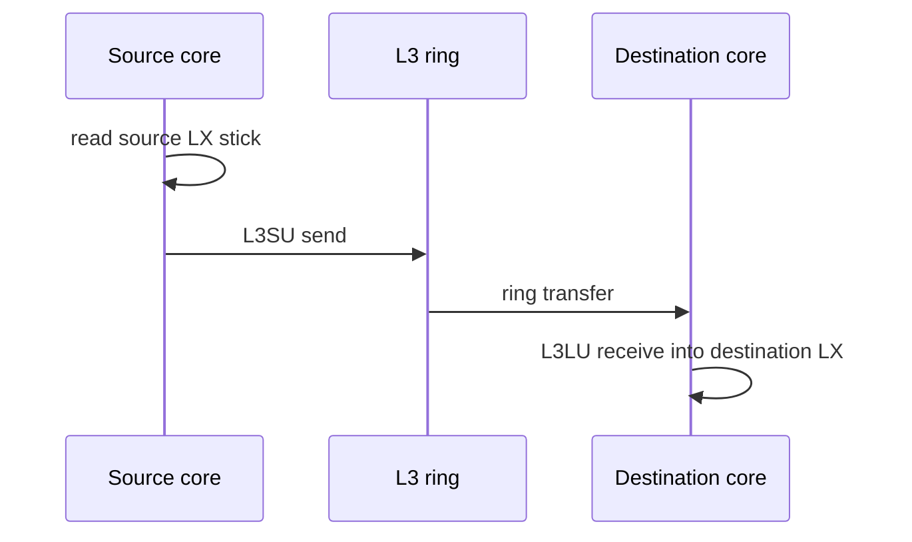
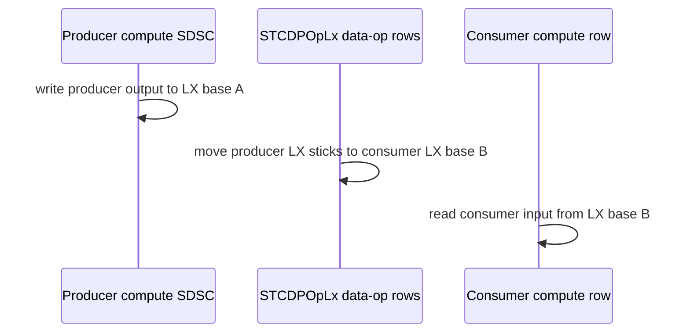

# LX Planner Relayout with STCDPOpLx

This document explains the LX relayout work from first principles, with the
specific production shape we want to pursue: an extension of the existing
Torch-Spyre LX planner that realizes cross-core LX-to-LX relayout through an
extended `STCDPOpLx` backend carrier.

The short version is this:

- Torch-Spyre already has an `LX_PLANNER` that keeps values in LX when producer
  and consumer cores agree on ownership.
- Important model patterns, especially prefill SwiGLU and parts of attention,
  often have a producer and consumer that want different core ownership views
  over the same physical sticks.
- The baseline compiler solves those mismatches by materializing through HBM.
- The LX relayout extension keeps the producer's preferred split, keeps the
  consumer's preferred split, and inserts an explicit on-chip movement plan
  between the two.
- The backend carrier is not a new public op. It is a range-encoded mode of the
  existing `STCDPOpLx` data-op, lowered through the existing L3 ring movement
  machinery.

The main result from the artifact rerun is that the optimization is visible in
both kernel time and wall time:

| Workload | Baseline kernel | STCDPOpLx relayout kernel | Kernel win | Baseline wall | STCDPOpLx relayout wall | Wall win |
| --- | ---: | ---: | ---: | ---: | ---: | ---: |
| Granite causal prefill block | `16.333 ms` | `13.838 ms` | `15.3%` | `23.062 ms` | `20.490 ms` | `11.2%` |
| Granite attention kernel within that block | `3.412 ms/iter` | `2.918 ms/iter` | `14.5%` | included above | included above | included above |
| Granite MLP/SwiGLU kernel within that block | `11.025 ms/iter` | `9.021 ms/iter` | `18.2%` | included above | included above | included above |
| Standalone fused FMS SwiGLU `[1,512,4096]` | `16.153 ms` | `13.174 ms` | `18.4%` | `19.600 ms` | `15.717 ms` | `19.8%` |

The structural evidence agrees with the timings:

| Workload | Baseline on-chip relayout rows | STCDPOpLx relayout rows | Baseline `ReStickifyOpHBM` rows | STCDPOpLx `ReStickifyOpHBM` rows |
| --- | ---: | ---: | ---: | ---: |
| Granite causal prefill block | `0` | `6` | `5` | `4` |
| Standalone fused FMS SwiGLU | `0` | `2` | `2` | `2` |

The remaining `ReStickifyOpHBM` rows are expected. This pass is not intended to
solve weight preloading or every downstream fan-out case in the first PR. It
solves same-stick, non-reduction, cross-core LX ownership mismatches.

## Why This Exists

SwiGLU has a simple mathematical shape:

```python
gate = x @ W_gate
up = x @ W_up
hidden = up * silu(gate)
out = hidden @ W_down
```

The first projection is a large matmul. It wants a PT-friendly two-dimensional
work split, for example `{mb:4, out:8}` across 32 cores. The SiLU and multiply
chain is pointwise. It wants a pure-M split, for example `{mb:32}`, because each
core can own a contiguous stripe of rows and run the elementwise work locally.

Both choices are right in isolation. The problem is the edge between them.

If the matmul writes a physical stick on core 17 but the pointwise consumer
expects the same stick on core 5, same-core LX persistence cannot help. The
stock safe answer is to write or restickify through HBM, then let the consumer
read its preferred view.

That is correct, but it is not the right cost model for a value that already
lives on chip.



The optimized path preserves both work splits and only changes the handoff:



This is why the work belongs near the LX planner. The existing planner already
answers "can the next op reuse this value in LX on the same core?" The extension
answers the adjacent question: "if the physical sticks are compatible but the
core owners differ, can we move those sticks to the consumer owners on chip?"

## Communication Taxonomy

The first production slice is intentionally narrow.

| Communication class | Covered by this feature? | Notes |
| --- | --- | --- |
| Same-core LX persistence | Existing `LX_PLANNER` | No new movement needed. |
| One-to-one cross-core relayout | Yes | Same physical sticks, different `PerCoreView`, no arithmetic. |
| Gather without duplication | Yes, when it is representable as one-to-one whole-stick ownership changes | A destination core may receive sticks from multiple source cores, but each logical stick has one destination. |
| Scatter without duplication | Yes, same condition | A source core may send sticks to multiple destination cores. |
| Fan-out / broadcast | Not in v1 | One logical stick feeding multiple destination owners needs duplication semantics. |
| Reduction / K-split partials | Not in v1 | Requires accumulation, not just movement. |
| Layout-changing restickify | Not in v1 | This is a different class: data reformat plus movement. |
| Sub-stick movement | Not in v1 | V1 uses 128-byte whole-stick transfers. |

That scope is important for PR hygiene. The first PR should establish a
well-specified on-chip movement primitive for the common one-to-one relayout
case. Fan-out, reductions, preloaded weights, and streaming down-projection
handoffs are follow-up capabilities.

## Planner Model

The planner uses existing compiler facts:

- the producer `PerCoreView`;
- the consumer `PerCoreView`;
- the tensor device layout and stride map;
- the element size;
- the producer and consumer core counts;
- the read dependency, including subviews for fused projections.

The core computation is a common refinement of producer and consumer ownership.
For each refinement cell, the planner records:

| Field | Meaning |
| --- | --- |
| `source_core` | Core whose LX contains the producer-owned stick. |
| `dest_core` | Core whose LX must contain the consumer-owned stick. |
| `dim_starts`, `dim_sizes` | Logical tensor coverage for diagnostics and validation. |
| `source_offset_bytes` | Offset inside the producer LX allocation. |
| `dest_offset_bytes` | Offset inside the consumer LX allocation. |
| `bytes` | Whole-stick byte count to move. |

The important invariant is exact consumer coverage:



For the canonical matmul-to-pointwise handoff, the ownership relation looks like
this:



Each arrow is a set of 128-byte stick movements. There is no arithmetic and no
change to tensor values.

## Production Architecture

The production-shaped branch is `pr-lx-planner-relayout-extension`. Its key
architecture decision is to treat cross-core relayout as an LX planner
extension, not as an unrelated post-pass.



The production-facing flags on the planner-extension branch are:

```bash
export SPYRE_LX_PLANNER_RELAYOUT=1
export SPYRE_LX_PLANNER_RELAYOUT_REALIZE=1
export SPYRE_LX_RELAYOUT_RANGE_ENCODING=1
export SPYRE_LX_RELAYOUT_MAX_CELLS=131072
export SPYRE_LX_RELAYOUT_CHUNK_CELLS=8192
export SPYRE_LX_RELAYOUT_PRODUCER_LX_BASE=0
export SPYRE_LX_RELAYOUT_CONSUMER_LX_BASE=1048576
```

The measured artifact branch used the earlier prototype flags:

```bash
export SPYRE_ONCHIP_MOVE_PLANNER=1
export SPYRE_ONCHIP_MOVE_REALIZE=1
export SPYRE_ONCHIP_MOVE_CARRIER=stcdp_range
export SPYRE_ONCHIP_MOVE_RANGE_ENCODING=1
```

The difference is naming and integration point. The intended production ask is
the LX planner extension. The validated backend carrier is the same idea:
range-encoded `STCDPOpLx` movements.

## Why STCDPOpLx

An earlier prototype introduced an explicit coordinate-remap data-op. That was
useful for proving correctness, but it was not the cleanest backend contract.

`STCDPOpLx` already represents LX data movement in the Deeptools vocabulary.
The final prototype therefore reuses that existing op and adds a range payload:

```json
{
  "op": {
    "name": "STCDPOpLx",
    "rangedLxRemap": {
      "schemaVersion": 0,
      "producerLxBase": 0,
      "consumerLxBase": 1048576,
      "movementRanges": [
        {
          "moveIndex": 0,
          "count": 64,
          "bytesPerMove": 128,
          "sourceStrideBytes": 128,
          "destinationStrideBytes": 128,
          "source": {"core": 4, "lxAddress": 4096},
          "destination": {"core": 0, "lxAddress": 8192}
        }
      ]
    }
  }
}
```

This keeps the separation clean:

- Torch owns the high-level legality and coordinate math.
- The SDSC exposes explicit source and destination LX byte ranges.
- Deeptools owns lowering those ranges to L3 ring send/receive work.

The Deeptools patch recorded on the artifact branch makes four narrow backend
changes:

1. Allow scheduled mixed SDSCs when `dataOpdscs_`, `dscs_`, and
   `coreIdToDscSchedule` are all present.
2. Parse `STCDPOpLx.op.rangedLxRemap` into range movement structures.
3. Route mixed data-op plus DL-op SDSCs through the existing
   `runDcgForDataOpsDlOps` path.
4. Lower each movement range to L3 ring transfer nodes: source `L3SU` sends
   from LX to ring, destination `L3LU` receives from ring to LX.



No tensor arithmetic is performed in Deeptools. The backend receives an explicit
movement list and lowers it.

## Mixed SDSC Schedule

The generated mixed SDSC has both data-op rows and the consumer compute row.
The schedule is explicit per core:



The consumer does not implicitly read the producer's LX allocation. The
relayout materializes the consumer's expected local layout at a separate
consumer LX base.

This design avoids the naive co-assignment map. We do not force matmul and
pointwise ops to share an inferior split. Each op keeps the split it wants, and
the compiler pays only the explicit on-chip movement cost at the boundary.

## Before SDSC: Fused FMS SwiGLU Baseline

This is the Jamie-style baseline signature for fused FMS SwiGLU
`[B=1,S=512,E=4096]`. The important points are:

- no `STCDPOpLx` relayout rows;
- projection-to-pointwise handoff is mediated through HBM/LX materialization;
- the final product still reaches the down projection through HBM;
- same-view pointwise edges can still use LX, which is why some rows contain
  `lx` even before this work.

| JSON | Op | cores | alloc tensor `{i}_{loc}` | Role | Layout / wkSlices | Address | `coreIdToWkSlice` |
| --- | --- | ---: | --- | --- | --- | --- | --- |
| `sdsc_0` | `ReStickifyOpHBM` | 25 | `0_hbm`<br/>`1_hbm` | INPUT<br/>OUTPUT | `25600/25, 4096*`<br/>`4096, 25600*/25` | `0x400000000`<br/>`0x0` | `mb=core_id out=0`<br/>`mb=core_id out=0` |
| `sdsc_1` | `batchmatmul` | 32 | `0_hbm`<br/>`1_hbm`<br/>`2_hbm` | INPUT<br/>INPUT<br/>OUTPUT | `4096*, 512/32`<br/>`4096, 25600*`<br/>`25600*, 512/32` | `0x800000000`<br/>`0x0`<br/>`0xc800000` | `mb=core_id out=0 in=0` |
| `sdsc_2` | `neg` | 32 | `0_hbm`<br/>`1_hbm` | INPUT<br/>OUTPUT | `12800*, 512/32`<br/>`12800*, 512/32` | `0xc800000`<br/>`0x0` | `mb=core_id out=0` |
| `sdsc_3` | `exp` | 32 | `0_hbm`<br/>`1_lx` | INPUT<br/>OUTPUT | `512/32, 12800*`<br/>`512/32, 12800*` | `0x0`<br/>`0x0` | `mb=core_id out=0` |
| `sdsc_4` | `add` | 32 | `0_lx`<br/>`1_hbm`<br/>`2_lx` | INPUT<br/>INPUT<br/>OUTPUT | `512/32, 12800*`<br/>`1, 1*`<br/>`512/32, 12800*` | `0x0`<br/>`0xc00000000`<br/>`0x0` | `mb=core_id out=0` |
| `sdsc_5` | `realdiv` | 32 | `0_hbm`<br/>`1_lx`<br/>`2_hbm` | INPUT<br/>INPUT<br/>OUTPUT | `12800*, 512/32`<br/>`12800*, 512/32`<br/>`12800*, 512/32` | `0xc800000`<br/>`0x0`<br/>`0xc80000` | `mb=core_id out=0` |
| `sdsc_6` | `mul` | 32 | `0_hbm`<br/>`1_hbm`<br/>`2_hbm` | INPUT<br/>INPUT<br/>OUTPUT | `512/32, 12800*`<br/>`512/32, 12800*`<br/>`512/32, 12800*` | `0xc80000`<br/>`0xc806400`<br/>`0x0` | `mb=core_id out=0` |
| `sdsc_7` | `ReStickifyOpHBM` | 25 | `0_hbm`<br/>`1_hbm` | INPUT<br/>OUTPUT | `4096, 12800*/25`<br/>`12800/25, 4096*` | `0x1000000000`<br/>`0x1900000` | `mb=0 out=core_id` |
| `sdsc_8` | `batchmatmul` | 32 | `0_hbm`<br/>`1_hbm`<br/>`2_hbm` | INPUT<br/>INPUT<br/>OUTPUT | `512/32, 12800*`<br/>`12800, 4096*`<br/>`4096*, 512/32` | `0x0`<br/>`0x1900000`<br/>`0x1400000000` | `mb=core_id out=0 in=0` |

Baseline operation summary:

| Op | Count | Meaning |
| --- | ---: | --- |
| `OnChipMoveSTCDPOpLx` / LX relayout | `0` | No explicit on-chip cross-core relayout. |
| `ReStickifyOpHBM` | `2` | HBM restickify remains on fused projection and down-projection boundaries. |
| `batchmatmul` | `2` | First fused gate/up projection and final down projection. |
| `neg`, `exp`, `add`, `realdiv`, `mul` | `1` each | Pointwise SiLU and product chain. |

## After SDSC: Fused FMS SwiGLU with STCDPOpLx Relayout

The after artifact has the same high-level model computation but adds two
mixed SDSCs carrying `STCDPOpLx` ranged relayouts.

| Op / SDSC class | Count | Location signature | What changed |
| --- | ---: | --- | --- |
| `STCDPOpLx` ranged LX relayout mixed SDSC | `2` | `lx -> lx` data-op movements before pointwise consumers | Projection halves are moved on chip into the consumer ownership view. |
| `ReStickifyOpHBM` | `2` | HBM | Weight/layout restickifies remain; this is outside PR1 scope. |
| `batchmatmul` | `2` | HBM inputs plus LX/HBM outputs depending on edge | Matmul split is preserved; it is not degraded to make pointwise easier. |
| `exp` | `1` | LX-compatible pointwise chain | Existing same-view LX reuse continues. |
| `add` | `1` | LX-compatible pointwise chain | Existing same-view LX reuse continues. |
| `realdiv` | `1` | LX-compatible pointwise chain | Existing same-view LX reuse continues. |
| Separate `neg` / separate `mul` top-level rows | `0` in the simple operation counter | These consumers are wrapped by mixed relayout SDSCs in the optimized artifact. |

The strongest after-signature is not just fewer top-level rows. It is this
combination:

| Evidence | Baseline | After |
| --- | ---: | ---: |
| `STCDPOpLx` / `OnChipMoveSTCDPOpLx` rows | `0` | `2` |
| `STCDPOpLx` data-op chunks | `0` | `10` |
| `ReStickifyOpHBM` rows | `2` | `2` |
| Separate `neg` rows in the simple op counter | `1` | `0` |
| Separate `mul` rows in the simple op counter | `1` | `0` |
| Fused SwiGLU kernel time | `16.153 ms` | `13.174 ms` |
| Fused SwiGLU wall time | `19.600 ms` | `15.717 ms` |

The HBM restickifies did not all disappear because this pass does not solve
preloaded weights or every down-projection handoff. The win comes from removing
the expensive HBM round trip on the targeted activation ownership handoffs.

## Granite Block Evidence

The full Granite causal prefill block is the more important system test because
it includes attention, MLP/SwiGLU, normalization, and residual structure.

| Structural signal | Baseline | STCDPOpLx relayout |
| --- | ---: | ---: |
| Generated SDSC cache files | `47` | `47` |
| `OnChipMoveSTCDPOpLx` rows | `0` | `6` |
| `ReStickifyOpHBM` rows | `5` | `4` |
| `batchmatmul` rows | `6` | `6` |
| `neg` rows | `1` | `0` |
| `exp` rows | `2` | `2` |
| `realdiv` rows | `2` | `2` |
| `mul` rows | `13` | `10` |

Timing from the artifact rerun:

| Component | Baseline | STCDPOpLx relayout | Improvement |
| --- | ---: | ---: | ---: |
| Full block kernel time | `16.333 ms` | `13.838 ms` | `2.495 ms`, `15.3%` |
| Full block wall time | `23.062 ms` | `20.490 ms` | `2.572 ms`, `11.2%` |
| Full block memory time | `0.220 ms` | `0.286 ms` | `+0.066 ms` |
| Attention kernel | `3.412 ms/iter` | `2.918 ms/iter` | `0.494 ms`, `14.5%` |
| MLP/SwiGLU kernel | `11.025 ms/iter` | `9.021 ms/iter` | `2.004 ms`, `18.2%` |

The wall-time result matters. It shows the optimization is not merely moving
time from the traced kernel bucket into unmeasured host/runtime overhead. The
full block wall-time win is within measurement distance of the kernel-time win.

## Why Attention Improves Too

The pass is not a SwiGLU special case. It handles a dataflow class:
same-stick values whose producer and consumer have different core ownership
views. A Granite attention block contains handoffs with the same shape of
problem: a producer emits values under one work split, while a later pointwise
or matmul-adjacent consumer wants another ownership view.

The artifact evidence is intentionally conservative:

- Full block `OnChipMoveSTCDPOpLx` rows increase from `0` to `6`.
- The attention kernel bucket improves from `3.412 ms/iter` to
  `2.918 ms/iter`.
- We should not claim a new attention algorithm. The claim is that the same LX
  ownership-relayout primitive removes HBM movement from some attention
  handoffs inside the block.

Follow-up attention work may need a broader primitive, such as fan-out or
all-gather-style movement. That is not part of this PR1 feature.

## Correctness and Validation

The planner validates legality before emitting a movement:

- producer and consumer must refer to the same buffer edge;
- producer must not be a K-split partial needing reduction;
- producer and consumer views must differ;
- device layout must expose a usable whole-stick dimension;
- movement cells must exactly cover the consumer subview;
- destination byte ranges must not overlap;
- source and destination addresses must be 128-byte aligned;
- the movement list must fit the configured cell/chunk limits.

Unit-level coverage on the planner-extension branch includes:

- `{mb:4,out:8} -> {mb:32}` common-refinement coverage;
- v1 rejection of unaligned and overlapping cells;
- `STCDPOpLx` range carrier emission;
- mixed SDSC schedule ordering;
- consumer input patching to LX;
- range encoding expansion for diagnostics.

AIU-level evidence from the artifact branch includes:

- value-correct synthetic remap probes;
- value-correct fused FMS SwiGLU prefill;
- value-correct Granite causal prefill block;
- trace-derived kernel timings;
- wall-time timings;
- structural SDSC evidence showing `STCDPOpLx` relayout rows.

## Artifact Provenance

The main rerun discussed here used:

| Component | Value |
| --- | --- |
| Torch artifact branch | `lx-relayout-stcdp-range-proto` |
| Torch artifact SHA | `be0da06` plus fixed production branch artifact update |
| Production-shaped branch | `pr-lx-planner-relayout-extension` |
| Production-shaped branch SHA used for fixed SwiGLU rerun | `0f9bbcb682c80d9de9a1c2708a3b336b50f6868c` |
| Deeptools STCDPOpLx prototype SHA | `29254c37d3f2ee5c96a7323fdfd701026b63546c` |
| Deeptools patch location | `third_party/deeptools/patches/lx-relayout-stcdp-range-deeptools.patch` |
| Granite benchmark artifacts | `/tmp/lx_relayout_artifact_perf_rerun_20260621_232751` |
| Fixed fused FMS three-way profiler artifact | `/tmp/lx_relayout_three_way_profile_20260622_081800` |
| Perf-suite branch used in earlier runs | `jamie/dev` at `d73ea9b9d653f28c4391184eaf84e45e3b6fdfb5` |

The fixed-branch Jamie-style tables, profiler summaries, raw compact run
artifacts, and three-way comparison table are archived in
[`lx_relayout_stcdp_swiglu_artifacts_2026_06_22/source_artifacts.md`](lx_relayout_stcdp_swiglu_artifacts_2026_06_22/source_artifacts.md).

The latest standalone fused FMS SwiGLU rerun used the profiler-enabled path from
`spyre-granite-e2e-bench`, device-resident empty weights, and the same
Deeptools STCDPOpLx build for the upstream-main and STCDPOpLx lanes. The
coordinate-remap reference branch measured `13.145 ms/iter`, so the fixed
STCDPOpLx branch is within `0.22%` of the earlier coordinate-remap kernel-time
result while preserving the lower-friction STCDPOpLx carrier design.

## PR1 Scope

The clean PR should include:

- planner integration as an LX planner relayout extension;
- one-to-one whole-stick cross-core relayout planning;
- STCDPOpLx ranged carrier emission;
- mixed SDSC schedule construction;
- narrowly scoped tests for coverage, rejection, range carrier emission, and
  schedule ordering;
- default-off environment gating until Deeptools support lands.

It should not include:

- broad documentation artifacts;
- benchmark scripts and local pod skills;
- weight preload fixes;
- fan-out/all-gather movement;
- reduction/K-split movement;
- layout-changing restickify;
- warp specialization;
- fused SiLU epilogue work.

That scope keeps the first PR reviewable: one compiler feature, one backend
carrier extension, one communication class.

## Future Work

The next useful work falls into clear buckets.

| Bucket | Why it matters |
| --- | --- |
| Same-core LX copy | The current conservative relay for local moves is correct but not optimal. A true local LX copy primitive would reduce overhead. |
| Fan-out / all-gather | Needed for broader attention and down-projection handoffs where one produced stick must feed multiple consumers. |
| Weight preloading | Remaining weight `ReStickifyOpHBM` rows should be handled by the preload workstream, not by this PR. |
| Layout-changing on-chip restickify | Needed when the physical stick layout changes, not just the core owner. |
| Decode-specific study | Decode often emits no remap rows, so prefill is the clear first target. Decode needs its own communication analysis. |
| Deeptools upstream API | Decide whether `rangedLxRemap` becomes the stable `STCDPOpLx` schema or is refactored into a generic range-transfer subobject. |
| Attention-specific primitive | If attention needs true fan-out/all-gather, extend the taxonomy rather than overloading one-to-one relayout. |

## Bottom Line

The feature is valuable because it fixes a real compiler gap without forcing
bad work splits. Matmul can keep the split that feeds PT efficiently. Pointwise
consumers can keep the split that feeds SFP/local row ownership efficiently.
The compiler inserts the missing on-chip movement at the boundary.

The artifact branch proves the idea with `STCDPOpLx` range lowering and shows
real prefill wins in both standalone fused SwiGLU and full Granite block runs.
The production ask should be the LX planner extension shape: preserve existing
same-core LX planning, add a narrow cross-core relayout path for mismatched
`PerCoreView`s, and realize it through the existing Deeptools `STCDPOpLx`
movement abstraction.
