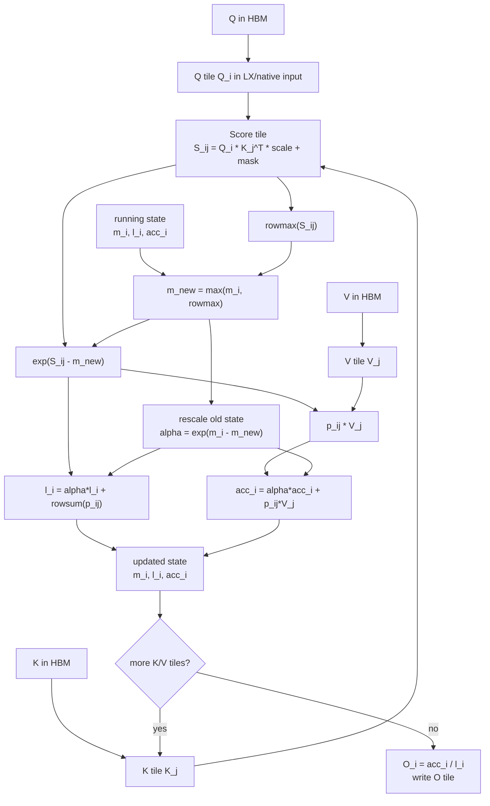
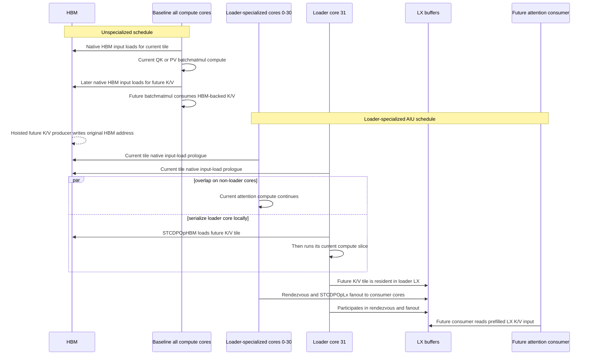
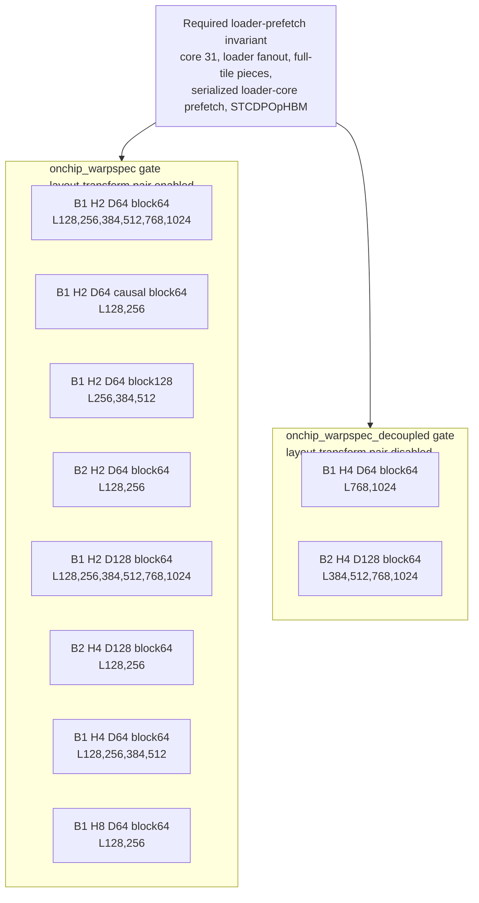

# Stage089 - FlashAttention Warpspec First Principles

## Scope

This note explains the current FlashAttention-on-AIU design from first
principles, then maps the branch's "warpspec" work onto the actual Torch-Spyre
compiler and AIU execution mechanisms. The term "warpspec" is used here as a
loose shorthand for a loader-specialized attention schedule. It is not a claim
that AIU exposes CUDA warp semantics.

The evidence below is limited to the gated experimental subset recorded in
Stages079-088. It is not production-general coverage, and the timing numbers
are diagnostic medians from short hardware sweeps, not repeatable performance
benchmarks.

## FlashAttention From First Principles

Scaled dot-product attention computes:

```text
S = Q K^T * scale + mask
P = softmax(S)
O = P V
```

The direct implementation materializes `S` and usually `P`, both shaped
approximately `[B, H, Lq, Lk]`. For prefill where `Lq == Lk == L`, those
intermediates are `O(L^2)` elements per batch/head. The input and output tensors
are only `O(L * D)` each. For example, at `L=1024, D=64`, one score matrix is
1,048,576 elements per head, while Q, K, V, and O together are 262,144 elements.
If the score/probability matrices are written to and reread from HBM, memory
traffic can dominate even though the math is still `O(L^2 * D)`.

FlashAttention avoids the `L x L` HBM intermediates. It tiles Q rows and streams
K/V blocks through an online softmax state:

```text
for each Q tile i:
  m_i = -inf          # running row max
  l_i = 0             # running row sum(exp(score - m_i))
  acc_i = 0           # running unnormalized P @ V accumulator

  for each K/V tile j:
    s_ij = Q_i @ K_j^T * scale + mask_ij
    m_new = max(m_i, rowmax(s_ij))
    alpha = exp(m_i - m_new)
    p_ij = exp(s_ij - m_new)
    l_i = alpha * l_i + rowsum(p_ij)
    acc_i = alpha * acc_i + p_ij @ V_j
    m_i = m_new

  O_i = acc_i / l_i
```

The key invariant is that `m_i`, `l_i`, and `acc_i` summarize all previous K/V
tiles for the current Q rows. That lets each score tile be consumed immediately
by the softmax update and value accumulation instead of being committed to HBM.



On Spyre, the generated flash-prefill graph is not a single monolithic kernel.
It is a sequence of SDSCs for batchmatmul and pointwise/reduction operations,
with selected edges replaced by mixed SDSC sidecars that keep data in LX or
prefetch/fan out future K/V tiles.

## Warp Specialization, Loosely Mapped

On GPUs, "warp specialization" usually means assigning different warps in a
cooperative thread array to different roles. Producer warps issue asynchronous
global-memory loads into shared-memory pipeline buffers. Consumer warps run
matrix math on the already-loaded buffers. Barriers and buffer indices keep the
producer and consumer roles ordered.

The AIU/Spyre mapping is conceptual only:

| GPU concept | AIU/Spyre analogue in this branch | Important difference |
| --- | --- | --- |
| Producer warp | A selected loader core, currently core 31 | It is a core-level schedule role, not a CUDA warp |
| Shared-memory staging | LX buffers plus explicit `STCDPOpHBM` and `STCDPOpLx` dataops | The compiler must describe address, layout, and per-core pieces explicitly |
| Consumer warps | The remaining AIU cores running current attention DL compute | The loader core's own compute slice is locally serialized, not redistributed |
| Async copy/barrier pipeline | Mixed SDSC schedule rows, `nop` rendezvous rows, and sidecar ordering | Ordering is encoded in SDSC schedules and bundle replacement/insertion |
| Future tile prefetch | Hoisted future K/V producer, HBM load to loader LX, fanout to consumer LX | The future consumer is rewritten to read a prefilled LX input |

The correctness invariant found in Stage078 is the practical core of the
current design:

```text
Do not overlap the loader core's HBM prefetch data movement with that same
core's current attention compute slice. Other cores may keep computing.
```



## Current AIU Design

The production-shaped umbrella starts with:

```text
SPYRE_FLASH_ATTENTION_ONCHIP_SDPA=1
```

That enables the generated flash-prefill decomposition, the mixed-pipeline
machinery, score-scale and pointwise handoff gates, and a larger default
prefill block size. It does not by itself turn every diagnostic overlap probe
into production behavior.

The current implementation has four relevant layers.

### 1. Mixed SDSCs

A mixed SDSC combines one or more dataops with a DL compute op under an explicit
per-core schedule. In this branch, mixed sidecars are used to:

- execute an `STCDPOpLx` copy before a consumer reads an LX input;
- execute an `STCDPOpHBM` HBM-to-LX prefetch before a future consumer;
- combine current compute with future prefetch where safe;
- record `flashAttentionPipeline_` metadata for gate validation.

The sidecars are inserted into or substituted for the generated bundle by
`torch_spyre/_inductor/codegen/bundle.py`. The sidecar builders live in
`torch_spyre/_inductor/onchip_realize.py`.

### 2. Pointwise And Score-Scale Handoffs

`realize_flash_attention_pointwise_handoffs` repeatedly finds legal flash
attention pointwise edges and rewrites the producer/consumer boundary to use LX
instead of HBM. When score-scale handoff is enabled, the score-scale edge is
handled first, then regular pointwise edges are realized until no more legal
edges remain.

The promotion gates check for these pointwise mixed sidecars, so a row cannot
pass only by generating a K/V prefetch artifact while falling back to the older
HBM-heavy pointwise path.

### 3. Layout-Transform Pair

The layout-transform pair handles a same-dimension layout conversion on the
query-side batchmatmul input. The layout-coupled path enables:

```text
SPYRE_FLASH_ATTENTION_ONCHIP_SDPA_LAYOUT_XFORM=1
SPYRE_FLASH_ATTENTION_MIXED_PIPELINE_LAYOUT_XFORM_PAIR_TILE=-2
```

Auto mode scans for a legal layout-transform pair. This path was important for
the earlier on-chip SDPA island, but Stages086-088 showed that it can also hide
valid loader-prefetch rows behind layout-transform numerical failures.

### 4. K/V HBM Repack, Prefetch, And Loader Fanout

The K/V path is deliberately different from the query-side layout pair. The
candidate detector looks for a low-core `ReStickifyOpHBM` producer feeding a
future K/V input of a higher-core batchmatmul consumer. The branch extended this
detector so the producer split can be one dimension or multiple dimensions, for
example `["mb_", "x_"]`, as long as the mapped split factors divide the
consumer iteration space and match the producer core count.

The loader-prefetch sidecar does this:

1. Hoist the future K/V producer before the current attention tile.
2. Preserve the original HBM write so other future consumers, such as max/sum
   reductions, can still read the original address.
3. Load the future K/V HBM tile into one loader core's LX buffer with
   `STCDPOpHBM`.
4. Use an all-core rendezvous before fanout.
5. Fan the loader-core LX copy out to future consumer cores with `STCDPOpLx`.
6. Replace the future batchmatmul consumer with a compute-only sidecar whose
   K/V input is marked as prefilled LX.

The certified warpspec aliases request the stable loader-specialized shape:

```text
SPYRE_FLASH_ATTENTION_KV_REPACK_HBM_PREFETCH_HOIST_TILE=-2
SPYRE_FLASH_ATTENTION_KV_REPACK_HBM_PREFETCH_LOADER_CORE=31
SPYRE_FLASH_ATTENTION_KV_REPACK_HBM_PREFETCH_LOADER_FANOUT=1
SPYRE_FLASH_ATTENTION_KV_REPACK_HBM_PREFETCH_LOADER_FANOUT_FULL_TILE_PIECES=1
SPYRE_FLASH_ATTENTION_KV_REPACK_HBM_PREFETCH_SERIALIZE_LOADER_CORE=1
SPYRE_FLASH_ATTENTION_KV_REPACK_HBM_PREFETCH_TAIL_CURRENT=0
```

`onchip_warpspec_kv_hbm_prefetch_loader_core31` keeps the layout-transform pair
enabled. `onchip_warpspec_kv_hbm_prefetch_loader_core31_decoupled` disables the
layout-transform adjunct and requests only the serialized loader-core K/V HBM
prefetch schedule:

```text
SPYRE_FLASH_ATTENTION_ONCHIP_SDPA_LAYOUT_XFORM=0
SPYRE_FLASH_ATTENTION_MIXED_PIPELINE_LAYOUT_XFORM_PAIR_TILE=-1
```



```mermaid
flowchart LR
    Shape["SDPA shape<br/>B,H,L,D,block,causal"] --> Sweep["tools/onchip_sdpa_sweep.py<br/>one child per shape x variant"]
    Sweep --> Env["Variant env<br/>SPYRE_* knobs"]
    Env --> Config["torch_spyre/_inductor/config.py<br/>default-off config gates"]
    Config --> Bundle["codegen/bundle.py<br/>selects sidecar builders"]
    Bundle --> Realize["onchip_realize.py<br/>detects edges and builds mixed SDSCs"]
    Realize --> Sidecars["Generated mixed SDSCs<br/>STCDPOpLx, STCDPOpHBM, nop, DL compute"]
    Sidecars --> Device["Device execution<br/>correctness and medians"]
    Device --> JSON["Sweep JSON<br/>status, max_abs_error, mixed_sdscs"]
    JSON --> Gate["tools/onchip_sdpa_promotion_gate.py<br/>shape, metadata, error, and coverage checks"]
    Gate --> RFC["Stage docs<br/>evidence and promotion boundaries"]
```

## What Changed In This Branch

The branch turned the loader-specialized attention idea from a set of one-off
probes into gated experimental coverage.

Compiler/config changes:

- Added default-off K/V HBM prefetch controls for hoist selection, source
  fanout, loader fanout, loader core selection, loader LX base selection,
  fanout transport, fanout copyback, full-tile fanout pieces, current/tail
  scheduling, corelet routing, and loader-core serialization.
- Added layout-coupled and layout-decoupled on-chip SDPA selection through
  `SPYRE_FLASH_ATTENTION_ONCHIP_SDPA_LAYOUT_XFORM` and the low-level
  layout-transform pair tile knob.
- Kept the production-shaped `SPYRE_FLASH_ATTENTION_ONCHIP_SDPA` umbrella
  separate from the individual diagnostic probes.

Codegen and realizer changes:

- Plumbed the K/V prefetch controls through `bundle.py` into
  `build_flash_attention_kv_repack_hbm_prefetch_hoist_tile_artifacts`.
- Added K/V edge detection for multi-dimensional producer splits and preserved
  the older single-split metadata shape for compatibility.
- Allowed the prefetch hoist to preserve additional HBM consumers while still
  redirecting the target future batchmatmul to prefilled LX.
- Added the loader-core fanout schedule and the important
  `serialize_loader_core_prefetch` mode, where loader-core HBM movement and that
  same core's compute slice run in separate rows.
- Emitted metadata needed by the gates, including loader core id, full-tile
  fanout, serialization, current/future tile ids, additional consumers, and
  `STCDPOpHBM`/`STCDPOpLx` op usage.

Tooling and gate changes:

- Added sweep aliases for the exploratory K/V repack, HBM prefetch, loader
  fanout, copyback, full-tile fanout, serialized loader-core, layout-coupled
  warpspec, and layout-decoupled warpspec variants.
- Extended the sweep harness to summarize mixed SDSCs, flash pipeline metadata,
  layout-transform candidate diagnostics, max error, medians, and fallback
  status.
- Added promotion gates:
  - `onchip_warpspec`, defaulting to
    `onchip_warpspec_kv_hbm_prefetch_loader_core31`;
  - `onchip_warpspec_decoupled`, defaulting to
    `onchip_warpspec_kv_hbm_prefetch_loader_core31_decoupled`.
- Added gate checks for the serialized loader-core K/V prefetch artifact:
  current-prefetch role, loader fanout, loader core 31, full-tile fanout pieces,
  loader-core serialization, and `STCDPOpHBM` usage.
- Added `tools/onchip_sdpa_perf_compare.py` to run a gated target variant beside
  one or more baselines, validate the target against the same promotion
  invariants, and report per-row plus geometric-mean speedups.
- Recorded the branch history in Stages060-088, with Stages079-088 defining the
  current promotion boundary.

## Gate And Coverage Evidence

The latest layout-coupled warpspec promotion gate recorded before Stage088 was:

```text
PROMOTION_GATE_PASSED gate=onchip_warpspec cases=8 rows=25
```

Stage088 then added the layout-decoupled gate:

```text
PROMOTION_GATE_PASSED gate=onchip_warpspec_decoupled cases=2 rows=6
```

The gates validate shape, block size, causal flag, row status, max absolute
error, minimum mixed-SDSC count, pointwise handoff presence, and the loader-core
prefetch metadata. The default gate tolerance is a maximum absolute error of
`0.01`. The default timing sample is short (`warmup=1`, `iters=2`), so these
medians are correctness-gate diagnostics, not benchmark claims.



Stage088 key row medians for the decoupled gate:

| Gate | Shape | Lengths | Median ms | Max abs error | Mixed SDSCs |
| --- | --- | --- | ---: | ---: | ---: |
| `onchip_warpspec_decoupled` | B1 H4 D64 block64 | 768 | 1.781614 | 0.00195312 | 59 |
| `onchip_warpspec_decoupled` | B1 H4 D64 block64 | 1024 | 2.518849 | 0.00268555 | 78 |
| `onchip_warpspec_decoupled` | B2 H4 D128 block64 | 384 | 1.339696 | 0.00390625 | 22 |
| `onchip_warpspec_decoupled` | B2 H4 D128 block64 | 512 | 1.679618 | 0.00317383 | 31 |
| `onchip_warpspec_decoupled` | B2 H4 D128 block64 | 768 | 3.318368 | 0.00366211 | 47 |
| `onchip_warpspec_decoupled` | B2 H4 D128 block64 | 1024 | 5.053475 | 0.00219727 | 63 |

The important interpretation is not that the decoupled path is globally better.
It is that the loader-core K/V prefetch invariant can be certified independently
from the layout-transform pair. Stages086-088 showed that some long rows failed
when the layout-transform pair was coupled in, while the same loader-prefetch
rows passed after the layout pair was disabled.

## Repeated Performance Comparison

Stage226 used `tools/onchip_sdpa_perf_compare.py` with `warmup=2` and `iters=7`
to compare the decoupled warpspec gate against `flash_hbm` and `onchip_master`.
This is still a short engineering benchmark, but it is stronger evidence than
the one-iteration promotion-gate medians.

```text
PERF_COMPARE_PASSED gate=onchip_warpspec_decoupled cases=2 comparisons=12
PERF_SUMMARY baseline=flash_hbm ok_pairs=6/6 geomean_speedup=1.1716x
PERF_SUMMARY baseline=onchip_master ok_pairs=6/6 geomean_speedup=0.9999x
```

Per-row medians:

| Shape | L | `flash_hbm` ms | `onchip_master` ms | decoupled warpspec ms | Speedup vs `flash_hbm` | Speedup vs `onchip_master` |
| --- | ---: | ---: | ---: | ---: | ---: | ---: |
| B1 H4 D64 block64 | 768 | 1.748374 | 1.583245 | 1.567068 | 1.1157x | 1.0103x |
| B1 H4 D64 block64 | 1024 | 2.554044 | 2.170516 | 2.182102 | 1.1705x | 0.9947x |
| B2 H4 D128 block64 | 384 | 1.246830 | 1.113446 | 1.121148 | 1.1121x | 0.9931x |
| B2 H4 D128 block64 | 512 | 1.770552 | 1.500117 | 1.495212 | 1.1841x | 1.0033x |
| B2 H4 D128 block64 | 768 | 3.716771 | 3.101267 | 3.116855 | 1.1925x | 0.9950x |
| B2 H4 D128 block64 | 1024 | 6.056340 | 4.818441 | 4.802847 | 1.2610x | 1.0032x |

The current performance read is therefore precise but modest: the
loader-specialized path is consistently faster than `flash_hbm` on the
decoupled gate island, while it is effectively tied with `onchip_master`. This
suggests the next performance work should focus on finding where the
loader-core schedule can reduce work or hide more latency beyond the already
strong on-chip master schedule, not merely on proving that the sidecar exists.

## Open Gaps And Next Steps

Production readiness:

- The loader-specialized path is still selected by explicit variants and gates.
  It should not be treated as a default production SDPA path.
- The mixed SDSC metadata still marks much of the prefetch path as experimental
  and runtime-forced.
- The current implementation serializes the loader core's own compute slice
  instead of redistributing that work across the remaining cores.

Coverage:

- Broader batch, head, head-dim, block-size, causal, and long-sequence matrices
  need promotion gates before the path can be generalized.
- `B1 H2 D64 block128` at L768/L1024 remains excluded because the non-warpspec
  HBM-KV layout-transform baseline shows the same numerical failures.
- Causal long-sequence coverage and mask/bias interactions remain separate
  hazards from the non-causal loader-prefetch rows.

Layout hazards:

- The layout-transform pair is useful but independently risky. The
  layout-decoupled gate proves the loader-prefetch invariant without claiming
  the layout pair is fixed for the long failing shapes.
- Future promotion should keep layout-transform and loader-prefetch evidence
  separable so one path does not hide failures in the other.

Benchmarking:

- The Stage226 medians are repeated short-run engineering data, not a final
  production benchmark. A stronger performance claim still needs more repeated
  runs, stable warmup/iteration policy, comparison against `flash_hbm`,
  `onchip_master`, and relevant layout-transform variants, fallback-forbidden
  runs, and cache/compile/run separation.
- The next benchmark should report distributions, not only medians, and should
  keep correctness summaries beside timing rows.

Near-term engineering steps:

- Keep `onchip_warpspec_decoupled` as the direct certification lane for the
  loader-core K/V prefetch invariant.
- Add promotion rows only when they both pass value checks and emit the required
  serialized loader-core metadata.
- Investigate the layout-transform long-row failures independently.
- Decide whether to accept one-core local serialization as the first supported
  AIU schedule or pursue redistribution of core 31's compute slice.
