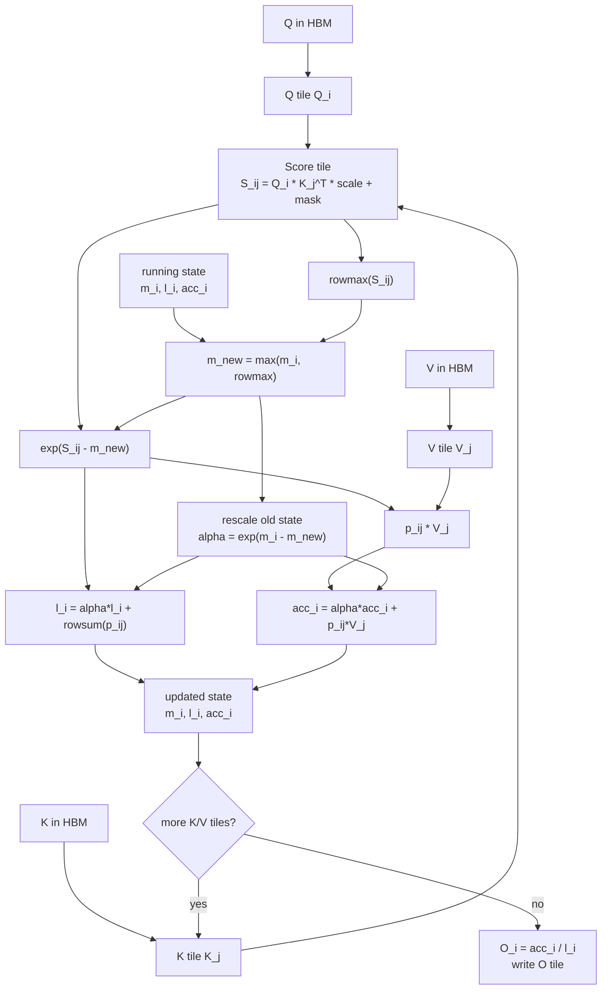
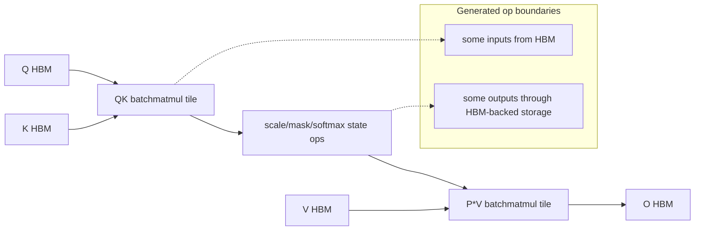
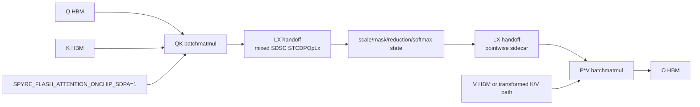
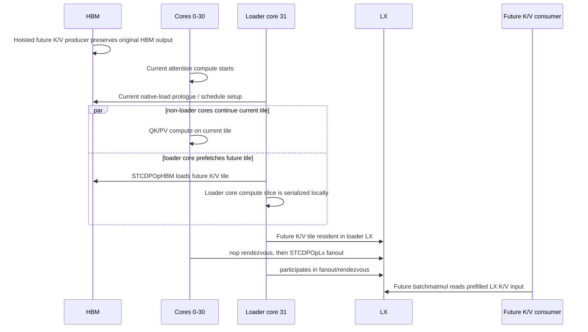
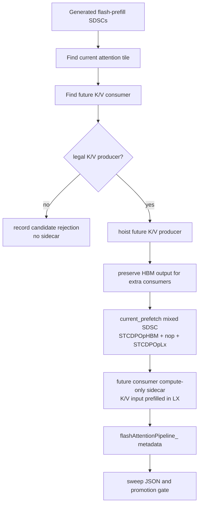
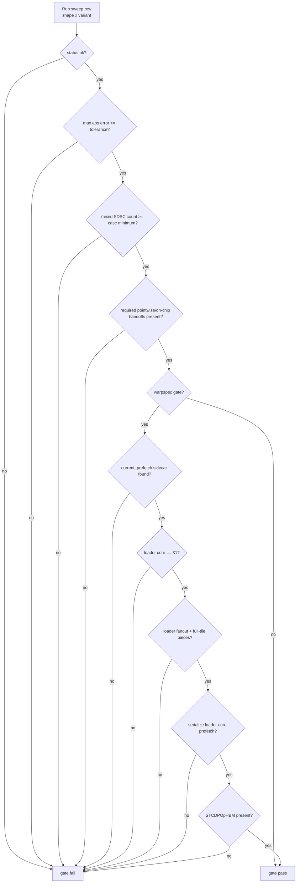

# Stage089 - FlashAttention Warp-Specialized AIU Design

## Scope

This note explains the current FlashAttention-on-AIU work from first
principles and then maps the branch's "warpspec" terminology onto the actual
Torch-Spyre compiler mechanisms. The term "warpspec" is convenient shorthand
for a loader-specialized attention schedule. It is not a claim that AIU exposes
CUDA warp semantics or that this branch contains a literal CUDA-style
warp-specialized kernel.

The current result is a gated experimental loader-specialized path. It is not
production-general coverage. The branch has a real promotion gate for selected
shapes, repeated short-run performance evidence for the layout-decoupled gate
island, and exploratory A/B lanes for fanout tuning. The gate says "this
specific shape emitted the expected serialized loader-core K/V prefetch
artifact and was value-correct." It does not say "all SDPA shapes should route
through this path by default."

## First Principles: Why FlashAttention Tiles Matter

Scaled dot-product attention computes:

```text
S = Q K^T * scale + mask
P = softmax(S)
O = P V
```

For prefill, where `Lq == Lk == L`, `S` and `P` are shaped approximately
`[B, H, L, L]`. The input and output tensors are shaped `[B, H, L, D]`. That
matters because the score and probability matrices are quadratic in sequence
length, while Q, K, V, and O are linear in sequence length.

For one batch/head at `L=1024, D=64`:

```text
Q + K + V + O elements = 4 * 1024 * 64 = 262144
one score matrix       = 1024 * 1024     = 1048576
```

Materializing `S` and `P` into HBM creates large temporary tensors and extra
HBM traffic. FlashAttention avoids those HBM intermediates by processing one
query tile against a stream of K/V tiles while maintaining an online softmax
state.

For a query tile `Q_i` and K/V tile `K_j, V_j`:

```text
for each Q tile i:
  m_i = -inf          # running row max
  l_i = 0             # running row sum(exp(score - m_i))
  acc_i = 0           # running unnormalized P @ V accumulator

  for each K/V tile j:
    s_ij = Q_i @ K_j^T * scale + mask_ij
    m_new = max(m_i, rowmax(s_ij))
    alpha = exp(m_i - m_new)
    p_ij = exp(s_ij - m_new)
    l_i = alpha * l_i + rowsum(p_ij)
    acc_i = alpha * acc_i + p_ij @ V_j
    m_i = m_new

  O_i = acc_i / l_i
```

The invariant is simple: `m_i`, `l_i`, and `acc_i` summarize all previous K/V
tiles for the current Q rows. Therefore each score tile can be consumed
immediately by the softmax update and value accumulation instead of being
stored as an `L x L` HBM tensor.



This makes Q/K/V/O tiling central to the implementation:

- Q tiling controls the rows whose online softmax state is live.
- K tiling controls the score tile width and the sequence of softmax updates.
- V tiling must align with the K tile stream because each probability tile is
  immediately multiplied by the matching V tile.
- O tiling follows the Q tile because the final normalized accumulator is
  written once per Q tile.
- The on-chip implementation is useful only when these tile boundaries let
  generated SDSCs exchange intermediate data in LX rather than repeatedly
  spilling and reloading through HBM.

## AIU Concepts Used By This Work

The implementation is not a single monolithic handwritten kernel. It is a
generated flash-prefill graph made of SDSCs and mixed SDSC sidecars.

### SDSC

An SDSC is a scheduled descriptor for one generated operation or a small
scheduled group. In these notes it is useful to think of SDSCs as the compiler's
unit of device scheduling. A flash attention graph contains batchmatmul SDSCs,
pointwise/reduction SDSCs, and mixed SDSCs that combine data movement with
compute.

### Mixed SDSC

A mixed SDSC carries one or more dataops plus one or more DL compute ops under
an explicit per-core schedule. This branch uses mixed SDSCs for:

- LX handoffs between generated flash attention ops.
- HBM-to-LX K/V prefetches with `STCDPOpHBM`.
- LX-to-LX K/V fanout with `STCDPOpLx`.
- `nop` rows that act as schedule rendezvous points.
- metadata under `flashAttentionPipeline_` so tests and gates can verify which
  artifact actually selected.

### STCDP Dataops

The names that show up in generated metadata are important:

```text
STCDPOpHBM  HBM <-> LX data movement
STCDPOpLx   LX <-> LX data movement / fanout
nop         explicit schedule row without data movement
```

The loader-specialized path is specifically looking for a current-tile mixed
SDSC that contains an `STCDPOpHBM` load for a future K/V tile and later an
`STCDPOpLx` fanout before the future consumer reads that K/V tile from LX.

### Current And Future Tile Flows

The branch uses "current" and "future" relative to a current attention compute
tile:

```text
current tile:
  the QK/PV work currently being computed

future tile:
  a later K/V consumer whose K or V input can be prepared while non-loader
  cores continue current-tile compute
```

The key sidecar is named like this in generated artifacts:

```text
mixed_flash_kv_repack_hbm_prefetch_hoist_<tile>_current_prefetch
```

Its role metadata is:

```text
kv_repack_hbm_prefetch_hoist_role == "current_prefetch"
```

### HBM-Backed K/V Restickify

The K/V path starts from a K/V producer that restickifies or repacks data into
the layout needed by a future batchmatmul consumer. Earlier paths were
HBM-backed: the producer wrote an HBM address and future consumers read that
address. The loader-specialized path keeps that original HBM write when needed,
but also hoists a future K/V producer and creates a sidecar that pulls that
future K/V tile into LX ahead of the future consumer.

Preserving the original HBM address matters because the target future
batchmatmul is not always the only consumer. For example, max/sum reductions
may still need the original HBM-backed value. The current implementation can
redirect the selected future batchmatmul to a prefilled LX input while keeping
additional HBM consumers valid.

### Corelets, Cores, And Loader Core 31

The tested AIU schedule uses 32 consumer cores. Earlier probes tried corelet
routing and broader sync changes, but Stage078 isolated the practical
correctness rule:

```text
Do not overlap the loader core's HBM prefetch data movement with that same
core's current attention compute slice. Other cores may keep computing.
```

The certified variants choose core 31 as the loader core:

```text
SPYRE_FLASH_ATTENTION_KV_REPACK_HBM_PREFETCH_LOADER_CORE=31
```

That does not remove core 31 from the computation globally. It means the
current mixed SDSC gives core 31 a loader role for the HBM prefetch and
serializes that core's own current compute slice around the prefetch rows.
Other cores can still compute current-tile work while core 31 performs the
loader-side HBM movement.

## Three Attention Paths

The branch currently distinguishes three useful mental models.

### 1. Baseline Flash HBM Path

The baseline flash path still has FlashAttention's online softmax structure,
but K/V and intermediate boundaries can remain HBM-backed between generated
ops. It avoids materializing full `S` and `P`, but it does not force the
branch's on-chip handoff and loader-prefetch artifacts to select.



In the performance tool this baseline appears as:

```text
flash_hbm
```

### 2. On-Chip Master Path

The on-chip master path enables the main on-chip SDPA umbrella. It realizes
pointwise handoffs and, when enabled, layout-transform pair artifacts so more
of the generated flash graph can communicate through LX.



This path is already strong. Stage226 showed the layout-decoupled warpspec
gate island was effectively tied with `onchip_master`, not dramatically faster
than it.

### 3. Decoupled Loader-Specialized Path

The loader-specialized path adds a future-K/V prefetch role on top of the
on-chip flash graph. The stable decoupled variant disables the layout-transform
adjunct and certifies the loader-core K/V prefetch invariant directly:

```text
SPYRE_FLASH_ATTENTION_ONCHIP_SDPA=1
SPYRE_FLASH_ATTENTION_ONCHIP_SDPA_LAYOUT_XFORM=0
SPYRE_FLASH_ATTENTION_MIXED_PIPELINE_LAYOUT_XFORM_PAIR_TILE=-1
SPYRE_FLASH_ATTENTION_KV_REPACK_HBM_PREFETCH_HOIST_TILE=-2
SPYRE_FLASH_ATTENTION_KV_REPACK_HBM_PREFETCH_LOADER_CORE=31
SPYRE_FLASH_ATTENTION_KV_REPACK_HBM_PREFETCH_LOADER_FANOUT=1
SPYRE_FLASH_ATTENTION_KV_REPACK_HBM_PREFETCH_LOADER_FANOUT_FULL_TILE_PIECES=1
SPYRE_FLASH_ATTENTION_KV_REPACK_HBM_PREFETCH_SERIALIZE_LOADER_CORE=1
SPYRE_FLASH_ATTENTION_KV_REPACK_HBM_PREFETCH_TAIL_CURRENT=0
```



An ASCII view of the same schedule:

```text
time ->

cores 0-30:  native-load/prologue | current compute continues | fanout sync | future compute
core 31:     native-load/prologue | HBM load future K/V       | own compute | fanout sync | future compute
                                      STCDPOpHBM                 serialized    STCDPOpLx
```

The current design pays the cost of serializing one core's compute slice. The
bet is that earlier K/V availability and reduced HBM pressure can compensate on
some shapes. Today that bet is true versus `flash_hbm` on the decoupled gate
island, and roughly break-even versus `onchip_master`.

## Why This Is An Analogue, Not Literal CUDA Warp Specialization

CUDA warp specialization commonly means producer warps issue asynchronous
global-memory copies into shared memory while consumer warps run tensor-core
math. Barriers and stage indices coordinate shared-memory buffers.

The AIU mapping is conceptual:

| GPU concept | AIU/Spyre analogue in this branch | Important difference |
| --- | --- | --- |
| Producer warp | Loader core 31 | Core-level schedule role, not a CUDA warp |
| Consumer warps | Remaining AIU cores doing current attention compute | The loader core still has a compute slice, serialized locally |
| Shared memory | LX buffers | Addressing, layout, and per-core pieces are compiler artifacts |
| Async copy | `STCDPOpHBM` inside a mixed SDSC | Ordered by generated SDSC schedules, not CUDA async-copy APIs |
| Warp barrier | `nop` rendezvous rows and mixed SDSC schedule ordering | No CUDA warp/barrier semantics are exposed |
| Future stage | Hoisted future K/V producer plus prefilled-LX future consumer | Selection depends on graph candidates and layout legality |
| Multicast/unicast transfer | `STCDPOpLx` fanout knob | A tuning lane, not the core correctness invariant |

The phrase "warp-specialized" should therefore be read as:

```text
logical producer/loader role + logical compute role + explicit on-chip staging
```

It should not be read as:

```text
CUDA warp groups, CUDA shared memory, or a handwritten GPU kernel
```

## How The Compiler Builds The Loader-Specialized Path

The implementation has four relevant layers.

### 1. Config Knobs

The low-level controls live in:

```text
torch_spyre/_inductor/config.py
```

Important default-off K/V prefetch controls include:

```text
SPYRE_FLASH_ATTENTION_KV_REPACK_HBM_PREFETCH_HOIST_TILE
SPYRE_FLASH_ATTENTION_KV_REPACK_HBM_PREFETCH_LOADER_CORE
SPYRE_FLASH_ATTENTION_KV_REPACK_HBM_PREFETCH_LOADER_LX_BASE
SPYRE_FLASH_ATTENTION_KV_REPACK_HBM_PREFETCH_LOADER_FANOUT
SPYRE_FLASH_ATTENTION_KV_REPACK_HBM_PREFETCH_LOADER_FANOUT_FULL_TILE_PIECES
SPYRE_FLASH_ATTENTION_KV_REPACK_HBM_PREFETCH_FANOUT_USE_UNICAST
SPYRE_FLASH_ATTENTION_KV_REPACK_HBM_PREFETCH_SERIALIZE_LOADER_CORE
SPYRE_FLASH_ATTENTION_KV_REPACK_HBM_PREFETCH_TAIL_CURRENT
SPYRE_FLASH_ATTENTION_KV_REPACK_HBM_PREFETCH_CORELET1
```

The production-shaped umbrella is separate:

```text
SPYRE_FLASH_ATTENTION_ONCHIP_SDPA=1
```

That umbrella enables the generated on-chip SDPA machinery. It does not by
itself certify every diagnostic K/V prefetch probe as production behavior.

### 2. Variant Selection And Sweeps

The sweep aliases live in:

```text
tools/onchip_sdpa_sweep.py
```

The two primary warpspec aliases are:

```text
onchip_warpspec_kv_hbm_prefetch_loader_core31
onchip_warpspec_kv_hbm_prefetch_loader_core31_decoupled
```

The coupled alias keeps the layout-transform pair enabled. The decoupled alias
turns layout-transform off and requests only the serialized loader-core K/V
HBM prefetch schedule.

Stage090 added a controlled fanout A/B alias:

```text
onchip_warpspec_kv_hbm_prefetch_loader_core31_decoupled_unicast
```

That alias differs from the decoupled default only by:

```text
SPYRE_FLASH_ATTENTION_KV_REPACK_HBM_PREFETCH_FANOUT_USE_UNICAST=1
```

It is not the promotion-gate default.

### 3. Bundle Selection

The codegen bundle layer lives in:

```text
torch_spyre/_inductor/codegen/bundle.py
```

It reads the config knobs, selects the requested flash attention sidecar
builders, and inserts or replaces generated SDSCs with mixed SDSC artifacts.
For this design, the key builder call is:

```text
build_flash_attention_kv_repack_hbm_prefetch_hoist_tile_artifacts(...)
```

### 4. Realization

The sidecar builders and candidate detectors live in:

```text
torch_spyre/_inductor/onchip_realize.py
```

The K/V HBM prefetch builder:

1. Finds a current attention consumer and a future K/V consumer.
2. Finds a K/V producer feeding that future consumer.
3. Validates producer and consumer core layouts, including multi-dimensional
   producer splits such as `["mb_", "x_"]`.
4. Hoists the future K/V producer before the current tile.
5. Preserves the original HBM-backed producer output when other consumers need
   it.
6. Builds a current-prefetch mixed SDSC containing loader `STCDPOpHBM`,
   rendezvous `nop`, and loader fanout `STCDPOpLx`.
7. Rewrites the selected future consumer to read a prefilled LX input.
8. Emits metadata so gates can prove the intended artifact selected.



## Promotion Gate Decision Flow

Promotion gates live in:

```text
tools/onchip_sdpa_promotion_gate.py
```

The current gates are:

```text
onchip_layout_xform
onchip_warpspec
onchip_warpspec_decoupled
```

The warpspec gates do not merely check that a row ran successfully. They check
that the row emitted the specific serialized loader-core prefetch artifact.

Required loader-prefetch metadata includes:

```text
kv_repack_hbm_prefetch_hoist_role == "current_prefetch"
kv_repack_hbm_prefetch_hoist_prefetch_loader_fanout == true
kv_repack_hbm_prefetch_hoist_prefetch_loader_core_id == 31
kv_repack_hbm_prefetch_hoist_prefetch_loader_fanout_full_tile_pieces == true
kv_repack_hbm_prefetch_hoist_serialize_loader_core_prefetch == true
opFuncsUsed contains STCDPOpHBM
```



The repeated performance comparison tool lives in:

```text
tools/onchip_sdpa_perf_compare.py
```

It runs a gated target variant beside one or more baselines, validates the
target against the same promotion invariants, and reports per-row plus
geometric-mean speedups.

## Code, Test, And Tool Inventory

This is the current branch inventory for the loader-specialized FlashAttention
work. It is intentionally file-path based so future readers can verify each
claim in code.

Compiler/config:

- `torch_spyre/_inductor/config.py`
  - Added default-off K/V HBM prefetch controls.
  - Added loader core, loader LX base, fanout, unicast, copyback, full-tile
    fanout pieces, tail/current scheduling, corelet, and loader-core
    serialization controls.
  - Kept the main on-chip SDPA umbrella separate from individual probes.

- `torch_spyre/_inductor/codegen/bundle.py`
  - Plumbs K/V prefetch controls into the flash attention sidecar builders.
  - Selects K/V broadcast, HBM-staged, HBM-prefetch, layout-coupled, and
    layout-decoupled artifact paths.
  - Passes loader core, fanout, unicast, and serialization options into
    `build_flash_attention_kv_repack_hbm_prefetch_hoist_tile_artifacts`.

- `torch_spyre/_inductor/onchip_realize.py`
  - Detects K/V repack broadcast and HBM prefetch hoist candidates.
  - Supports multi-dimensional producer splits.
  - Builds `STCDPOpHBM` loader prefetch dataops.
  - Builds `STCDPOpLx` source or loader fanout dataops.
  - Builds serialized loader-core current-prefetch schedules.
  - Preserves additional HBM consumers when redirecting the selected future
    batchmatmul to prefilled LX.
  - Emits `flashAttentionPipeline_` metadata consumed by tests and gates.

Tools:

- `tools/onchip_sdpa_sweep.py`
  - Defines `flash_hbm`, `onchip_master`, layout-xform, K/V prefetch, coupled
    warpspec, decoupled warpspec, and decoupled A/B variants such as unicast,
    safe-source, no-after-sync, and corelet1.
  - Runs shape/variant sweeps and writes JSON with status, medians, max error,
    mixed SDSC summaries, metadata, and candidate diagnostics.

- `tools/onchip_sdpa_promotion_gate.py`
  - Defines the promotion matrices for `onchip_layout_xform`,
    `onchip_warpspec`, and `onchip_warpspec_decoupled`.
  - Requires loader-prefetch metadata for warpspec gates.
  - Tracks minimum mixed-SDSC counts by shape and length.

- `tools/onchip_sdpa_perf_compare.py`
  - Runs a gated target beside baselines.
  - Reuses promotion-gate validation on the target.
  - Reports per-row timings and geometric-mean speedups.

Tests:

- `tests/_inductor/test_config_logic.py`
  - Covers config/env parsing for the new controls.

- `tests/_inductor/test_onchip_realize_logic.py`
  - Covers K/V candidate selection, split mapping, sidecar metadata, and
    schedule construction logic.

- `tests/_inductor/test_onchip_sdpa_sweep_logic.py`
  - Covers sweep aliases and their environment settings, including the
    decoupled and decoupled-unicast variants.

- `tests/_inductor/test_onchip_sdpa_promotion_gate_logic.py`
  - Covers gate case selection and required warpspec metadata checks.

- `tests/_inductor/test_onchip_sdpa_perf_compare_logic.py`
  - Covers performance comparison command construction, target selection,
    parsing, and summary logic.

Documentation:

- `docs/source/rfcs/drafts/NNNN-OnChipRestickify/Stage060-...Stage088-...`
  - Records the probe sequence that led to the current serialized-loader
    invariant and gate boundaries.

- `docs/source/rfcs/drafts/NNNN-OnChipRestickify/Stage090-WarpspecFanoutTuning.md`
  - Records the fanout/unicast tuning A/B lane.

- `docs/source/rfcs/drafts/NNNN-OnChipRestickify/Stage091-H8MidDecoupledWarpspecGate.md`
  - Records the narrow B1/H8/D64 mid-length decoupled gate extension and the
    H8 long-row boundary.

- `docs/source/rfcs/drafts/NNNN-OnChipRestickify/Stage092-DecoupledWarpspec8RowPerf.md`
  - Records the expanded eight-row decoupled performance comparison against
    `flash_hbm` and `onchip_master`.

- `docs/source/rfcs/drafts/NNNN-OnChipRestickify/Stage093-DecoupledWarpspecKnobScreen.md`
  - Records the decoupled safe-source, no-after-sync, and corelet1 A/B tuning
    aliases and explains why none replaces the default gate target yet.

## Gate Coverage And Correctness Evidence

The latest layout-coupled warpspec gate recorded before layout decoupling was:

```text
PROMOTION_GATE_PASSED gate=onchip_warpspec cases=8 rows=25
```

This gate covers:

```text
B1 H2 D64  block64  L128,L256,L384,L512,L768,L1024
B1 H2 D64  causal   L128,L256
B1 H2 D64  block128 L256,L384,L512
B2 H2 D64  block64  L128,L256
B1 H2 D128 block64  L128,L256,L384,L512,L768,L1024
B2 H4 D128 block64  L128,L256
B1 H4 D64  block64  L128,L256,L384,L512
B1 H8 D64  block64  L128,L256
```

Stage088 added the initial layout-decoupled gate, and Stage091 extended it with
the B1/H8/D64 mid-length rows:

```text
PROMOTION_GATE_PASSED gate=onchip_warpspec_decoupled cases=3 rows=8
```

This decoupled gate covers:

```text
B1 H4 D64  block64 L768,L1024
B1 H8 D64  block64 L384,L512
B2 H4 D128 block64 L384,L512,L768,L1024
```

The key point is separability. The loader-core K/V prefetch path can be
certified independently from the layout-transform pair. Stages086-088 showed
that some long rows failed when layout-transform was coupled in, while the same
loader-prefetch rows passed after disabling the layout pair.

Stage088 decoupled gate medians:

| Gate | Shape | L | Median ms | Max abs error | Mixed SDSCs |
| --- | --- | ---: | ---: | ---: | ---: |
| `onchip_warpspec_decoupled` | B1 H4 D64 block64 | 768 | 1.781614 | 0.00195312 | 59 |
| `onchip_warpspec_decoupled` | B1 H4 D64 block64 | 1024 | 2.518849 | 0.00268555 | 78 |
| `onchip_warpspec_decoupled` | B2 H4 D128 block64 | 384 | 1.339696 | 0.00390625 | 22 |
| `onchip_warpspec_decoupled` | B2 H4 D128 block64 | 512 | 1.679618 | 0.00317383 | 31 |
| `onchip_warpspec_decoupled` | B2 H4 D128 block64 | 768 | 3.318368 | 0.00366211 | 47 |
| `onchip_warpspec_decoupled` | B2 H4 D128 block64 | 1024 | 5.053475 | 0.00219727 | 63 |

Stage091 added B1/H8/D64 mid-length rows after repeated hardware checks:

| Gate | Shape | L | Repeated median ms | Max abs error | Mixed SDSCs |
| --- | --- | ---: | ---: | ---: | ---: |
| `onchip_warpspec_decoupled` | B1 H8 D64 block64 | 384 | 0.960641 | 0.00292969 | 29 |
| `onchip_warpspec_decoupled` | B1 H8 D64 block64 | 512 | 1.273712 | 0.00305176 | 39 |

The default promotion-gate tolerance is currently a maximum absolute error of
`0.01`. The gate timing samples are short and should be treated as diagnostic
medians, not production benchmark results.

## Performance Evidence

Stage226 used `tools/onchip_sdpa_perf_compare.py` with `warmup=2` and `iters=7`
to compare the initial six-row decoupled warpspec gate against `flash_hbm` and
`onchip_master`:

```text
PERF_COMPARE_PASSED gate=onchip_warpspec_decoupled cases=2 comparisons=12
PERF_SUMMARY baseline=flash_hbm ok_pairs=6/6 geomean_speedup=1.1716x
PERF_SUMMARY baseline=onchip_master ok_pairs=6/6 geomean_speedup=0.9999x
```

Per-row medians:

| Shape | L | `flash_hbm` ms | `onchip_master` ms | decoupled warpspec ms | Speedup vs `flash_hbm` | Speedup vs `onchip_master` |
| --- | ---: | ---: | ---: | ---: | ---: | ---: |
| B1 H4 D64 block64 | 768 | 1.748374 | 1.583245 | 1.567068 | 1.1157x | 1.0103x |
| B1 H4 D64 block64 | 1024 | 2.554044 | 2.170516 | 2.182102 | 1.1705x | 0.9947x |
| B2 H4 D128 block64 | 384 | 1.246830 | 1.113446 | 1.121148 | 1.1121x | 0.9931x |
| B2 H4 D128 block64 | 512 | 1.770552 | 1.500117 | 1.495212 | 1.1841x | 1.0033x |
| B2 H4 D128 block64 | 768 | 3.716771 | 3.101267 | 3.116855 | 1.1925x | 0.9950x |
| B2 H4 D128 block64 | 1024 | 6.056340 | 4.818441 | 4.802847 | 1.2610x | 1.0032x |
| B1 H8 D64 block64 | 384 | 1.035977 | 0.955282 | 0.960641 | 1.0784x | 0.9944x |
| B1 H8 D64 block64 | 512 | 1.458632 | 1.275601 | 1.273712 | 1.1452x | 1.0015x |

Interpretation:

- The decoupled loader-specialized path is consistently faster than
  `flash_hbm` on this gate island.
- It is effectively tied with `onchip_master`.
- That means the work is real, but the current schedule is not yet a clear
  production performance win over the best on-chip baseline.

Stage090 recorded the fanout tuning work. Its Stage229 full-island check tested
the `fanout_use_unicast=1` alias across the six-row decoupled island, and every
row remained value-correct:

| Shape | Unicast ms | Previous default ms |
| --- | ---: | ---: |
| B1 H4 L768 D64 | 1.565760 | 1.567068 |
| B1 H4 L1024 D64 | 2.181850 | 2.182102 |
| B2 H4 L384 D128 | 1.118608 | 1.121148 |
| B2 H4 L512 D128 | 1.493568 | 1.495212 |
| B2 H4 L768 D128 | 3.105724 | 3.116855 |
| B2 H4 L1024 D128 | 4.810600 | 4.802847 |

The approximate geomean speedup over the previous decoupled default was
`1.002x`, with one row slightly slower. That is useful A/B signal, not enough
to make unicast the default. The production-facing decoupled gate should remain
on the simpler default until a larger and more stable performance delta appears.

Stage092 reran the performance comparison after the H8 mid rows were added to
the decoupled gate:

```text
PERF_COMPARE_PASSED gate=onchip_warpspec_decoupled cases=3 comparisons=16
PERF_SUMMARY baseline=flash_hbm ok_pairs=8/8 geomean_speedup=1.1518x
PERF_SUMMARY baseline=onchip_master ok_pairs=8/8 geomean_speedup=0.9929x
```

That run showed row-level wins over `onchip_master` on the longer promoted rows
and row-level losses on the shorter/mid rows. The current performance story is
therefore precise: the decoupled loader-specialized path consistently beats
`flash_hbm`, but is not yet a blanket replacement for `onchip_master`.

Stage093 added decoupled safe-source, no-after-sync, and corelet1 A/B aliases.
The most promising knob, safe-source, remained value-correct but did not beat
the default decoupled target across the full eight-row island:

```text
PERF_SUMMARY baseline=onchip_warpspec_kv_hbm_prefetch_loader_core31_decoupled ok_pairs=8/8 geomean_speedup=0.9904x
```

Those aliases are therefore diagnostic lanes, not production defaults.

## Production-Ready Status

The current loader-specialized FlashAttention path is not production ready as a
general AIU SDPA kernel.

What is ready:

- A reproducible experimental gate for selected shapes.
- Correctness metadata that proves the intended serialized loader-core artifact
  emitted instead of silently falling back.
- A layout-decoupled lane that isolates loader-prefetch correctness from
  layout-transform correctness.
- A performance comparison tool that validates the target before reporting
  timings.
- A controlled unicast fanout A/B alias for future tuning.

What is not ready:

- It is not the default production SDPA route.
- Coverage is a selected island, not the full batch/head/dim/length/causal
  space.
- The loader core's compute slice is serialized locally rather than
  redistributed.
- Performance versus `onchip_master` is roughly break-even on the repeated
  gate island.
- Some adjacent long/head shapes still fail or lack a clean promotion story.

## Current Limitations And Next Work

### B1/H8/D64 Long Boundary

The checked-in gates now cover `B1 H8 D64 block64` at L128 and L256 for the
layout-coupled warpspec path, and at L384 and L512 for the layout-decoupled
loader-specialized path. Current exploratory context should make us
conservative about expanding beyond those rows.

Stage231 tested exact decoupled `B1 H8 D64 block64` rows with seed 42865:

```text
L384:  ok
L512:  ok
L768:  failed
L1024: failed
```

Stage232 then ran a layer probe for `B1 H8 D64 block64 L768`, seed 42865,
`warmup=0`, `iters=1`:

| Variant | Result | Median ms |
| --- | --- | ---: |
| `flash_hbm` | ok | 3.1902976334095 |
| `onchip_master` | failed | n/a |
| `onchip_hbm_kv_layout_xform` | failed | n/a |
| `onchip_warpspec_kv_hbm_prefetch_loader_core31` | failed | n/a |
| `onchip_warpspec_kv_hbm_prefetch_loader_core31_decoupled` | failed | n/a |
| `onchip_warpspec_kv_hbm_prefetch_loader_core31_decoupled_unicast` | failed | n/a |

Stage233 reran the L384/L512 rows with `warmup=2`, `iters=7`; both rows were
value-correct and emitted the required serialized loader-core prefetch sidecar.
Those rows are now a narrow decoupled gate extension.

Interpretation: B1/H8/L768 is a broader on-chip long-H8 boundary, not evidence
that only decoupled loader specialization is broken. The H8 long rows beyond
L512 should not be promoted yet. The likely work is candidate-selection,
layout, and fanout analysis for higher-head long rows, especially around K/V
producer and consumer split compatibility.

### Layout-Transform Coupling

The layout-transform pair is useful for earlier on-chip SDPA coverage, but it
is independently risky. Stages086-088 showed rows where the layout-coupled path
failed with the same mismatch pattern as `onchip_hbm_kv_layout_xform`, while
the layout-decoupled loader-prefetch path passed.

Future gates should keep these evidence streams separate:

```text
layout-transform correctness
loader-core K/V prefetch correctness
combined layout + loader schedule correctness
```

### Loader Core Serialization Cost

The correctness-critical rule is now clear: do not overlap the loader core's
HBM prefetch with that same core's current compute slice. The cost is also
clear: one core's compute slice is serialized locally. Next work can either:

- accept this as the first supported AIU schedule and find shapes where it wins;
- redistribute or avoid core 31's compute slice;
- make the future K/V prefetch hide more latency without violating the
  serialization invariant; or
- reduce extra mixed-SDSC and fanout rows relative to `onchip_master`.

### Broader Coverage

The gate still needs broader coverage before the path can be generalized:

- more batch sizes;
- more head counts;
- more head dimensions;
- more sequence lengths;
- block128 long rows;
- causal long rows;
- mask/bias interactions;
- fallback-forbidden performance runs with stable compile/cache/run separation.

### Benchmark Quality

The Stage226 and Stage090 numbers are useful engineering evidence, but they are
not final production benchmarks. A stronger claim should include:

- more repetitions;
- explicit warmup/iteration policy;
- distributions in addition to medians;
- stable cache handling;
- comparison against `flash_hbm`, `onchip_master`, layout-coupled warpspec, and
  decoupled warpspec;
- correctness summaries beside every timing row;
- fallback-forbidden runs so timing rows cannot hide artifact selection
  failures.

## Practical Mental Model

The branch has converted a rough idea into a measurable compiler feature:

```text
Before:
  generated flash graph with K/V consumers often reading HBM-backed future data

After:
  selected current tile contains a serialized loader-core HBM prefetch for a
  future K/V tile; future consumer reads that tile from LX; promotion gates
  verify the exact sidecar metadata
```

The AIU "warpspec" design is therefore best described as:

```text
loader-specialized K/V prefetch sidecar
+ serialized loader-core safety invariant
+ LX fanout to future attention consumers
+ shape-limited promotion gates
```

That is a measurable step toward warp-specialized FlashAttention on AIU. It is
not yet a production-ready general-purpose kernel, and the next performance
target is to move from "beats flash_hbm and ties onchip_master" to "clearly
improves on the strongest on-chip baseline for a documented shape island."
