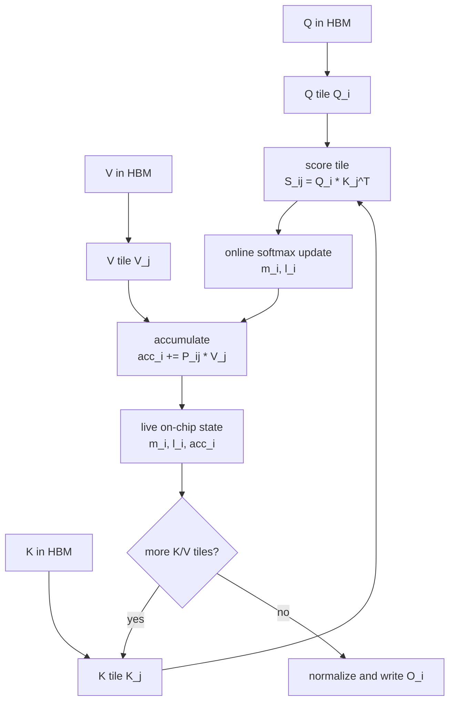
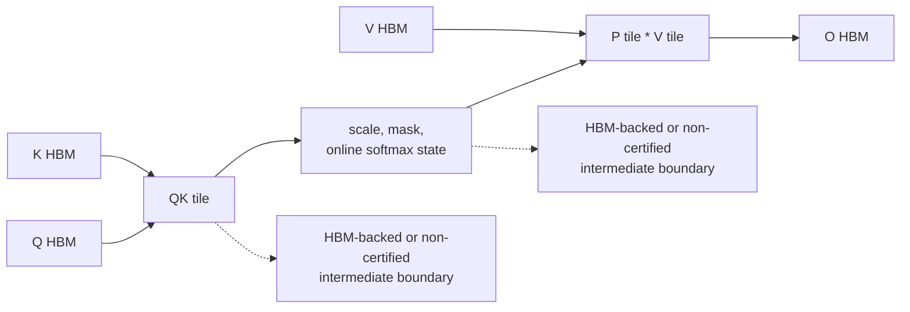
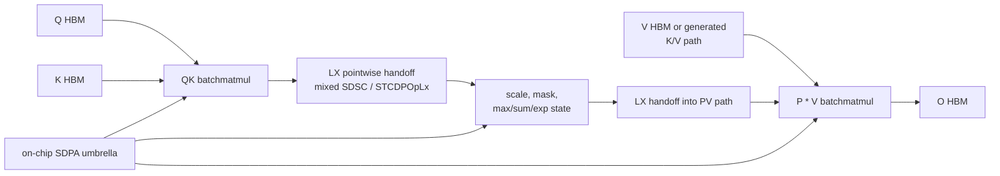
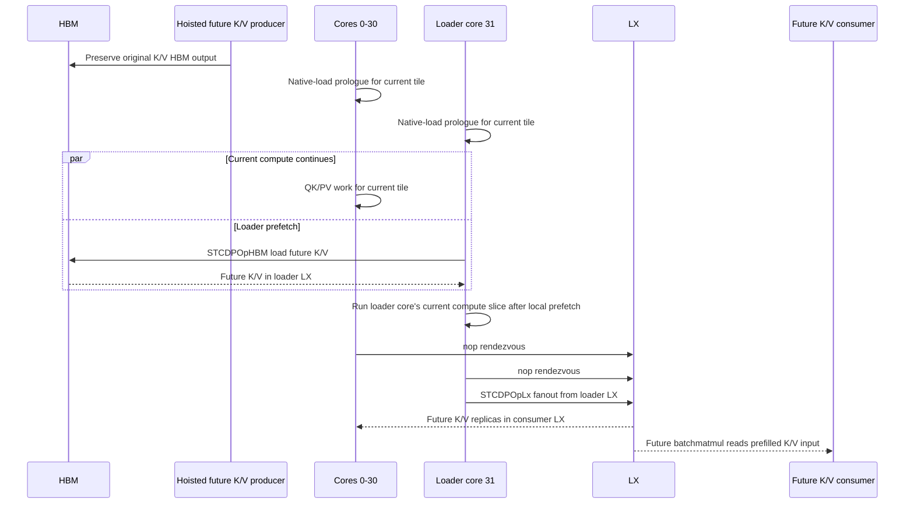
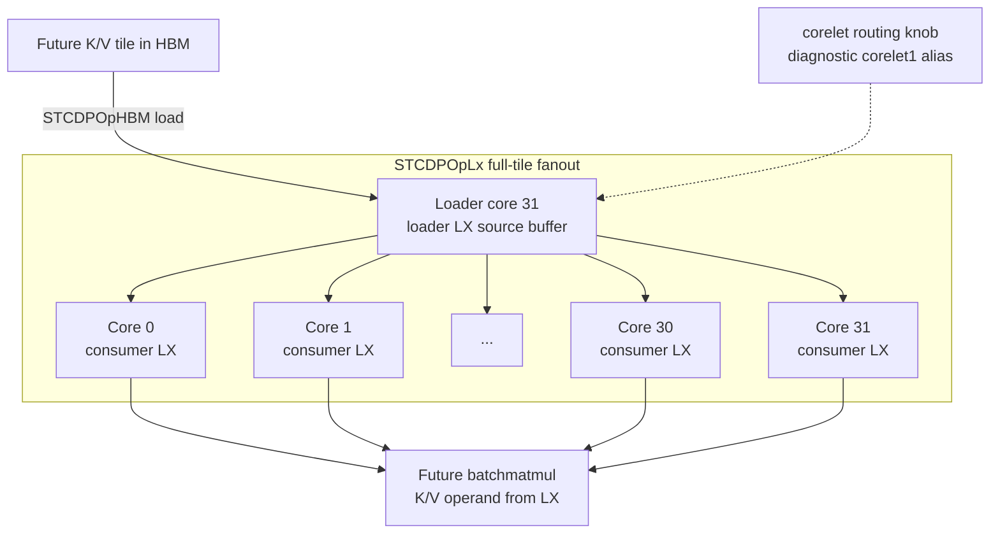
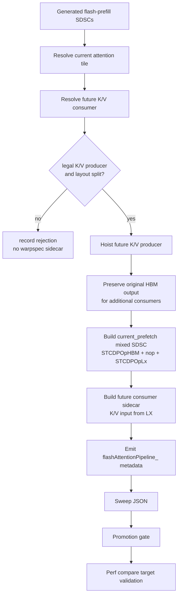
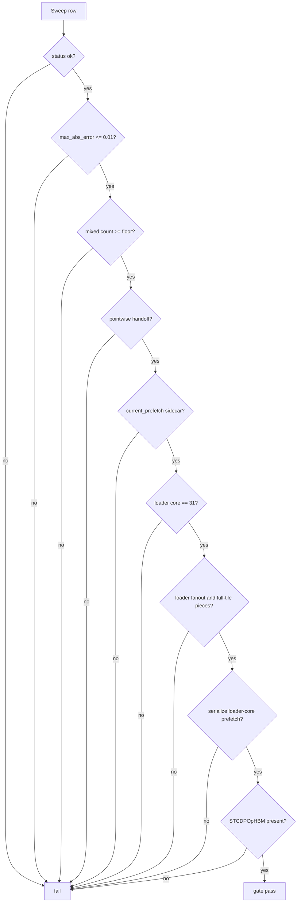
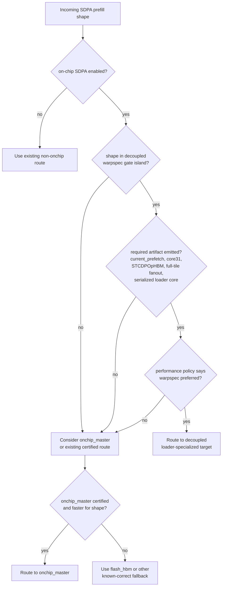

# Stage094 - FlashAttention Warpspec First-Principles Deep Dive

## Status

This note describes the current FlashAttention loader-specialized path on AIU
from first principles, then maps that model to the branch artifacts, gates, and
performance data.

The current result is a correctness-certified and performance-bounded candidate
for a selected shape island. It is not a blanket production-ready SDPA default.
The branch has:

- a reproducible `onchip_warpspec_decoupled` promotion gate;
- a default certified target variant,
  `onchip_warpspec_kv_hbm_prefetch_loader_core31_decoupled`;
- repeated eight-row performance comparisons against `flash_hbm` and
  `onchip_master`;
- diagnostic A/B aliases for fanout, safe source placement, after-sync behavior,
  and corelet routing;
- no shape-aware production routing policy yet.

The word "warpspec" is shorthand in this branch. AIU is not exposing CUDA
warps. The implemented analogue is:

```text
producer/loader role split
+ serialized loader-core K/V HBM prefetch
+ LX fanout to future attention consumers
+ gate metadata proving that exact artifact emitted
```

It should not be read as a claim that this branch contains a literal CUDA
warp-specialized kernel.

## Executive Summary

FlashAttention wins by never materializing the full score/probability matrices
in HBM. It streams K/V tiles through a live online-softmax state for a tile of Q
rows. Once score materialization is removed, repeated K/V movement is the next
large pressure point: every Q tile must see the K/V stream, and the K and V
operands must be in the right layout for the QK and PV batchmatmul consumers.

The AIU path in this branch attacks that pressure point with a loader-specialized
sidecar. A future K/V producer is hoisted. While most AIU cores continue current
attention compute, loader core 31 issues an `STCDPOpHBM` load for the future K/V
tile into LX. The sidecar then performs a barrier-like rendezvous and an
`STCDPOpLx` fanout with full-tile pieces so the future batchmatmul can read the
K/V input from prefilled LX. The correctness-critical rule is narrow:

```text
Do not overlap loader core 31's HBM prefetch with loader core 31's own current
attention compute slice.
```

Other cores may continue current compute while the loader prefetch runs. That
localized serialization is the current safety boundary and also a fixed
performance cost.

The eight-row decoupled gate currently covers:

```text
B1 H4 D64  block64 L768,L1024
B1 H8 D64  block64 L384,L512
B2 H4 D128 block64 L384,L512,L768,L1024
```

Stage234 measured the default decoupled target at `1.1518x` geomean over
`flash_hbm` across 8/8 rows, but only `0.9929x` geomean over `onchip_master`.
Stage237 showed the safe-source diagnostic target at `1.1416x` over
`flash_hbm`, `0.9948x` over `onchip_master`, and `0.9904x` versus the default
decoupled target. Safe-source is therefore a diagnostic lane, not a replacement
default.

## First Principles: FlashAttention

Scaled dot-product attention computes:

```text
S = Q K^T * scale + mask
P = softmax(S)
O = P V
```

For prefill, Q, K, V, and O have shape `[B, H, L, D]`, while S and P have shape
`[B, H, L, L]`. The score and probability tensors are quadratic in sequence
length. The inputs and output are linear in sequence length.

For one batch/head at `L=1024, D=64`:

```text
Q + K + V + O elements = 4 * 1024 * 64 = 262144
one score matrix       = 1024 * 1024     = 1048576
```

The naive implementation pays for large HBM intermediates:

```text
Q, K, V -> QK -> S in HBM -> softmax -> P in HBM -> PV -> O
```

FlashAttention keeps the math exact, but changes the schedule. For one Q tile
`Q_i`, it streams K/V tiles `K_j, V_j` and maintains an online softmax state:

```text
for each Q tile i:
  m_i = -inf
  l_i = 0
  acc_i = 0

  for each K/V tile j:
    s_ij = Q_i @ K_j^T * scale + mask_ij
    m_new = max(m_i, rowmax(s_ij))
    alpha = exp(m_i - m_new)
    p_ij = exp(s_ij - m_new)
    l_i = alpha * l_i + rowsum(p_ij)
    acc_i = alpha * acc_i + p_ij @ V_j
    m_i = m_new

  O_i = acc_i / l_i
```

The state `(m_i, l_i, acc_i)` summarizes all K/V tiles already seen for those Q
rows. That lets each score tile die on chip after it updates the state and the
value accumulator.

### Figure 1: Baseline FlashAttention Dataflow



The key memory property is:

```text
avoid: S and P HBM materialization, O(L^2) elements each
still pay: K/V streaming for every Q tile unless K/V movement is hidden or reused
```

### Why K/V Movement Becomes The Next Bottleneck

Let `Bq` be the number of Q rows per tile and assume the K and V stream is read
from HBM for each Q tile. Ignoring layout padding, one batch/head sees:

```text
Q/O linear traffic        ~= 2 * L * D * bytes_per_element
K/V stream per Q tile     ~= 2 * L * D * bytes_per_element
number of Q tiles         ~= L / Bq
K/V streaming traffic     ~= 2 * L * D * bytes_per_element * (L / Bq)
```

For `L=1024, D=64, Bq=64`, the K/V stream is revisited for 16 Q tiles. The
algorithm no longer spills `S` or `P`, but the K/V stream and its layout
conversion still sit on the critical path.

```text
+-------------------------------+---------------------------+
| Thing                         | Scaling per batch/head    |
+-------------------------------+---------------------------+
| Q read + O write              | O(L * D)                  |
| S materialization avoided     | O(L * L)                  |
| P materialization avoided     | O(L * L)                  |
| K/V streaming across Q tiles  | O((L / Bq) * L * D)       |
| K/V restickify/fanout costs   | shape and layout dependent|
+-------------------------------+---------------------------+
```

The on-chip work is therefore not just "make FlashAttention work". It is "make
the remaining K/V stream land where the future batchmatmul needs it, with less
HBM pressure and without corrupting current compute".

## AIU Execution Model Inferred From This Branch

This section intentionally uses the branch vocabulary rather than assuming a
public hardware contract beyond what the checked-in code and docs expose.

```text
+----------------------+--------------------------------------------------+
| Term                 | Meaning in this branch                          |
+----------------------+--------------------------------------------------+
| SDSC                 | Compiler scheduling unit for generated device op |
| Mixed SDSC           | SDSC carrying dataops plus DL compute schedule   |
| DL compute op        | The attention math side of the mixed SDSC        |
| STCDPOpHBM           | HBM <-> LX data movement / DMA-like prefetch     |
| STCDPOpLx            | LX <-> LX data movement/fanout dataop            |
| nop                  | Explicit schedule/rendezvous dataop row          |
| LX                   | Per-core on-chip scratch/local storage           |
| PieceInfo            | Per-core placement and tile-slice metadata       |
| Corelet              | Lower-level routing/scheduling lane exposed by   |
|                      | diagnostic knobs; not forced by default          |
| Loader core 31       | Certified single core that loads future K/V      |
| Full-tile pieces     | Loader/fanout mode that uses whole-tile pieces   |
| Pointwise handoff    | On-chip LX handoff for flash pointwise/reduction |
+----------------------+--------------------------------------------------+
```

Two points matter for the design:

1. AIU execution is graph/compiler scheduled. The branch emits SDSCs, mixed
   SDSCs, dataops, per-core schedules, and `flashAttentionPipeline_` metadata.
2. The loader path is a compiler-generated role assignment. Core 31 is selected
   as a loader for the future K/V prefetch sidecar; it is not removed from the
   computation globally.

The current certified decoupled path does not force the `corelet1` knob. That
knob exists as the diagnostic alias
`onchip_warpspec_kv_hbm_prefetch_loader_core31_decoupled_corelet1`.

## Scratch And On-Chip Layout

The K/V path has three relevant storage identities:

```text
+-------------------------+------------------------------------------------+
| Storage identity        | Purpose                                        |
+-------------------------+------------------------------------------------+
| Original HBM producer   | Preserved K/V value for consumers that still   |
| output                  | need the HBM-backed contract                   |
| Loader LX source buffer | Temporary copy loaded by loader core 31 with   |
|                         | STCDPOpHBM                                     |
| Future consumer LX      | Per-consumer-core input slot populated by      |
| input region            | STCDPOpLx fanout before future batchmatmul     |
+-------------------------+------------------------------------------------+
```

The sidecar metadata tracks both original and redirected locations:

```text
kv_repack_hbm_prefetch_hoist_source_hbm_addr
kv_repack_hbm_prefetch_hoist_consumer_lx_base
kv_repack_hbm_prefetch_hoist_original_consumer_lx_base
kv_repack_hbm_prefetch_hoist_prefetch_loader_lx_base
kv_repack_hbm_prefetch_hoist_prefetch_loader_lx_base_request
```

The certified default uses loader fanout and full-tile fanout pieces:

```text
SPYRE_FLASH_ATTENTION_KV_REPACK_HBM_PREFETCH_LOADER_FANOUT=1
SPYRE_FLASH_ATTENTION_KV_REPACK_HBM_PREFETCH_LOADER_FANOUT_FULL_TILE_PIECES=1
```

"Full-tile pieces" means the loader/fanout data movement is described at the
whole K/V tile granularity for participating cores instead of relying on a more
fragmented source-slice fanout shape. This is part of the current gate
invariant because it is the shape that has been device-certified.

## Three Dataflow Levels

### Level 1: `flash_hbm`

`flash_hbm` is the FlashAttention HBM baseline in
`tools/onchip_sdpa_sweep.py`. It enables the mixed flash pipeline, but it does
not require the on-chip SDPA master path, pointwise handoffs, K/V prefetch, or
warpspec metadata.

### Figure 2: `flash_hbm` Baseline Dataflow



This path is a good baseline because it preserves the FlashAttention algorithm
without asserting the new on-chip K/V prefetch behavior.

### Level 2: `onchip_master`

`onchip_master` enables the main on-chip SDPA umbrella:

```text
SPYRE_FLASH_ATTENTION_ONCHIP_SDPA=1
SPYRE_ONCHIP_HANDOFF_MIN_BYTES=0
```

It realizes the stronger pointwise/on-chip handoff path. It is already a strong
baseline, which is why the decoupled warpspec target is currently only
break-even against it.

### Figure 3: `onchip_master` Dataflow



The promotion gate still checks pointwise handoff for the warpspec target
because the loader-prefetch path is only valuable when it composes with the
rest of the on-chip flash graph.

### Level 3: Decoupled Loader-Specialized Path

The decoupled path starts from `onchip_master`, disables the layout-transform
pair, and enables the K/V HBM prefetch sidecar:

```text
SPYRE_FLASH_ATTENTION_ONCHIP_SDPA=1
SPYRE_FLASH_ATTENTION_ONCHIP_SDPA_LAYOUT_XFORM=0
SPYRE_FLASH_ATTENTION_MIXED_PIPELINE_LAYOUT_XFORM_PAIR_TILE=-1
SPYRE_FLASH_ATTENTION_KV_REPACK_HBM_PREFETCH_HOIST_TILE=-2
SPYRE_FLASH_ATTENTION_KV_REPACK_HBM_PREFETCH_LOADER_CORE=31
SPYRE_FLASH_ATTENTION_KV_REPACK_HBM_PREFETCH_LOADER_FANOUT=1
SPYRE_FLASH_ATTENTION_KV_REPACK_HBM_PREFETCH_LOADER_FANOUT_FULL_TILE_PIECES=1
SPYRE_FLASH_ATTENTION_KV_REPACK_HBM_PREFETCH_SERIALIZE_LOADER_CORE=1
SPYRE_FLASH_ATTENTION_KV_REPACK_HBM_PREFETCH_TAIL_CURRENT=0
```

The selected sidecar is named like:

```text
mixed_flash_kv_repack_hbm_prefetch_hoist_<tile>_current_prefetch
```

Its role metadata is:

```text
kv_repack_hbm_prefetch_hoist_role == "current_prefetch"
```

## How The Warp-Specialization Analogue Works

CUDA warp specialization usually means producer warps issue asynchronous global
memory copies into shared memory while consumer warps execute matrix math. The
AIU analogue is not implemented with CUDA warps or CUDA barriers. The mapping is
conceptual and compiler scheduled:

```text
+---------------------+--------------------------------------+------------------+
| GPU idea            | AIU branch analogue                  | Difference       |
+---------------------+--------------------------------------+------------------+
| Producer warp       | Loader core 31                       | Core role, not   |
|                     |                                      | CUDA warp        |
| Consumer warps      | Cores 0-30 current attention compute | Core 31 still has|
|                     |                                      | a serialized     |
|                     |                                      | compute slice    |
| Shared memory       | LX buffers                           | Compiler PieceInfo|
| Async copy          | STCDPOpHBM in mixed SDSC             | SDSC schedule,   |
|                     |                                      | not CUDA API     |
| Warp barrier        | nop rows and schedule dependencies   | Not CUDA barrier |
| Shared-memory stage | Hoisted future K/V + future LX input | Graph selected   |
| Multicast           | STCDPOpLx fanout                     | Tunable transport|
+---------------------+--------------------------------------+------------------+
```

### Figure 4: Decoupled Warpspec Pipeline Timeline



The same schedule as an ASCII timeline:

```text
time ->

cores 0-30:
  native-load/prologue | current attention compute | nop/barrier | STCDPOpLx fanout | future compute

core 31:
  native-load/prologue | STCDPOpHBM future K/V load | own current compute | nop/barrier | STCDPOpLx fanout | future compute

invariant:
  core 31 does not run its own current compute slice in the same overlap window
  as its STCDPOpHBM future K/V load.
```

The overlap is therefore partial and explicit. It hides the future K/V HBM load
behind non-loader cores' current compute, but it does not pretend the loader
core's local work is free.

### Figure 5: AIU Loader/Corelet Fanout Topology



The topology is a single-loader pattern, not an all-core direct HBM fill. The
loader reads a whole future K/V tile into its LX source buffer, then fanout
replicates that tile into the future consumer LX slots.

## What The Compiler Builds

The implementation path has several relevant layers:

```text
+-------------------------------------------+------------------------------+
| File                                      | Role                         |
+-------------------------------------------+------------------------------+
| torch_spyre/_inductor/config.py           | Env knobs, default-off gates |
| torch_spyre/_inductor/codegen/bundle.py   | Plumbs knobs into builders   |
| torch_spyre/_inductor/onchip_realize.py   | Builds sidecars and metadata |
| tools/onchip_sdpa_sweep.py                | Names repeatable variants    |
| tools/onchip_sdpa_promotion_gate.py       | Certifies selected rows      |
| tools/onchip_sdpa_perf_compare.py         | Compares gated target to     |
|                                           | baselines                    |
+-------------------------------------------+------------------------------+
```

The builder entry point is:

```text
build_flash_attention_kv_repack_hbm_prefetch_hoist_tile_artifacts(...)
```

It performs the following logical steps:

1. Resolve a current attention consumer and a future K/V consumer.
2. Find the future K/V producer feeding that consumer.
3. Hoist the future K/V producer before the current tile.
4. Preserve the original HBM-backed K/V output for any additional consumers.
5. Build the current-prefetch mixed SDSC with `STCDPOpHBM`, `nop`, and
   `STCDPOpLx` dataops.
6. Rewrite the selected future consumer input to read the prefilled LX region.
7. Emit `flashAttentionPipeline_` metadata so gates can verify artifact
   selection.

### Figure 6: Compiler Artifact Flow



The branch's metadata checks are intentionally strict because many nearby
probes can run and be value-correct without proving the actual loader-specialized
artifact selected.

## Promotion Gate Contract

`tools/onchip_sdpa_promotion_gate.py` defines the gates:

```text
onchip_layout_xform
onchip_warpspec
onchip_warpspec_decoupled
```

The decoupled gate's default target is:

```text
onchip_warpspec_kv_hbm_prefetch_loader_core31_decoupled
```

The gate validates more than row success:

```text
+--------------------------------------------+--------------------------------+
| Check                                      | Purpose                        |
+--------------------------------------------+--------------------------------+
| status == ok                               | Device row ran                 |
| max_abs_error <= 0.01                      | Value correctness bound        |
| block size / causal / shape match          | Correct test row               |
| mixed SDSC count floor                     | Expected on-chip artifacts     |
| pointwise handoff present                  | On-chip flash graph selected   |
| K/V repack allowed for warpspec cases      | Gate owns this artifact class  |
| current_prefetch sidecar                   | Loader path selected           |
| loader fanout == true                      | Single-loader fanout path      |
| loader core == 31                          | Certified loader assignment    |
| full-tile fanout pieces == true            | Certified fanout shape         |
| serialize loader-core prefetch == true     | Safety invariant               |
| opFuncsUsed contains STCDPOpHBM            | Real HBM prefetch dataop       |
+--------------------------------------------+--------------------------------+
```

### Figure 7: Gate Decision Tree



## Exact Branch Changes And Aliases

Recent branch commits relevant to this design are:

```text
dc8d742 Add decoupled warpspec tuning aliases
b752aa0 Record decoupled warpspec perf envelope
7ebfc9f Extend warpspec decoupled gate to H8 mid rows
0fd88e9 Document flash attention warpspec design
210354f Add warpspec fanout unicast tuning alias
b89dccd Document flash attention warp specialization design
8f29cb6 Record decoupled warp spec gate results
d1916a0 Add flash attention warp specialization probes
```

### Variant Aliases

`tools/onchip_sdpa_sweep.py` now contains the following production-facing and
diagnostic aliases:

```text
+---------------------------------------------------------------+----------------+
| Alias                                                         | Role           |
+---------------------------------------------------------------+----------------+
| onchip_warpspec_kv_hbm_prefetch_loader_core31                 | Layout-coupled |
|                                                               | warpspec gate  |
| onchip_warpspec_kv_hbm_prefetch_loader_core31_decoupled       | Default        |
|                                                               | decoupled gate |
| onchip_warpspec_kv_hbm_prefetch_loader_core31_decoupled_unicast| Fanout A/B     |
| onchip_warpspec_kv_hbm_prefetch_loader_core31_decoupled_safesrc| Loader LX base |
|                                                               | A/B            |
| onchip_warpspec_kv_hbm_prefetch_loader_core31_decoupled_no_after_sync | Sync A/B |
| onchip_warpspec_kv_hbm_prefetch_loader_core31_decoupled_corelet1 | Corelet A/B  |
+---------------------------------------------------------------+----------------+
```

The default decoupled alias sets:

```text
SPYRE_FLASH_ATTENTION_ONCHIP_SDPA=1
SPYRE_FLASH_ATTENTION_ONCHIP_SDPA_LAYOUT_XFORM=0
SPYRE_FLASH_ATTENTION_MIXED_PIPELINE_LAYOUT_XFORM_PAIR_TILE=-1
SPYRE_FLASH_ATTENTION_KV_REPACK_BROADCAST_PLAN_ARTIFACT=0
SPYRE_FLASH_ATTENTION_KV_REPACK_BROADCAST_PAIR_TILE=-1
SPYRE_FLASH_ATTENTION_KV_REPACK_HBM_PREFETCH_HOIST_TILE=-2
SPYRE_FLASH_ATTENTION_KV_REPACK_HBM_PREFETCH_LOADER_FANOUT=1
SPYRE_FLASH_ATTENTION_KV_REPACK_HBM_PREFETCH_LOADER_CORE=31
SPYRE_FLASH_ATTENTION_KV_REPACK_HBM_PREFETCH_LOADER_FANOUT_FULL_TILE_PIECES=1
SPYRE_FLASH_ATTENTION_KV_REPACK_HBM_PREFETCH_SERIALIZE_LOADER_CORE=1
SPYRE_FLASH_ATTENTION_KV_REPACK_HBM_PREFETCH_TAIL_CURRENT=0
SPYRE_FLASH_ATTENTION_KV_REPACK_BROADCAST_COPYBACK_TILE=-1
SPYRE_ONCHIP_HANDOFF_MIN_BYTES=0
```

The A/B aliases differ by one additional setting:

```text
+----------------+---------------------------------------------------------+
| Alias suffix   | Extra setting                                           |
+----------------+---------------------------------------------------------+
| unicast        | SPYRE_FLASH_ATTENTION_KV_REPACK_HBM_PREFETCH_FANOUT_USE_UNICAST=1 |
| safesrc        | SPYRE_FLASH_ATTENTION_KV_REPACK_HBM_PREFETCH_LOADER_LX_BASE=-2    |
| no_after_sync  | SPYRE_FLASH_ATTENTION_KV_REPACK_HBM_PREFETCH_OVERLAP_AFTER_SYNC=0 |
| corelet1       | SPYRE_FLASH_ATTENTION_KV_REPACK_HBM_PREFETCH_CORELET1=1           |
+----------------+---------------------------------------------------------+
```

### Gate Coverage

`tools/onchip_sdpa_promotion_gate.py` defines the decoupled gate as three cases
and eight rows:

```text
+-------------------------------------------+--------------------------+
| Gate case                                 | Rows                     |
+-------------------------------------------+--------------------------+
| b1h4d64_block64_long_decoupled_loader_core31 | L768,L1024           |
| b1h8d64_block64_mid_decoupled_loader_core31  | L384,L512            |
| b2h4d128_block64_long_decoupled_loader_core31| L384,L512,L768,L1024 |
+-------------------------------------------+--------------------------+
```

The gate prints:

```text
PROMOTION_GATE_PASSED gate=onchip_warpspec_decoupled cases=3 rows=8
```

The broader layout-coupled `onchip_warpspec` gate still exists with 8 cases and
25 rows, but the current default certified target for the decoupled work is the
layout-free loader-core path.

### Low-Level Config

`torch_spyre/_inductor/config.py` exposes the low-level controls. The main
production-shaped umbrella is:

```text
SPYRE_FLASH_ATTENTION_ONCHIP_SDPA=1
```

That umbrella does not automatically enable the K/V prefetch or warpspec route.
The K/V prefetch controls remain explicit, default-off knobs such as:

```text
SPYRE_FLASH_ATTENTION_KV_REPACK_HBM_PREFETCH_HOIST_TILE
SPYRE_FLASH_ATTENTION_KV_REPACK_HBM_PREFETCH_LOADER_CORE
SPYRE_FLASH_ATTENTION_KV_REPACK_HBM_PREFETCH_LOADER_LX_BASE
SPYRE_FLASH_ATTENTION_KV_REPACK_HBM_PREFETCH_LOADER_FANOUT
SPYRE_FLASH_ATTENTION_KV_REPACK_HBM_PREFETCH_LOADER_FANOUT_FULL_TILE_PIECES
SPYRE_FLASH_ATTENTION_KV_REPACK_HBM_PREFETCH_FANOUT_USE_UNICAST
SPYRE_FLASH_ATTENTION_KV_REPACK_HBM_PREFETCH_OVERLAP_AFTER_SYNC
SPYRE_FLASH_ATTENTION_KV_REPACK_HBM_PREFETCH_SERIALIZE_LOADER_CORE
SPYRE_FLASH_ATTENTION_KV_REPACK_HBM_PREFETCH_CORELET1
```

That separation is important. It prevents a user from turning on the broad
on-chip SDPA umbrella and silently opting into this still-shape-limited
loader-prefetch schedule.

## Performance State

### Stage234: Default Decoupled Target

Stage234 ran:

```text
tools/onchip_sdpa_perf_compare.py
  --gate onchip_warpspec_decoupled
  --cases all
  --baseline-variants flash_hbm,onchip_master
  --warmup 2
  --iters 7
  --seed 42865
```

Summary:

```text
PERF_COMPARE_PASSED gate=onchip_warpspec_decoupled cases=3 comparisons=16
PERF_SUMMARY baseline=flash_hbm ok_pairs=8/8 geomean_speedup=1.1518x
PERF_SUMMARY baseline=onchip_master ok_pairs=8/8 geomean_speedup=0.9929x
```

Per-row medians:

```text
+---------------------+------+-----------+---------------+--------------+----------+----------+
| Shape               | L    | flash_hbm | onchip_master | decoupled ms | vs flash | vs master|
+---------------------+------+-----------+---------------+--------------+----------+----------+
| B1 H4 D64 block64   | 768  | 1.738489  | 1.626099      | 1.571266     | 1.1064x  | 1.0349x  |
| B1 H4 D64 block64   | 1024 | 2.550084  | 2.194906      | 2.173174     | 1.1734x  | 1.0100x  |
| B1 H8 D64 block64   | 384  | 1.049221  | 0.954747      | 0.968222     | 1.0837x  | 0.9861x  |
| B1 H8 D64 block64   | 512  | 1.465706  | 1.267971      | 1.275051     | 1.1495x  | 0.9944x  |
| B2 H4 D128 block64  | 384  | 1.249995  | 1.102760      | 1.151739     | 1.0853x  | 0.9575x  |
| B2 H4 D128 block64  | 512  | 1.764253  | 1.486903      | 1.555549     | 1.1342x  | 0.9559x  |
| B2 H4 D128 block64  | 768  | 3.712762  | 3.115857      | 3.109740     | 1.1939x  | 1.0020x  |
| B2 H4 D128 block64  | 1024 | 6.250052  | 4.821906      | 4.796391     | 1.3031x  | 1.0053x  |
+---------------------+------+-----------+---------------+--------------+----------+----------+
```

Interpretation:

- The default decoupled target beats `flash_hbm` on every promoted row.
- It wins or ties `onchip_master` mostly on longer rows.
- It loses to `onchip_master` on some mid rows.
- The current value proposition is "beats HBM baseline and is close to master",
  not "replaces the strongest on-chip route everywhere".

### Stage237: Safe-Source Diagnostic

Stage237 ran the safe-source alias across the same gate island. Summary:

```text
PERF_COMPARE_PASSED gate=onchip_warpspec_decoupled cases=3 comparisons=24
PERF_SUMMARY baseline=flash_hbm ok_pairs=8/8 geomean_speedup=1.1416x
PERF_SUMMARY baseline=onchip_master ok_pairs=8/8 geomean_speedup=0.9948x
PERF_SUMMARY baseline=onchip_warpspec_kv_hbm_prefetch_loader_core31_decoupled ok_pairs=8/8 geomean_speedup=0.9904x
```

Safe-source occasionally improves a row, but it loses to the default decoupled
target in geomean. It should stay diagnostic unless a future route policy or
larger run proves a stable shape-selective win.

## Route Policy Implications

There is no implemented production routing policy in this branch. The branch
currently has certified candidates and evidence, not a final dispatcher.

A conservative policy would have to separate:

```text
correctness-certified island:
  rows where the exact loader-prefetch artifact is proven value-correct

performance-preferred island:
  subset where the loader-specialized path beats the best available on-chip
  baseline, not only flash_hbm

fallback island:
  rows where on-chip or loader-specialized paths fail, lack certification, or
  lose enough performance to prefer another route
```

### Figure 8: Shape Route Decision Tree



Today the "performance policy says warpspec preferred" node does not exist in
code. Based on Stage234, the likely initial performance-preferred subset is the
longer promoted rows:

```text
B1 H4 D64  L768,L1024
B2 H4 D128 L768,L1024
```

The mid rows remain valuable correctness coverage, but they do not yet justify
a blanket route ahead of `onchip_master`.

## Known Boundaries

### H8 Long Rows

`B1 H8 D64 block64 L768,L1024` remain excluded. Stage231 showed the exact
decoupled target failed at those rows. Stage232 showed the L768 failure across
the broader on-chip stack:

```text
+---------------------------------------------------------------+--------+
| Variant                                                       | Result |
+---------------------------------------------------------------+--------+
| flash_hbm                                                     | ok     |
| onchip_master                                                 | failed |
| onchip_hbm_kv_layout_xform                                    | failed |
| onchip_warpspec_kv_hbm_prefetch_loader_core31                 | failed |
| onchip_warpspec_kv_hbm_prefetch_loader_core31_decoupled       | failed |
| onchip_warpspec_kv_hbm_prefetch_loader_core31_decoupled_unicast| failed |
+---------------------------------------------------------------+--------+
```

That points to a broader on-chip long-H8 boundary, not a defect specific to the
decoupled loader-prefetch sidecar. Those rows should stay out of the gate until
the broader on-chip boundary is understood.

### Layout Transform Coupling

The decoupled path exists because layout-transform correctness and
loader-prefetch correctness are separable. Stages086-088 showed rows where the
layout-coupled path failed while the layout-decoupled loader path passed.
Future gates should keep these evidence streams separate:

```text
layout-transform correctness
loader-core K/V prefetch correctness
combined layout + loader schedule correctness
```

### Loader Core Serialization Cost

The current safety invariant serializes core 31's local prefetch and compute
work. That avoids the observed overlap hazard, but it costs a compute slice and
adds mixed-SDSC/fanout rows. The path becomes more attractive when longer rows
make K/V movement and HBM pressure dominate that fixed overhead.

## What This Path Proves

The branch has moved from a speculative overlap idea to a reproducible
compiler-generated artifact:

```text
Before:
  Future K/V producer writes HBM.
  Future consumer later reads HBM or a non-certified on-chip handoff.

After:
  Future K/V producer is hoisted.
  Current tile sidecar loads future K/V through loader core 31.
  Loader core's local prefetch/compute overlap is serialized.
  STCDPOpLx fans out full-tile pieces into consumer LX.
  Future consumer reads prefilled LX.
  Promotion gate proves this exact artifact emitted.
```

The path does not yet prove:

```text
all SDPA shapes are covered
all H8 long rows are fixed
layout-coupled warpspec is generally safe
warpspec should be default whenever SPYRE_FLASH_ATTENTION_ONCHIP_SDPA=1
safe-source or corelet1 should replace the default
```

## Open Questions And Next Steps

- Define a shape-aware route policy that distinguishes correctness-certified
  rows from performance-preferred rows.
- Decide whether the first production candidate should route only the longer
  rows where Stage234 beats or ties `onchip_master`.
- Investigate the broader `B1 H8 D64 L768,L1024` on-chip failure before
  expanding H8 long coverage.
- Reduce fixed mixed-SDSC and fanout overhead on mid rows.
- Explore whether core 31's serialized compute slice can be redistributed or
  avoided without reintroducing the overlap hazard.
- Keep safe-source, no-after-sync, unicast, and corelet1 as diagnostic A/B
  lanes until they show stable shape-selective wins.
- Strengthen benchmark quality with more repetitions, stable cache policy,
  fallback-forbidden runs, and distribution summaries beside every timing row.
- Keep `SPYRE_FLASH_ATTENTION_ONCHIP_SDPA=1` separate from automatic K/V
  prefetch/warpspec selection until the route policy exists.
