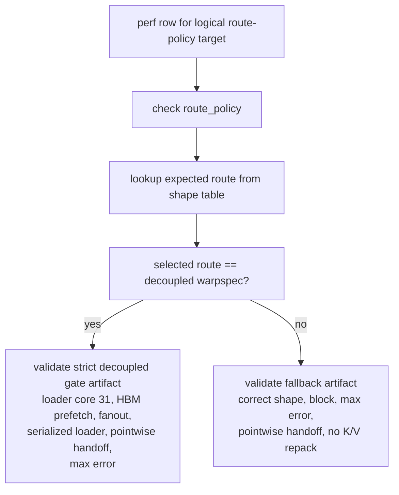

# Stage097 - Route-Policy Perf Validation

## Question

Stage096 made the Stage234 route table executable as a sweep variant:

```text
onchip_warpspec_kv_hbm_prefetch_loader_core31_decoupled_route_policy
```

The missing proof was not just that this variant could run one selected row. The
benchmark comparator also needed to validate a mixed logical target:

```text
same target variant name
  -> strict decoupled warpspec artifact on selected shapes
  -> ordinary onchip_master artifact on fallback shapes
```

Without route-aware validation, fallback rows are falsely rejected because they
intentionally do not emit the loader-core K/V HBM prefetch artifact.

## Change

`tools/onchip_sdpa_perf_compare.py` now records the concrete route selected by a
logical target row:

```text
target_route_policy
target_route_selected_variant
```

For the route-policy target, validation becomes per-row:



This preserves the original strict promotion-gate contract for rows where the
policy selects:

```text
onchip_warpspec_kv_hbm_prefetch_loader_core31_decoupled
```

and gives fallback rows the correct contract:

```text
onchip_master
```

## AIU Validation Run

Ran on pod `adnan-cdx-spyre-dev-pf`, staging tree:

```text
/home/adnan-cdx/dt-inductor-mixed/torch-spyre-stage039-two-sdsc-ifn
```

Command:

```text
tools/onchip_sdpa_perf_compare.py \
  --gate onchip_warpspec_decoupled \
  --cases all \
  --baseline-variants onchip_master \
  --target-variant onchip_warpspec_kv_hbm_prefetch_loader_core31_decoupled_route_policy \
  --warmup 1 \
  --iters 2 \
  --seed 42865 \
  --output-json /tmp/sdpa-stage241-route-policy-perf.json \
  --case-output-dir /tmp/sdpa-stage241-route-policy-perf-cases \
  --timeout-s 600
```

Result:

```text
PERF_COMPARE_PASSED gate=onchip_warpspec_decoupled cases=3 comparisons=8
PERF_SUMMARY baseline=onchip_master ok_pairs=8/8 geomean_speedup=1.0023x
```

Rows:

```text
+---------------------+------+--------------------+-------------+-------------+---------+
| Shape               | L    | Route              | Master ms   | Policy ms   | Speedup |
+---------------------+------+--------------------+-------------+-------------+---------+
| B1 H4 D64 block64   | 768  | decoupled warpspec | 1.605684    | 1.596058    | 1.0060x |
| B1 H4 D64 block64   | 1024 | decoupled warpspec | 2.220470    | 2.209524    | 1.0050x |
| B1 H8 D64 block64   | 384  | onchip_master      | 0.991684    | 0.982570    | 1.0093x |
| B1 H8 D64 block64   | 512  | onchip_master      | 1.299771    | 1.289694    | 1.0078x |
| B2 H4 D128 block64  | 384  | onchip_master      | 1.118157    | 1.139722    | 0.9811x |
| B2 H4 D128 block64  | 512  | onchip_master      | 1.496950    | 1.483636    | 1.0090x |
| B2 H4 D128 block64  | 768  | decoupled warpspec | 3.139592    | 3.128870    | 1.0034x |
| B2 H4 D128 block64  | 1024 | decoupled warpspec | 4.842496    | 4.857147    | 0.9970x |
+---------------------+------+--------------------+-------------+-------------+---------+
```

This was a short validation run, not the final performance envelope. Its main
value is that every route-policy row executed on AIU and the comparator
validated the appropriate artifact contract for both branches.

## Test Coverage

Local:

```text
python3 tests/_inductor/test_onchip_sdpa_perf_compare_logic.py
python3 tests/_inductor/test_onchip_sdpa_sweep_logic.py
python3 tests/_inductor/test_onchip_sdpa_route_policy_logic.py
python3 -m py_compile tools/onchip_sdpa_perf_compare.py tools/onchip_sdpa_sweep.py \
  tools/onchip_sdpa_route_policy.py tests/_inductor/test_onchip_sdpa_perf_compare_logic.py \
  tests/_inductor/test_onchip_sdpa_sweep_logic.py \
  tests/_inductor/test_onchip_sdpa_route_policy_logic.py
git diff --check
```

Pod:

```text
/home/adnan-cdx/dt-inductor-mixed/.venv/bin/python \
  tests/_inductor/test_onchip_sdpa_perf_compare_logic.py
```

## Interpretation

The working implementation conclusion for this phase is:

```text
The AIU route-policy variant is executable across the full certified
onchip_warpspec_decoupled gate island.

It selects the decoupled loader-specialized FlashAttention analogue on the
Stage234 performance-preferred long rows, validates the strict loader-core
artifact there, and falls back to onchip_master on the other certified rows.
```

This is stronger than a raw kernel proof because it gives the future dispatcher
a shape-aware candidate with a safe fallback route. It is still narrower than a
production default because:

1. The route table is still embedded in the sweep harness.
2. The B2/H4/D128 long-row wins are small and should be repeated with stronger
   benchmark settings before becoming a default runtime policy.
3. The current certified island is non-causal block64 prefill only.
4. H8 long rows remain excluded due to the broader on-chip failure noted in the
   earlier gate work.

The next production-facing step is to repeat the route-policy benchmark with the
stronger Stage234 settings, then move the stable table out of the sweep harness
and into the real compile-time/runtime selection path.
