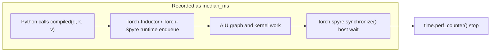
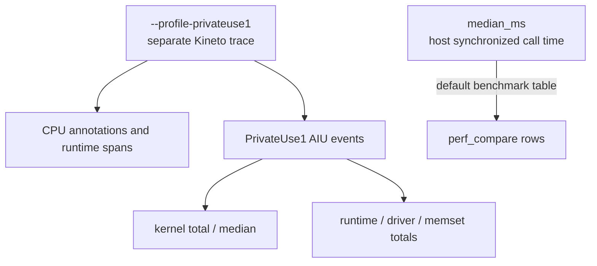
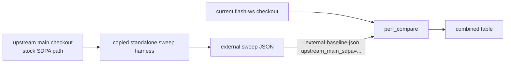

# Stage098 - Timing Scope and Upstream Baselines

## Question

The Stage097 route-policy table showed only small gains over `onchip_master`,
and some rows were slightly slower. The key measurement question is whether
those numbers are AIU kernel times or end-to-end wall times around the compiled
call.

They are wall times.

The sweep harness has always measured:

```text
start = time.perf_counter()
compiled(q_dev, k_dev, v_dev)
torch.spyre.synchronize()
elapsed = time.perf_counter() - start
```

So `median_ms` is a synchronized host-side call duration. It is not an AIU
kernel-duration counter.

That distinction matters because the current route-policy wins are tiny. If a
kernel-side schedule change saves only a small slice of device time, the
host-visible `median_ms` can be dominated by Python dispatch, runtime enqueue,
launch latency, synchronization wait, and measurement noise.

## Measurement Model



Rows now carry explicit timing metadata:

```text
timing_method = host_perf_counter_synchronized_call
timing_scope = compiled_call_plus_torch_spyre_synchronize
timing_clock = time.perf_counter
timing_synchronization = torch.spyre.synchronize
timing_primary_stat = median_ms
device_event_timing = not_collected
```

The row metadata also spells out the contract:

```text
includes:
  python_compiled_callable_dispatch
  runtime_enqueue_or_launch_overhead
  compiled_graph_device_work
  host_wait_for_torch_spyre_synchronize

excludes:
  torch_compile_first_run_compile_in_median_ms
  cpu_reference_attention
  host_to_device_input_copies
  device_to_host_correctness_copy
```

## Kineto / PrivateUse1 Path

`torch.Event(device="spyre")` is not a usable kernel timer on the current
Spyre stack. The local hooks are still placeholder event hooks, and the pod
smoke check failed event recording with:

```text
RuntimeError: Backend doesn't support events
```

The correct near-term path is Kineto-Spyre:

```text
torch.profiler.profile(
    activities=[ProfilerActivity.CPU, ProfilerActivity.PrivateUse1],
)
```

The local profiling guide already describes this as requiring a matching
`kineto-spyre` wheel:

```text
docs/source/user_guide/profiling/pytorch_profiler.md
https://github.com/IBM/kineto-spyre/releases
```

The sweep harness now has an optional profiling mode:

```text
tools/onchip_sdpa_sweep.py ... --profile-privateuse1 --profile-iters 2
```

This mode runs after the normal wall-time samples, so it does not change
`median_ms`. It exports a Chrome trace and summarizes the PrivateUse1
categories when the runtime exposes them:

```text
kernel
privateuse1_runtime
privateuse1_driver
gpu_memset
```

The output fields are separate from the wall timer:

```text
privateuse1_profile_status
privateuse1_profile_trace
privateuse1_profile_iters
privateuse1_kernel_total_ms
privateuse1_kernel_median_ms
privateuse1_<category>_event_count
privateuse1_<category>_total_us
privateuse1_<category>_median_us
privateuse1_<category>_min_us
privateuse1_<category>_max_us
privateuse1_<category>_p90_us
```

On `adnan-cdx-spyre-dev-pf`, the profiler is Kineto-enabled but did not expose
Spyre `PrivateUse1` events for the smoke run, so the harness reported:

```text
privateuse1_profile_status = no_privateuse1_events
```

On a Kineto-enabled Spyre pod with the matching wheel/runtime, the same trace
path can emit `kernel`, `privateuse1_runtime`, `privateuse1_driver`, and
`gpu_memset` events. That gives us the split we need:



## Upstream-Main Baseline

The comparator now accepts external sweep JSON as a baseline:

```text
--baseline-variants upstream_main_sdpa,onchip_master
--external-baseline-json upstream_main_sdpa=/tmp/sdpa-upstream-main-warpspec-decoupled.json
```

External baseline rows are relabeled to the requested variant and annotated:

```text
external_baseline = true
external_baseline_source_json = ...
external_baseline_source_variant = ...
```

The target still runs from the current branch. External rows must carry the
same timing method and scope as the current sweep rows, plus `block_size` and
`is_causal`, before they are eligible for comparison. They are filtered by exact
shape, block size, and causal flag, and duplicate rows for the same relabeled
variant/length are rejected rather than silently chosen by JSON order.



The correct label is `upstream_main_sdpa`, not `flash_hbm`. The current upstream
main checkout does not contain the on-chip FlashAttention variants or the
route-policy environment surface, so calling it `flash_hbm` would conflate two
different implementations.

## Current Combined Table

The table below keeps the upstream-main column in the comparison shape, but the
numbers are not filled yet because the clean upstream-main source could not be
built against the current cdx lower stack.

```text
+---------------------+------+--------------------+-------------+-------------+---------+--------------------+
| Shape               | L    | Route              | Master ms   | Policy ms   | Speedup | upstream_main_sdpa |
+---------------------+------+--------------------+-------------+-------------+---------+--------------------+
| B1 H4 D64 block64   | 768  | decoupled warpspec | 1.605684    | 1.596058    | 1.0060x | pending            |
| B1 H4 D64 block64   | 1024 | decoupled warpspec | 2.220470    | 2.209524    | 1.0050x | pending            |
| B1 H8 D64 block64   | 384  | onchip_master      | 0.991684    | 0.982570    | 1.0093x | pending            |
| B1 H8 D64 block64   | 512  | onchip_master      | 1.299771    | 1.289694    | 1.0078x | pending            |
| B2 H4 D128 block64  | 384  | onchip_master      | 1.118157    | 1.139722    | 0.9811x | pending            |
| B2 H4 D128 block64  | 512  | onchip_master      | 1.496950    | 1.483636    | 1.0090x | pending            |
| B2 H4 D128 block64  | 768  | decoupled warpspec | 3.139592    | 3.128870    | 1.0034x | pending            |
| B2 H4 D128 block64  | 1024 | decoupled warpspec | 4.842496    | 4.857147    | 0.9970x | pending            |
+---------------------+------+--------------------+-------------+-------------+---------+--------------------+
```

The blocked upstream staging was:

```text
/home/adnan-cdx/dt-inductor-mixed/torch-spyre-upstream-main-9d31e2d-stage242
```

The first failure was expected for an unbuilt clean archive:

```text
ModuleNotFoundError: No module named 'torch_spyre.codegen_ops'
```

After attempting `setup.py build_ext --inplace`, the build reached the C++
extension and failed because upstream main at `9d31e2d` does not match the cdx
runtime headers:

```text
RuntimeEntry::getDefaultStream(c10::DeviceIndex&) no match; candidate expects 0 args
RuntimeEntry::createStream(c10::DeviceIndex, RuntimeStreamPriority) no match; candidate expects 1 arg
sendnn::GraphLoader(GlobalRuntime::get()) no matching constructor
```

So the upstream-main rows are not missing because the comparator cannot ingest
them. They are missing because this cdx pod does not currently provide a
compatible lower stack for a clean upstream-main build.

## Command Recipe Once Upstream Main Builds

Run the stock SDPA path from a compatible clean upstream-main checkout with the
standalone sweep harness copied in as `tools/upstream_sdpa_sweep.py`:

```bash
PY=/home/adnan-cdx/dt-inductor-mixed/.venv/bin/python
UP=/home/adnan-cdx/dt-inductor-mixed/torch-spyre-upstream-main-compatible
COMMON="--variants vanilla --block-size 64 --warmup 1 --iters 2 --timeout-s 600 --seed 42865 --atol 0.1 --rtol 0.1"

cd "$UP"
$PY tools/upstream_sdpa_sweep.py $COMMON \
  --batch 1 --heads 4 --dim 64 --lengths 768,1024 \
  --cache-prefix /tmp/sdpa-up-main-b1h4d64 \
  --output-json /tmp/sdpa-up-main-b1h4d64.json

$PY tools/upstream_sdpa_sweep.py $COMMON \
  --batch 1 --heads 8 --dim 64 --lengths 384,512 \
  --cache-prefix /tmp/sdpa-up-main-b1h8d64 \
  --output-json /tmp/sdpa-up-main-b1h8d64.json

$PY tools/upstream_sdpa_sweep.py $COMMON \
  --batch 2 --heads 4 --dim 128 --lengths 384,512,768,1024 \
  --cache-prefix /tmp/sdpa-up-main-b2h4d128 \
  --output-json /tmp/sdpa-up-main-b2h4d128.json
```

Merge the rows:

```bash
python3 - <<'PY'
import json

paths = [
    "/tmp/sdpa-up-main-b1h4d64.json",
    "/tmp/sdpa-up-main-b1h8d64.json",
    "/tmp/sdpa-up-main-b2h4d128.json",
]
rows = []
for path in paths:
    rows.extend(json.load(open(path)))
json.dump(
    rows,
    open("/tmp/sdpa-upstream-main-warpspec-decoupled.json", "w"),
    indent=2,
    sort_keys=True,
)
PY
```

Then compare from the current `flash-ws` checkout:

```bash
tools/onchip_sdpa_perf_compare.py \
  --gate onchip_warpspec_decoupled \
  --cases all \
  --baseline-variants upstream_main_sdpa,onchip_master \
  --external-baseline-json upstream_main_sdpa=/tmp/sdpa-upstream-main-warpspec-decoupled.json \
  --target-variant onchip_warpspec_kv_hbm_prefetch_loader_core31_decoupled_route_policy \
  --warmup 1 \
  --iters 2 \
  --seed 42865 \
  --output-json /tmp/sdpa-stage242-route-policy-with-upstream-main.json \
  --case-output-dir /tmp/sdpa-stage242-route-policy-with-upstream-main-cases \
  --timeout-s 600
```

## Working Conclusion

The working implementation is still real but narrower than the headline "warp
specialized FlashAttention is faster":

```text
We have a value-correct AIU route-policy variant that runs the decoupled
loader-specialized FlashAttention analogue on the certified long rows and
falls back to onchip_master elsewhere in the current gate island.
```

The performance conclusion is weaker:

```text
The current table is based on host synchronized wall time. It proves executable
correctness and route-policy safety, but it does not yet prove a meaningful
AIU kernel-time speedup.
```

The next decisive measurement is the three-way table:

```text
upstream_main_sdpa wall time
current onchip_master wall time
route-policy wall time
plus PrivateUse1 kernel/runtime trace fields where Kineto is available
```

That will tell us whether the small route-policy deltas are because the
warpspec schedule is not materially faster, or because the current wall-time
measurement is hiding kernel-side changes under launch/runtime overhead.
