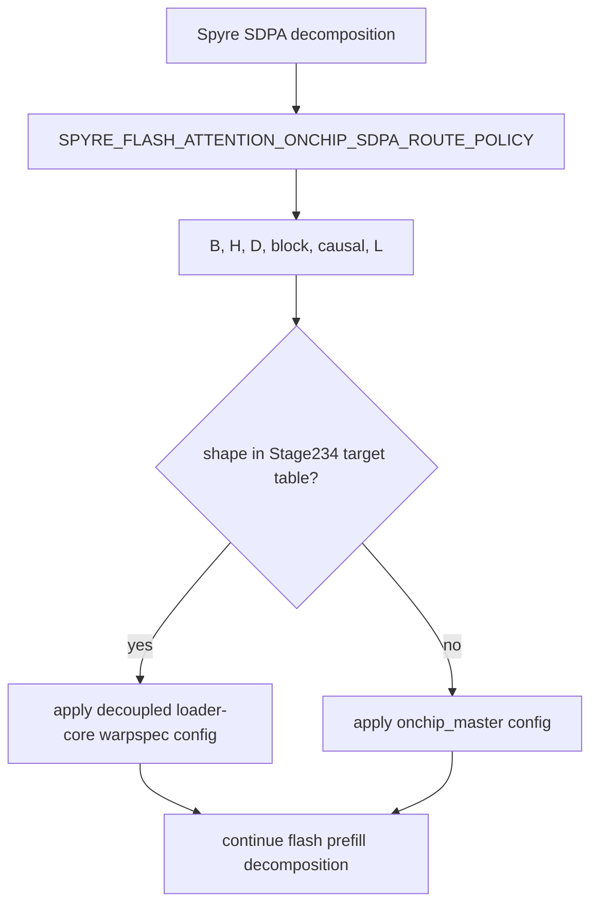

# Stage099 - Core Route-Policy Selector

## Question

Stage096 made the Stage234 route table executable, but it still lived in the
sweep harness. That proved the policy table but left an important gap:

```text
tool decides route -> tool expands low-level env -> compiler sees only knobs
```

For the warp-specialized attention path to become a real Spyre implementation,
the compiler path needs to own the shape decision.

## Change

Added a core route-policy module:

```text
torch_spyre/_inductor/flash_attention_route_policy.py
```

It defines the Stage234 policy:

```text
policy: stage234_min_speedup_1p0
target: onchip_warpspec_kv_hbm_prefetch_loader_core31_decoupled
fallback: onchip_master
```

Target rows remain:

```text
B1 H4 D64  block64 non-causal L768,L1024
B2 H4 D128 block64 non-causal L768,L1024
```

The SDPA decomposition now applies the policy from the actual SDPA shape:



The sweep route-policy variant now only sets:

```text
SPYRE_FLASH_ATTENTION_ONCHIP_SDPA_ROUTE_POLICY=stage234_min_speedup_1p0
```

It no longer pre-expands the low-level K/V prefetch and loader-core knobs in
the parent process. The selected concrete route is recorded from
`torch_spyre._inductor.config` after compilation:

```text
flash_attention_onchip_sdpa_route_selected_variant
```

That makes `route_selected_variant` evidence that the compiled decomposition
made the decision.

## Config Applied by the Target Route

When a target shape is selected, the policy enables the decoupled loader-core
path:

```text
SPYRE_FLASH_ATTENTION_ONCHIP_SDPA=1
SPYRE_FLASH_ATTENTION_ONCHIP_SDPA_LAYOUT_XFORM=0
SPYRE_FLASH_ATTENTION_MIXED_PIPELINE_LAYOUT_XFORM_PAIR_TILE=-1
SPYRE_FLASH_ATTENTION_KV_REPACK_BROADCAST_PLAN_ARTIFACT=0
SPYRE_FLASH_ATTENTION_KV_REPACK_BROADCAST_PAIR_TILE=-1
SPYRE_FLASH_ATTENTION_KV_REPACK_HBM_PREFETCH_HOIST_TILE=-2
SPYRE_FLASH_ATTENTION_KV_REPACK_HBM_PREFETCH_LOADER_FANOUT=1
SPYRE_FLASH_ATTENTION_KV_REPACK_HBM_PREFETCH_LOADER_CORE=31
SPYRE_FLASH_ATTENTION_KV_REPACK_HBM_PREFETCH_LOADER_FANOUT_FULL_TILE_PIECES=1
SPYRE_FLASH_ATTENTION_KV_REPACK_HBM_PREFETCH_SERIALIZE_LOADER_CORE=1
SPYRE_FLASH_ATTENTION_KV_REPACK_HBM_PREFETCH_TAIL_CURRENT=0
SPYRE_FLASH_ATTENTION_KV_REPACK_BROADCAST_COPYBACK_TILE=-1
SPYRE_ONCHIP_HANDOFF_MIN_BYTES=0
```

When a non-target shape is selected, the policy applies the `onchip_master`
config and leaves the K/V prefetch sidecar disabled.

## AIU Validation

Ran on `adnan-cdx-spyre-dev-pf` from:

```text
/home/adnan-cdx/dt-inductor-mixed/torch-spyre-stage039-two-sdsc-ifn
```

Command:

```text
tools/onchip_sdpa_perf_compare.py \
  --gate onchip_warpspec_decoupled \
  --cases all \
  --baseline-variants onchip_master \
  --target-variant onchip_warpspec_kv_hbm_prefetch_loader_core31_decoupled_route_policy \
  --warmup 1 \
  --iters 1 \
  --seed 42865 \
  --output-json /tmp/sdpa-stage243-core-route-policy-perf.json \
  --case-output-dir /tmp/sdpa-stage243-core-route-policy-perf-cases \
  --cache-prefix /tmp/sdpa-stage243-core-route-policy-perf \
  --timeout-s 600
```

Result:

```text
PERF_COMPARE_PASSED gate=onchip_warpspec_decoupled cases=3 comparisons=8
PERF_SUMMARY baseline=onchip_master ok_pairs=8/8 geomean_speedup=0.9892x
```

Rows:

```text
+---------------------+------+--------------------+-------------+-------------+---------+
| Shape               | L    | Route              | Master ms   | Policy ms   | Speedup |
+---------------------+------+--------------------+-------------+-------------+---------+
| B1 H4 D64 block64   | 768  | decoupled warpspec | 1.592332    | 1.604160    | 0.9926x |
| B1 H4 D64 block64   | 1024 | decoupled warpspec | 2.199834    | 2.247451    | 0.9788x |
| B1 H8 D64 block64   | 384  | onchip_master      | 0.963360    | 1.009483    | 0.9543x |
| B1 H8 D64 block64   | 512  | onchip_master      | 1.287386    | 1.328632    | 0.9690x |
| B2 H4 D128 block64  | 384  | onchip_master      | 1.145901    | 1.152322    | 0.9944x |
| B2 H4 D128 block64  | 512  | onchip_master      | 1.525117    | 1.513822    | 1.0075x |
| B2 H4 D128 block64  | 768  | decoupled warpspec | 3.207283    | 3.155740    | 1.0163x |
| B2 H4 D128 block64  | 1024 | decoupled warpspec | 4.860908    | 4.850941    | 1.0021x |
+---------------------+------+--------------------+-------------+-------------+---------+
```

This was a one-iteration correctness/dispatch validation, not a final
performance claim. Its useful proof is:

```text
The route-policy variant now gets its selected route from the core SDPA
decomposition, executes all eight certified rows on AIU, and the comparator
still validates the strict warpspec artifact on selected rows plus the fallback
contract on non-selected rows.
```

## Remaining Gap

This is still not the final production dispatcher. The current selector mutates
the compile-process config for the active SDPA shape. That is acceptable for the
current one-shape benchmark harness and moves the decision into compiler code,
but a production model graph with multiple SDPA shapes will need a per-graph or
per-SDPA policy object rather than process-global config mutation.

The next implementation step is to carry the selected route as graph/bundle
metadata so multiple attention sites can be routed independently inside one
compiled graph.
