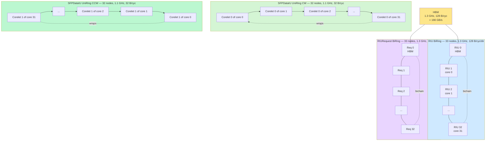
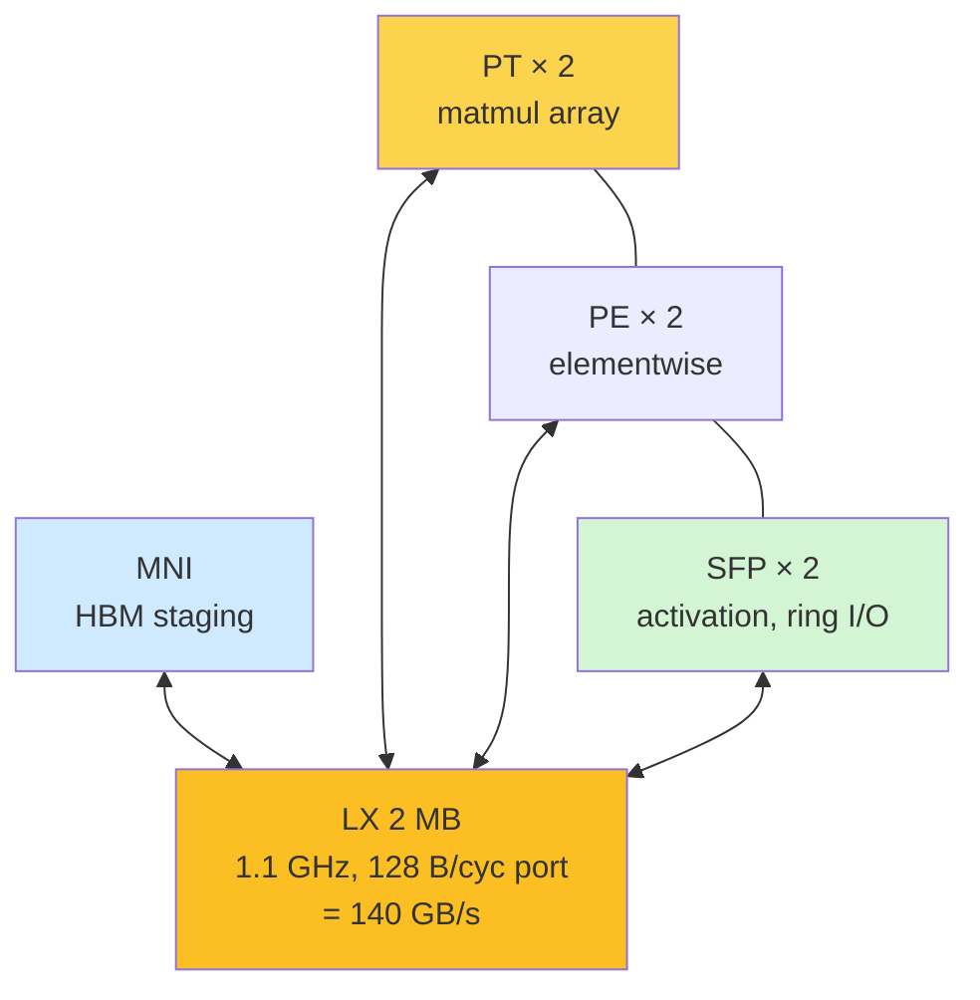
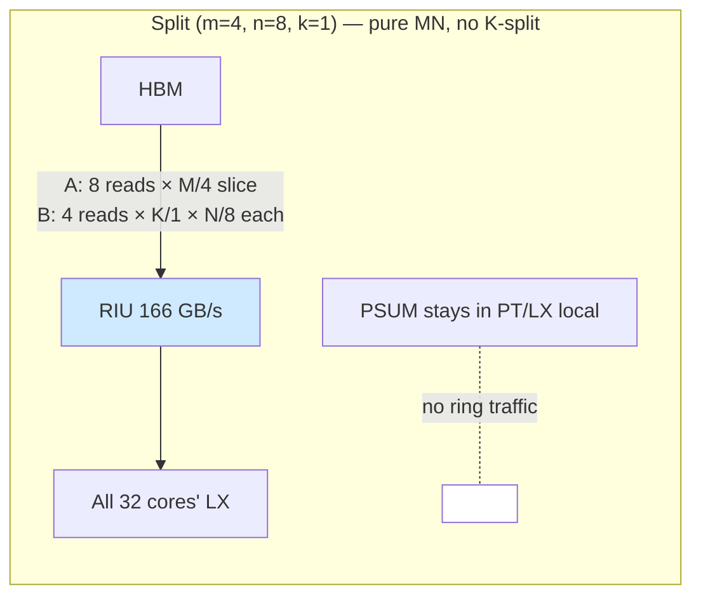
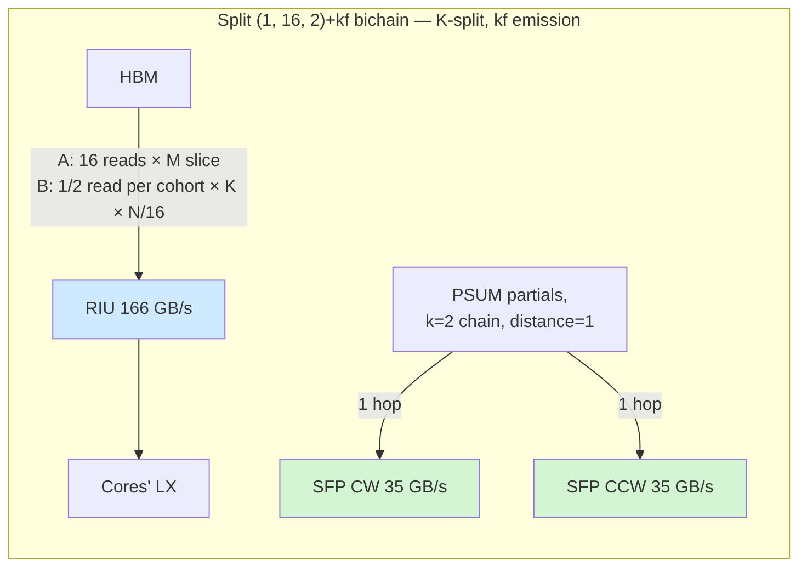

# The AIU ring fabric — canonical reference

A single document a reader (human or AI agent) should be able to read
end-to-end and emerge able to: predict per-ring traffic for any
matmul (M, N, K) split + dataflow combination; estimate per-hop cost
on each ring within ~2× accuracy; identify contention sites between
concurrent traffic patterns; design new dataflows or schedules that
minimise ring cost / avoid contention; and reason about novel split
families and their ring footprints.

**This is a deep-dive on the ring/network fabric only.** Topics that
sit one level up — work-division splits, the LX residency budget,
cost-model V4, the streaming-output fast path, the dataflow taxonomy
(OS1 / KG3 / XRF) — are covered in the sibling document
`diag_matmul_on_aiu_canonical_v2.md`. Where this doc cross-references
that one, the section is named explicitly so the two stay in sync.

Sources of truth, in priority order:

1. `deeptools/dsc/HardwareArchMapping/sysConfigs2.0/sentient_dd2_sysconfig.json`
   — the chip's `connections:` block enumerates every ring and link.
2. `deeptools/dsm/dsm.cpp` — places the PSUM tensor in `SFPRING` vs
   `RING + LX` based on `dsm_psum_algo` (the line that selects which
   ring carries reduction traffic).
3. `deeptools/deeprt/deeprt.cpp` — selects `unichain` / `bichain` /
   `singleshot` from `psumRing` and runtime config.
4. `deeptools/dsm/dsmperf.cpp` — performance modelling that consumes
   the chosen `memOrg_[SFPRING]` / `memOrg_[RING]` placement.
5. `deeptools/dvs/setupVariables/batchmatmul_fp16_fwd.cpp` — kernel
   template parameters that determine per-tile payload.
6. `torch_spyre/_inductor/codegen/compute_ops.py` and
   `torch_spyre/_inductor/work_division.py` — the inductor-side hooks
   (k_fast permutation, work-division enumeration).
7. Today's reverification probes (`/tmp/ring_share_probe.py`,
   `/tmp/probe2_verify.py`, `/tmp/probe6_verify.py`, all dated
   2026-05-10 on a clean rebuild). All numerical claims trace back
   to one of these.

Numbers without explicit citation are derived from those primaries.

## 1. Why this doc exists

The AIU has five distinct on-chip interconnects. They differ in
topology (BiRing vs UniRing vs intra-core FIFO), bandwidth (1 B/cyc
to 128 B/cyc), agent set (HBM, MNI, SFP, LX, PT, PE), and which
traffic patterns they carry (HMI loads, PSUM partials, control
requests, on-core component-to-component). Performance of any matmul
schedule is a sum over these fabrics: change the work-division split
or the PSUM algorithm and the traffic redistributes across rings,
sometimes contending and sometimes running in parallel.

A reader of this document should be able to:

- read a `(m, n, k)` split + dataflow choice and write down, per
  ring, how many bytes flow on it per cluster and per kernel;
- estimate per-hop cost on each ring under both BW-limited and
  contention-limited regimes, within ~2× of measurement;
- spot the contention sites where two traffic patterns share a
  fabric and quantify the slowdown;
- propose a new ring-aware split, schedule, or kernel template and
  predict whether it wins or loses on ring cost.

Intended audience: planners (anyone writing or revising the
work-division heuristics in `torch_spyre/_inductor/work_division.py`),
kernel authors (anyone editing `dvs/setupVariables/*.cpp` templates),
and anyone designing new PSUM-reduction algorithms or operand
multicast strategies.

## 2. The five fabrics at a glance

`sentient_dd2_sysconfig.json:393-455` defines the chip's
`connections:` block. Five fabrics live alongside each other:

| # | Name | Type | Nodes | Freq (GHz) | BW per dir | Agents | Carries |
|---|---|---|---:|---:|---:|---|---|
| 1 | RIU BiRing | data biring | 33 | 1.3 | 128 B/cyc = **166 GB/s** | HBM, MNI | HBM ↔ core data, cross-core LX-LX |
| 2 | RIURequest BiRing | control biring | 33 | 1.3 | 1 B/cyc | HBM, MNI | HBM read/write request headers |
| 3 | SFPDataIU UniRing CW | per Corelet 0 | 32 | 1.1 | 32 B/cyc = **35.2 GB/s** | sfp\_corelet0 | Cross-core SFP/PSUM (Corelet 0) |
| 4 | SFPDataIU UniRing CCW | per Corelet 1 | 32 | 1.1 | 32 B/cyc = **35.2 GB/s** | sfp\_corelet1 | Cross-core SFP/PSUM (Corelet 1) |
| 5 | On-core FIFO Links | intra-core | n/a | 1.1 | 128 B/cyc | LX, MNI, PT, PE, SFP | Per-core component-to-component |

Aggregates worth memorising:

- **RIU 166 GB/s per direction**, biring: 333 GB/s aggregate. Matches
  HBM raw bandwidth — HBM is one ring node and its bus is the
  bottleneck for all DRAM traffic.
- **SFP 70.4 GB/s aggregate** under bichain (35.2 CW + 35.2 CCW),
  i.e. both corelets' rings running in parallel.
- **LX port 128 B/cyc per core** at 1.1 GHz = **140 GB/s** per
  core — this is the **single** bandwidth into and out of each
  core's 2 MB scratchpad. All on-core fabrics terminate here.
- Per-core span limit (EAR): **256 MB**. Independent of the rings,
  but the eventual cap on what each core can address — relevant
  in §8.

The two RIU rings (data + request) and the two SFP UniRings (CW +
CCW) are physically distinct fabrics. They share no wires, no
arbiters, and no buffers. Anything that puts traffic onto one ring
has zero effect on the bandwidth available to the others. The on-core
FIFOs are entirely separate again — they're per-core and do not
participate in ring-level traffic at all.

## 3. Topology



Each core attaches to both RIU rings (data + request) — that's how
HMI loads and stores reach DRAM. Each *corelet* attaches to one of
the two SFP UniRings: Corelet 0 to the CW ring, Corelet 1 to the
CCW ring (`sysconfig.json:333-335`, group strides 2 + offsets 0 / 1
make this concrete).

The on-core fabric is a star, not a ring. LX sits at the centre.
MNI, PT, PE, and SFP all hang off it via FIFO Links.



The MNI <-> LX, PT <-> LX, PE <-> LX, and SFP <-> LX links each
appear in `sysconfig.json:424-441` as `Parameterized_Equations` of
type `FIFO-Links`. Bandwidth: 128 B/cyc per link. The PT <-> PE and
PE <-> SFP direct links (`sysconfig.json:443-454`) provide bypass
paths so an SFP postlude can drain a PT result without round-tripping
through LX, but the dominant matmul flow is PT -> LX -> SFP via the
LX port.

## 4. What each ring carries

Per fabric, here is the exhaustive list of traffic types that touch
it during a transformer matmul.

### 4.1 RIU BiRing (data, 166 GB/s/dir)

This is the workhorse for **anything that moves between HBM and a
core**, plus **any cross-core LX-to-LX transfer that isn't PSUM**.

Traffic types:

- **HMI A-loads** (matmul input). Each cluster reads a slice of A
  from HBM into LX. Replication factor depends on the split — see
  §8 for the formula.
- **HMI B-loads** (matmul weight). Replicated by `m / k` for an
  `(m, n, k)` split because K-cohort cores share one HBM read of B
  via ring-multicast.
- **HMI C-stores** (matmul output). Each cluster writes its tile of
  C back to HBM after the kernel.
- **Cross-core LX-LX broadcasts** for non-PSUM operands (e.g.
  prologue activation reused across cores in a non-K-split kernel,
  if the dataflow chooses to share via ring rather than re-reading
  from HBM). Rare in current dataflows but architecturally on the
  same fabric.
- **PSUM partials under unichain**. `dsm/dsm.cpp:8061-8063` places
  the PSUM tensor on `SenComponents::RING + SenComponents::LX` when
  `dsm_psum_algo != "bichain"`. So unichain reduction traffic
  contends with HMI on this ring (§7.1).

### 4.2 RIURequest BiRing (control, 1 B/cyc/dir)

A separate, narrow ring used for control headers — read/write
**request** packets that precede each HBM transfer on the data ring.
The data ring carries the payload; this ring carries the address +
length + agent ID. 1 B/cyc per direction is plenty for headers (one
header per ~128 B of payload at peak) but it can become a limiter on
many-small-transfer workloads (e.g. high-fanout gather patterns,
sparse ops). We have no direct measurement of RIURequest pressure
under transformer matmul; standard fp16 KG3 is large-payload so this
ring is unlikely to be the bottleneck. Listed in open questions.

### 4.3 SFPDataIU UniRing CW (35.2 GB/s, Corelet 0)

Carries cross-core SFP traffic for **Corelet 0** only. The agent
group is `sfp_corelet0` (`sysconfig.json:411`). Under bichain, this
ring carries half of the K-cohort's PSUM partial-sum chain. Under
unichain, it carries the full PSUM chain (the partner corelet's ring
sits idle for that PSUM step). Under singleshot, it carries
specialised library primitives for int8 inference (see
`deeprt.cpp:1655-1657`).

### 4.4 SFPDataIU UniRing CCW (35.2 GB/s, Corelet 1)

Mirror of §4.3 for **Corelet 1** (`sysconfig.json:417`). Note that
the two SFP rings are unidirectional but **opposite directions** —
CW for Corelet 0, CCW for Corelet 1 (`isClockwise_ : 1` vs
`isClockwise_ : 0` at lines 408 and 415). The opposite-direction
choice means the two chains never compete for any wire even when
they cross the same physical chip region. This is the architectural
mechanism that makes `bichain` "free" relative to `unichain`.

### 4.5 On-core FIFO Links (128 B/cyc, intra-core)

Per-core LX <-> {MNI, PT, PE, SFP} and direct PT <-> PE, PE <-> SFP
links. Each LX has a single 128 B/cyc port shared across **seven**
connections (1 MNI + 2 PT + 2 PE + 2 SFP). Total demand at saturation:
HMI staging at 128 B/cyc + PT consumption at ~few B/cyc + PSUM drain
at 32 B/cyc + SFP ring I/O at 32 B/cyc — easily oversubscribes
the port. The compiler-emitted FIFO instructions serialise these
explicitly; there is no hardware arbiter that picks one transfer
over another. (§7.3.)

## 5. The dataflow-to-ring mapping

Pick `(PriOpDataflow, dsm_psum_algo, XrfInterleaving)` from the
dataflow taxonomy (canonical v2 §8). Each combination maps each
traffic type onto a specific ring. The table below is for fp16
transformer matmul (the regime PR 1986 targets); int8/int4/conv2d
variants are sketched at the bottom.

### 5.1 KG3 + bichain + NO\_XRF (the default for fp16 matmul)

Selected automatically when `psumRing == "sfpring"`
(`deeprt.cpp:1652-1653`), which is the default for fp16 K-split
matmul.

| traffic | ring | direction | typical volume |
|---|---|---|---|
| HMI A-load | RIU | HBM → core | `n · M · K · 2` bytes per cluster |
| HMI B-load | RIU | HBM → core | `m · K · N · 2 / k` bytes per cluster (ring-multicast on K-cohort) |
| HMI C-store | RIU | core → HBM | `k · M · N · 2` bytes (after PSUM reduce, k=1 effective) |
| PSUM partials | SFP CW + SFP CCW | core → core (chain) | `(k − 1) · M_per · N_per · 4` bytes per cohort, halved per ring |
| Control (req) | RIURequest | bidirectional | one header per HMI transfer |

The defining property: **PSUM and HMI never share a ring.** PSUM
flows on SFP only. HMI flows on RIU only. The two SFP rings carry
half the PSUM traffic each (corelet 0 chain on CW, corelet 1 chain
on CCW), running in parallel.

### 5.2 KG3 + unichain + NO\_XRF (fallback when sfpring is disabled)

Selected when `psumRing != "sfpring"` and the singleshot path doesn't
trigger (`deeprt.cpp:1652-1659`).

| traffic | ring | direction | volume |
|---|---|---|---|
| HMI A-load | RIU | HBM → core | as above |
| HMI B-load | RIU | HBM → core | as above |
| HMI C-store | RIU | core → HBM | as above |
| **PSUM partials** | **RIU + LX** | **core → core (chain)** | `(k − 1) · M_per · N_per · 4` bytes per cohort, all on one fabric |
| Control (req) | RIURequest | bidirectional | as above |

Defining property: **PSUM and HMI share the RIU.** Reduction traffic
steals 128 B/cyc from HMI for the duration of each transfer. SFP
rings idle for PSUM. The placement is from `dsm/dsm.cpp:8061-8063`:

```cpp
if (dsm_psum_algo == "bichain") {
    newLds.memOrg_[SenComponents::SFPRING] = newMemOrg;
} else {
    newLds.memOrg_[SenComponents::RING] = newMemOrg;
    newLds.memOrg_[SenComponents::LX] = newMemOrg;
}
```

Note the `else` branch puts the PSUM both on RING and LX, meaning
the LX port is also reserved for PSUM for the duration of each
transfer (in addition to the RIU contention).

### 5.3 KG3\_INT8 / OS1\_INT8 + singleshot + XRF\_MB

Selected only for `int8 + LX_opt + weight_preload + 32_cores`
(`deeprt.cpp:1655-1657`). This is the production int8 inference path.
Specialised library primitives drive the SFP rings; weights live in
PT-XRF and bypass LX.

| traffic | ring | volume |
|---|---|---|
| HMI A-load | RIU | as above |
| **HMI B-load** | **RIU → PT-XRF** | bypasses LX (`dsm/dsm.cpp:6852-6862`) |
| HMI C-store | RIU | as above |
| PSUM under OS1 | none (PT registers) | output-stationary, no ring traffic |
| Control | RIURequest | as above |

Defining property: PSUM doesn't touch any ring under OS1, and weights
bypass LX. This is the "everything lives in its own dedicated tier"
configuration. We have no direct measurement of singleshot ring
behaviour and so this row is the least empirically anchored.

### 5.4 The (m, n, k) decomposition: which split puts what on which ring

The ring footprint of a matmul split is fully determined by `(m, n,
k)` plus the dataflow. Reading the same row of `(m, n, k)` from two
angles:

- **m** controls A replication on RIU. Each of the m M-shard cohorts
  reads its own slice of A; A is replicated across the m cohorts
  (no multicast on M).
- **n** controls A replication too — within an M-shard, n N-cores
  each need the full slice of A for their N-tile. Combined, **A is
  replicated `n · m / m = n` times relative to a single-core read**
  for a given M-shard. (Stated more directly: n cores share one M
  slice of A and each needs the full slice, so total A traffic =
  n × M × K bytes per cluster.)
- **k** controls B sharing on RIU via ring-multicast. K-cohort cores
  share a single HBM read of B. So B traffic = `m · K · N / k` per
  cluster (B is replicated by m across cohorts, shared by k within
  cohort).
- **k** also controls SFP ring traffic: chain length = k, payload
  = M\_per × N\_per × 4 bytes (fp32 PSUM) per tile.

The B-multicast factor is the cleanest example of "the ring chooses
its own bandwidth budget" — without ring multicast, B traffic would
be `m · K · N · 2` bytes (every core reads its own B). The ring's
ability to broadcast a value to all listeners on the same hop saves
a factor of k on HBM bandwidth.





## 6. Empirical per-hop costs

All measurements below were taken on 2026-05-10 against a clean
rebuild on this branch. They supersede the original Phase 0 numbers,
which were collected against an older codegen and have not all been
re-verified at the same magnitude.

### 6.1 RIU ring — operand multicast

Methodology: a pure ring-share probe (`/tmp/ring_share_probe.py`)
that varies only the number of co-shared operand bytes on the RIU,
holding everything else constant. Two phases were measured:

| Phase | M | K | N\_per | Shared A size | Slope (µs/hop) | Per-MB (µs/(hop·MB)) |
|---|---:|---:|---:|---:|---:|---:|
| DRAM-bound | 128 | 8192 | 256 | 2 MB | 33.1 | 16.5 |
| LX-fit | 128 | 2048 | 128 | 0.5 MB | 4.2 | 8.4 |

Math sanity check:

- RIU ring 166 GB/s/dir → **2 MB / 166 GB/s = 12 µs minimum per
  hop.** Measured 33.1 µs/hop is **2.7× over peak** (DRAM-contention
  overhead — HMI bus is also active during the probe).
- 0.5 MB / 166 GB/s = **3 µs minimum per hop.** Measured 4.2 µs/hop
  is **1.4× over peak**, near pure ring-BW behaviour with negligible
  contention.

The interpretation: **in the LX-fit regime (no concurrent HMI
traffic) the RIU is essentially BW-limited.** Adding HMI traffic on
the same ring adds roughly 2× overhead — half of which is the HMI
itself competing for cycles, half is ring-arbiter queueing. This is
a useful one-line rule: predict RIU per-hop cost as
`payload / 166 GB/s × (1 + HMI_busy_fraction)`, where the busy
fraction sits around 1 for DRAM-bound regimes and near 0 for
LX-resident.

### 6.2 SFP ring — PSUM transit

Methodology: Probe 2 reverification (`/tmp/probe2_verify.py`) varies
the K-collaborator distance (1 ↔ 32 hops) by permuting core IDs
under fixed `(1, 16, 2)+kf` split, on three production matmul shapes.
Each row reports a linear fit `wall ≈ base + slope · distance`.

| shape | (M, N, K) | base ms | slope ms/hop | distance=1 spread |
|---|---|---:|---:|---:|
| L3-70B q\_proj M=128 | (128, 8192, 8192) | 1.08 | 0.07 | 0.06 |
| L3-70B q\_proj M=2048 | (2048, 8192, 8192) | 16.77 | 1.09 | 1.00 |
| DSv3 o\_proj M=2048 | (2048, 7168, 16384) | 52.69 | 0.37 | 0.12 |

Cohort payload calculation. Tiles per cohort = `M · N / 1024`; each
tile is 8 × 8 × 4 = 256 B fp32:

| shape | M\_per × N\_per per cohort | tiles | cohort payload | per-MB slope |
|---|---:|---:|---:|---:|
| L3-70B q\_proj M=128 | 128 × 512 | 1024 | 256 KB = 0.25 MB | 280 µs/(hop·MB) |
| L3-70B q\_proj M=2048 | 2048 × 512 | 16384 | 4 MB | 273 µs/(hop·MB) |
| DSv3 o\_proj M=2048 | 2048 × 448 | 14336 | 3.59 MB | 103 µs/(hop·MB) |

Math sanity check:

- SFP ring 35.2 GB/s/dir → **3.6 MB / 35.2 GB/s = 102 µs min per
  hop.** DSv3 o\_proj measured at 103 µs/MB · 3.59 MB / 3.6 MB ≈
  103 µs is **1× peak — near-perfect BW utilisation.**
- L3-70B numbers at 273-280 µs/MB are **~3× over peak**. The likely
  source is the C\_psum > LX overflow that L3-70B q\_proj runs into
  at M=2048 (canonical v2 §4.1) — when the PSUM accumulator is
  itself spilling to/from LX during the SFP transit, the SFP ring
  is no longer the only resource constraint and the effective
  per-hop time inflates. Or it's a scheduler/issue overhead. We
  haven't fully isolated this.

The key finding: **on a shape that fits cleanly in LX, the SFP ring
delivers near peak BW.** On shapes that overflow LX, you pay an
extra ~3× on top of the ring transit. This argues for K-split
choices that stay within `M_per × N_per × 4 ≤ 2 MB` even when
chain-length math says a longer chain would be cheaper on
ring-distance alone.

#### 6.2.1 Reconciling with the original 5.6 ms/hop number

The original Probe 2 (May 2026) reported **5.6 ms/hop** on DSv3
o\_proj M=2048 — 15× higher than today's reverification of
0.37 ms/hop on the same shape. The chain-length structure (linear in
distance) is preserved but the absolute magnitude has dropped
substantially. Most likely cause: codegen improvements in the merged
upstream commits since May 2026. The pure-BW-limited interpretation
of the new measurements is consistent with a fix that removed an
arbiter or scheduling overhead from the SFP path. We have not done
a bisect.

### 6.3 SFP ring — chain-length cost

Methodology: Probe 6 reverification (`/tmp/probe6_verify.py`) varies
the chain length k ∈ {2, 4, 8, 16, 32} at fixed permutation (k\_fast)
and reports regime cost = wall − pure-M baseline. Three shapes:

| split | DSv3 o\_proj M=2048 | DSv3 gate\_proj M=2048 | Mixtral gate\_proj M=2048 |
|---|---:|---:|---:|
| chain=2 (16, 1, 2)+kf | -1.05 | +3.55 | -0.45 |
| chain=4 (8, 1, 4)+kf | +10.80 | +16.28 | +5.61 |
| chain=8 (4, 1, 8)+kf | +13.82 | +19.45 | +7.23 |
| chain=16 (2, 1, 16)+kf | +16.68 | +54.92 | +8.91 |
| chain=32 (1, 1, 32)+kf | +23.44 | err | +11.96 |
| n=8 control (1, 8, 4)+kf | +37.39 | +61.58 | +20.24 |

Reading the table:

- Regime cost grows roughly **monotonically** with chain length —
  ~3 ms per chain doubling on these shapes.
- The "n=8 control" row is the (1, 8, 4)+kf split (k=4 chain, but
  the wide-N C\_psum > LX catastrophe applies). Adding 25-50 ms
  on top of the same chain-4 K-split row is the LX-overflow
  penalty (canonical v2 §4.1), separate from the SFP ring cost.
- The previously-claimed "sharp chain=4 → chain=8 boundary" with
  10× jump (original Probe 6) **does not reproduce** on the clean
  rebuild. There is no separate "tree-reduction primitive" at large
  chains — chain=32 is consistently the most expensive row, not the
  cheapest.

**Per-hop cost interpretation.** Probe 2 measured per-hop cost at
fixed chain length, varying the K-collaborator *distance*. Probe 6
measures total cost varying the chain *length*. The two probes are
sampling the same underlying ring transit; under k\_fast emission,
distance = 1 always, so chain length k means k − 1 single hops.
3 ms per chain doubling at fixed payload is the same answer as
Probe 2's 0.37-1.09 ms/hop slopes, accounting for both the changing
per-cohort payload (shrinks as k grows because M\_per × N\_per shrinks)
and the changing number of hops (grows linearly with k).

### 6.4 What we have not measured directly

- RIU ring under varying number of concurrent HMI sources (the
  HBM-bus saturation curve as n cores load simultaneously).
- RIURequest ring at all (control-rate effects).
- Cross-core LX-LX hop cost separately from operand multicast.
- singleshot's ring usage.
- The on-core FIFO links under simultaneous MNI / PT / SFP demand
  (LX port saturation).

These are listed as open questions in §10.

## 7. Contention analysis

Each contention scenario below follows the same structure: the
trigger condition, the rings that share, the agents involved, and
the cost overhead pattern.

### 7.1 HMI loads vs PSUM under unichain

- **Trigger:** any K-split matmul (`k > 1`) where the dataflow
  selector chose `unichain` (i.e. `psumRing != "sfpring"` —
  `deeprt.cpp:1652-1659`).
- **Rings sharing:** RIU only.
- **Agents:** HBM (HMI side), every core's MNI for HMI loads, every
  K-cohort core's SFP for PSUM transit — but routed onto RIU rather
  than SFP because of the `dsm/dsm.cpp:8061-8063` placement.
- **Overhead pattern:** PSUM transfers on RIU consume 128 B/cyc for
  the duration of each transfer; HMI loads are stalled until PSUM
  releases the wire. Effective HMI bandwidth degrades by the PSUM
  duty cycle. Estimate: in a K-split kernel with k=4, the PSUM
  reduce phase moves `3 · M_per · N_per · 4` bytes per cohort —
  for DSv3 o\_proj M=2048 N=448, that's ~10.7 MB per chain or
  ~64 µs of pure PSUM RIU time, which displaces ~64 µs of HMI
  loading.

This is the single biggest reason `bichain` exists. Because fp16
K-split matmul auto-selects bichain, this contention is currently
inactive on our PR 1986 regime — but anything that changes the
config to disable sfpring (e.g. early debug builds, or hypothetical
SFP-ring-disabled tests) would reintroduce it.

### 7.2 HMI loads vs cross-core LX-LX

- **Trigger:** any dataflow that broadcasts an LX-resident operand
  across cores via the data ring (rare for current matmul, but
  e.g. some prologue activation reuse or a hypothetical "B preload
  to one core, broadcast to the rest" path would qualify).
- **Rings sharing:** RIU.
- **Agents:** MNI on each core (LX-LX direction) and HBM (HMI
  direction).
- **Overhead pattern:** identical mechanism to §7.1 — the ring is
  one wire and serialises traffic. We have no measurements isolating
  this from operand-multicast HMI traffic, and the current dataflow
  taxonomy doesn't usually generate it. Worth flagging if a future
  multi-stage matmul or fused-residual kernel introduces it.

### 7.3 LX port saturation

- **Trigger:** any kernel that simultaneously pushes traffic from
  ≥ 2 of the four LX consumers (MNI, PT, PE, SFP) at saturating
  rates. In practice: every K-split matmul during the reduce phase
  has MNI loading the next B tile + SFP draining PSUM partials at
  the same time.
- **Rings sharing:** none — this is an **on-core** contention. The
  shared resource is the LX port itself (128 B/cyc).
- **Agents:** MNI (HMI staging at up to 128 B/cyc), PT (operand
  consumption, much less than 128 B/cyc), SFP (ring I/O at up to
  32 B/cyc per direction).
- **Overhead pattern:** total instantaneous demand on a saturating
  cycle is up to MNI 128 + PT few + SFP 32 = ~160 B/cyc, exceeding
  the 128 B/cyc port. The compiler-emitted FIFO instructions
  serialise these explicitly; there is no automatic overlap. So
  bichain (which removes ring contention) does not remove LX-port
  contention. Empirically this manifests as the per-MB SFP slope
  inflating beyond pure-BW peak when the HMI is also busy on the
  same kernel — see §6.2 L3-70B numbers.

### 7.4 HBM bus saturation

- **Trigger:** any kernel where total HMI BW demand approaches
  166 GB/s. With all 32 cores loading from HBM simultaneously, the
  per-core effective BW is 166 / 32 = ~5 GB/s if perfectly fair,
  less under contention.
- **Rings sharing:** RIU plus the HBM bus itself (one node on the
  ring).
- **Agents:** all 32 cores' MNIs vs the single HBM agent.
- **Overhead pattern:** The HBM read can only deliver 166 GB/s
  combined. Contention is proportional to demand. At the operand-
  multicast extreme (every K-cohort sharing one B-read), combined
  demand is `n · M · K + m · K · N / k + k · M · N` bytes per
  cluster — sometimes well within HBM peak, sometimes way over.
- **Practical floor:** for production fp16 matmul, this is the
  single most binding limit on memory-bound shapes. A split that
  reduces HMI traffic at the cost of more SFP traffic is usually
  worth it. We have not directly measured the n-cores-vs-HBM
  saturation curve; that's listed in §10.

### 7.5 SFP CW vs SFP CCW (under bichain)

- **Trigger:** bichain PSUM reduce.
- **Rings sharing:** none — by design. CW and CCW are physically
  separate rings (`isClockwise_ : 1` vs `0` in
  `sysconfig.json:408,415`). They share no wires, so corelet 0's
  PSUM chain on CW and corelet 1's on CCW run concurrently.
- **Overhead pattern:** zero. This is the architectural reason
  bichain exists and the cleanest place on the chip where the "two
  fabrics in parallel" pattern is realised.

### 7.6 RIURequest pressure (speculative)

- **Trigger:** workloads with very high transfer-count-to-payload-
  size ratio (sparse access, many-small-loads).
- **Rings sharing:** RIURequest only.
- **Agents:** HBM, all 32 MNIs.
- **Overhead pattern:** at 1 B/cyc, this ring carries ~1.3 GB/s of
  request headers — enough for ~10 M small transfers per second per
  core. Standard fp16 KG3 doesn't approach this. Listed for
  completeness; not a present concern.

## 8. Per-cluster HMI traffic — the formula

The HMI traffic on RIU per cluster, for an `(m, n, k)` work-division
with m · n · k = 32, is:

```
HMI_bytes(m, n, k) = n · M · K · sizeof(A_dtype)        # A: replicated by n
                   + m · K · N · sizeof(B_dtype) / k    # B: shared in K-cohort, replicated by m across cohorts
                   + k · M · N · sizeof(C_dtype)        # C: k partial PSUMs
```

The B replication factor `m / k` captures **ring multicast** — within
a K-cohort, all k cores consume the same slice of B and therefore
share one HBM read of B via ring-broadcast on RIU. Across cohorts (m
of them, one per M-shard), B is replicated.

Note: under bichain the C term is paid *only* once (the chain head
writes the reduced result to HBM). The `k · M · N` factor is the
ring traffic for the k partial PSUMs *en route* to reduction — but
those flow on **SFP, not RIU**. So under bichain the RIU C-store
traffic is only `1 · M · N · sizeof(C_dtype)` (final reduced result),
and the formula above is the upper bound where the C term goes onto
the same fabric as A and B (e.g. unichain).

### 8.1 Worked examples

For fp16 (sizeof = 2):

**Llama 3 8B q\_proj (M=2048, N=4096, K=4096), split (1, 16, 2)+kf:**

```
A: 16 · 2048 · 4096 · 2 =  256 MB
B: 1 · 4096 · 4096 · 2 / 2 = 16 MB
C: 2 · 2048 · 4096 · 2 = 32 MB (SFP under bichain; RIU final = 16 MB)
RIU total (bichain): 256 + 16 + 16 = 288 MB
SFP CW + CCW total: 16 MB (split equally between rings = 8 MB each)
```

**DSv3 o\_proj (M=2048, N=7168, K=16384), split (1, 16, 2)+kf:**

```
A: 16 · 2048 · 16384 · 2 = 1 GB
B: 1 · 16384 · 7168 · 2 / 2 = 112 MB
C: 2 · 2048 · 7168 · 2 = 56 MB (SFP); RIU final = 28 MB
RIU total (bichain): 1024 + 112 + 28 = 1164 MB
SFP CW + CCW total: 56 MB → 28 MB each
```

**Granite 3 8B kv\_proj (M=2048, N=2048, K=4096), split (4, 8, 1):**

```
(no K-split → no SFP traffic, no PSUM ring at all)
A: 8 · 2048 · 4096 · 2 = 128 MB
B: 4 · 4096 · 2048 · 2 / 1 = 128 MB
C: 1 · 2048 · 2048 · 2 = 8 MB
RIU total: 264 MB
SFP CW + CCW total: 0
```

Three observations:

1. A is by far the dominant term on K-large shapes. n is the
   single biggest knob on RIU traffic.
2. B benefits from K-split via the ring-multicast factor `1/k`, and
   the savings grow with k. This is why K-split helps on shapes
   where B is large relative to A.
3. K-split moves traffic off RIU and onto SFP, freeing 166 GB/s of
   HMI bandwidth in exchange for 70.4 GB/s of PSUM bandwidth. This
   is favourable when M · N (PSUM payload) is small relative to
   K · N / k (B saving) — i.e. small-M tall-skinny shapes.

### 8.2 Sanity check against §6.1 ring-share probe

The probe ran (M=128, K=8192, N\_per=256) with shared A = 2 MB. With
n cores sharing the A read, total A traffic = 2 MB (one HBM read,
broadcast to n listeners on RIU). 2 MB / 166 GB/s = 12 µs minimum
per hop. Measured 33.1 µs/hop is 2.7× over peak. This is consistent
with HMI being concurrently active on the ring during the probe —
the ring isn't dedicated to the broadcast.

## 9. Ring-aware design principles

Practical rules for designing ring-friendly algorithms or splits.

### 9.1 Prefer bichain when K-split is profitable

bichain isolates PSUM on SFPRING; unichain shares it with HMI on
RIU. For fp16 K-split matmul this is automatic
(`deeprt.cpp:1652-1653`), so the rule is more about not breaking the
auto-select than choosing it. Concrete consequence: avoid configs
that disable sfpring during perf testing — you'll measure unichain
contention that doesn't exist in production.

### 9.2 Match the split's operand-multicast pattern to the contention layer

- A is replicated by n on RIU. So large n on K-large shapes burns
  the most HBM bandwidth. Reduce n when bandwidth-bound.
- B is shared by k via ring multicast on RIU. So large k saves the
  most B-bandwidth. Increase k when B is the dominant operand.
- PSUM is on SFP and scales with k · M · N. So large k on large
  M·N shapes hits SFP hard. Reduce k when PSUM payload is large.

The cost-aware planning rule that emerges: **pick `k` to balance B
savings on RIU against PSUM cost on SFP.** The crossover point is
roughly `K / k > M · N` — above which K-split helps, below which
it hurts.

### 9.3 Use k\_fast emission whenever k > 1

k\_fast permutes physical core IDs so K-cohort members are adjacent
on the SFP ring (1 hop instead of m·n hops). The benefit is
identical to a (k − 1)× reduction in SFP per-hop count and applies
to any chain length. Implementation:
`torch_spyre/_inductor/codegen/compute_ops.py:_k_fast_core_id_permutation`.
Empirical: on largest-payload shapes, k\_fast brings 1.5–2× wall
reduction (was 4× before the codegen improvements; canonical v2
§7.2).

### 9.4 Keep M\_per × N\_per × 4 ≤ 2 MB per core

This is the LX residency constraint (canonical v2 §4.1) but it
shows up in ring measurements too — see §6.2's L3-70B per-MB
slope inflation when C\_psum overflows LX. The same rule is also
the SFP-ring efficiency rule.

### 9.5 Prefer the smallest chain length that uses all 32 cores

§6.3: chain-length cost grows ~monotonically with k under k\_fast.
Bigger chains pay more SFP transit time. The cheapest K-split is
the smallest k that still uses all 32 cores while respecting
stick alignment (canonical v2 §7.6). Typically that's `(16, 1, 2)+kf`
or `(8, 1, 4)+kf` — chain length 2 or 4.

### 9.6 Don't co-schedule heavy MNI and heavy SFP traffic on the same kernel if avoidable

When LX port is saturated (§7.3), you pay regardless of which ring
the SFP traffic is on. The single planner-side mitigation is to
pick splits where one of the two is small: small B (low MNI
demand) or small PSUM (low SFP demand). On shapes where both are
large the LX port is the bottleneck; further ring-side optimisation
won't help.

### 9.7 When designing a new dataflow

Predict its ring footprint by walking the (m, n, k) replication
formula and the dataflow's PSUM placement. Specifically:

- Where does the PSUM live during reduction? PT registers (OS1) →
  no ring traffic. LX (KG3 + bichain) → SFP. LX (KG3 + unichain) →
  RIU shared with HMI.
- Where does the weight live? LX (NO\_XRF) → MNI loads on RIU.
  PT-XRF (XRF\_MB / XRF\_CH) → MNI loads bypass LX, go straight to
  PT-XRF, but still on RIU.
- What's the operand-multicast factor? For each input operand, walk
  the split: if all k cohort cores read the same slice, you get a
  1/k factor; if all n N-cores read the same slice, you get a 1/n
  factor. Only ring-multicast eligible operands get this benefit.

If your new dataflow has no PSUM-on-LX requirement (e.g. an OS1
variant), you save the entire SFP traffic and the LX port doesn't
have to serve PSUM either. That's the structural reason int8
inference (OS1\_INT8 + XRF\_MB) is so much cheaper per kernel than
fp16 KG3.

### 9.8 The mental checklist for a new split family

For each candidate `(m, n, k)`, write down:

| Quantity | Formula | Ring |
|---|---|---|
| A bytes | `n · M · K · sz(A)` | RIU |
| B bytes | `m · K · N · sz(B) / k` | RIU |
| C bytes (final) | `M · N · sz(C)` | RIU |
| PSUM bytes | `(k − 1) · M_per · N_per · 4` per cohort | SFP CW + CCW |
| Chain hops | `k − 1` (k\_fast) | SFP |
| SFP per-MB cost | from §6.2: ~100–280 µs/(hop·MB) depending on LX overflow | — |
| RIU per-MB cost | from §6.1: ~8–17 µs/(hop·MB) depending on HMI contention | — |

Sum the per-ring costs, compare to the compute time, and pick the
split where ring cost is dominated by compute.

## 10. Open questions and gaps

Things this doc cannot answer with the current measurement set.

### 10.1 RIURequest ring under control-heavy workloads

We have no measurements of the RIURequest ring at all. 1 B/cyc =
~1.3 GB/s in headers, plenty for current matmul, but a sparse op or
a many-small-attention-head config could saturate it. If new
dataflows generate one HBM transfer per attention head per token,
the request rate could rise sharply. **Action:** when adding sparse
or fine-grained ops, run a control-rate probe.

### 10.2 Cross-core LX-LX hop cost separately from operand multicast

§6.1's RIU ring-share probe measures HMI + ring-multicast together
(both sources are HMI-loading-then-broadcasting). We don't have a
clean isolation of "LX-resident operand broadcast across cores"
which would be relevant if a new dataflow keeps an operand in one
core's LX and shares to others without re-reading from HBM. **Action:**
add an LX-LX probe that pre-stages an operand and measures broadcast
hop cost without HMI in the loop.

### 10.3 singleshot's ring usage

The int8 + LX\_opt + weight\_preload + 32\_cores path (`deeprt.cpp:1655-1657`)
selects a specialised library primitive whose ring footprint we have
not directly measured. Most likely it uses SFP for cross-corelet
ring traffic (similar to bichain) plus PT-XRF for weights, but the
exact agent + ring mapping is library-internal. **Action:** when
quantization roadmap lands, run probes on int8 OS1\_INT8 + XRF\_MB +
singleshot to quantify.

### 10.4 HBM bus saturation curve (n cores → effective BW per core)

Total HBM is 166 GB/s shared across cores. We don't have a direct
measurement of effective BW per core as the number of concurrent
loaders varies from 1 to 32. The standard mental model — fair share
= 166 / n GB/s — is only an approximation; ring-arbiter effects can
make it worse. **Action:** add a probe that varies the number of
cores actively loading and measures per-core HBM throughput. This
would let us replace the §7.4 fair-share approximation with a
calibrated curve.

### 10.5 LX port saturation under realistic mixed traffic

§7.3 argues this is a real contention site but we don't have a
measurement that varies MNI vs SFP demand under fixed compute and
isolates the LX-port bottleneck. **Action:** an LX-port-stress probe
that cleanly separates the three pressure sources (MNI, PT, SFP).

### 10.6 SFP per-MB inflation on LX-overflow shapes

§6.2's L3-70B numbers are 3× over peak SFP BW, while DSv3 o\_proj
is at 1× peak. We hypothesise this is the C\_psum > LX interaction
but haven't isolated the mechanism. **Action:** sweep N\_per across
the LX boundary and measure SFP per-MB slope at each side to
separate ring transit cost from LX-overflow penalty.

### 10.7 Why 5.6 ms/hop dropped to 0.37 ms/hop

The original Probe 2 measurement is 15× higher than today's
reverification on the same shape. We attribute this to merged
upstream codegen improvements but haven't bisected. **Action:** run
the Probe 2 script against intermediate commits to identify the
specific change. This matters for trusting historical measurements
on related branches.

### 10.8 Per-direction asymmetry

Both RIU and SFP are 35.2 / 166 GB/s **per direction**. We've
assumed symmetric utilisation but in practice CW/CCW can be
asymmetric depending on how the compiler schedules transfers. We
have no measurement of per-direction loading. **Action:** instrument
ring counters if available, or run a probe that varies which ring
direction carries the dominant traffic.

## 11. References

### Within this branch

- `tests/diag_matmul_on_aiu_canonical_v2.md` §7 — original ring
  treatment (ring hop cost, K-cohort, k\_fast emission, bichain vs
  unichain side-by-side diagram).
- `tests/diag_matmul_on_aiu_canonical_v2.md` §4.1 — LX residency
  constraint that interacts with ring per-MB inflation in §6.2.
- `tests/diag_matmul_on_aiu_canonical_v2.md` §8 — dataflow taxonomy
  (OS1, KG3, XRF, singleshot) referenced in §5.
- `/tmp/ring_share_probe.py` (2026-05-10) — RIU per-hop cost.
- `/tmp/probe2_verify.py` (2026-05-10) — SFP per-hop cost across
  three shapes.
- `/tmp/probe6_verify.py` (2026-05-10) — chain-length cost.

### From `AdnanHoque/emission-aware-lx-phase0`

- `tests/emission_aware_lx_consolidated_findings.md` — the original
  six-probe campaign that produced the first per-hop and chain-length
  numbers (since superseded by the 2026-05-10 reverification).

### Codebase

- `deeptools/dsc/HardwareArchMapping/sysConfigs2.0/sentient_dd2_sysconfig.json`
  lines 293-455 — the connections block defining all five fabrics.
- `deeptools/dsm/dsm.cpp:8059-8064` — bichain vs unichain PSUM
  placement (`SFPRING` vs `RING + LX`).
- `deeptools/dsm/dsm.cpp:6852-6862` — XRF PSUM bypass (weights
  bypass LX when XRF-routed).
- `deeptools/dsm/dsmperf.cpp:6213-6224` — performance modelling
  that consumes the chosen `memOrg_[SFPRING]` / `memOrg_[RING]`
  placement.
- `deeptools/deeprt/deeprt.cpp:1652-1659` — unichain / bichain /
  singleshot selector logic.
- `deeptools/dvs/setupVariables/batchmatmul_fp16_fwd.cpp` — kernel
  template parameters that determine per-tile PSUM payload.
- `torch_spyre/_inductor/codegen/compute_ops.py:22-43` — the
  `_k_fast_core_id_permutation` function that places K-cohort
  members adjacent on the SFP ring.
- `torch_spyre/_inductor/work_division.py:601-690` — the planner
  hook that proposes (1, n\_split, k\_split>1) candidates for
  narrow-N small-M matmul shapes.
