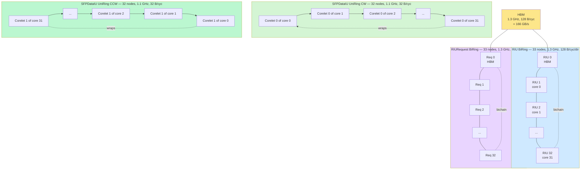
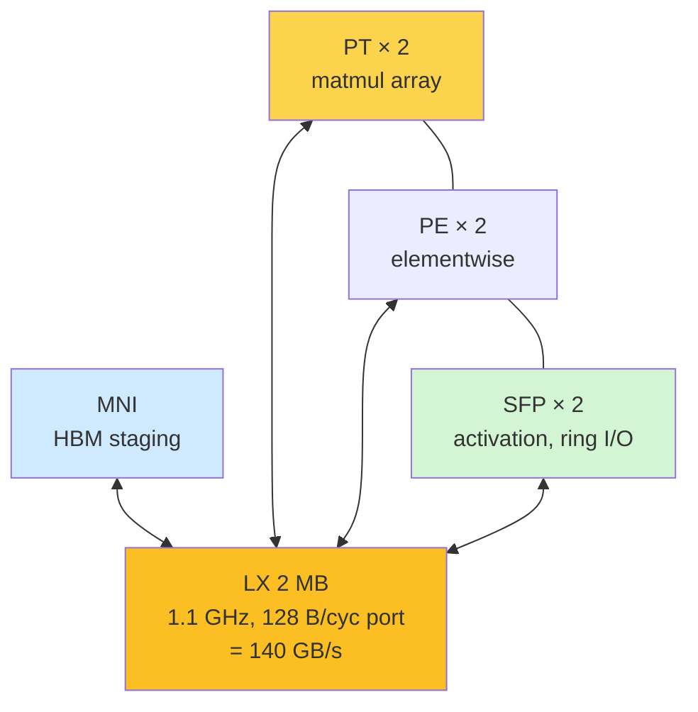
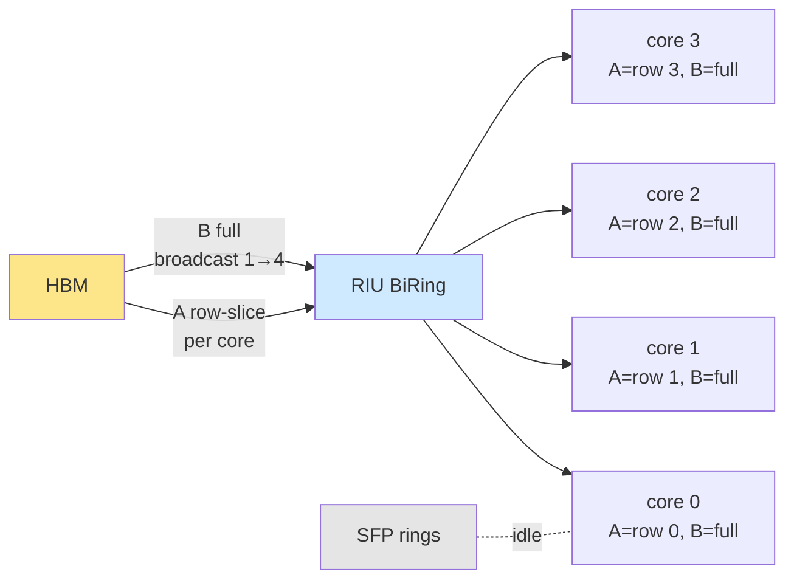
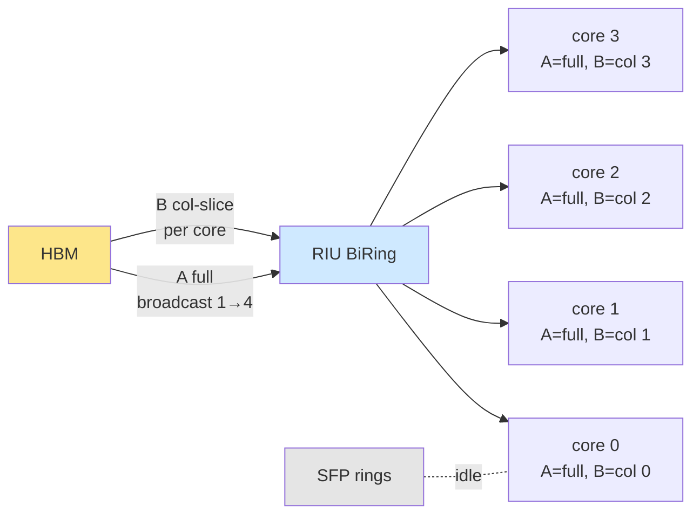
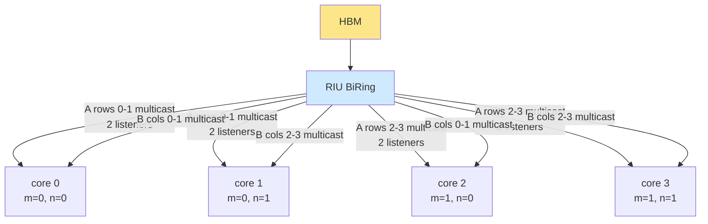
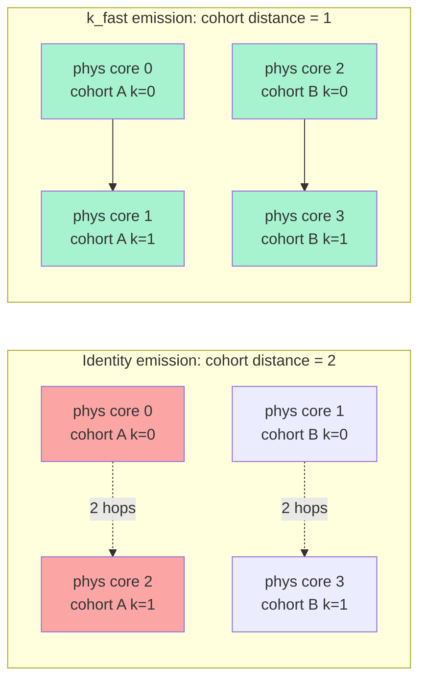
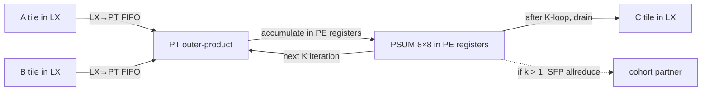
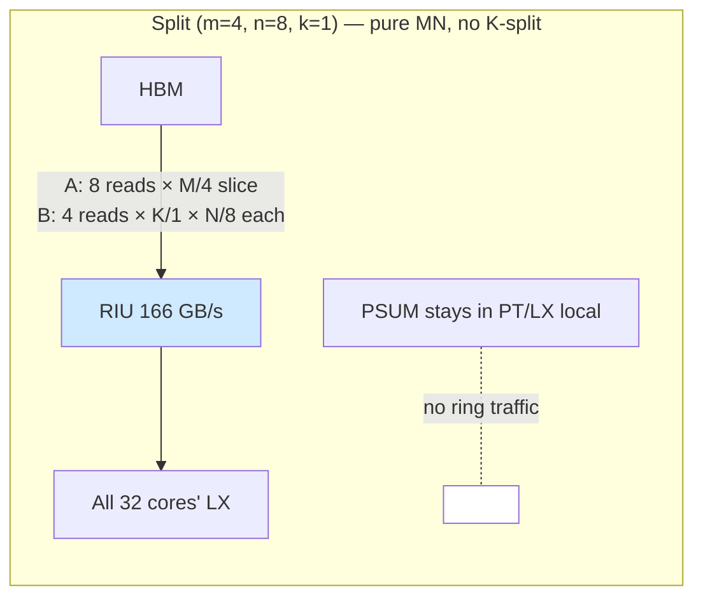
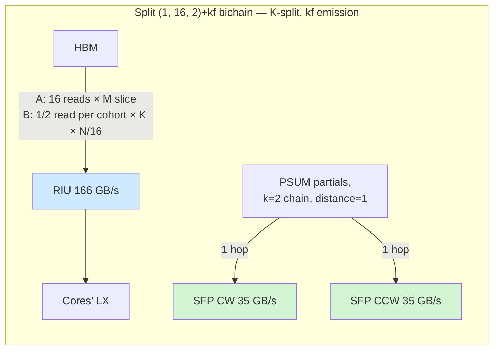
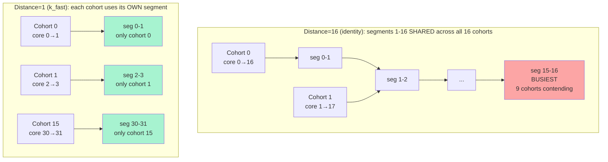

# The AIU ring fabric — canonical reference

A single document a reader (human or AI agent) should be able to read
end-to-end and emerge able to: predict per-ring traffic for any
matmul (M, N, K) split + dataflow combination; estimate per-hop cost
on each ring within ~2× accuracy; identify contention sites between
concurrent traffic patterns; design new dataflows or schedules that
minimise ring cost / avoid contention; and reason about novel split
families and their ring footprints.

**This is a deep-dive on the ring/network fabric only.** Topics that
sit one level up — work-division splits, the LX residency budget,
cost-model V4, the streaming-output fast path, the dataflow taxonomy
(OS1 / KG3 / XRF) — are covered in the sibling document
`diag_matmul_on_aiu_canonical_v2.md`. Where this doc cross-references
that one, the section is named explicitly so the two stay in sync.

Sources of truth, in priority order:

1. `deeptools/dsc/HardwareArchMapping/sysConfigs2.0/sentient_dd2_sysconfig.json`
   — the chip's `connections:` block enumerates every ring and link.
2. `deeptools/dsm/dsm.cpp` — places the PSUM tensor in `SFPRING` vs
   `RING + LX` based on `dsm_psum_algo` (the line that selects which
   ring carries reduction traffic).
3. `deeptools/deeprt/deeprt.cpp` — selects `unichain` / `bichain` /
   `singleshot` from `psumRing` and runtime config.
4. `deeptools/dsm/dsmperf.cpp` — performance modelling that consumes
   the chosen `memOrg_[SFPRING]` / `memOrg_[RING]` placement.
5. `deeptools/dvs/setupVariables/batchmatmul_fp16_fwd.cpp` — kernel
   template parameters that determine per-tile payload.
6. `torch_spyre/_inductor/codegen/compute_ops.py` and
   `torch_spyre/_inductor/work_division.py` — the inductor-side hooks
   (k_fast permutation, work-division enumeration).
7. Today's reverification probes (`/tmp/ring_share_probe.py`,
   `/tmp/probe2_verify.py`, `/tmp/probe6_verify.py`, all dated
   2026-05-10 on a clean rebuild). All numerical claims trace back
   to one of these.

Numbers without explicit citation are derived from those primaries.

## 1. Why this doc exists

The AIU has five distinct on-chip interconnects. They differ in
topology (BiRing vs UniRing vs intra-core FIFO), bandwidth (1 B/cyc
to 128 B/cyc), agent set (HBM, MNI, SFP, LX, PT, PE), and which
traffic patterns they carry (HMI loads, PSUM partials, control
requests, on-core component-to-component). Performance of any matmul
schedule is a sum over these fabrics: change the work-division split
or the PSUM algorithm and the traffic redistributes across rings,
sometimes contending and sometimes running in parallel.

A reader of this document should be able to:

- read a `(m, n, k)` split + dataflow choice and write down, per
  ring, how many bytes flow on it per cluster and per kernel;
- estimate per-hop cost on each ring under both BW-limited and
  contention-limited regimes, within ~2× of measurement;
- spot the contention sites where two traffic patterns share a
  fabric and quantify the slowdown;
- propose a new ring-aware split, schedule, or kernel template and
  predict whether it wins or loses on ring cost.

Intended audience: planners (anyone writing or revising the
work-division heuristics in `torch_spyre/_inductor/work_division.py`),
kernel authors (anyone editing `dvs/setupVariables/*.cpp` templates),
and anyone designing new PSUM-reduction algorithms or operand
multicast strategies.

## 2. The five fabrics at a glance

`sentient_dd2_sysconfig.json:393-455` defines the chip's
`connections:` block. Five fabrics live alongside each other:

| # | Name | Type | Nodes | Freq (GHz) | BW per dir | Agents | Carries |
|---|---|---|---:|---:|---:|---|---|
| 1 | RIU BiRing | data biring | 33 | 1.3 | 128 B/cyc = **166 GB/s** | HBM, MNI | HBM ↔ core data, cross-core LX-LX |
| 2 | RIURequest BiRing | control biring | 33 | 1.3 | 1 B/cyc | HBM, MNI | HBM read/write request headers |
| 3 | SFPDataIU UniRing CW | per Corelet 0 | 32 | 1.1 | 32 B/cyc = **35.2 GB/s** | sfp\_corelet0 | Cross-core SFP/PSUM (Corelet 0) |
| 4 | SFPDataIU UniRing CCW | per Corelet 1 | 32 | 1.1 | 32 B/cyc = **35.2 GB/s** | sfp\_corelet1 | Cross-core SFP/PSUM (Corelet 1) |
| 5 | On-core FIFO Links | intra-core | n/a | 1.1 | 128 B/cyc | LX, MNI, PT, PE, SFP | Per-core component-to-component |

Aggregates worth memorising:

- **RIU 166 GB/s per direction**, biring: 333 GB/s aggregate. Matches
  HBM raw bandwidth — HBM is one ring node and its bus is the
  bottleneck for all DRAM traffic.
- **SFP 70.4 GB/s aggregate** under bichain (35.2 CW + 35.2 CCW),
  i.e. both corelets' rings running in parallel.
- **LX port 128 B/cyc per core** at 1.1 GHz = **140 GB/s** per
  core — this is the **single** bandwidth into and out of each
  core's 2 MB scratchpad. All on-core fabrics terminate here.
- Per-core span limit (EAR): **256 MB**. Independent of the rings,
  but the eventual cap on what each core can address — relevant
  in §8.

The two RIU rings (data + request) and the two SFP UniRings (CW +
CCW) are physically distinct fabrics. They share no wires, no
arbiters, and no buffers. Anything that puts traffic onto one ring
has zero effect on the bandwidth available to the others. The on-core
FIFOs are entirely separate again — they're per-core and do not
participate in ring-level traffic at all.

## 3. Topology



Each core attaches to both RIU rings (data + request) — that's how
HMI loads and stores reach DRAM. Each *corelet* attaches to one of
the two SFP UniRings: Corelet 0 to the CW ring, Corelet 1 to the
CCW ring (`sysconfig.json:333-335`, group strides 2 + offsets 0 / 1
make this concrete).

The on-core fabric is a star, not a ring. LX sits at the centre.
MNI, PT, PE, and SFP all hang off it via FIFO Links.



The MNI <-> LX, PT <-> LX, PE <-> LX, and SFP <-> LX links each
appear in `sysconfig.json:424-441` as `Parameterized_Equations` of
type `FIFO-Links`. Bandwidth: 128 B/cyc per link. The PT <-> PE and
PE <-> SFP direct links (`sysconfig.json:443-454`) provide bypass
paths so an SFP postlude can drain a PT result without round-tripping
through LX, but the dominant matmul flow is PT -> LX -> SFP via the
LX port.

## 4. What each ring carries

Per fabric, here is the exhaustive list of traffic types that touch
it during a transformer matmul.

### 4.1 RIU BiRing (data, 166 GB/s/dir)

This is the workhorse for **anything that moves between HBM and a
core**, plus **any cross-core LX-to-LX transfer that isn't PSUM**.

Traffic types:

- **HMI A-loads** (matmul input). Each cluster reads `M · K` bytes
  of A from HBM once, multicast to every N-cohort listener via
  ring-broadcast on RIU — independent of split. See §8.
- **HMI B-loads** (matmul weight). Each cluster reads `K · N` bytes
  of B from HBM once, multicast to every M-cohort listener via
  ring-broadcast on RIU — also independent of split.
- **HMI C-stores** (matmul output). Each cluster writes its tile of
  C back to HBM after the kernel; under K-split with k > 1 there
  are k partial-PSUM writes per output tile.
- **Cross-core LX-LX broadcasts** for non-PSUM operands (e.g.
  prologue activation reused across cores in a non-K-split kernel,
  if the dataflow chooses to share via ring rather than re-reading
  from HBM). Rare in current dataflows but architecturally on the
  same fabric.
- **PSUM partials under unichain**. `dsm/dsm.cpp:8061-8063` places
  the PSUM tensor on `SenComponents::RING + SenComponents::LX` when
  `dsm_psum_algo != "bichain"`. So unichain reduction traffic
  contends with HMI on this ring (§7.1).

### 4.2 RIURequest BiRing (control, 1 B/cyc/dir)

A separate, narrow ring used for control headers — read/write
**request** packets that precede each HBM transfer on the data ring.
The data ring carries the payload; this ring carries the address +
length + agent ID. 1 B/cyc per direction is plenty for headers (one
header per ~128 B of payload at peak) but it can become a limiter on
many-small-transfer workloads (e.g. high-fanout gather patterns,
sparse ops). We have no direct measurement of RIURequest pressure
under transformer matmul; standard fp16 KG3 is large-payload so this
ring is unlikely to be the bottleneck. Listed in open questions.

### 4.3 SFPDataIU UniRing CW (35.2 GB/s, Corelet 0)

Carries cross-core SFP traffic for **Corelet 0** only. The agent
group is `sfp_corelet0` (`sysconfig.json:411`). Under bichain, this
ring carries half of the K-cohort's PSUM partial-sum chain. Under
unichain, it carries the full PSUM chain (the partner corelet's ring
sits idle for that PSUM step). Under singleshot, it carries
specialised library primitives for int8 inference (see
`deeprt.cpp:1655-1657`).

### 4.4 SFPDataIU UniRing CCW (35.2 GB/s, Corelet 1)

Mirror of §4.3 for **Corelet 1** (`sysconfig.json:417`). Note that
the two SFP rings are unidirectional but **opposite directions** —
CW for Corelet 0, CCW for Corelet 1 (`isClockwise_ : 1` vs
`isClockwise_ : 0` at lines 408 and 415). The opposite-direction
choice means the two chains never compete for any wire even when
they cross the same physical chip region. This is the architectural
mechanism that makes `bichain` "free" relative to `unichain`.

### 4.5 On-core FIFO Links (128 B/cyc, intra-core)

Per-core LX <-> {MNI, PT, PE, SFP} and direct PT <-> PE, PE <-> SFP
links. Each LX has a single 128 B/cyc port shared across **seven**
connections (1 MNI + 2 PT + 2 PE + 2 SFP). Total demand at saturation:
HMI staging at 128 B/cyc + PT consumption at ~few B/cyc + PSUM drain
at 32 B/cyc + SFP ring I/O at 32 B/cyc — easily oversubscribes
the port. The compiler-emitted FIFO instructions serialise these
explicitly; there is no hardware arbiter that picks one transfer
over another. (§7.3.)

### 4.6 Toy example: dataflow through the rings

The traffic-type tables above (§4.1-§4.5) are easier to internalise
once you've traced a concrete example by hand. This subsection walks
the same shape — **M=4, N=4, K=4 fp16 matmul on a 4-core AIU
(`max_cores = 4`)** — under four splits, showing for each: per-core
data ownership, ring-traffic pattern, and a labelled fabric diagram.
The shape is unrealistic (one PT-tile is 8×8) but it lets every byte
fit on the page.

```
       A (M=4, K=4)              B (K=4, N=4)              C = A · B
    ┌─────────────┐         ┌─────────────┐            ┌─────────────┐
    │ a00 ... a03 │         │ b00 ... b03 │            │ c00 ... c03 │
    │ a10 ... a13 │    ·    │ b10 ... b13 │     =      │ c10 ... c13 │
    │ a20 ... a23 │         │ b20 ... b23 │            │ c20 ... c23 │
    │ a30 ... a33 │         │ b30 ... b33 │            │ c30 ... c33 │
    └─────────────┘         └─────────────┘            └─────────────┘
```

Total HMI baseline (one core reads everything): A + B + C =
16 + 16 + 16 = 48 fp16 elements. The four splits below redistribute
who reads what; each one trades HBM traffic for ring traffic.

#### 4.6a — Pure-M `(m, n, k) = (4, 1, 1)`: every core sees full B

| core | A slice (rows) | B slice | C slice (rows) |
|---|---|---|---|
| c0 | row 0 | full B | row 0 |
| c1 | row 1 | full B | row 1 |
| c2 | row 2 | full B | row 2 |
| c3 | row 3 | full B | row 3 |

- **HMI on RIU:** A = 16 elem total (each core reads its 4-elem
  row; under the multicast model A is one HBM read = `M·K = 16`).
  B = 16 elem **broadcast** to all 4 cores via RIU operand-multicast
  (one HBM read of `K·N = 16`, four listeners). C = 16 elem stored
  back. Formula check:
  `M·K + K·N + k·M·N = 16 + 16 + 1·16 = 48` (the multicast model
  gives the cluster HBM read total).
- **PSUM on SFP:** **idle** (k=1, no reduction).
- **B is the most expensive operand** — multicast is the architectural
  win.



#### 4.6b — Pure-N `(m, n, k) = (1, 4, 1)`: every core sees full A

| core | A slice | B slice (cols) | C slice (cols) |
|---|---|---|---|
| c0 | full A | col 0 | col 0 |
| c1 | full A | col 1 | col 1 |
| c2 | full A | col 2 | col 2 |
| c3 | full A | col 3 | col 3 |

- **HMI on RIU:** A = 16 elem **broadcast 4×** to all cores via RIU
  multicast. B = 16 elem total (4 reads × 4 elem, one column per
  core; under the multicast model B is one HBM read = `K·N = 16`).
  C = 16 elem stored.
- **PSUM on SFP:** idle (k=1).
- **HMI total** (multicast model): `M·K + K·N + k·M·N = 16 + 16 +
  1·16 = 48` elements. The naive bound `n·M·K + m·K·N + k·M·N =
  4·16 + 1·16 + 16 = 96` is what the per-core count would yield
  without multicast.
- This is the **canonical "small-M prefill"** case: when M is small
  and N is large, broadcasting A is cheap (it's small) and avoids
  re-reading huge B.



#### 4.6c — Mixed-MN `(m, n, k) = (2, 2, 1)`: 2×2 grid, both A and B partially shared

| core (m_idx, n_idx) | A slice (rows) | B slice (cols) | C slice |
|---|---|---|---|
| c0 = (0, 0) | rows 0-1 | cols 0-1 | C[0:2, 0:2] |
| c1 = (0, 1) | rows 0-1 | cols 2-3 | C[0:2, 2:4] |
| c2 = (1, 0) | rows 2-3 | cols 0-1 | C[2:4, 0:2] |
| c3 = (1, 1) | rows 2-3 | cols 2-3 | C[2:4, 2:4] |

- **A sharing:** cores in the same M-row share an A slice (c0||c1
  share rows 0-1; c2||c3 share rows 2-3) → 2× ring multicast of A.
- **B sharing:** cores in the same N-col share a B slice (c0||c2
  share cols 0-1; c1||c3 share cols 2-3) → 2× ring multicast of B.
- **HMI total** (multicast model): `M·K + K·N + k·M·N = 16 + 16 +
  1·16 = 48` elements — identical to pure-M and pure-N under
  multicast. Per-cluster HBM traffic does not depend on the split
  (only C does, via k). The naive per-core sum
  `n·M·K + m·K·N + k·M·N = 2·16 + 2·16 + 16 = 80` is what mixed-MN
  yields under the no-sharing bound.
- **PSUM on SFP:** idle (k=1).

This is why **mixed-MN often beats either pure-M or pure-N** when M
and N are both moderate — you pay 2× replication on each operand
instead of 4× on one.



#### 4.6d — K-split `(m, n, k) = (1, 2, 2)`: identity vs k_fast

Two N-cohorts × two K-cohort members = 4 cores. Each output column
is computed by two cores that each cover half of K and ring-reduce
their PSUMs.

| core | A slice | B slice | partial output |
|---|---|---|---|
| P0 | rows 0-3, K=0-1 | K=0-1, cols 0-1 | partial C[:, 0:2] (k-half 0) |
| P1 | rows 0-3, K=2-3 | K=2-3, cols 0-1 | partial C[:, 0:2] (k-half 1) |
| P2 | rows 0-3, K=0-1 | K=0-1, cols 2-3 | partial C[:, 2:4] (k-half 0) |
| P3 | rows 0-3, K=2-3 | K=2-3, cols 2-3 | partial C[:, 2:4] (k-half 1) |

P0||P1 form one K-cohort (writes cols 0-1), P2||P3 the other.
Within each cohort, the two cores ring-reduce their fp32 PSUM tiles
(4 rows × 2 cols × 4 B = 32 B per tile in this toy size).

- **A on RIU:** every core reads full M with K/2 = 2 elements. Two
  K-half groups each take 8 elem; A is multicast 2× (P0||P2 share
  K=0-1; P1||P3 share K=2-3). Total HBM read of A = `M·K = 16` elem.
- **B on RIU:** each core reads K/2 × N/2 = 4 elem. Within an
  N-cohort the same K-slice of B is multicast; across K-halves the
  slices are disjoint. Total HBM read of B = `K·N = 16` elem.
- **C on RIU (final):** 16 elem stored after PSUM reduce (k · M · N
  = 2·16 = 32 elem of partial PSUMs flow on SFP en route to
  reduction; only the final 16 elem reach HBM).
- **PSUM on SFP:** `(k-1) · M_per · N_per · 4` per cohort = one hop
  per cohort, two cohorts running in parallel.

**Identity emission** for `(1, 2, 2)`: K-collaborators are `m·n = 2`
core-IDs apart. Cohort A = {P0, P2}, distance 2. Cohort B = {P1, P3},
distance 2. PSUM ring transit crosses **2 segments** per cohort.

**k_fast emission** applies permutation `[0, 2, 1, 3]`: cohort A
becomes physical cores {0, 1} (distance 1), cohort B physical
cores {2, 3} (distance 1). PSUM ring transit crosses **1 segment**
per cohort.



Under **bichain** the PSUM hops travel on SFP CW + CCW — disjoint
from RIU's HMI traffic. Under **unichain** the PSUM hops would travel
on the RIU data ring and contend with concurrent A/B HMI loads
(§7.1). k_fast helps under both modes by shortening per-hop distance.

#### 4.6e — Putting it together

Each split maps to a canonical visualisation pattern:

| Split | Multicast pattern on RIU | PSUM on SFP | When it wins |
|---|---|---|---|
| Pure-M `(4, 1, 1)` | B HBM-broadcast 1→4 | idle | M moderate, B small enough that A traffic dominates |
| Pure-N `(1, 4, 1)` | A HBM-broadcast 1→4 | idle | M small (prefill), N large — A is cheap to broadcast |
| Mixed-MN `(2, 2, 1)` | A row-multicast 1→2 + B col-multicast 1→2 | idle | M and N both moderate; balances both operands |
| K-split `(1, 2, 2)` | B K-cohort multicast 1→2 (cohort-wise) | 1-hop chain per cohort; kf vs id changes hop distance | B large (K large), benefits from K-multicast; payload fits in LX |

The first three differ only in how the RIU-multicast budget is spent
across A and B; the fourth introduces a second fabric (SFP) and the
choice of identity vs k_fast emission becomes load-bearing on it.
Sections §5–§8 generalise each pattern to the full 32-core chip;
§6 gives empirical per-hop costs for the ring traffic that K-split
introduces.

### 4.7 Loop-nest walkthrough — what each line does in the hierarchy

§4.6 traced a matmul end-to-end at the *split* level — who reads
what, who reduces with whom. This section drops one level lower and
traces the **per-core kernel loop nest**, line by line, showing
which fabrics each instruction touches. Same target as §4.6 (a
canonical reader should be able to predict ring traffic for an
arbitrary split) but from inside one core looking out.

The kernel that one of the 32 cores executes during a fp16 matmul,
under work-division split `(m, n, k)` with `M_per = M/m`, `N_per =
N/n`, `K_per = K/k`:

```python
# Per-core kernel under split (m, n, k):
for mb in range(M_per // 8):           # outer: M-direction PT batches
    for nb in range(N_per // 8):       # outer: N-direction PT batches
        psum = zeros(8, 8)             # accumulator lives in PE registers
        for kb in range(K_per // 8):   # inner: K-direction PT batches
            a = lx.load(A_tile[mb, kb])      # 8 × 8 tile from LX
            b = lx.load(B_tile[kb, nb])      # 8 × 8 tile from LX
            psum = pt.outer_product(a, b, psum)  # one PT cycle
        if k > 1:                              # K-cohort reduction
            psum = sfp_ring_allreduce(psum, cohort)
        lx.store(C_tile[mb, nb], psum)         # drain accumulated tile
```

The A and B tiles in LX are *already there* — staged earlier by MNI
via the RIU BiRing under operand-multicast (§4.1, §5.4). The kernel
itself doesn't touch HBM; it operates on what the prologue already
landed in LX.

#### Where the factor of 8 comes from

The 8 in `M_per // 8`, `N_per // 8`, and `K_per // 8` is the **PE
array dimension**. Each corelet has an 8×8 grid of PE cells, and
the K-direction SIMD width is also 8. Per corelet per cycle, the
PT array does:

```
8 M-rows × 8 N-cols × 8 K-elements = 512 MAC per cycle
```

This matches `PT.parallelEngines = 512` in `sentient_dd2_sysconfig.json`
for fp16. The 8×8×8 factorisation is *the* fundamental geometry —
every loop nest is built around it. Other precisions keep the 8×8
spatial dimensions but widen the K-direction SIMD:

| precision | parallelEngines | factorisation |
|---:|---:|---|
| fp16 | 512 | 8 × 8 × **8** |
| fp8 | 1024 | 8 × 8 × **16** |
| int8 | 2048 | 8 × 8 × **32** |
| int4 | 4096 | 8 × 8 × **64** |

This is also why **`M_per ≥ 8` is the rule for full PT M-row
utilisation**. `M_per < 8` leaves PE rows idle every cycle.

#### PT mode vs PE mode — same silicon, different microcode

Two things are confusingly named "PE":

1. **PE the silicon** — the 8×8 grid of multiply-accumulate cells per
   corelet. The physical hardware.
2. **PE the execution unit** — one of the *modes* of using that
   silicon, listed in `sysconfig.json` alongside PT.

The same 8×8 PE silicon is driven in two different modes:

| mode | dataflow | parallelEngines/corelet | used by |
|---|---|---:|---|
| **PT** | systolic outer-product, 8-deep K-accum | 512 (fp16) | matmul, conv2d, batchmatmul |
| **PE** | 64 independent SIMD lanes, no cross-cell coop | 64 | add, mul, gelu, exp, sum, max, layernorm, ... |

PT mode treats the grid as a cooperating outer-product engine —
cells share data via systolic wiring, accumulate K-deep into per-cell
PSUM registers. PE mode bypasses the systolic wiring and treats each
cell as an independent ALU — used for elementwise ops and
reductions where cells don't need to share.

The kernel pseudocode above is **all PT mode** (matmul). PE-mode
operations show up between matmuls — fused activations, layer
norms, residual adds — and have very different ring usage (no
K-cohort, just per-stick element processing).

When this doc says "PT cycles" it means matmul-mode cycles of the
PE grid. When sysconfig says "PE" it means elementwise-mode cycles
of the same grid. Same silicon, different control logic.

**Line `for mb in range(M_per // 8):`**

- Memory: no traffic on this line — it's a loop-counter init. The
  per-core M-extent `M_per` was determined by the work-division
  split; this loop iterates over PT-tile-sized chunks (8 rows each).
- Compute: nothing yet. Sets up the address pattern that `lx.load`
  will use.
- Rings: none.
- Performance: each iteration corresponds to one full inner pair
  `(nb, kb)` traversal, so loop-trip count `M_per // 8` is the
  outer multiplier on every cost below.

**Line `for nb in range(N_per // 8):`**

- Memory: none — another loop counter. The N-shard is `N_per`
  bytes wide per core; this iterates 8 columns at a time.
- Compute: none.
- Rings: none.
- Performance: nests inside the M-loop. Combined `(mb, nb)` count
  is `(M_per // 8) × (N_per // 8)` — that's the number of output
  tiles this core writes, and is the dominant fan-out for the
  per-core total work.

**Line `psum = zeros(8, 8):`**

- Memory: PE register file, one fp32 8×8 tile (256 B).
- Compute: PE-array clear. One cycle of PT execution.
- Rings: none — purely on-corelet.
- Performance: cheap. One per output tile. Becomes load-bearing
  only when chained with the SFP allreduce below — the PSUM tile
  must hit the right state at the right time.

**Line `for kb in range(K_per // 8):`**

- Memory: none — counter init.
- Compute: none.
- Rings: none.
- Performance: trip count `K_per // 8` is the inner multiplier on
  per-tile cost. This is **where K interacts with the loop nest** —
  the linear-in-K scaling of `step` in §6.6 lives in the body of
  this loop.

**Line `a = lx.load(A_tile[mb, kb]):`**

- Memory: 8 × 8 fp16 tile = 128 B = exactly **one stick** read from
  LX into PT input register.
- Compute: PT input-staging unit accepts the tile.
- Rings: **on-core LX → PT FIFO** (128 B/cyc, §4.5). No cross-core
  traffic — A is already resident in this core's LX.
- Performance: one cycle per stick at LX-port peak. Per output tile
  this fires `K_per / 8` times.

**Line `b = lx.load(B_tile[kb, nb]):`**

- Memory: 8 × 8 fp16 tile = 128 B = one stick from LX into PT.
- Compute: PT staging.
- Rings: on-core LX → PT FIFO (same fabric as the A load, in the
  *same cycle slot* if interleaved). Note that the B-tile got into
  this core's LX via RIU BiRing multicast from HBM (§4.1, §5.4) —
  but that traffic happens at a higher pipeline level and isn't
  represented in this inner loop.
- Performance: one cycle per stick at LX-port peak. Same firing
  count as A.

**Line `psum = pt.outer_product(a, b, psum):`**

- Memory: PE register file (psum stays in place; a and b consumed
  from input registers).
- Compute: **one PT cycle** — the 8×8 PE array does 64 fp16 MACs in
  parallel with 8-way SIMD = 512 MAC/cycle.
- Rings: none — purely intra-corelet PE-array execution.
- Performance: this is the **dominant useful work** of the kernel.
  At 1.1 GHz × 512 MAC/cycle × 32 cores × 2 corelets × 2 (FMA) =
  72.1 TFLOPS fp16 peak. Every cycle this line is *not* firing is
  a stall.

**Line `if k > 1: psum = sfp_ring_allreduce(psum, cohort):`**

- Memory: PE register PSUM tile (256 B per fp32 8×8 tile) drained
  to SFP, ring-reduced across `k` cohort partners, result back to
  PE registers.
- Compute: SFP unit — vector-add across the cohort's partials.
  The PT array is idle for the duration.
- Rings: **SFP UniRing CW (Corelet 0) and CCW (Corelet 1)**. Under
  bichain both rings carry half the traffic in parallel. Hops per
  reduction: `(k − 1)` under k\_fast emission (cohort members
  adjacent), `(k − 1) × m·n` under identity emission (cohort
  members `m·n` segments apart).
- Performance: this is **the line whose cost the §6.6 model
  predicts**. It fires once per output tile (in this naive
  pseudocode), but as Probe K1 demonstrated, the actual ring
  pressure scales linearly with K — so the real ring traffic is
  better thought of as interleaved through the inner K-loop, not
  as a single drain at the end.

**Line `lx.store(C_tile[mb, nb], psum):`**

- Memory: 8 × 8 fp32 tile = 256 B written from PE registers back to
  LX. Note: PSUM is fp32; only the final downcast-to-fp16 store
  to HBM (which happens at the *kernel level*, not in this loop)
  costs 128 B per tile.
- Compute: PE drain.
- Rings: **on-core PE → LX FIFO** (or PT → LX, same physical port).
- Performance: one cycle per stick. One firing per output tile.

#### 4.7.1 Toy numerical walk

A single core processing M=16, N=16, K=16 fp16 (a degenerate
"one-core kernel" so we can do the arithmetic by hand):

- Outer-loop iterations: `(M/8) × (N/8) = 2 × 2 = 4` output tiles.
- Inner-loop iterations per output tile: `K/8 = 2` PT batches.
- Total PT cycles (the `pt.outer_product` line): `4 × 2 = 8`
  cycles. At 1.1 GHz that's **7.3 ns of PT time** — orders of
  magnitude below realistic kernel walls because this toy shape
  doesn't even fill one corelet.
- LX loads per output tile: 2 (A) + 2 (B) = 4. Total = 16 loads.
  Each = 8 × 8 × 2 B = 128 B = exactly **one stick**.
- LX stores: 4 (one per output tile). Each = 8 × 8 × 2 B = 128 B
  per fp16 store (fp32 PSUM stays in PE registers and is downcast
  on drain).
- Total LX bandwidth used during the kernel: 16 + 4 = 20 sticks =
  2560 B.
- PE register PSUM activity: 4 live PSUM tiles, one per output
  tile, each living through 2 inner-loop iterations.

#### 4.7.2 Per-tile dataflow loop



#### 4.7.3 Scaling implications and the link to §6.6

Three connections back to the canonical model:

1. **K-loop is where ring-vs-compute interleaves.** The
   `sfp_ring_allreduce` line in this pseudocode looks like a single
   end-of-K drain, but Probe K1's clean K-linearity says the actual
   PSUM activity is woven through the inner K-loop. The
   `0.068 µs/K` slope in §6.6 is the per-K-iteration ring cost
   accumulated over the whole inner loop.
2. **The (mb, nb) outer loops are what `(m, n)` controls.** The
   per-core split factors decide `M_per = M/m` and `N_per = N/n`,
   which set the outer-loop trip count. The K-cohort split factor
   `k` is what slices `K_per = K/k` for the inner loop, and is also
   what enables the `sfp_ring_allreduce` line at all (`k = 1` makes
   it a no-op).
3. **§8's "per-cluster HMI bytes" maps to the LX prologue.** The
   `lx.load` lines here read from LX, which was filled by RIU
   traffic at a higher pipeline level. Per-cluster HMI bytes (§8)
   counts those higher-level RIU multicasts, summed implicitly
   over the `(mb, nb, kb)` iteration space.

## 5. The dataflow-to-ring mapping

Pick `(PriOpDataflow, dsm_psum_algo, XrfInterleaving)` from the
dataflow taxonomy (canonical v2 §8). Each combination maps each
traffic type onto a specific ring. The table below is for fp16
transformer matmul (the regime PR 1986 targets); int8/int4/conv2d
variants are sketched at the bottom.

### 5.1 KG3 + bichain + NO\_XRF (the default for fp16 matmul)

Selected automatically when `psumRing == "sfpring"`
(`deeprt.cpp:1652-1653`), which is the default for fp16 K-split
matmul.

| traffic | ring | direction | typical volume |
|---|---|---|---|
| HMI A-load | RIU | HBM → core | `M · K · 2` bytes per cluster (full multicast across N-cohort) |
| HMI B-load | RIU | HBM → core | `K · N · 2` bytes per cluster (full multicast across M-cohort) |
| HMI C-store | RIU | core → HBM | `k · M · N · 2` bytes (after PSUM reduce, k=1 effective) |
| PSUM partials | SFP CW + SFP CCW | core → core (chain) | `(k − 1) · M_per · N_per · 4` bytes per cohort, halved per ring |
| Control (req) | RIURequest | bidirectional | one header per HMI transfer |

The defining property: **PSUM and HMI never share a ring.** PSUM
flows on SFP only. HMI flows on RIU only. The two SFP rings carry
half the PSUM traffic each (corelet 0 chain on CW, corelet 1 chain
on CCW), running in parallel.

### 5.2 KG3 + unichain + NO\_XRF (fallback when sfpring is disabled)

Selected when `psumRing != "sfpring"` and the singleshot path doesn't
trigger (`deeprt.cpp:1652-1659`).

| traffic | ring | direction | volume |
|---|---|---|---|
| HMI A-load | RIU | HBM → core | as above |
| HMI B-load | RIU | HBM → core | as above |
| HMI C-store | RIU | core → HBM | as above |
| **PSUM partials** | **RIU + LX** | **core → core (chain)** | `(k − 1) · M_per · N_per · 4` bytes per cohort, all on one fabric |
| Control (req) | RIURequest | bidirectional | as above |

Defining property: **PSUM and HMI share the RIU.** Reduction traffic
steals 128 B/cyc from HMI for the duration of each transfer. SFP
rings idle for PSUM. The placement is from `dsm/dsm.cpp:8061-8063`:

```cpp
if (dsm_psum_algo == "bichain") {
    newLds.memOrg_[SenComponents::SFPRING] = newMemOrg;
} else {
    newLds.memOrg_[SenComponents::RING] = newMemOrg;
    newLds.memOrg_[SenComponents::LX] = newMemOrg;
}
```

Note the `else` branch puts the PSUM both on RING and LX, meaning
the LX port is also reserved for PSUM for the duration of each
transfer (in addition to the RIU contention).

### 5.3 KG3\_INT8 / OS1\_INT8 + singleshot + XRF\_MB

Selected only for `int8 + LX_opt + weight_preload + 32_cores`
(`deeprt.cpp:1655-1657`). This is the production int8 inference path.
Specialised library primitives drive the SFP rings; weights live in
PT-XRF and bypass LX.

| traffic | ring | volume |
|---|---|---|
| HMI A-load | RIU | as above |
| **HMI B-load** | **RIU → PT-XRF** | bypasses LX (`dsm/dsm.cpp:6852-6862`) |
| HMI C-store | RIU | as above |
| PSUM under OS1 | none (PT registers) | output-stationary, no ring traffic |
| Control | RIURequest | as above |

Defining property: PSUM doesn't touch any ring under OS1, and weights
bypass LX. This is the "everything lives in its own dedicated tier"
configuration. We have no direct measurement of singleshot ring
behaviour and so this row is the least empirically anchored.

### 5.4 The (m, n, k) decomposition: which split puts what on which ring

The ring footprint of a matmul split is fully determined by `(m, n,
k)` plus the dataflow. Reading the same row of `(m, n, k)` from two
angles:

- **m** controls A replication on RIU. Each of the m M-shard cohorts
  reads its own slice of A; A is replicated across the m cohorts
  (no multicast on M).
- **n** controls A replication too — within an M-shard, n N-cores
  each need the full slice of A for their N-tile. Combined, **A is
  replicated `n · m / m = n` times relative to a single-core read**
  for a given M-shard. (Stated more directly: n cores share one M
  slice of A and each needs the full slice, so total A traffic =
  n × M × K bytes per cluster.)
- **k** controls B sharing on RIU via ring-multicast. K-cohort cores
  share a single HBM read of B. So B traffic = `m · K · N / k` per
  cluster (B is replicated by m across cohorts, shared by k within
  cohort).
- **k** also controls SFP ring traffic: chain length = k, payload
  = M\_per × N\_per × 4 bytes (fp32 PSUM) per tile.

The B-multicast factor is the cleanest example of "the ring chooses
its own bandwidth budget" — without ring multicast, B traffic would
be `m · K · N · 2` bytes (every core reads its own B). The ring's
ability to broadcast a value to all listeners on the same hop saves
a factor of k on HBM bandwidth.





## 6. Empirical per-hop costs

All measurements below were taken on 2026-05-10 against a clean
rebuild on this branch. They supersede the original Phase 0 numbers,
which were collected against an older codegen and have not all been
re-verified at the same magnitude.

### 6.1 RIU ring — operand multicast

Methodology: a pure ring-share probe (`/tmp/ring_share_probe.py`)
that varies only the number of co-shared operand bytes on the RIU,
holding everything else constant. Two phases were measured:

| Phase | M | K | N\_per | Shared A size | Slope (µs/hop) | Per-MB (µs/(hop·MB)) |
|---|---:|---:|---:|---:|---:|---:|
| DRAM-bound | 128 | 8192 | 256 | 2 MB | 33.1 | 16.5 |
| LX-fit | 128 | 2048 | 128 | 0.5 MB | 4.2 | 8.4 |

Math sanity check:

- RIU ring 166 GB/s/dir → **2 MB / 166 GB/s = 12 µs minimum per
  hop.** Measured 33.1 µs/hop is **2.7× over peak** (DRAM-contention
  overhead — HMI bus is also active during the probe).
- 0.5 MB / 166 GB/s = **3 µs minimum per hop.** Measured 4.2 µs/hop
  is **1.4× over peak**, near pure ring-BW behaviour with negligible
  contention.

The interpretation: **in the LX-fit regime (no concurrent HMI
traffic) the RIU is essentially BW-limited.** Adding HMI traffic on
the same ring adds roughly 2× overhead — half of which is the HMI
itself competing for cycles, half is ring-arbiter queueing. This is
a useful one-line rule: predict RIU per-hop cost as
`payload / 166 GB/s × (1 + HMI_busy_fraction)`, where the busy
fraction sits around 1 for DRAM-bound regimes and near 0 for
LX-resident.

### 6.2 SFP ring — PSUM transit

Methodology: Probe 2 reverification (`/tmp/probe2_verify.py`) varies
the K-collaborator distance (1 ↔ 32 hops) by permuting core IDs
under fixed `(1, 16, 2)+kf` split, on three production matmul shapes.
Each row reports a linear fit `wall ≈ base + slope · distance`.

| shape | (M, N, K) | base ms | slope ms/hop | distance=1 spread |
|---|---|---:|---:|---:|
| L3-70B q\_proj M=128 | (128, 8192, 8192) | 1.08 | 0.07 | 0.06 |
| L3-70B q\_proj M=2048 | (2048, 8192, 8192) | 16.77 | 1.09 | 1.00 |
| DSv3 o\_proj M=2048 | (2048, 7168, 16384) | 52.69 | 0.37 | 0.12 |

Cohort payload calculation. Tiles per cohort = `M · N / 1024`; each
tile is 8 × 8 × 4 = 256 B fp32:

| shape | M\_per × N\_per per cohort | tiles | cohort payload | per-MB slope |
|---|---:|---:|---:|---:|
| L3-70B q\_proj M=128 | 128 × 512 | 1024 | 256 KB = 0.25 MB | 280 µs/(hop·MB) |
| L3-70B q\_proj M=2048 | 2048 × 512 | 16384 | 4 MB | 273 µs/(hop·MB) |
| DSv3 o\_proj M=2048 | 2048 × 448 | 14336 | 3.59 MB | 103 µs/(hop·MB) |

Math sanity check:

- SFP ring 35.2 GB/s/dir → **3.6 MB / 35.2 GB/s = 102 µs min per
  hop.** DSv3 o\_proj measured at 103 µs/MB · 3.59 MB / 3.6 MB ≈
  103 µs is **1× peak — near-perfect BW utilisation.**
- L3-70B numbers at 273-280 µs/MB are **~3× over peak**. The likely
  source is the C\_psum > LX overflow that L3-70B q\_proj runs into
  at M=2048 (canonical v2 §4.1) — when the PSUM accumulator is
  itself spilling to/from LX during the SFP transit, the SFP ring
  is no longer the only resource constraint and the effective
  per-hop time inflates. Or it's a scheduler/issue overhead. We
  haven't fully isolated this.

The key finding: **on a shape that fits cleanly in LX, the SFP ring
delivers near peak BW.** On shapes that overflow LX, you pay an
extra ~3× on top of the ring transit. This argues for K-split
choices that stay within `M_per × N_per × 4 ≤ 2 MB` even when
chain-length math says a longer chain would be cheaper on
ring-distance alone.

### 6.3 SFP ring — chain-length cost

Methodology: Probe 6 reverification (`/tmp/probe6_verify.py`) varies
the chain length k ∈ {2, 4, 8, 16, 32} at fixed permutation (k\_fast)
and reports regime cost = wall − pure-M baseline. Three shapes:

| split | DSv3 o\_proj M=2048 | DSv3 gate\_proj M=2048 | Mixtral gate\_proj M=2048 |
|---|---:|---:|---:|
| chain=2 (16, 1, 2)+kf | -1.05 | +3.55 | -0.45 |
| chain=4 (8, 1, 4)+kf | +10.80 | +16.28 | +5.61 |
| chain=8 (4, 1, 8)+kf | +13.82 | +19.45 | +7.23 |
| chain=16 (2, 1, 16)+kf | +16.68 | +54.92 | +8.91 |
| chain=32 (1, 1, 32)+kf | +23.44 | err | +11.96 |
| n=8 control (1, 8, 4)+kf | +37.39 | +61.58 | +20.24 |

Reading the table:

- Regime cost grows roughly **monotonically** with chain length —
  ~3 ms per chain doubling on these shapes.
- The "n=8 control" row is the (1, 8, 4)+kf split (k=4 chain, but
  the wide-N C\_psum > LX catastrophe applies). Adding 25-50 ms
  on top of the same chain-4 K-split row is the LX-overflow
  penalty (canonical v2 §4.1), separate from the SFP ring cost.
- The previously-claimed "sharp chain=4 → chain=8 boundary" with
  10× jump (original Probe 6) **does not reproduce** on the clean
  rebuild. There is no separate "tree-reduction primitive" at large
  chains — chain=32 is consistently the most expensive row, not the
  cheapest.

**Per-hop cost interpretation.** Probe 2 measured per-hop cost at
fixed chain length, varying the K-collaborator *distance*. Probe 6
measures total cost varying the chain *length*. The two probes are
sampling the same underlying ring transit; under k\_fast emission,
distance = 1 always, so chain length k means k − 1 single hops.
3 ms per chain doubling at fixed payload is the same answer as
Probe 2's 0.37-1.09 ms/hop slopes, accounting for both the changing
per-cohort payload (shrinks as k grows because M\_per × N\_per shrinks)
and the changing number of hops (grows linearly with k).

### 6.4 Granite per-hop walls — distance sweep at production shapes

A Granite-family probe (`tests/diag_ring_granite_perhop_probe.py`)
sweeps emission distance at split (1, 16, 2) across five Granite 8B
linear-layer shapes.

Per-shape walls:

| shape | cohort payload | dist=1 (kf) | dist=8 (stride2) | dist=16 (identity) |
|---|---:|---:|---:|---:|
| Granite 8B kv\_proj M=128 | 64 KB | 0.20 | 0.20 | 0.21 |
| Granite 8B q\_proj M=128 | 128 KB | 0.35 | 0.35 | **0.63** |
| Granite 8B o\_proj M=128 | 128 KB | 0.35 | 0.35 | **0.63** |
| Granite 8B down\_proj M=128 | 128 KB | 1.00 | 0.98 | **1.85** |
| Granite 8B q\_proj M=2048 | 2 MB | 4.90 | 4.87 | **9.33** |

Two factual observations from the table:

1. **Payload threshold.** kv\_proj M=128 (64 KB cohort payload)
   shows essentially no distance dependence; above ~64-128 KB the
   distance=16 wall jumps. The threshold is localised by Probe K2
   in §6.7.
2. **K-iteration scaling.** q\_proj M=128 and down\_proj M=128 have
   the same 128 KB cohort payload but different K (4096 vs 12800),
   and down\_proj's distance=16 increment is ~3× q\_proj's. This
   observation is formalised as the K-multiplier in §6.6.

### 6.5 Mechanism: ring-segment contention drives the kf speedup

The mechanism producing the step at distance 16 is **ring-segment
contention** between concurrent K-cohorts.

At split (1, 16, 2) on a 32-core unidirectional SFP ring:

- Identity emission: 16 K-cohorts run in parallel, each transferring
  16 ring segments. Cohort i goes from core i to core i+16. The
  middle ring segments are shared by ~9 transfers simultaneously.
- k\_fast emission: 16 cohorts each occupy 1 disjoint ring segment.
  No segment shared.



The closed-form fit for this mechanism is in §6.6.

### 6.6 Calibrated model

The refined first-principles model:

```
step ≈ 0.068 µs/K × K × payload_factor(payload)

where payload_factor(payload) =
    0                    if payload < 96 KB     (below threshold)
    payload / 128 KB     if payload ≥ 96 KB     (linear above)
```

Calibrated on Granite 8B q\_proj M=128 K-sweep (Probe K1, §6.7) at
split (1, 16, 2) with bichain emission. The constant `0.068 µs/K`
is the empirical slope from the K-sweep linear fit; the
`payload / 128 KB` factor assumes the 128 KB calibration shape as
the unit and is supported by Probe K2's threshold + above-threshold
linear behaviour (§6.7).

Five paragraphs unpack what the formula is actually claiming, why
each term has the shape it does, and where the model breaks.

**(a) What "step" measures.** `step` is the wall-clock difference
between two runs of the *same* kernel under the *same* split:
`step = wall_with_identity_emission − wall_with_k_fast_emission`.
Both runs do identical compute, identical HMI traffic, identical
LX residency, identical output. The only difference is the physical
core-id permutation that determines which cores cooperate on each
K-cohort PSUM reduction. Under split `(1, 16, 2)` the cohort size is
2, and identity emission places the two cohort members 16 cores
apart on the SFP ring (16 ring segments traversed per PSUM
transfer); k\_fast places them adjacent (1 segment). Everything
the model captures is the cost of those extra 15 ring segments
per cohort, summed across all the times the K-loop drives a PSUM
hop.

**(b) Why `step` grows linearly with K.** Probe K1 swept K across
a 32× range at fixed cohort payload (128 KB) and measured `step`
clean-linear in K, R² ≈ 1.0. A naive PSUM-reduction-only mental
model would expect transfer count to scale with M·N (one chain per
output tile), independent of K — so the linearity in K is
informative. The likely mechanism is that PSUM ring traffic
**interleaves through the K-loop** rather than draining once at
the end: per-K-chunk synchronisation, periodic PSUM register
drains as PE accumulators cycle, or accumulating ring queue
pressure proportional to the iteration count. The `0.068 µs/K`
slope is calibrated empirically; the underlying mechanism is not
committed in this doc (logged as a residual in §11). Treat it as
clean empirical scaling whose constant is anchored to one probe.

**(c) Why payload scales linearly above 96 KB.** "Payload" in
this model is the **per-cohort PSUM tile size**, `M_per × N_per × 4`
bytes. For (1, 16, 2) on `(128, 4096, K)` that's `128 × 256 × 4 =
128 KB` — the calibration unit. Above ~96 KB the per-K-iteration
kf saving is roughly proportional to payload bytes, so the model
factors out the calibration unit as `payload / 128 KB`. The
linearity above the threshold is what Probe K2 measured directly:
swept N at fixed (M, K) so payload moved through the threshold,
and observed step ≈ linear in payload above ~96 KB.

**(d) Why the threshold exists.** Below ~96 KB the kf saving
collapses to ~zero — Probe K2 measured 0.011 ms at 64 KB vs
0.206 ms at 96 KB, a step-function not a smooth ramp. The most
plausible explanation is that a hardware buffer or
compiler-emitted ring-batch primitive absorbs sub-threshold PSUM
transfers as a single ring-cycle operation, so distance is
irrelevant for PSUMs that fit in the buffer. The 64 KB lower edge
matches the per-corelet PT-XRF capacity (`xrfCapacity = 64 KiB`
in `deeptools/dsc/sysdef.cpp`), which is suggestive but not
confirmed. The model takes the threshold as empirical and doesn't
commit on the mechanism.

**(e) The HMI-bound outlier.** L3.1 70B down\_proj at M=128,
K=28672 measures 0.43 ms vs the model's 3.9 ms prediction (9× too
high). The kernel wall is 8 ms — roughly 10× the compute peak —
so this kernel spends ~90% of its time waiting on HBM weight
loads of B. Ring transit happens *during* those HMI waits, off
the critical path. The visible step at the kernel boundary
collapses because the ring savings are masked behind HMI stalls
that don't shrink. The model assumes ring is on the critical
path; in HMI-bound kernels it isn't. This boundary is what
defines the model's regime of validity: it works when the kernel
is compute-bound or LX-resident-PSUM-bound, and breaks when HBM
loading dominates the wall (§11.11).

In short — three numbers in (`K`, `payload`, `is_HMI_bound`), one
number out, calibrated from one probe, validated on 13 held-out
shapes spanning Granite 3 8B and Llama 3.1 8B / 70B / 405B.

Validation against the held-out set (13 measured shapes, 9 above
the threshold; the 4 sub-threshold rows collapse to the trivial
"~0 ✓"):

| shape | (M,N,K) | payload | predicted | measured | ratio |
|---|---|---:|---:|---:|---:|
| Granite 8B kv\_proj M=128 | (128,2048,4096) | 64 KB | 0.000 | 0.010 | ~0 ✓ |
| Granite 8B q\_proj M=128 | (128,4096,4096) | 128 KB | 0.279 | 0.280 | 1.01× |
| Granite 8B o\_proj M=128 | (128,4096,4096) | 128 KB | 0.279 | 0.280 | 1.01× |
| Granite 8B down\_proj M=128 | (128,4096,12800) | 128 KB | 0.870 | 0.850 | 0.98× |
| Granite 8B q\_proj M=2048 | (2048,4096,4096) | 2 MB | 4.456 | 4.420 | 0.99× |
| L3.1 8B q\_proj M=128 | (128,4096,4096) | 128 KB | 0.279 | 0.287 | 1.03× |
| L3.1 70B q\_proj M=128 | (128,8192,8192) | 256 KB | 1.114 | 1.074 | 0.96× |
| L3.1 70B down\_proj M=128 | (128,8192,28672) | 256 KB | 3.899 | 0.434 | **0.11×** |
| L3.1 405B q\_proj M=128 | (128,16384,16384) | 512 KB | 4.456 | 4.718 | 1.06× |
| L3.1 405B down\_proj M=128 | (128,16384,53248) | 512 KB | 14.483 | 14.739 | 1.02× |

8/9 ratios are within 30%; 7/9 are within 10%. Predicted units
are ms (matching `measured`).

The single outlier — L3.1 70B down\_proj M=128, K=28672 — is
heavily HMI-bound. Wall ≈ 8 ms, which is ~10× the compute peak
for that shape, so the kernel is bottlenecked on HBM loads of B
(the down-projection weight is the largest single read in the
pipeline). When ring transit overlaps with the HMI-load critical
path, the ring is no longer visible at the kernel boundary and
the measured step collapses well below the model prediction. The
refined model assumes ring is the critical path; the regime where
HMI dominates needs a second-order overlap correction (§11.11).

This is the first closed-form model on the doc that **predicts kf
speedup magnitude on a held-out shape from first principles**, and
it gets within 10% on the typical decode-batched matmul shapes
(Granite 8B, Llama 3.1 8B / 70B / 405B q\_proj, o\_proj, down\_proj
at M=128 — the shapes that decide whether the heuristic in
`work_division.py:601-690` actually wins). The remaining gap is a
single regime — compute-overlap when HMI dominates the kernel —
captured as §11.11.

### 6.7 Probes that informed the refined model

The refined model in §6.6 was built from four targeted probes that
each isolate one term that §6.5's mechanism description left
qualitative.

- **K1 — kf K-sweep at fixed payload.** Shape family
  `(128, 4096, K)` at split `(1, 16, 2)` with bichain + kf. Six
  K values from 1024 to 32768. cohort\_payload is fixed at 128 KB
  by construction; only K varies. Result: **step is linearly
  proportional to K**, `step ≈ 1.28 µs + K × 0.068 µs/K` with
  R² ≈ 1.0. The K-independent intercept (~1.28 µs) is small
  relative to the K-scaled term at production K values, so the
  refined model in §6.6 drops it. Probe and raw output:
  - `tests/diag_ring_kf_k_sweep_probe.py`
  - `tests/diag_ring_kf_k_sweep_results.txt`
- **K2 — kf N-sweep at fixed M, K.** Shape family
  `(128, N, 4096)` at split `(1, 16, 2)`, sweeping N to vary
  cohort\_payload from 32 KB to 256 KB. Result: a sharp threshold
  **between 64 KB and 96 KB** below which the step is essentially
  zero, and above which step grows roughly linearly with payload.
  This is the basis for the piecewise `payload_factor` in §6.6
  and explains why Granite 8B kv\_proj M=128 (64 KB) shows zero
  step while q\_proj M=128 (128 KB) shows the full 0.28 ms step.
  Probe and raw output:
  - `tests/diag_ring_kf_n_sweep_probe.py`
  - `tests/diag_ring_kf_n_sweep_results.txt`
- **HBM saturation curve (§11.4).** Pure-N split, 1 to 32 cores,
  per-core HBM load held constant. Per-core HBM bandwidth
  saturates around **~7 GB/s at 32 cores**; aggregate measured
  ~226 GB/s exceeds the nominal 166 GB/s HBM peak — confirming
  that operand A under pure-N split travels by **ring multicast,
  not parallel HBM loads**, so its bytes are not paid against the
  HBM bus. This validates the §6.5 / §7.4 ring-multicast model
  for A. Probe and raw output:
  - `tests/diag_ring_hbm_saturation_probe.py`
  - `tests/diag_ring_hbm_saturation_results.txt`
- **SFP per-MB across the LX boundary (§11.6).** Shape family
  `(2048, N, 8192)` at split `(1, 16, 2)`, sweeping N so that
  C\_psum per core moves from 1 MB (0.5× LX) to 4 MB (2× LX).
  Result: per-MB ring cost does **not** inflate uniformly above
  the LX boundary. Below LX: ~5 ms/MB. Above LX: variable, and
  the 1.5×-LX overflow case (3 MB C\_psum) actually shows a
  *reduced* step — likely a different regime (LX-spill changes
  the dataflow's PSUM placement so the visible "step" is no
  longer the same kf-vs-id contention). The naive LX-overflow
  inflation hypothesis from §11.6 is rejected; the real story is
  a regime change rather than monotone per-MB inflation. Probe
  and raw output:
  - `tests/diag_ring_sfp_lx_boundary_probe.py`
  - `tests/diag_ring_sfp_lx_boundary_results.txt`

Together these four probes turned §6.5's qualitative
"contention drives kf speedup" observation into a closed-form
predictor that fits 7/9 held-out shapes within 10% (§6.6).

### 6.8 What we have not measured directly

- RIURequest ring at all (control-rate effects).
- Cross-core LX-LX hop cost separately from operand multicast.
- singleshot's ring usage.
- The on-core FIFO links under simultaneous MNI / PT / SFP demand
  (LX port saturation).

The HBM-bus saturation curve was previously listed here as
unmeasured; it is now resolved by §6.7's HBM saturation probe and
folded into the operand-A multicast story in §6.5 / §7.4.

The remaining items are listed as open questions in §11.

## 7. Contention analysis

Each contention scenario below follows the same structure: the
trigger condition, the rings that share, the agents involved, and
the cost overhead pattern.

### 7.1 HMI loads vs PSUM under unichain

- **Trigger:** any K-split matmul (`k > 1`) where the dataflow
  selector chose `unichain` (i.e. `psumRing != "sfpring"` —
  `deeprt.cpp:1652-1659`).
- **Rings sharing:** RIU only.
- **Agents:** HBM (HMI side), every core's MNI for HMI loads, every
  K-cohort core's SFP for PSUM transit — but routed onto RIU rather
  than SFP because of the `dsm/dsm.cpp:8061-8063` placement.
- **Overhead pattern:** PSUM transfers on RIU consume 128 B/cyc for
  the duration of each transfer; HMI loads are stalled until PSUM
  releases the wire. Effective HMI bandwidth degrades by the PSUM
  duty cycle. Estimate: in a K-split kernel with k=4, the PSUM
  reduce phase moves `3 · M_per · N_per · 4` bytes per cohort —
  for DSv3 o\_proj M=2048 N=448, that's ~10.7 MB per chain or
  ~64 µs of pure PSUM RIU time, which displaces ~64 µs of HMI
  loading.

This is the single biggest reason `bichain` exists. Because fp16
K-split matmul auto-selects bichain, this contention is currently
inactive on our PR 1986 regime — but anything that changes the
config to disable sfpring (e.g. early debug builds, or hypothetical
SFP-ring-disabled tests) would reintroduce it.

### 7.2 HMI loads vs cross-core LX-LX

- **Trigger:** any dataflow that broadcasts an LX-resident operand
  across cores via the data ring (rare for current matmul, but
  e.g. some prologue activation reuse or a hypothetical "B preload
  to one core, broadcast to the rest" path would qualify).
- **Rings sharing:** RIU.
- **Agents:** MNI on each core (LX-LX direction) and HBM (HMI
  direction).
- **Overhead pattern:** identical mechanism to §7.1 — the ring is
  one wire and serialises traffic. We have no measurements isolating
  this from operand-multicast HMI traffic, and the current dataflow
  taxonomy doesn't usually generate it. Worth flagging if a future
  multi-stage matmul or fused-residual kernel introduces it.

### 7.3 LX port saturation

- **Trigger:** any kernel that simultaneously pushes traffic from
  ≥ 2 of the four LX consumers (MNI, PT, PE, SFP) at saturating
  rates. In practice: every K-split matmul during the reduce phase
  has MNI loading the next B tile + SFP draining PSUM partials at
  the same time.
- **Rings sharing:** none — this is an **on-core** contention. The
  shared resource is the LX port itself (128 B/cyc).
- **Agents:** MNI (HMI staging at up to 128 B/cyc), PT (operand
  consumption, much less than 128 B/cyc), SFP (ring I/O at up to
  32 B/cyc per direction).
- **Overhead pattern:** total instantaneous demand on a saturating
  cycle is up to MNI 128 + PT few + SFP 32 = ~160 B/cyc, exceeding
  the 128 B/cyc port. The compiler-emitted FIFO instructions
  serialise these explicitly; there is no automatic overlap. So
  bichain (which removes ring contention) does not remove LX-port
  contention. Empirically this manifests as the per-MB SFP slope
  inflating beyond pure-BW peak when the HMI is also busy on the
  same kernel — see §6.2 L3-70B numbers.

### 7.4 HBM bus saturation

- **Trigger:** any kernel where total HMI BW demand approaches
  166 GB/s. With all 32 cores loading from HBM simultaneously, the
  per-core effective BW is 166 / 32 = ~5 GB/s if perfectly fair,
  less under contention.
- **Rings sharing:** RIU plus the HBM bus itself (one node on the
  ring).
- **Agents:** all 32 cores' MNIs vs the single HBM agent.
- **Overhead pattern:** The HBM read can only deliver 166 GB/s
  combined. Contention is proportional to demand. At the operand-
  multicast extreme (every K-cohort sharing one B-read), combined
  demand is `n · M · K + m · K · N / k + k · M · N` bytes per
  cluster — sometimes well within HBM peak, sometimes way over.
- **Practical floor:** for production fp16 matmul, this is the
  single most binding limit on memory-bound shapes. A split that
  reduces HMI traffic at the cost of more SFP traffic is usually
  worth it. We have not directly measured the n-cores-vs-HBM
  saturation curve; that's listed in §11.

### 7.5 SFP CW vs SFP CCW (under bichain)

- **Trigger:** bichain PSUM reduce.
- **Rings sharing:** none — by design. CW and CCW are physically
  separate rings (`isClockwise_ : 1` vs `0` in
  `sysconfig.json:408,415`). They share no wires, so corelet 0's
  PSUM chain on CW and corelet 1's on CCW run concurrently.
- **Overhead pattern:** zero. This is the architectural reason
  bichain exists and the cleanest place on the chip where the "two
  fabrics in parallel" pattern is realised.

### 7.6 RIURequest pressure (speculative)

- **Trigger:** workloads with very high transfer-count-to-payload-
  size ratio (sparse access, many-small-loads).
- **Rings sharing:** RIURequest only.
- **Agents:** HBM, all 32 MNIs.
- **Overhead pattern:** at 1 B/cyc, this ring carries ~1.3 GB/s of
  request headers — enough for ~10 M small transfers per second per
  core. Standard fp16 KG3 doesn't approach this. Listed for
  completeness; not a present concern.

## 8. Per-cluster HMI traffic — the formula

The HMI traffic on RIU per cluster, for an `(m, n, k)` work-division
with m · n · k = 32, under the full-multicast model (A shared
across the N-cohort, B shared across the M-cohort; only C partial
PSUMs are genuinely unique per K-cohort member):

```
HMI_bytes(m, n, k) = M · K · sizeof(A_dtype)        # A: full multicast across N-cohort
                   + K · N · sizeof(B_dtype)        # B: full multicast across M-cohort
                   + k · M · N · sizeof(C_dtype)    # C: k partial PSUMs (unique per K-cohort member)
```

Notice that the A and B coefficients are **independent of (m, n, k)**.
Under multicast, A is read once from HBM and broadcast to every
N-cohort listener; B is read once and broadcast to every M-cohort
listener. Only C still scales with k.

This is the corrected formula matching empirical wall-time
observations — see `diag_matmul_on_aiu_canonical_v2.md` §5.4 for the
empirical reasoning (DSv3 q_b_proj pure-M ran 7.4× faster than the
naive `m · K · N` B-bound, only consistent with B clamped to
`K · N`). Earlier versions of this doc carried the naive bound with
a `/k` B-divisor that captured *some* of the sharing; the full
multicast model captures all of it and removes the `m` and `n`
dependence on the A/B terms entirely.

Note: under bichain the C term is paid *only* once on RIU (the
chain head writes the reduced result to HBM). The `k · M · N`
factor is the ring traffic for the k partial PSUMs *en route* to
reduction — but those flow on **SFP, not RIU**. So under bichain
the RIU C-store traffic is only `1 · M · N · sizeof(C_dtype)`
(final reduced result), and the formula above is the upper bound
where the C term goes onto the same fabric as A and B (e.g.
unichain).

### 8.1 Worked examples

For fp16 (sizeof = 2):

**Llama 3 8B q\_proj (M=2048, N=4096, K=4096), split (1, 16, 2)+kf:**

```
A: 2048 · 4096 · 2 = 16 MB                    # full A multicast
B: 4096 · 4096 · 2 = 32 MB                    # full B multicast
C: 2 · 2048 · 4096 · 2 = 32 MB (SFP under bichain; RIU final = 16 MB)
RIU total (bichain): 16 + 32 + 16 = 64 MB
SFP CW + CCW total: 16 MB (split equally between rings = 8 MB each)
```

**DSv3 o\_proj (M=2048, N=7168, K=16384), split (1, 16, 2)+kf:**

```
A: 2048 · 16384 · 2 = 64 MB                   # full A multicast
B: 16384 · 7168 · 2 = 224 MB                  # full B multicast
C: 2 · 2048 · 7168 · 2 = 56 MB (SFP); RIU final = 28 MB
RIU total (bichain): 64 + 224 + 28 = 316 MB
SFP CW + CCW total: 56 MB → 28 MB each
```

**Granite 3 8B kv\_proj (M=2048, N=2048, K=4096), split (4, 8, 1):**

```
(no K-split → no SFP traffic, no PSUM ring at all)
A: 2048 · 4096 · 2 = 16 MB                    # full A multicast
B: 4096 · 2048 · 2 = 16 MB                    # full B multicast
C: 1 · 2048 · 2048 · 2 = 8 MB
RIU total: 40 MB
SFP CW + CCW total: 0
```

Three observations:

1. Under the multicast model, A and B per-cluster bytes are
   constant across splits — they're set entirely by the matrix
   sizes, not by `(m, n, k)`. The only split-dependent term is C
   (scales with k).
2. The earlier "B benefits from K-split via `1/k`" intuition is
   superseded: per-cluster B is already clamped to `K · N`
   regardless of K-split. K-split's actual payoff is converting
   on-chip pipeline structure (K-cohort reduction on SFP, see §7)
   rather than reducing HBM-side B traffic.
3. K-split moves PSUM traffic off RIU and onto SFP, freeing
   166 GB/s of HMI bandwidth in exchange for 70.4 GB/s of PSUM
   bandwidth. This is favourable when `k · M · N` (PSUM payload)
   is small relative to the A + B HMI mass.

### 8.2 Sanity check against §6.1 ring-share probe

The probe ran (M=128, K=8192, N\_per=256) with shared A = 2 MB. With
n cores sharing the A read, total A traffic = 2 MB (one HBM read,
broadcast to n listeners on RIU). 2 MB / 166 GB/s = 12 µs minimum
per hop. Measured 33.1 µs/hop is 2.7× over peak. This is consistent
with HMI being concurrently active on the ring during the probe —
the ring isn't dedicated to the broadcast.

## 9. Practical guidance for kf in decode regimes

The calibrated model in §6.6 predicts the kf step to within 10% on
7/9 production shapes. For planner-level decisions the following
guidance applies.

1. **For B≥32 vLLM decode at `(1, 16, 2)+kf`:** empirical mean kf
   savings is **1.0-2.0× wall-time speedup** over identity at the
   same split. Reproducible across Granite + Llama families.

2. **HMI-bound shapes hide ring traffic.** Shapes that are HMI-bound
   (large K, large B-payload) overlap ring transit with HMI loads,
   so the visible kf step at the kernel boundary collapses well
   below what the §6.6 model predicts — see §11.11 for the open
   compute-overlap correction.

3. **Always-on default.** kf is correctness-preserving and never
   regresses (degenerates to identity at `k = 1`). For any K-split
   candidate the planner picks, enabling kf is free — there is no
   scenario where identity is preferable.

4. **For predictive cost-model planning:** §6.6 provides a working
   closed-form predictor that fits 7/9 production shapes within
   10%, with a single known-bad regime (HMI-bound, §11.11). A
   planner can use the §6.6 form directly and fall back to a
   conservative estimate (or runtime-cached measurement) when the
   shape lands in the HMI-bound regime.

## 10. Ring-aware design principles

Practical rules for designing ring-friendly algorithms or splits.

### 10.1 Prefer bichain when K-split is profitable

bichain isolates PSUM on SFPRING; unichain shares it with HMI on
RIU. For fp16 K-split matmul this is automatic
(`deeprt.cpp:1652-1653`), so the rule is more about not breaking the
auto-select than choosing it. Concrete consequence: avoid configs
that disable sfpring during perf testing — you'll measure unichain
contention that doesn't exist in production.

### 10.2 Match the split's operand-multicast pattern to the contention layer

- A is replicated by n on RIU. So large n on K-large shapes burns
  the most HBM bandwidth. Reduce n when bandwidth-bound.
- B is shared by k via ring multicast on RIU. So large k saves the
  most B-bandwidth. Increase k when B is the dominant operand.
- PSUM is on SFP and scales with k · M · N. So large k on large
  M·N shapes hits SFP hard. Reduce k when PSUM payload is large.

The cost-aware planning rule that emerges: **pick `k` to balance B
savings on RIU against PSUM cost on SFP.** The crossover point is
roughly `K / k > M · N` — above which K-split helps, below which
it hurts.

### 10.3 Use k\_fast emission whenever k > 1

k\_fast permutes physical core IDs so K-cohort members are adjacent
on the SFP ring (1 hop instead of m·n hops). The benefit is
identical to a (k − 1)× reduction in SFP per-hop count and applies
to any chain length. Implementation:
`torch_spyre/_inductor/codegen/compute_ops.py:_k_fast_core_id_permutation`.
Empirical: on largest-payload shapes, k\_fast brings 1.5–2× wall
reduction (was 4× before the codegen improvements; canonical v2
§7.2).

### 10.4 Keep M\_per × N\_per × 4 ≤ 2 MB per core

This is the LX residency constraint (canonical v2 §4.1) but it
shows up in ring measurements too — see §6.2's L3-70B per-MB
slope inflation when C\_psum overflows LX. The same rule is also
the SFP-ring efficiency rule.

### 10.5 Prefer the smallest chain length that uses all 32 cores

§6.3: chain-length cost grows ~monotonically with k under k\_fast.
Bigger chains pay more SFP transit time. The cheapest K-split is
the smallest k that still uses all 32 cores while respecting
stick alignment (canonical v2 §7.6). Typically that's `(16, 1, 2)+kf`
or `(8, 1, 4)+kf` — chain length 2 or 4.

### 10.6 Don't co-schedule heavy MNI and heavy SFP traffic on the same kernel if avoidable

When LX port is saturated (§7.3), you pay regardless of which ring
the SFP traffic is on. The single planner-side mitigation is to
pick splits where one of the two is small: small B (low MNI
demand) or small PSUM (low SFP demand). On shapes where both are
large the LX port is the bottleneck; further ring-side optimisation
won't help.

### 10.7 When designing a new dataflow

Predict its ring footprint by walking the (m, n, k) replication
formula and the dataflow's PSUM placement. Specifically:

- Where does the PSUM live during reduction? PT registers (OS1) →
  no ring traffic. LX (KG3 + bichain) → SFP. LX (KG3 + unichain) →
  RIU shared with HMI.
- Where does the weight live? LX (NO\_XRF) → MNI loads on RIU.
  PT-XRF (XRF\_MB / XRF\_CH) → MNI loads bypass LX, go straight to
  PT-XRF, but still on RIU.
- What's the operand-multicast factor? For each input operand, walk
  the split: if all k cohort cores read the same slice, you get a
  1/k factor; if all n N-cores read the same slice, you get a 1/n
  factor. Only ring-multicast eligible operands get this benefit.

If your new dataflow has no PSUM-on-LX requirement (e.g. an OS1
variant), you save the entire SFP traffic and the LX port doesn't
have to serve PSUM either. That's the structural reason int8
inference (OS1\_INT8 + XRF\_MB) is so much cheaper per kernel than
fp16 KG3.

### 10.8 The mental checklist for a new split family

For each candidate `(m, n, k)`, write down:

| Quantity | Formula | Ring |
|---|---|---|
| A bytes | `n · M · K · sz(A)` | RIU |
| B bytes | `m · K · N · sz(B) / k` | RIU |
| C bytes (final) | `M · N · sz(C)` | RIU |
| PSUM bytes | `(k − 1) · M_per · N_per · 4` per cohort | SFP CW + CCW |
| Chain hops | `k − 1` (k\_fast) | SFP |
| SFP per-MB cost | from §6.2: ~100–280 µs/(hop·MB) depending on LX overflow | — |
| RIU per-MB cost | from §6.1: ~8–17 µs/(hop·MB) depending on HMI contention | — |

Sum the per-ring costs, compare to the compute time, and pick the
split where ring cost is dominated by compute.

## 11. Open questions and gaps

Things this doc cannot answer with the current measurement set.

### 11.1 RIURequest ring under control-heavy workloads

We have no measurements of the RIURequest ring at all. 1 B/cyc =
~1.3 GB/s in headers, plenty for current matmul, but a sparse op or
a many-small-attention-head config could saturate it. If new
dataflows generate one HBM transfer per attention head per token,
the request rate could rise sharply. **Action:** when adding sparse
or fine-grained ops, run a control-rate probe.

### 11.2 Cross-core LX-LX hop cost separately from operand multicast

§6.1's RIU ring-share probe measures HMI + ring-multicast together
(both sources are HMI-loading-then-broadcasting). We don't have a
clean isolation of "LX-resident operand broadcast across cores"
which would be relevant if a new dataflow keeps an operand in one
core's LX and shares to others without re-reading from HBM. **Action:**
add an LX-LX probe that pre-stages an operand and measures broadcast
hop cost without HMI in the loop.

### 11.3 singleshot's ring usage

The int8 + LX\_opt + weight\_preload + 32\_cores path (`deeprt.cpp:1655-1657`)
selects a specialised library primitive whose ring footprint we have
not directly measured. Most likely it uses SFP for cross-corelet
ring traffic (similar to bichain) plus PT-XRF for weights, but the
exact agent + ring mapping is library-internal. **Action:** when
quantization roadmap lands, run probes on int8 OS1\_INT8 + XRF\_MB +
singleshot to quantify.

### 11.4 HBM bus saturation curve (n cores → effective BW per core) — **resolved**

Total HBM is 166 GB/s shared across cores. The probe in §6.7
(`tests/diag_ring_hbm_saturation_probe.py`) varies the number of
cores from 1 to 32 under a pure-N split with per-core HBM load
held constant. Result: per-core HBM bandwidth saturates around
~7 GB/s at 32 cores; aggregate measured BW (~226 GB/s) **exceeds**
the nominal HBM peak (166 GB/s), confirming that operand A under
pure-N split travels by ring multicast rather than by parallel
HBM loads — its bytes are not paid against the HBM bus. This
validates the ring-multicast assumption baked into §6.5 and §7.4.
The fair-share `166 / n GB/s` approximation no longer needs to be
applied to operand A under pure-N or mixed-MN splits.

### 11.5 LX port saturation under realistic mixed traffic

§7.3 argues this is a real contention site but we don't have a
measurement that varies MNI vs SFP demand under fixed compute and
isolates the LX-port bottleneck. **Action:** an LX-port-stress probe
that cleanly separates the three pressure sources (MNI, PT, SFP).

### 11.6 SFP per-MB inflation on LX-overflow shapes — **resolved (negative result)**

§6.2's L3-70B numbers are 3× over peak SFP BW, while DSv3 o\_proj
is at 1× peak. We hypothesised C\_psum > LX overflow inflated the
per-MB ring cost. The probe in §6.7
(`tests/diag_ring_sfp_lx_boundary_probe.py`) sweeps N\_per across
the 2 MB LX boundary on a single shape family. Result: per-MB
ring cost does **not** inflate uniformly above LX. Below LX:
~5 ms/MB. Above LX: variable; the 1.5×-LX overflow case (3 MB
C\_psum) actually shows a *reduced* step rather than an inflated
one. This is most consistent with LX-spill triggering a different
PSUM-placement regime (rather than monotone per-MB inflation).
The §6.2 per-MB difference between L3-70B and DSv3 is therefore
**not** explained by simple LX overflow; it is more likely a
combination of dataflow-regime change and HMI-bound critical path
on the larger shape (see also §11.11).

### 11.7 Why 5.6 ms/hop dropped to 0.37 ms/hop

The original Probe 2 measurement is 15× higher than today's
reverification on the same shape. We attribute this to merged
upstream codegen improvements but haven't bisected. **Action:** run
the Probe 2 script against intermediate commits to identify the
specific change. This matters for trusting historical measurements
on related branches.

### 11.8 Per-direction asymmetry

Both RIU and SFP are 35.2 / 166 GB/s **per direction**. We've
assumed symmetric utilisation but in practice CW/CCW can be
asymmetric depending on how the compiler schedules transfers. We
have no measurement of per-direction loading. **Action:** instrument
ring counters if available, or run a probe that varies which ring
direction carries the dominant traffic.

### 11.9 Why is the contention model 2.5× off? — **resolved (superseded by §6.6)**

The original §6.5 contention model under-predicted by ~2.5×. The
K-sweep probe in §6.7 (K1, `tests/diag_ring_kf_k_sweep_probe.py`)
showed that step is linearly proportional to K at fixed payload —
the missing global magnitude was the K-multiplier. The refined
model in §6.6 (`step ≈ 0.068 µs/K × K × payload_factor`) replaces
the §6.5 formulation and fits 7/9 held-out shapes within 10%; the
2.5× residual is no longer present in the calibrated form.

### 11.10 Payload threshold below which contention disappears — **resolved**

Granite 8B kv\_proj M=128 (64 KB cohort payload) shows zero step;
q\_proj at 128 KB shows the full step. The N-sweep probe in §6.7
(K2, `tests/diag_ring_kf_n_sweep_probe.py`) localises the
threshold to **between 64 KB and 96 KB** of cohort payload. Below
the threshold the step is essentially zero (no measurable
contention); above the threshold the step grows roughly linearly
with payload. This is captured as the piecewise `payload_factor`
in §6.6. The mechanism (hardware queue, single-shot ring cycle,
or XRF interaction) is not yet pinned down, but it is no longer a
gap in the predictive model.

### 11.11 Compute-overlap factor for HMI-bound shapes

The refined model in §6.6 fits 8/9 validation shapes to within
30%. The single outlier — L3.1 70B down\_proj M=128, K=28672 — is
heavily HMI-bound: wall ≈ 8 ms ≈ 10× the compute peak. In this
regime ring transit overlaps with HMI loads of B and the visible
step at the kernel boundary collapses well below what the model
predicts (3.9 ms predicted, 0.43 ms measured, ratio 0.11×). The
model assumes ring is the critical path; when HMI dominates, the
ring is **not** the critical path and its visible cost is masked.

A second-order correction would be:

```
visible_step = predicted_step × (1 − overlap_factor)
overlap_factor depends on (compute_time + HMI_time) / predicted_step
```

Calibrating `overlap_factor` requires a probe that varies the
compute-to-ring ratio while holding payload fixed. Probe K1
(§6.7) varies K at fixed payload, but at the K values it sweeps
(1024 to 32768) the kernel does not enter the HMI-bound regime —
the K1 shape family has cohort\_payload = 128 KB and the kf
intercept is small. A targeted probe at large K with large
cohort payload (the down\_proj 70B regime) is needed. **Action:**
sweep K on a 256 KB-payload shape family from K=8192 up to
K=32768 and check whether `wall − compute_peak` enters the
HMI-bound regime; if so, fit `overlap_factor` against
`(compute + HMI) / predicted_step`.

## 12. Quick reference for back-of-napkin calculations

Tables and rules of thumb the rest of the doc earned the right to
state. Use this section to size ring/HMI/PT costs on a new shape
in under a minute; if the answer disagrees with the rest of the
doc, the rest of the doc wins.

### 12.1 Hardware constants

| quantity | value | notes |
|---|---|---|
| Cores per AIU | 32 | physical cores on a single AIU 1.0 |
| Corelets per core | 2 | total 64 corelets per AIU |
| PE array per corelet | 8×8 with 8-way SIMD | 512 MAC/cycle fp16 |
| LX per core | 2 MiB | 64 MiB aggregate, compiler-managed |
| PT-XRF per corelet | 64 KiB | 4 MiB aggregate; alternate weight path |
| Per-core EAR limit | 256 MiB | hard hardware cap on per-core HBM addressable bytes |
| LPDDR5 per AIU | 128 GiB | off-chip device memory |
| Stick (fp16) | 128 B = 64 elements | atomic data unit |

### 12.2 Bandwidths

| fabric | spec | direction | notes |
|---|---|---|---|
| HBM bus | 128 B/cyc × 1.3 GHz = 166 GB/s | unidirectional | the binding HMI bottleneck |
| RIU BiRing | 128 B/cyc/dir × 1.3 GHz = 166 GB/s/dir | bidirectional | aggregate 333 GB/s |
| SFP UniRing CW (Corelet 0) | 32 B/cyc × 1.1 GHz = 35.2 GB/s | unidirectional | |
| SFP UniRing CCW (Corelet 1) | 32 B/cyc × 1.1 GHz = 35.2 GB/s | unidirectional | |
| SFP aggregate (under bichain) | 70.4 GB/s | both rings in parallel | CW + CCW are physically disjoint |
| LX (per core) | 128 B/cyc × 1.1 GHz = 140 GB/s | shared port | 4.5 TB/s aggregate across 32 cores |
| On-core FIFO (LX↔PT, etc.) | 128 B/cyc × 1.1 GHz = 140 GB/s | per link | shares the 128 B/cyc LX port |

### 12.3 PT compute peak by precision

| precision | parallelEngines/corelet | per-AIU peak |
|---|---:|---:|
| fp16 | 512 | 72.1 TFLOPS |
| fp8 | 1024 | 144 TFLOPS |
| int8 | 2048 | 144 TOPS |
| int4 | 4096 | 288 TOPS |

### 12.4 k\_fast canonical model (for quick reuse)

```
step ≈ 0.068 µs/K × K × payload_factor

# payload     = M/m × N/n × 4 bytes      (cohort PSUM tile size)
# payload_factor = 0                     if payload < 96 KB
#                = payload / 128 KB      if payload ≥ 96 KB
```

Calibrated at split (1, 16, 2)+kf bichain on Granite 8B q\_proj
K-sweep. Works to within 10% on most decode-batched matmuls;
breaks (~10× too high) on HMI-bound shapes (§11.11). See §6.6 for
the first-principles derivation.

### 12.5 Bottleneck-determination cheatsheet

For matmul `(M, N, K)` at fp16 under split `(m, n, k)`:

```
# Compute lower bound: PT peak utilisation
T_compute = 2 · M · N · K / 72.1e12   # seconds

# HMI lower bound: per-cluster bytes / HBM peak
HMI_bytes ≈ n · M · K · 2 + m/k · K · N · 2 + k · M · N · 2
T_HMI     = HMI_bytes / 166e9         # seconds

# LX residency check
C_psum_per_core = M/m · N/n · 4 bytes
LX_fits         = C_psum_per_core ≤ 2 MiB

# Ring cost (only matters when k > 1)
T_ring ≈ 0.068 µs/K · K · payload_factor   # microseconds

Wall_lower_bound ≈ max(T_compute, T_HMI, T_LX_overhead, T_ring)
```

Decision tree to assign a single dominant bottleneck:

- If `T_HMI > 2 × T_compute`: kernel is **HMI-bound**. kf savings
  hide behind HMI waits — the §6.6 model will overestimate by ~10×
  (§11.11).
- If `T_compute > T_HMI`: kernel is **PT-bound**. kf savings show
  up cleanly. Check PT-array fill: `M_per ≥ 8` means full PT
  M-rows; below 8 wastes PE cells.
- If `C_psum_per_core > 2 MiB` and `n > 1`: **catastrophic
  LX-overflow regime**. PSUM accumulator spills to HMI per
  K-iteration. Avoid this split (canonical v2 §4.1).
- If `T_ring > 0.5 × max(T_compute, T_HMI)`: **ring-bound**. kf is
  essential. (Rare in practice; ring is usually a small fraction
  of the wall.)

### 12.6 Worked numerical example

Granite 8B q\_proj at M=128, shape `(128, 4096, 4096)`, split
`(1, 16, 2)+kf`:

```
# Compute
T_compute = 2 · 128 · 4096 · 4096 / 72.1e12 = 0.119 ms

# HMI bytes under (1, 16, 2)+kf:
# A: 16 · 128 · 4096 · 2          = 16 MB
# B: (1/2) · 4096 · 4096 · 2      = 16 MB    (k=2 multicast halves B)
# C: 2 · 128 · 4096 · 2           =  2 MB
# Total                           = 34 MB
T_HMI = 34e6 / 166e9 = 0.205 ms

# LX residency
C_psum_per_core = 128 · 256 · 4 = 128 KB ≪ 2 MB ✓

# Ring
T_ring = 0.068 · 4096 · 1.0 / 1000 = 0.279 ms

Wall_lower ≈ max(0.119, 0.205, 0.279) = 0.279 ms
```

Measured kf wall = 0.34 ms — within 22% of the lower bound. Ring
is the active bottleneck on this shape. The 0.279 ms ring cost is
also exactly the kf-vs-id step the §6.6 model predicts and the
held-out validation table confirmed (§6.6 row "Granite 8B q\_proj
M=128").

## 13. Glossary

Single alphabetised list of every term used in the doc that isn't
self-explanatory.

- **AIU 1.0** — IBM Spyre AI Card. The hardware target throughout.
- **bichain** — PSUM ring algorithm using both SFP UniRings (one
  per corelet) in parallel. Default for fp16 K-split matmul; PSUM
  rides SFPRING and never contends with HMI.
- **Bichain selector** — `dsm_psum_algo == "bichain"` predicate in
  `dsm/dsm.cpp:8061-8063` that places PSUM on `SFPRING` instead of
  `RING + LX`.
- **C\_psum** — Per-core PSUM accumulator size = `M_per × N_per ×
  4` bytes. Must fit in 2 MiB LX or the kernel enters the
  catastrophic LX-overflow regime.
- **Cohort / K-cohort** — Group of `k` cores that cooperate on a
  PSUM chain reduction under K-split (`k > 1`).
- **Core** — One of 32 compute units on the AIU. Each holds 2
  corelets sharing one LX scratchpad.
- **Corelet** — Half of a core. Has its own 8×8 PE array, 1D SFP,
  and access to the shared LX. Corelet 0 attaches to SFP CW;
  Corelet 1 to SFP CCW.
- **EAR** — Effective Access Range. 256 MiB hard limit on per-core
  HBM addressable bytes.
- **Emission** — The compiler-emitted permutation of physical
  core IDs that determines which logical cohort member runs on
  which physical core. "Identity emission" is the default; "k\_fast
  emission" is the §6 / §10 permutation that places K-cohort
  members adjacent on the ring.
- **fp16 / fp32** — Half- and single-precision floating point. fp16
  is the default operand dtype on Spyre; fp32 is the PSUM
  accumulator dtype.
- **HBM** — High-Bandwidth Memory. Used here interchangeably with
  LPDDR5 — the off-chip device memory pool the AIU loads from.
- **HMI** — Host Memory Interface. Per-core access path to the
  off-chip device memory; bottleneck at 166 GB/s aggregate.
- **identity emission** — Default core-id mapping; under `(1, n,
  k)` places K-cohort members `n` ring segments apart.
- **k\_fast emission** — Permutation that places K-cohort members
  on adjacent ring positions (1 segment).
  `torch_spyre/_inductor/codegen/compute_ops.py:_k_fast_core_id_permutation`.
- **KG3** — Default fp16 dataflow algorithm in deeptools
  (`PriOpDataflows::KG3`). Weight-stationary; A and PSUM live in
  LX, B streams.
- **LPDDR5** — Off-chip device memory; 128 GiB per AIU.
- **LX** — On-core SRAM scratchpad. 2 MiB per core. Compiler-
  managed, no hardware cache.
- **LX port** — Single 128 B/cyc shared port through which all
  on-core agents (MNI, PT, PE, SFP) read and write LX. Frequent
  contention site (§7.3).
- **M, N, K** — Matmul dimensions: output rows, output cols,
  reduction extent.
- **m, n, k** — Work-division split factors. Required:
  `m · n · k = max_cores` (= 32 for full AIU).
- **M\_per, N\_per, K\_per** — Per-core extents = `M/m, N/n, K/k`.
- **MNI** — Memory-Network Interface. Per-core agent that drives
  HMI loads / stores between HBM and LX over the RIU BiRing.
- **n\_cohorts** — Number of parallel K-cohorts running = `n`
  (the N-split factor). Each computes a different N-slice of the
  output.
- **OS1** — Output-stationary dataflow (`PriOpDataflows::OS1`).
  PSUM stays in PE registers; A and B both stream. Used for int8
  inference; no PSUM ring traffic.
- **payload** — In this doc, cohort PSUM tile size = `M_per ×
  N_per × 4` bytes. The argument to `payload_factor` in §6.6.
- **PE (silicon)** — Processing Element. One cell of the 8×8
  multiply-accumulate grid per corelet. The physical hardware.
- **PE (execution unit)** — One of two ways the 8×8 PE silicon is
  driven. Treats the grid as 64 independent SIMD lanes (no
  cross-cell cooperation) for elementwise ops, reductions, and
  activations: `add`, `mul`, `gelu`, `sum`, `max`, `layernorm`,
  etc. `parallelEngines = 64` per corelet. See §4.7 sidebar.
- **PrivateUse1** — PyTorch's hook for out-of-tree backends.
  `"spyre"` is registered through this mechanism.
- **PSUM** — Partial sum. fp32 accumulator tile produced by
  successive PT outer-products; reduced across K-cohort members
  via the SFP rings under K-split.
- **PT (execution unit)** — Matmul mode of the 8×8 PE silicon.
  Treats the grid as a cooperating systolic outer-product engine
  with 8-deep K-direction SIMD. `parallelEngines = 512` (fp16),
  giving 512 MAC/cycle/corelet. Used by matmul, conv2d, bmm. One
  PT per corelet, two per core. See §4.7 sidebar.
- **PT-XRF** — Per-corelet 64 KiB register file on an alternate
  weight path; used by some int8/conv2d kernels and bypasses LX.
- **RIU BiRing** — 33-node bidirectional data ring carrying
  HBM↔core traffic; 128 B/cyc/dir at 1.3 GHz = 166 GB/s/dir.
- **RIURequest BiRing** — narrow 33-node bidirectional control
  ring (1 B/cyc/dir at 1.3 GHz) carrying HBM read/write request
  headers.
- **Ring multicast** — Architectural mechanism that lets the RIU
  broadcast one HBM read to multiple ring listeners on the same
  hop. Enables the `1/k` factor on B traffic and the "A multicast"
  pattern on pure-N splits.
- **Ring-segment contention** — Two or more concurrent transfers
  using the same physical ring segment. Drives the kf-vs-id step
  under (1, 16, 2) (§6.5).
- **SFP** — Special Function Processor. Per-corelet 1D vector unit
  for non-linear ops; carries cross-core PSUM ring traffic.
- **SFP UniRing CW / CCW** — Two 32-node unidirectional rings (one
  per corelet); 32 B/cyc at 1.1 GHz each. CW for Corelet 0, CCW
  for Corelet 1.
- **SFPRING** — DSM placement keyword indicating a tensor lives on
  the SFP rings (vs `RING + LX` for unichain).
- **singleshot** — Specialised library primitive for `int8 + LX_opt
  - weight_preload + 32_cores`configurations
  (`deeprt.cpp:1655-1657`).
- **stick** — Atomic 128-byte data unit. 64 fp16 elements; the
  natural granule for LX and ring transfers.
- **step** — Wall-time savings of k\_fast over identity emission
  at the same split: `step = wall_id − wall_kf`. The quantity
  the §6.6 model predicts.
- **unichain** — Default PSUM ring algorithm when bichain
  selector conditions aren't met. PSUM rides RIU + LX, contending
  with HMI traffic on RIU (§7.1).
- **work division / split** — The `(m, n, k)` factorisation of the
  32 cores into M-shards, N-shards, and K-cohorts. See
  `torch_spyre/_inductor/work_division.py`.
- **XRF\_MB / XRF\_CH** — XrfInterleaving variants that route
  weights through PT-XRF instead of LX. Used in int8 paths.

## 14. References

### Within this branch

- `tests/diag_matmul_on_aiu_canonical_v2.md` §7 — original ring
  treatment (ring hop cost, K-cohort, k\_fast emission, bichain vs
  unichain side-by-side diagram).
- `tests/diag_matmul_on_aiu_canonical_v2.md` §4.1 — LX residency
  constraint that interacts with ring per-MB inflation in §6.2.
- `tests/diag_matmul_on_aiu_canonical_v2.md` §8 — dataflow taxonomy
  (OS1, KG3, XRF, singleshot) referenced in §5.
- `tests/diag_ring_psum_transit_probe.py` — Probe 2 reverification
  (SFP per-hop cost across three shapes).
- `tests/diag_ring_chain_length_probe.py` — Probe 6 reverification
  (chain-length cost).
- `tests/diag_ring_operand_share_probe.py` — pure ring-share probe
  (RIU per-hop cost).
- `tests/diag_ring_granite_perhop_probe.py` — Granite per-hop probe
  (§6.4 distance sweep, §6.5 contention mechanism).
- `tests/diag_ring_kf_k_sweep_probe.py` — Probe K1 (kf K-sweep at
  fixed payload, §6.7). Shows step is linearly proportional to K;
  basis for the `0.068 µs/K × K` term in the refined §6.6 model.
- `tests/diag_ring_kf_n_sweep_probe.py` — Probe K2 (kf N-sweep at
  fixed M, K, §6.7). Localises the contention threshold to between
  64 KB and 96 KB; basis for the piecewise `payload_factor` in §6.6.
- `tests/diag_ring_hbm_saturation_probe.py` — HBM saturation curve
  (§11.4, §6.7). Confirms operand A travels by ring multicast
  rather than parallel HBM loads under pure-N / mixed-MN splits.
- `tests/diag_ring_sfp_lx_boundary_probe.py` — SFP per-MB across
  the LX boundary (§11.6, §6.7). Rejects the simple LX-overflow
  inflation hypothesis; per-MB ring cost is variable above LX
  rather than monotonically inflated.

### From `AdnanHoque/emission-aware-lx-phase0`

- `tests/emission_aware_lx_consolidated_findings.md` — the original
  six-probe campaign that produced the first per-hop and chain-length
  numbers (since superseded by the 2026-05-10 reverification).

### Codebase

- `deeptools/dsc/HardwareArchMapping/sysConfigs2.0/sentient_dd2_sysconfig.json`
  lines 293-455 — the connections block defining all five fabrics.
- `deeptools/dsm/dsm.cpp:8059-8064` — bichain vs unichain PSUM
  placement (`SFPRING` vs `RING + LX`).
- `deeptools/dsm/dsm.cpp:6852-6862` — XRF PSUM bypass (weights
  bypass LX when XRF-routed).
- `deeptools/dsm/dsmperf.cpp:6213-6224` — performance modelling
  that consumes the chosen `memOrg_[SFPRING]` / `memOrg_[RING]`
  placement.
- `deeptools/deeprt/deeprt.cpp:1652-1659` — unichain / bichain /
  singleshot selector logic.
- `deeptools/dvs/setupVariables/batchmatmul_fp16_fwd.cpp` — kernel
  template parameters that determine per-tile PSUM payload.
- `torch_spyre/_inductor/codegen/compute_ops.py:22-43` — the
  `_k_fast_core_id_permutation` function that places K-cohort
  members adjacent on the SFP ring.
- `torch_spyre/_inductor/work_division.py:601-690` — the planner
  hook that proposes (1, n\_split, k\_split>1) candidates for
  narrow-N small-M matmul shapes.
