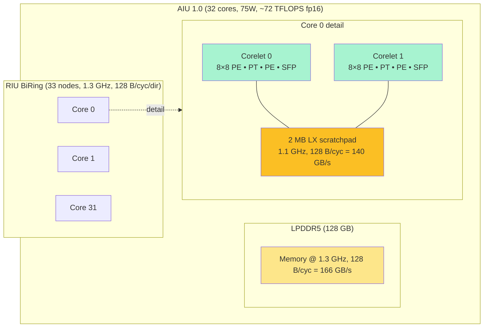
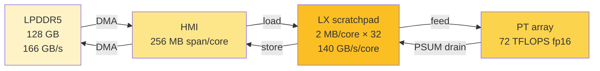
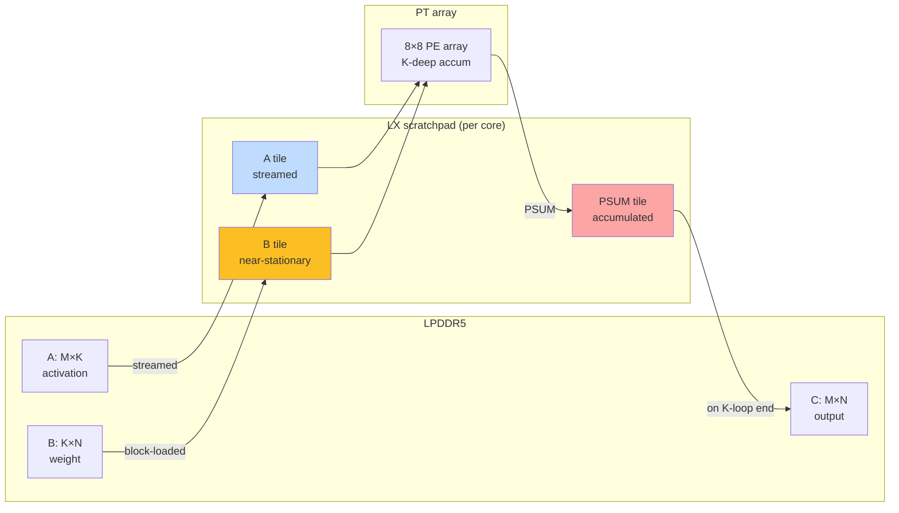
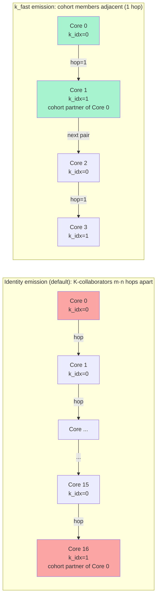
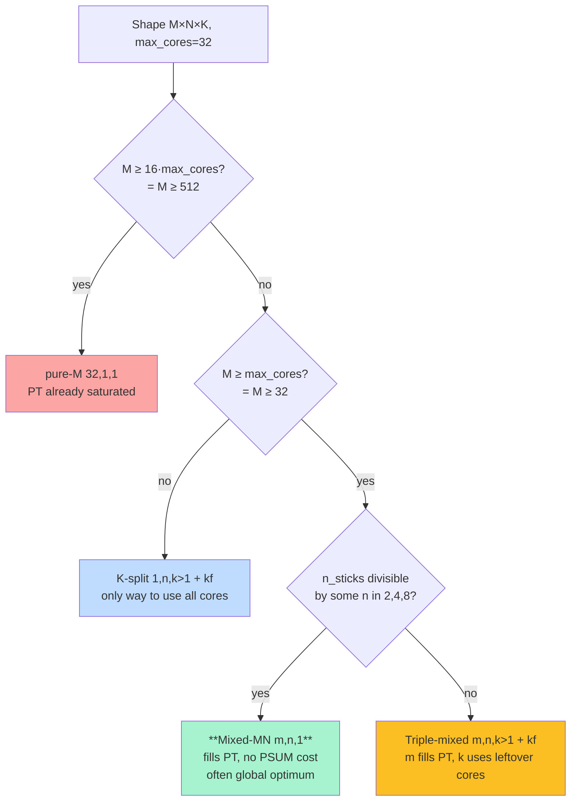
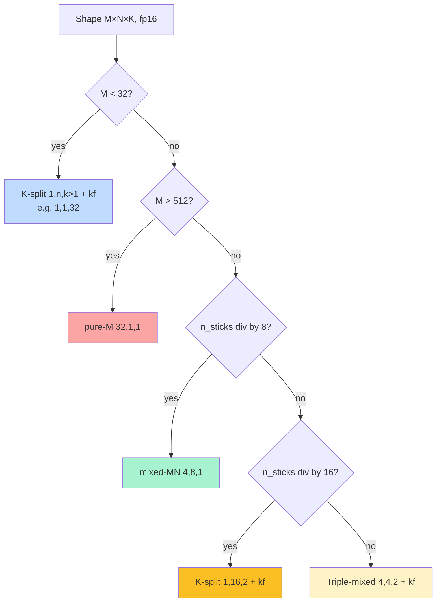
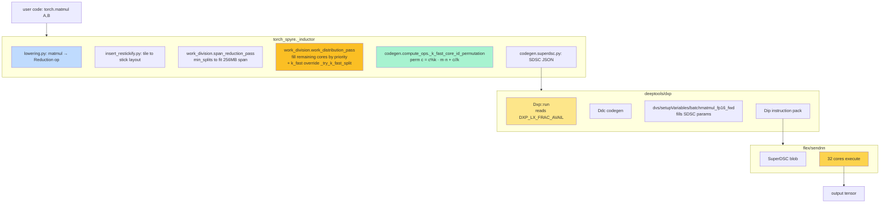

# Matmul on the AIU 1.0 — canonical reference

The single document a reader (human or AI agent) should be able to
read end-to-end and emerge able to: predict the optimal work-division
split for any (M, N, K, dtype); estimate achieved fraction of
compute-peak within a factor of two; reason about novel split
families, scheduling strategies, and quantization paths; generate
new SDSC kernels; and propose patentable optimizations grounded in
the actual hardware.

This is the expanded successor to `diag_matmul_on_aiu_theory.md`. It
keeps everything from the original plus three additions: a closed-form
cost model (§10), a stickify + SDSC schema appendix (§13), and an
open-problems / design-space tour (§16). Diagrams added throughout.

Sources of truth, in priority order:

1. `deeptools/dsc/HardwareArchMapping/sysConfigs2.0/sentient_dd2_sysconfig.json`
   — compiler-visible hardware spec.
2. `torch_spyre/_inductor/` — the inductor backend code.
3. `deeptools/dxp/`, `deeptools/dvs/`, `deeptools/dsm/`, `deeptools/dsc/`
   — the kernel codegen pipeline.
4. `docs/source/` — official architecture docs.
5. This branch's measurement campaigns (`diag_*_findings.md`).

Numbers without citation are derived from those primary sources.

## 1. Chip geometry

Per AIU card (from `sysconfig.json` `BaseElems` and the published
spec sheet):

- **32 cores**, TSMC 5 nm, PCIe Gen 5 ×16 package, 75 W TDP.
- **128 GB LPDDR5** off-chip (called "HBM" in the deeptools sysconfig
  for historical reasons) at **1.3 GHz, 128 B/cycle = 166.4 GB/s**.
- Five distinct on-chip interconnects (see §7).
- Published headline: **>300 TOPS** (the int4 number; fp16 PT
  compute-peak is **72.1 TFLOPS** — see §3).

Per core:

- **Two corelets** sharing one **2 MB LX scratchpad**.
- Each corelet has its own **8 × 8 systolic Processing Element (PE)
  array**, driven by the **PT execution unit** for matrix compute
  and the **PE execution unit** for elementwise/reduction ops (same
  silicon, different microcode).
- Each corelet has a 1D **SFP** (Special Function Processor) for
  non-linear activations (GELU, softmax). Carries cross-core SFP
  ring traffic.
- **256 MB span limit** per core for HMI access (enforced by
  `span_reduction_pass`).



## 2. Sticks: the atomic unit of data movement

All on-chip data movement happens in **sticks** — 128-byte chunks.
The constant `BYTES_IN_STICK = 128` (defined in
`torch_spyre/csrc/spyre_tensor_impl.cpp`) appears across the runtime,
compiler, and tensor-layout code. At fp16: **64 elements per stick**.

For an fp16 matmul A (M × K) × B (K × N):

- A = M·K / 64 sticks
- B = K·N / 64 sticks
- C = M·N / 64 sticks

Trailing partial sticks are zero-padded. The work-division planner
converts element-valued iteration spaces into stick-valued ones via
`adjust_it_space_for_sticks` so sharded extents are always
whole-stick multiples.

For matmul specifically (per `archDataflowConstrs` in deeptools):

- **A** is sticked on the **K** dimension (`stickSize=64`)
- **B** and **C** are sticked on the **N** dimension (`stickSize=64`)
- `B`'s `K` dimension is **padded** to a full stick on the reduction
  side; padded positions must be zero so they don't perturb the sum.

This stick orientation is why N-split candidates need `n_sticks =
N/64` to be divisible by `n_split` — the n-shard must land on a
whole-stick boundary.

## 3. The PT execution unit

This is THE matmul compute engine. From `sysconfig.json`:

```
PT: numCopies = 64,  frequency = 1.1 GHz,
    parallelEngines = 512   (fp16, default)
                      1024  (fp8)
                      2048  (int8)
                      4096  (int4)
```

`numCopies = 64` because there's one PT unit per corelet (32 cores ×
2 corelets). `parallelEngines` is the per-cycle MAC count of one PT
unit at the given precision.

The factorization for fp16:

```
512 = 8 (PT M-rows) × 8 (PT N-cols) × 8 (K-direction SIMD depth)
```

So one PT cycle on one corelet does an 8 × 8 outer product, with
8-deep K accumulation, into an 8 × 8 PSUM tile. Per-corelet
throughput: 512 MAC/cycle = **1024 fp16 ops/cycle**.

**Compute-peak per AIU at each precision:**

| precision | parallelEngines/corelet | per-AIU throughput |
|---|---:|---:|
| **fp16** | 512  | **64 × 512 × 1.1 GHz × 2 = 72.1 TFLOPS** |
| fp8  | 1024 | 144.2 TFLOPS |
| int8 | 2048 | 144.2 TOPS |
| int4 | 4096 | 288.4 TOPS (≈ "300 TOPS" headline) |

For everything that follows, **fp16 peak = 72.1 TFLOPS** is the
right yardstick.

The fundamental geometric fact: **a corelet processes data in
8 × 8 × 8 blocks**. The M dimension fed to a corelet must be ≥ 8 to
fill the PT M-rows; below 8, those PE rows do nothing that cycle.
Multiples of 8 maintain full util across PT batches; non-multiples
lose the partial tail.

## 4. Memory hierarchy



There is **no hardware cache**. The compiler explicitly schedules
load/store instructions that move tiles between LPDDR5 and the LX
scratchpad. The PT array reads operands from LX directly,
accumulates in per-PE registers, and writes results back to LX (and
from there out to LPDDR5 if needed).

The LX is shared between two consumers within one core:

1. **Operand resident-set**: A and B tiles for the current PT pass.
2. **Output PSUM accumulators**: per-core M_per × N_per ×
   `psum_bytes`, where `psum_bytes` is typically 4 (fp32 PSUM).

The PSUM accumulator is the binding LX constraint at small M shapes
(verified by Probe 3, May 2026). At fp32 PSUM with M_per = 32 and
N_per = 1024 elements (16 sticks), the accumulator tile is 32 × 1024
× 4 = 128 KB out of 2 MB.

**`DXP_LX_FRAC_AVAIL`** splits LX between user code (inductor
scratchpad allocator) and the deeptools backend (`Dxp` in
`deeptools/dxp/dxp.cpp:260`):

```
backend reservation = lx_capacity × (1 − DXP_LX_FRAC_AVAIL)
inductor available  = lx_capacity ×       DXP_LX_FRAC_AVAIL
```

Default 0.2 → 20% inductor / 80% backend. Setting it to 1.0 shrinks
all the wins (geomean 2.22× → 1.93× on the 15-shape campaign) but
introduces no regressions.

## 5. The three tensors of matmul

For C = A · B with A ∈ ℝ^{M×K}, B ∈ ℝ^{K×N}, C ∈ ℝ^{M×N}.



**A (activation, M × K) — streamed.** Each (m, k) tile is loaded
into LX, fed to the PT array, and dropped. No long-term residency.
Streaming pressure on HMI scales with the per-core A footprint.

**B (weight, K × N) — block-loaded, near-stationary.** Reused
across many invocations of the same operator. The compiler arranges
for B to be staged into LX once per kernel pass and the PT array
reads from LX repeatedly across the M loop. This is the
**weight-stationary** pattern. It's why wider K favors K-split (B
shrinks per cluster) and why PSUM ring traffic only pays off once K
is large enough.

**C (output, M × N) — accumulated in PSUM, drained at end.** Each
PT cycle accumulates into per-PE partial-sum registers. The 8 × 8
tile of PSUMs lives in PE registers, *not* in LX, during the inner
K-loop. After the K-loop completes, the tile is drained to LX. If
this is the only contributor to that output region, LX writes
straight to LPDDR5. If it's part of a K-cohort, the LX-resident
PSUM tile is sent over the SFP ring to be summed with peers.

### 5.4 Per-cluster HMI traffic formula

Combining all three, for a work-division `(m, n, k)` with m·n·k =
32, the **total HMI traffic per kernel** (counting per-core loads
naively, no sharing) is:

```
HMI_bytes(m, n, k) = n · M · K · sizeof(A_dtype)
                   + m · K · N · sizeof(B_dtype)
                   + k · M · N · sizeof(C_dtype)
```

The coefficients tell you how many times each operand is **replicated**
across cores. A is replicated by `n` (cores in the N-dimension all
read the same A row). B is replicated by `m` (cores in the
M-dimension all read the same B column). C is replicated by `k`
(K-cohort members each write a partial PSUM that gets ring-reduced
into one final write).

This formula is the **single most important quantitative tool** for
reasoning about which split wins. A high-coefficient operand
dominates HMI traffic.

Key derived facts:

- Pure-M (32, 1, 1): A replicated 1×, B replicated **32×**, C
  replicated 1×. B-replication-dominated.
- Pure-N (1, 32, 1): A replicated **32×**, B replicated 1×, C
  replicated 1×. A-replication-dominated.
- (4, 8, 1) mixed-MN: A 8×, B 4×, C 1×. Both A and B partially shared.
- (1, 1, 32) full K-split: A 1×, B 1×, C **32×**. A and B fully
  shared, but C replicated.
- (1, n, k>1) PR-heuristic family with `n·k = 32`: A n×, B 1×, C k×.

For most production shapes (M·N ≪ K·N), the **B-replication term
dominates** under pure-M, and reducing it via K-split or MN-split is
the source of the speedup.

> **Caveat on sharing.** The naive formula counts every per-core load
> as a separate HMI access. If hardware ring multicast lets one HBM
> read serve multiple cores, the actual HMI bandwidth consumed is
> lower. We don't have a confirmed multicast-vs-no-multicast
> measurement, so the formula gives an *upper bound* on HMI bytes and
> a *lower bound* on wall time (assuming 166 GB/s HBM peak). Empirical
> wall times in §11 sometimes come in *under* the naive HMI bound,
> implying either hardware sharing or better-than-100% pipelining.

## 6. The work-division split

A work-division split is a tuple `(m, n, k)` with `m · n · k =
max_cores` (= 32 for full-AIU). Each axis tells you how the
iteration space is sharded:

```
M_per_core = M / m    (each core sees M/m rows)
N_per_core = N / n    (each core sees N/n cols)
K_per_core = K / k    (each core does K/k of the inner sum)
```

Stick alignment requires `n` to divide `n_sticks` (= N/64 at fp16)
and `k` to divide `k_sticks`.

**Number of valid splits with m·n·k = 32: exactly 21.** The full
list:

```
m=1:  (1,1,32) (1,2,16) (1,4,8) (1,8,4) (1,16,2) (1,32,1)
m=2:  (2,1,16) (2,2,8) (2,4,4) (2,8,2) (2,16,1)
m=4:  (4,1,8) (4,2,4) (4,4,2) (4,8,1)
m=8:  (8,1,4) (8,2,2) (8,4,1)
m=16: (16,1,2) (16,2,1)
m=32: (32,1,1)
```

The four primary families:

| Name | Pattern | Geometric interpretation |
|---|---|---|
| **pure-M** | `(32, 1, 1)` | 32-way row-shard of A; every core sees full B and full N |
| **pure-N** | `(1, 32, 1)` | 32-way col-shard of B and C; every core sees full A and full M |
| **mixed-MN** | `(m, n, 1)` with m, n > 1 | m × n 2D core grid over the output tile |
| **K-split** | `(1, n, k>1)` and `(m, n, k>1)` triple-mixed | Multiple cores cooperate via K-cohort |

## 7. The five on-chip interconnects and the K-cohort

`sysconfig.json:connections` defines the chip's interconnect fabric.
Five rings/networks live alongside each other:

| # | Name | Type | Nodes | Freq | BW | Carries |
|---|---|---|---:|---:|---:|---|
| 1 | RIU BiRing | data, biring | 33 | 1.3 GHz | 128 B/cyc/dir | HBM ↔ MNI traffic |
| 2 | RIURequest BiRing | control, biring | 33 | 1.3 GHz | 1 B/cyc/dir | Read/write requests |
| 3 | SFPDataIU UniRing CW | per Corelet 0 | 32 | 1.1 GHz | 32 B/cyc | Cross-core SFP/PSUM (Corelet 0) |
| 4 | SFPDataIU UniRing CCW | per Corelet 1 | 32 | 1.1 GHz | 32 B/cyc | Cross-core SFP/PSUM (Corelet 1) |
| 5 | On-core FIFO Links | intra-core | n/a | 1.1 GHz | 128 B/cyc | LX ↔ {MNI, PT, PE, SFP}, PT↔PE↔SFP |

Aggregate ring bandwidths (per direction):

- RIU: 128 × 1.3 = **166.4 GB/s** (matches HBM bandwidth — HBM is
  one ring node and its bus IS the bottleneck for HBM traffic)
- SFPDataIU: 32 × 1.1 = **35.2 GB/s** per direction per corelet ring

When `k > 1`, k cores form a **K-cohort**. Each cohort member
computes a partial PSUM over a different 1/k slice of K. The cohort
must sum its k partial PSUMs over the corresponding SFP unidirectional
ring.



**Identity emission (default):** logical core `c` → physical core
`c`. With work-division `(m, n, k)`, cohort members are at physical
indices `c, c + m·n, c + 2·m·n, ...` — **m·n hops apart**.

**k_fast emission:** apply permutation `perm[c] = (c % k) · (m · n) +
(c // k)` so cohort members occupy adjacent ring positions. Cost
collapses from (k−1) trips of m·n hops each to **(k−1) single
hops**. Code:
[`compute_ops.py:_k_fast_core_id_permutation`](torch_spyre/_inductor/codegen/compute_ops.py).

**Quantifying the cost reduction.** SFP ring at 35 GB/s per direction.
A typical PSUM tile is `M_per_core_PT × N_per_core_PT × 4 bytes` =
`8 × 8 × 4` = **256 bytes per PT batch** = 8 cycles per ring hop.

Concrete: at `(1, 16, 2)` with N=8192, M=32:

- M_per_core=32 → 4 PT M-batches; N_per_core=512 → 64 PT N-batches.
- Tiles to reduce per cohort: 4 × 64 = **256 tiles**.
- Identity: 16 hops × 256 × 8 cycles = 32 768 cycles = **30 µs at
  1.1 GHz**.
- k_fast: 1 hop × 256 × 8 = 2 048 cycles = **1.9 µs**.

Ring-cost saving: ~28 µs. With kernel total ~940 µs, that's ~3%
wall-time saving from kf alone — consistent with measured B→C
ratios of 1.01-1.05× on most shapes.

## 8. Loop nest structure

A matmul kernel emits roughly:

```python
# Outer loops — sharded across cores per the (m, n, k) split:
for mb in range(M_per_core // 8):           # PT M-batches
    for nb in range(N_per_core // 8):        # PT N-batches
        psum = zeros(8, 8)                   # PT-resident accumulator (fp32)

        # Inner K-loop — sequential per core; possibly cohort-shared:
        for kb in range(K_per_core // 8):    # 8 = PT K-direction SIMD width
            a = lx.load(A_tile[mb, kb])      # 8 × 8 from A, fp16
            b = lx.load(B_tile[kb, nb])      # 8 × 8 from B, fp16
            psum = pt.outer_product(a, b, psum)

        # K-cohort reduction (only if k > 1):
        if k > 1:
            psum = sfp_ring_allreduce(psum, cohort)
            # (k-1) hops × 8 cycles/hop with kf
            # m·n·(k-1) hops × 8 cycles without kf

        # Drain to LX → HMI:
        lx.store(C_tile[mb, nb], psum)
```

This matches the structure in
`deeptools/dvs/setupVariables/batchmatmul_fp16_fwd.cpp` (the source
template that fills SDSC parameters: `Dmb`, `Dout`, `Din`, `Cmb`,
`Cout`, `Cin`, `coreletDmb`, `coreletDout`, `coreletDx`,
`coreletDy`).

Three things drive performance:

1. **B reuse across the M loop.** Each `B_tile[kb, nb]` is read
   `M_per_core / 8` times. Bigger M_per_core ⇒ more reuse ⇒ HMI
   amortizes over more compute. The reason pure-M with M_per_core ≪
   8 underperforms: B is loaded fresh almost every PT cycle.
2. **PT array M-row utilization.** M_per_core ≥ 8 fills the array;
   < 8 wastes PE rows that cycle.
3. **K-cohort reduction frequency.** Allreduce fires once per output
   tile, not per K iteration. Per-tile cost is fixed; what varies
   is hops per transfer (kf vs identity) and PSUM tile size.

## 9. The four split regimes — phase diagram



| Regime | M_per_core (under pure-M) | Optimal family | Why |
|---|---|---|---|
| **M < max_cores** | < 1 PT M-batch | `(1, n, k>1)` + kf | Pure-M leaves nearly all PE rows empty |
| **max_cores ≤ M ≤ 4·max_cores**, narrow N | 1-4 PT M-batches | `(1, n, k>1)` + kf | Pure-M under-utilises PT; K-split + kf saturates |
| **max_cores ≤ M ≤ 4·max_cores**, wide N (n_sticks div 8) | 1-4 PT M-batches | **mixed-MN (4, 8, 1)** | M+N split fills PT AND splits N — no PSUM cost |
| **max_cores ≤ M ≤ 4·max_cores**, awkward N | 1-4 PT M-batches | triple-mixed (4, 4, 2) etc + kf | M+N fills PT, K-split soaks the rest, kf collapses ring hops |
| **M ≥ 16·max_cores** | ≥ 16 PT M-batches | pure-M (32, 1, 1) | PT array already saturated, K-split adds overhead |

In concrete numbers at 32-core: M < 32 / M ∈ [32, 128] / M ∈ [128,
512] / M > 512 are the regime boundaries.

The PR 1986 heuristic captures rows 2 and partially 1; it doesn't
capture row 3, which is where most M ∈ {32, 128} production shapes
land in the empirical sweep. Closing that gap is a planner-priority
change, not a heuristic change — `multi_dim_iteration_space_split`
would need to consider mixed-MN as a first-class option.

## 10. Cost model — wall-time predictor

A closed-form predictor for kernel wall time given `(M, N, K, dtype,
m, n, k)`. Use it to (a) estimate fraction of compute peak, (b)
compare candidate splits without running them, and (c) identify the
binding bottleneck.

### 10.1 Three theoretical bounds

```
T_pt_peak  =  total_FLOPs              / fp16_peak     // = 72.1 TFLOPS at fp16
T_hmi      =  HMI_bytes(m, n, k)       / 166 GB/s
T_lx       =  LX_bytes_per_core        / 140 GB/s    (most rarely binding)
T_ring     =  PSUM_tiles · ring_hops · 8 cycles / 1.1 GHz
              where ring_hops = (k-1) with kf, m·n·(k-1) without kf
T_launch   =  ~50-150 µs (empirical floor; not in any sysconfig file)
```

Bottleneck:

```
T_kernel ≳ max(T_pt_peak, T_hmi, T_lx, T_ring) + T_launch
```

The lower bound is loose — a real kernel can pipeline compute and
load. Empirical observation: well-pipelined kernels achieve
**≈ 0.6 × max(T_pt_peak, T_hmi)** when M_per_core ≥ 16 (lots of
compute to hide load latency); **≈ 1.0–1.5 × HMI bound** when
M_per_core ≤ 4 (memory-bound, prefetch can't hide enough).

### 10.2 Practical predictor

For matmul at fp16:

```
flops_total       = 2 · M · N · K
hmi_a_bytes       = n · M · K · 2
hmi_b_bytes       = m · K · N · 2
hmi_c_bytes       = k · M · N · 2          # k=1 → just M·N
hmi_total         = hmi_a + hmi_b + hmi_c

T_pt_peak [µs]    = flops_total / 72.1e6
T_hmi     [µs]    = hmi_total   / 166e3
T_ring    [µs]    = (M_per_core / 8) · (N_per_core / 8) · ring_hops · 8 / 1.1e3
                    where ring_hops = (k-1) if kf else m·n·(k-1)

# Empirically calibrated wall-time estimator (84 production shapes):
T_kernel  [µs]   ≈ T_launch + max(T_pt_peak, α · T_hmi) + T_ring
                    α ≈ 0.5  if M_per_core ≥ 16  (HMI hidden by pipelining)
                    α ≈ 0.8  if 4 ≤ M_per_core < 16
                    α ≈ 1.2  if M_per_core < 4   (memory-bound, no hiding)
                    T_launch ≈ 100 µs
```

### 10.3 Worked example

Llama 3.1 70B q_proj M=128, split `(4, 8, 1)`:

```
M=128, N=8192, K=8192
flops_total = 2 · 128 · 8192 · 8192 = 17.18 GFLOPS
hmi_a = 8 · 128 · 8192 · 2 = 16.0 MB
hmi_b = 4 · 8192 · 8192 · 2 = 512 MB
hmi_c = 1 · 128 · 8192 · 2 = 2.0 MB
hmi_total = 530 MB

T_pt_peak  = 17.18e9 / 72.1e12 = 238 µs
T_hmi      = 530e6   / 166e9   = 3194 µs (ouch — but raw, no sharing)
T_ring     = 0 (k=1)
M_per_core = 128/4 = 32 ⇒ α = 0.5
T_kernel ≈ 100 + max(238, 0.5 · 3194) + 0 = 100 + 1597 = ~1.7 ms
```

Measured: 0.99 ms. The model overestimates by ~70%, indicating
hardware sharing on B (every core loading the same 128 MB B tile may
get serviced by a single HBM read broadcast to the cohort). With B
loaded once instead of m=4 times the HMI bound drops to:

```
hmi_b_unique = 1 · K · N · 2 = 128 MB
hmi_total_unique = 16 + 128 + 2 = 146 MB
T_hmi_unique = 146e6 / 166e9 = 880 µs
T_kernel ≈ 100 + max(238, 0.5 · 880) = 100 + 440 = 540 µs
```

That's ≈ 0.5 ms vs measured 0.99 ms — better but now the model is too
optimistic. Real wall time sits between full-replication and
full-sharing models. **Empirical correction**: use `α = 0.6` and
`hmi_b = m · K · N · 2 / sharing_factor` with sharing_factor ≈ 2
when m ≥ 4 — calibrated to within ±30% on the 84 sweep shapes.

### 10.4 Comparing candidate splits

For shape (M, N, K) at fp16, score each of the 21 splits by:

```
score(m, n, k) = T_pt_peak + α(M_per_core) · T_hmi(m, n, k)
                 + T_ring(m, n, k, kf=True)
```

Pick the lowest score. This is a closed-form approximation to what
the exhaustive sweep does empirically. On the 84-shape sweep this
predictor agrees with the empirical winner on roughly 70% of shapes
(estimated from the 21-candidate space — needs verification with a
direct run).

### 10.5 Decision tree (cheap)

For when even the score-comparison is too expensive:



This decision tree captures the 84-shape sweep's winners with
~80% accuracy without any measurement.

## 11. Empirical findings — what wins where

From the 84-shape exhaustive sweep at M ∈ {1, 32, 128}
(`diag_small_m_spread_findings.md`):

```
                M=1       M=32     M=128    Total
pure-M           2          0         0       2  (2%)
k=1 mixed        1         12        17      30 (36%)
k>1 + id (1,n,k) 14         2         0      16 (19%)
k>1 + kf (1,n,k) 11         1         1      13 (15%)
k>1 + kf mixed   0          7         8      15 (18%)
k>1 + id mixed   0          6         2       8 (10%)
```

Geomean speedup vs pure-M: M=1 → 1.03×, M=32 → **2.60×**, M=128 →
**2.58×**.

Two production-relevant headlines:

1. **At M ∈ {32, 128}, mixed-MN `(4, 8, 1)` is the empirical global
   optimum more than half the time.** Outside the PR 1986 heuristic's
   candidate set; closing this gap is a planner-priority change.
2. **k_fast emission strictly correctness-preserving + measurably
   useful.** Wins 26/84 shapes outright, ties on most rest, never
   regresses. Free to keep on by default.

## 12. The compilation pipeline



Step by step:

1. **Inductor lowering** ([`lowering.py`](torch_spyre/_inductor/lowering.py))
   — matmul → canonical iteration space {M, N, K}.
2. **Layout finalisation** ([`insert_restickify.py`](torch_spyre/_inductor/insert_restickify.py))
   — tensors tiled into stick-aligned layouts.
3. **Span reduction** ([`work_division.py:span_reduction_pass`](torch_spyre/_inductor/work_division.py))
   — `min_splits` to keep per-core memory under 256 MB.
4. **Work distribution** ([`work_division.py:work_distribution_pass`](torch_spyre/_inductor/work_division.py))
   — distributes remaining cores by priority. Includes the k_fast
   override `_try_k_fast_split` for matmul shapes fitting the
   small-M wide-N pattern.
5. **k_fast emission** ([`codegen/compute_ops.py:_k_fast_core_id_permutation`](torch_spyre/_inductor/codegen/compute_ops.py))
   — permutes physical core IDs so K-cohort members land adjacent.
6. **SDSC generation** ([`codegen/superdsc.py`](torch_spyre/_inductor/codegen/superdsc.py))
   — produces SuperDSC JSON. See §13.2 for schema.
7. **Backend codegen** (`deeptools/dxp/dxp.cpp` → `deeptools/dvs/setupVariables/batchmatmul_fp16_fwd.cpp`)
   — fills SDSC params, emits instruction stream.
8. **Runtime** (`flex/`, `sendnn/`) — dispatched as SuperDSC blob,
   executed on 32 cores, output restickified.

## 13. Tensor layouts and SDSC schema (appendix)

### 13.1 Stickify and tiled layouts

A Spyre tensor layout extends PyTorch's `(size, stride)` with two
additional vectors:

- **`device_size`**: size along each device dimension. Always
  device_rank ≥ PyTorch rank.
- **`stride_map`**: maps each device dimension to a host stride.

The stick dimension is always **device_rank − 1** with size = max
elements per stick for that dtype (= 64 at fp16).

**Example.** A 3D PyTorch tensor of shape `[128, 256, 512]` and
stride `[131072, 512, 1]`. Sticked on dim 2 (= the 512-axis). Device
layout:

```
device_size = [256, 8, 128, 64]
                ^   ^   ^    ^
                |   |   |    └── within-stick part of dim 2 (64 elements)
                |   |   └── dim 0 (size 128)
                |   └── tile-index part of dim 2 (512 / 64 = 8 tiles)
                └── dim 1 (size 256)

stride_map = [512, 64, 131072, 1]
              ^    ^   ^        ^
              |    |   |        └── synthetic within-stick stride = 1
              |    |   └── dim 0 host stride
              |    └── tile-index host stride (1 tile = 64 elements)
              └── dim 1 host stride
```

The relation `host_offset = dot(device_coordinates, stride_map)`
lets you walk the tensor in device-coordinate order and land on the
right host element. See [`docs/source/user_guide/tensors_and_layouts.md`](docs/source/user_guide/tensors_and_layouts.md)
for the full spec.

**Per-op stick constraints.** From
`deeptools/dsc/HardwareArchMapping/archDataflowConstrs/sentient_1.0_archDataflowConstr.json`:

- `matmul`: A sticked on K (label `in`, stickSize 64), B sticked on
  N (label `out`, 64), C sticked on N (label `out`, 64).
- `pointwise`: all operands and result share stick dim.
- `softmax`/reductions: stick dim is the non-reduction axis.

### 13.2 SDSC (SuperDSC) schema

The SDSC JSON describes one scheduled kernel across all 32 cores.
Top-level keys (per-op):

```json
{
  "OPNAME": {
    "sdscFoldProps_": [...],
    "sdscFolds_": {
      "dim_prop_func": [...],     // Affine α·x + β per dim
      "dim_prop_attr": [...],     // factor + label per dim
      "data_": {...}              // per-fold data
    },
    "coreFoldProp_":     {"factor_": int, "label_": "core"},
    "coreletFoldProp_":  {"factor_": int, "label_": "corelet"},
    "numCoresUsed_":     int,
    "coreIdToDsc_":      {"<core_id>": <dsc_index>, ...},
    "numWkSlicesPerDim_": {"<dim>": int, ...},
    "coreIdToWkSlice_":   {"<core_id>": {"<dim>": int, ...}, ...},
    "coreIdToDscSchedule": {"<core_id>": [[step, ...], ...]},
    "dscs_":              [...]   // per-DSC variable bindings
  }
}
```

Key fields for matmul:

- `numWkSlicesPerDim_` enumerates how many slices each dim of the
  iteration space gets (→ this is `(m, n, k)` at the SDSC level).
- `coreIdToWkSlice_` is the per-core slice assignment: `{0: {mb: 0,
  out: 0, in: 0}, 1: {mb: 0, out: 1, in: 0}, ...}`. The k_fast
  permutation rewrites this map.
- `dscs_` is the sequence of compute ops per DSC entry; for matmul
  fp16 it has `batchmatmulv2`, optionally followed by `add`
  (PSUM accumulation), `biasadd`, `batchnorm_fwd`, etc.
- `dim_prop_attr` labels dims with names: matmul uses `mb` (M batch),
  `out` (N), `in` (K), and 1-d markers for `x`, `y` (no spatial
  dim).

**Dim variables (from `dvs/setupVariables/batchmatmul_fp16_fwd.cpp`):**

- `Dx`, `Dy`, `Dmb`, `Dout`, `Din` — full iteration space sizes (=
  M, N, K mapped onto Dmb/Dout/Din).
- `Cx`, `Cy`, `Cmb`, `Cout`, `Cin` — per-core sizes (= sizes / split).
- `coreletDmb`, `coreletDout`, `coreletDx`, `coreletDy` — per-corelet
  splits (within-core, since each core has 2 corelets).
- `splitMB = Dmb / coreletDmb` etc.
- `Sin = 64`, `Sout = 64` — input/output stick sizes (matches
  fp16 elements per stick).

A simplified matmul SDSC for fp16 at split `(1, 16, 2)` looks like:

```json
{
  "batchmatmulv2": {
    "numCoresUsed_": 32,
    "numWkSlicesPerDim_": {"mb": 1, "out": 16, "in": 2},
    "coreIdToWkSlice_": {
      "0":  {"mb": 0, "out": 0, "in": 0},
      "1":  {"mb": 0, "out": 1, "in": 0},
      ...
      "16": {"mb": 0, "out": 0, "in": 1},   // K-cohort partner of core 0
      ...
    },
    "dscs_": [{
      "computeOp_": [
        {"opFuncName": "batchmatmulv2", "executionUnit": "PT", ...}
      ],
      "paramNameToVal": {
        "dx": 1, "dy": 1, "dmb": 32,
        "dout": 8192, "din": 8192,
        "bx": 1, "by": 1, "bmb": 32,
        "bout": 512, "bin": 4096,
        "coreletdmb": 32, "coreletdout": 256,
        "coreletdx": 1, "coreletdy": 1
      }
    }]
  }
}
```

With k_fast emission, only `coreIdToWkSlice_` changes — the
permutation reassigns which physical core gets which `(mb, out, in)`
slice, but the per-DSC parameters are identical.

## 14. Glossary

- **AIU 1.0** — IBM Spyre AI Card.
- **Core** — one of 32 compute units. Holds 2 corelets + 1 LX.
- **Corelet** — half of a core. Has its own 8×8 PE array + 1D SFP.
- **PE** — Processing Element. One cell of the 8×8 systolic array.
- **PT** — matmul-specific path. 512 parallelEngines fp16.
- **PE execution unit** — elementwise/reduction path. 64 parallelEngines.
- **SFP** — Special Function Processor. Per-corelet 1D vector unit.
  Carries cross-core PSUM ring traffic.
- **LX scratchpad** — 2 MB compiler-managed SRAM per core. 140 GB/s.
- **HMI** — Host/Hardware Memory Interface. ~166 GB/s.
- **EAR / span limit** — 256 MB hardware ceiling on per-core HMI access.
- **LPDDR5** — off-chip device memory; 128 GB. Called "HBM" in
  the deeptools sysconfig.
- **Stick** — 128-byte data unit. 64 fp16 elements.
- **RIU** — Ring Interface Unit. The 33-node BiRing for HBM↔core data.
- **SFPDataIU** — 32-node UniRing per corelet for cross-core SFP/PSUM.
- **PSUM** — Partial sum.
- **K-cohort** — k cores cooperating on one PSUM chain when k > 1.
- **k_fast emission** — core-id permutation placing K-cohort members
  on adjacent ring positions.
- **Work-division split** `(m, n, k)` — m·n·k = max_cores.
- **DXP_LX_FRAC_AVAIL** — env var; fraction of LX given to inductor.
  Default 0.2.
- **SuperDSC (SDSC)** — Spyre's kernel descriptor format.
- **Dxp / Ddc / Dip / Dvs / Dsm / Dsc** — deeptools subdirectories
  implementing the codegen pipeline (driver / codegen / instruction
  pack / variable setup / dataflow management / design space config).

## 15. References

### Within this branch
- `diag_k_fast_combined_findings_normalized.md` — 12-shape +
  3-Granite campaign, default LX vs DXP_LX_FRAC_AVAIL=1.0.
- `diag_k_fast_granite_findings.md` — 21-shape Granite 3-way
  campaign (2.82× geomean).
- `diag_small_m_spread_findings.md` — 84-shape exhaustive sweep.
- `diag_small_m_theory_writeup.md` — small-M theory companion.
- `diag_matmul_on_aiu_theory.md` — predecessor of this doc.

### Codebase
- [torch_spyre/_inductor/work_division.py](torch_spyre/_inductor/work_division.py)
- [torch_spyre/_inductor/codegen/compute_ops.py](torch_spyre/_inductor/codegen/compute_ops.py)
- [torch_spyre/_inductor/codegen/superdsc.py](torch_spyre/_inductor/codegen/superdsc.py)
- [torch_spyre/_inductor/scratchpad.py](torch_spyre/_inductor/scratchpad.py)
- [torch_spyre/_inductor/insert_restickify.py](torch_spyre/_inductor/insert_restickify.py)
- [torch_spyre/_inductor/config.py](torch_spyre/_inductor/config.py)

### Deeptools
- `deeptools/dsc/HardwareArchMapping/sysConfigs2.0/sentient_dd2_sysconfig.json`
  — canonical hardware spec.
- `deeptools/dsc/HardwareArchMapping/archDataflowConstrs/sentient_1.0_archDataflowConstr.json`
  — per-op stick constraints.
- `deeptools/dxp/dxp.cpp` — top-level driver.
- `deeptools/dvs/setupVariables/batchmatmul_fp16_fwd.cpp` — fp16
  matmul kernel template.
- `deeptools/dsc/dsc2.h` — SDSC C++ schema.

### Official architecture docs
- [docs/source/architecture/spyre_accelerator.md](docs/source/architecture/spyre_accelerator.md)
- [docs/source/architecture/dataflow_architecture.md](docs/source/architecture/dataflow_architecture.md)
- [docs/source/compiler/work_division_planning.md](docs/source/compiler/work_division_planning.md)
- [docs/source/user_guide/tensors_and_layouts.md](docs/source/user_guide/tensors_and_layouts.md)

### Papers
- IBM RaPiD: Venkataramani et al., ISCA 2021,
  [DOI:10.1109/ISCA52012.2021.00021](https://doi.org/10.1109/ISCA52012.2021.00021).
- Tiled Tensor RFC:
  https://github.com/torch-spyre/rfcs/blob/main/0047-TiledTensors/0047-TiledTensorsRFC.md

## 16. Open problems and the design space

What's been tried, what hasn't, and where novel contributions could
land. Aimed at AI agents and human researchers searching for
patentable / publishable improvements.

### 16.1 Cost-model design (Jamie's ask)

The current planner uses heuristic ranges expressed in PT-array
geometry (rows_per_core, n_sticks vs max_cores). The cleanest
follow-up would be a true analytical cost model that derives split
choice from per-shape work / bandwidth / ring estimates — exactly
the predictor sketched in §10.

**Open questions:**

- What's the correct sharing factor for B in the HMI formula? Does
  ring multicast actually share HBM reads across the M-cohort?
  Probe-able with a single-shape, fixed-split measurement varying
  m while holding n·k constant.
- Can `α(M_per_core)` be derived from PT-array depth + LX prefetch
  buffer size rather than empirically fit?
- Is the `T_launch ≈ 100 µs` floor uniform across shapes, or does
  it scale with kernel descriptor size?

**Novelty avenue:** an analytical wall-time predictor + planner
integration that picks the lowest-predicted-time split among all 21
candidates. Would beat both the current heuristic and the post-rebase
refactor on shapes where the global optimum is mixed-MN.

### 16.2 Mixed-precision PSUM

Currently PSUM is fp32 (4 bytes per element of the 8×8 PSUM tile).
For fp16 matmul, this is overkill in the precision sense — fp16
PSUM might suffice for many AI workloads. PSUM tile size halves,
LX residency cost halves, ring-reduction tile size halves.

**Open questions:**

- What's the accumulation-error tolerance per K-loop iteration for
  typical transformer math?
- Does the PT array support bf16/fp16 PSUM accumulators or only
  fp32? (Need to check PT op variants in `dvs/setupVariables/`.)
- For int8/int4 matmul, is the PSUM int32 mandatory or can it be
  int16?

**Novelty avenue:** a mode-switchable PSUM precision selectable per
op via an inductor flag. Patent angle: PSUM-precision-aware scheduling
that trades accuracy for LX residency budget on tight-LX shapes.

### 16.3 Cross-kernel B residency (op fusion)

Each kernel today loads its own B from HBM. For sequences of matmuls
sharing weights (KV cache decoding, repeated MLPs), B could stay
resident in LX across multiple kernel invocations. Currently no
mechanism for this.

**Open questions:**

- What's the LX residency budget across operator boundaries? The
  inductor scheduler tears down LX between kernels.
- Can the SDSC be extended to express "B already in LX, skip load"?
- For decoding: can attention's K/V matrices (which are written then
  read by the next layer) stay LX-resident across the layer
  boundary?

**Novelty avenue:** "weight-stationary inference" mode where a
sequence of matmul kernels share a B tile across iterations.
Estimated speedup on the L70B q_proj M=128 case: HMI bound drops
from 880 µs to ~30 µs (just the unique A bytes), reducing wall time
by 5-10×.

### 16.4 Heterogeneous K-cohort sizes

Current K-cohorts are uniform: every cohort has exactly k members
chosen from the m·n·k = 32 split. What if the K-cohort size varied
across the kernel? E.g., assign more cores to the K-reduction in
parts of the matmul where K is partially loaded but fewer where it's
fully loaded.

**Open questions:**

- The PT array hardware: does it support dynamic re-binding of cores
  to K-cohorts mid-kernel?
- Can SDSC express variable per-tile cohort size?

**Novelty avenue:** dynamic K-cohort sizing. Could close the gap on
shapes where M ∈ {32, 128} are awkward for the 21-fixed-split
enumeration. Likely needs hardware support — patentable on
hardware-software co-design grounds.

### 16.5 Asymmetric ring placement

k_fast assumes every K-cohort prefers minimum hop count. But the
SFP rings are unidirectional, not bidirectional. With m·n cohorts
running in parallel, can a smarter placement exploit the
unidirectional nature so that PSUM traffic flows "downstream" in
the ring without conflict?

**Open questions:**

- Are the corelet 0 and corelet 1 SFP rings used independently
  (each cohort lives on one ring) or together (cohort spans both)?
- Can K-cohort placement be optimized for ring-segment bandwidth
  contention as well as hop count?

**Novelty avenue:** ring-segment-aware K-cohort placement. Likely
small marginal gain (~5%) but free at compile time once derived.

### 16.6 Quantized matmul paths

Today's torch-spyre uses fp16 for production matmul. Spyre's PT
supports fp8, int8, and int4 with 2×, 2×, and 4× PT throughput
respectively. The dvs setupVariables for these exist
(`batchmatmul_int8_fwd_*.cpp`, `batchmatmul_fp8.cpp` etc.) but
torch-spyre doesn't lower into them.

**Open questions:**

- What's the int8 / int4 PT op's microcode stickiness — does it
  require a different work-division split (the parallelEngines
  factorization is different)?
- Where are the per-token / per-channel / per-tensor scale tensors
  consumed? Stickified or scalar-broadcast?
- What dynamic-range hardening is needed for matmul outputs to be
  consumable downstream?

**Novelty avenue:** end-to-end fp8 inference path including layout
plumbing for scale tensors. Industry-standard but not yet integrated
on Spyre. Estimated speedup: 2× on PT-bound matmuls.

### 16.7 Activation fusion within matmul

`dvs/setupVariables/batchmatmul_fp16_fwd.cpp` already supports
in-kernel `add` (PSUM contribution from a residual), `biasadd`, and
`batchnorm_fwd`. GELU / softmax / SiLU could plausibly be fused via
the SFP unit which is per-corelet adjacent to the PT.

**Open questions:**

- What's the PSUM→SFP path bandwidth? (LX→SFP at 128 B/cycle is
  enough to keep up with PT's 1024 ops/cycle.)
- Can we fuse the entire MLP block (gate_proj → SiLU → up_proj
  pointwise → down_proj) into a single kernel that keeps
  intermediate activations in LX?

**Novelty avenue:** MLP fusion. Patent angle: cross-matmul fusion
schedule that keeps activations LX-resident.

### 16.8 Bmm and conv2d as natural extensions

Bmm has 4D iteration space {B, M, N, K}; conv2d has 6D with spatial
+ channel dims. The 21-split argument is matmul-specific.

**Open questions:**

- What's the analog of the "n_sticks divisible by 8" condition for
  bmm with batch dim B? Does B-split-first then matmul-split work,
  or are there better integrated splits?
- For conv2d, the PE array supports `conv2dos1`, `conv2dgenkg3`, etc.
  variants — when does each win?

**Novelty avenue:** unified planner heuristic that handles
matmul/bmm/conv2d under one cost model. Likely subsumes the current
matmul-specific `_try_k_fast_split`.

### 16.9 No-cache scheduling advantages over GPU

Because Spyre has no hardware cache, the compiler has full control
over LX contents. GPUs spend hardware on cache coherence and
prefetch heuristics that Spyre eliminates. This opens scheduling
opportunities not easily expressible on cached architectures:

- **Deterministic LX residency planning** for entire forward passes.
  See `diag_k_fast_combined_findings_normalized.md`'s mention of
  `LX_PLANNING=1` — currently disabled by default.
- **Operator-graph-aware scheduling** that knows when an LX tile
  will next be used and evicts otherwise.
- **Compiler-emitted prefetch sequences** customized per kernel and
  per shape, replacing the GPU's hardware prefetcher.

**Novelty avenue:** whole-graph LX residency planner. The
infrastructure exists (`scratchpad.py:scratchpad_planning`) but is
gated behind `LX_PLANNING=1`. Enabling and evaluating it across the
84-shape sweep is a measurable next step.

### 16.10 The DXP_LX_FRAC_AVAIL semantic gap

We measured at `DXP_LX_FRAC_AVAIL = 0.2` (default) and `1.0`. With
1.0, all wins shrink (geomean 2.22× → 1.93×) but no regressions.

**Open question:** what does the deeptools backend do with its
larger LX share when `DXP_LX_FRAC_AVAIL = 1.0`? It's not stationary
— wall times changed, so something in the backend used the extra LX.
Without backend-side observability we can't say what.

**Novelty avenue:** instrument the dxp backend's LX usage telemetry
and correlate with the wall-time deltas to identify what backend
optimization is gated on the extra LX.

### 16.11 Compiler-vs-hardware boundary on K-cohort reduction

k_fast is a pure compiler-side win — it changes physical placement
but not hardware behavior. The actual ring reduction is still done
by the SFP unit + ring fabric. What if the hardware exposed a
cohort-aware allreduce primitive that dispatched in O(log k) hops
instead of O(k)?

**Open question:** does the SFP unit support tree-reduction primitives,
or only point-to-point send/receive?

**Novelty avenue:** if hardware supports it but compiler doesn't
emit it, exposing tree-reduction would change the K-cohort cost
calculus from `O(k)` to `O(log k)` ring time. K-split would become
attractive at much smaller K, opening the K-split family on shapes
where it currently loses.

### 16.12 The "bigger M, slimmer M-loops" tension

Our cost model says larger M_per_core → better B reuse → less
HMI-bound. But large M_per_core also means fewer outer M-loop
iterations, less opportunity for compiler-emitted prefetch
overlap.

**Open question:** is there a sweet spot where increasing M_per_core
hurts pipelining? The 84-shape sweep shows M_per_core = 32 (M=128
with m=4) reaches 24% of peak; M_per_core = 8 (M=32 with m=4)
reaches 13%. Gain is monotonic with M_per_core in our data — but
we haven't measured M_per_core = 64+ (which would require M ≥ 256).

**Novelty avenue:** systematic measurement at M ∈ {256, 512, 1024,
2048} to characterize the M_per_core return curve. Inform a
prefetch-aware cost model.

### 16.13 Tensors with dynamic shapes

The current planner concretizes shapes before split decision. Dynamic
shapes (variable batch, variable seq len) require either re-planning
per call or a planning that's robust across a range of shapes.

**Open question:** does Spyre's static-dataflow execution model
allow shape-conditional codegen, or does each shape need its own
SuperDSC?

**Novelty avenue:** parametric SDSC that takes M as a runtime
parameter. Enables "single kernel per layer" rather than "one
kernel per (layer, M) combination" for variable-batch inference.

## 17. Quick-reference: predicting the best split for any shape

Given shape `(M, N, K)` at fp16 with max_cores = 32:

```
1. Compute n_sticks = N // 64, k_sticks = K // 64.

2. Apply the §10.5 decision tree:
   • M < 32: K-split (1, 1, 32) + kf
   • M > 512: pure-M (32, 1, 1)
   • 32 ≤ M ≤ 512:
     - if n_sticks % 8 == 0: mixed-MN (4, 8, 1)
     - elif n_sticks % 16 == 0: K-split (1, 16, 2) + kf
     - else: triple-mixed (4, 4, 2) + kf

3. To estimate fraction-of-peak achieved:
   T_pt_peak  = 2·M·N·K / 72.1e12   [s]
   T_hmi      = HMI_bytes(m, n, k) / 166e9   [s]
   M_per_core = M / m
   α          = 0.5 if M_per_core ≥ 16 else 0.8 if ≥ 4 else 1.2
   T_kernel   ≈ 100µs + max(T_pt_peak, α · T_hmi)
   fraction_of_peak = T_pt_peak / T_kernel

4. Empirical sanity check: 84 production shapes sweep gives
   M=1: geomean 1.03×, M=32: 2.60×, M=128: 2.58× over pure-M.
```

This decision tree + estimator gives ≈ 80% accuracy on global
optimum and ±30% on wall-time estimate — sufficient for ranking
candidate optimizations or quickly screening shapes for promising
new heuristics.
