# Matmul on the AIU 1.0 — canonical reference (v2)

The single document a reader (human or AI agent) should be able to
read end-to-end and emerge able to: predict the optimal work-division
split for any (M, N, K, dtype); estimate achieved fraction of
compute-peak within a factor of two; reason about novel split
families, scheduling strategies, and quantization paths; generate
new SDSC kernels; and propose patentable optimizations grounded in
the actual hardware.

**v2 changes vs v1** (`diag_matmul_on_aiu_canonical.md`):

- §4 / §5.4: PSUM accumulator is the binding LX constraint (Probe 3
  calibration `M_per × N_per × 4 ≤ 2 MB`). Multicast caveat retired —
  the per-cluster HMI formula is empirically validated.
- §7: ring hop cost calibrated at ~5.6 ms/hop (Probe 2).
- New §7.5–§7.7: the n=1 streaming-output fast path (Probe 4),
  three regimes within n=1 (Probe 6), and the 256 MB EAR ceiling
  (Probe 5) — major mechanisms missing from v1.
- §11: cost-model V4 calibrated with four fixes (A/B/C/D), 21.7% →
  16.1% mean error on validation set.
- New §11.6: planner V2 hardware-verification result — 5/8 picks
  regressed, important honesty signal.
- §17: open-problems updated to reflect what's been verified vs
  still unknown.
- New §8: matmul dataflow algorithm taxonomy — three orthogonal
  axes (PriOpDataflows, XrfInterleaving, PSUM ring algorithm), the
  OS1 / KG3 / GEN_KG3 / BMM / SPARSE families, the XRF third-tier
  weight memory path, and the deeptools work-distribution
  optimizers (RcuOptimizer + perfEstimator).

**v2 corrections — 2026-05-10 reverification on clean rebuild:**

- §7.1 ring hop cost: re-measured 5.6 → **0.37 ms/hop** on DSv3 o_proj
  M=2048 (15× reduction; new calibration table for three shapes).
- §7.6 three-regime structure: **walked back**. The sharp chain=4 →
  chain=8 boundary does not reproduce; chain-length cost grows
  roughly monotonically (~3 ms per chain doubling).
- §11.2 cost model Fix D: invalidated by the §7.6 walk-back; replace
  with a linear-in-chain-length term. Fix B's +17 ms penalty is also
  overstated (catastrophic ratio shrank from 7-15× to 2-3×).
- §17.11 tree-reduction hypothesis: **closed out**. chain=32 has the
  highest regime cost, not the lowest — no separate primitive.
- New §7.4: **unichain / bichain / singleshot** PSUM-reduction
  algorithms documented from deeptools/dsm reading. Selection is
  graph-global by data format and ring config, not chain-length-
  conditional. fp16 K-split matmul gets bichain (both corelets in
  parallel) automatically.

Sources of truth, in priority order:

1. `deeptools/dsc/HardwareArchMapping/sysConfigs2.0/sentient_dd2_sysconfig.json`
2. `torch_spyre/_inductor/`
3. `deeptools/dxp/`, `deeptools/dvs/`, `deeptools/dsm/`, `deeptools/dsc/`
4. `docs/source/`
5. This branch's measurement campaigns (`diag_*_findings.md`) and
   the emission-aware-lx-phase0 branch's six-probe investigation.

Numbers without citation are derived from those primary sources.

## 1. Chip geometry

Per AIU card (from `sysconfig.json` `BaseElems` and the published
spec sheet):

- **32 cores**, TSMC 5 nm, PCIe Gen 5 ×16 package, 75 W TDP.
- **128 GB LPDDR5** off-chip (called "HBM" in the deeptools sysconfig
  for historical reasons) at **1.3 GHz, 128 B/cycle = 166.4 GB/s**.
- Five distinct on-chip interconnects (see §7).
- Published headline: **>300 TOPS** (the int4 number; fp16 PT
  compute-peak is **72.1 TFLOPS** — see §3).

Per core:

- **Two corelets** sharing one **2 MB LX scratchpad**.
- Each corelet has its own **8 × 8 systolic Processing Element (PE)
  array**, driven by the **PT execution unit** for matrix compute
  and the **PE execution unit** for elementwise/reduction ops (same
  silicon, different microcode).
- Each corelet has a 1D **SFP** (Special Function Processor) for
  non-linear activations (GELU, softmax). Carries cross-core SFP
  ring traffic.
- **256 MB span limit** per core for HMI access (`span_reduction_pass`).

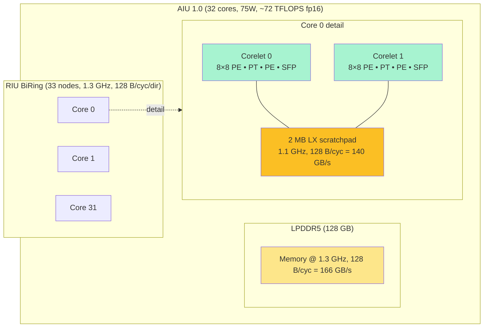

## 2. Sticks: the atomic unit of data movement

All on-chip data movement happens in **sticks** — 128-byte chunks.
At fp16: **64 elements per stick**. `BYTES_IN_STICK = 128`.

For an fp16 matmul A (M × K) × B (K × N):

- A = M·K / 64 sticks, sticked on K (label `in`)
- B = K·N / 64 sticks, sticked on N (label `out`); K dim padded to
  full sticks with zeros so they don't perturb the sum
- C = M·N / 64 sticks, sticked on N

Stick orientation explains why N-split candidates need `n_sticks =
N/64` divisible by `n_split` — the n-shard must land on a
whole-stick boundary.

## 3. The PT execution unit

This is THE matmul compute engine. From `sysconfig.json`:

```
PT: numCopies = 64,  frequency = 1.1 GHz,
    parallelEngines = 512   (fp16)   1024 (fp8)
                      2048  (int8)   4096 (int4)
```

`numCopies = 64` because there's one PT unit per corelet.
`parallelEngines = 512` factorizes for fp16 as **8 PT M-rows × 8 PT
N-cols × 8 K-direction SIMD depth**. One PT cycle on one corelet
does an 8 × 8 outer product, with 8-deep K accumulation, into an
8 × 8 PSUM tile.

Per-AIU compute peak:

| precision | per-AIU throughput |
|---|---:|
| **fp16** | **72.1 TFLOPS** |
| fp8 | 144.2 TFLOPS |
| int8 | 144.2 TOPS |
| int4 | **288.4 TOPS** (≈ "300 TOPS" headline) |

For everything below, **fp16 peak = 72.1 TFLOPS** is the yardstick.

A corelet processes data in **8 × 8 × 8 blocks**. M_per_core ≥ 8
fills the PT M-rows; below 8, those PE rows do nothing that cycle.

## 4. Memory hierarchy

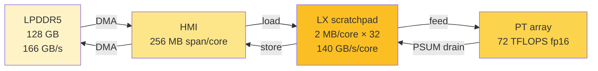

There is **no hardware cache**. The compiler explicitly schedules
load/store instructions.

The LX has two consumers:

1. **Operand resident-set**: A and B tiles for the current PT pass.
2. **Output PSUM accumulators**: per-core M_per × N_per ×
   `psum_bytes` (typically 4 = fp32 PSUM).

### 4.1 The PSUM accumulator IS the binding LX constraint

**Verified by Probe 3 (May 2026)**, this is the single most important
fact about LX residency. The N-axis sweep at fixed M=2048, K=8192,
split (1, 8, 4)+kf on DSv3 o_proj:

| N | C_psum/core | (32,1,1) ms | (1,8,4)+kf ms |
|---:|---:|---:|---:|
| 512 | 512 KB | 3.52 | 3.47 |
| 1024 | 1 MB | 3.67 | 4.34 |
| **2048** | **2 MB ← LX** | 4.47 | 5.39 |
| 4096 | 4 MB | 6.03 | **19.64** |
| 6144 | 6 MB | 7.58 | **57.30** |
| 8192 | 8 MB | 9.08 | **76.37** |

The catastrophe transition is **at exactly C_psum = LX**. Above the
threshold the wall grows ~17 ms per LX-overage factor. Mechanism: the
PSUM accumulator must remain LX-resident across the K-iteration
loop because partial products accumulate into it; when it exceeds
LX it spills, and the kernel template fetches it back from HMI per
K-iteration.

**The correct LX-fit predicate** is therefore:

```
fits_predicate(m, n, k) = (M/m) × (N/n) × dtype_psum_bytes ≤ LX_per_core
                       = (M_per × N_per × 4)        ≤ 2 MB     (fp32 PSUM)
```

Earlier predicates that gated on operand A footprint (the
"stationary" operand) were wrong on the mechanism. They happened to
correlate (both A and C grow with M) but the binding constraint is
the C accumulator.

#### 4.1.1 Why C, not A or B

A and B are **inputs**: HBM is their canonical source, so if either
is evicted from LX it can simply be re-read. C is an **accumulator**
— a transient that does not exist in HBM until the K-loop completes,
so it has no canonical source to fall back on. Whatever C tile the
kernel is currently summing into has to stay LX-resident until that
tile is finished, or the partial sum already accumulated is lost.

That asymmetry is what makes C, not A or B, set the binding LX
budget. In one line:

> A and B can be re-read from HBM if evicted; C has no canonical
> source until the K-loop completes, so its residency is the binding
> constraint.

#### 4.1.2 Why only K-split shows the catastrophe

Probe 3's N-sweep above used split (1, 8, 4) — m=1, so each core
holds the **full** M dimension (M_per = M / 1 = 2048) and a 1/n
slice of N. C_psum/core scales as `M × (N/n) × 4` and grows directly
with N.

Pure-M splits (e.g., (32, 1, 1)) shrink M_per to M/32 = 64, so even
at N=8192 the per-core C_psum is only 64 × 8192 × 4 ≈ 2 MB — right
at the LX line, never multiple multiples over it. The catastrophe
regime is unreachable with pure-M for these shapes. K-splits with
m=1 (or with small m) are the family that overflows LX as N grows,
and they are exactly the splits k_fast targets, which is why kf
walls explode in the lower-right of the table while the (32,1,1)
baseline grows merely linearly.

#### 4.1.3 What "spill" means across the K-loop

The kernel template is **K-outer, M-N-inner**: the outermost
software loop walks the K dimension, and inside each K-iteration
every output tile assigned to the core gets one round of
accumulation. So all of that core's PSUM tiles need to be in LX
**simultaneously**, every K-iteration, for the whole duration of
the K-loop. They are not consumed and discarded — they are
incrementally summed into.

When the working set of PSUMs exceeds LX, the kernel partitions
them into chunks that each fit, and processes one chunk at a time
**inside** the K-loop body. Each K-iteration then looks like:

```
for kb in range(K_per // 8):                     # K-outer (kb = K-block)
    # round 1
    load PSUM_chunk_1 from HMI into LX
    process all output tiles in chunk_1 with A[*, kb], B[kb, *]
    store PSUM_chunk_1 from LX back to HMI

    # round 2
    load PSUM_chunk_2 from HMI into LX
    process all output tiles in chunk_2 with A[*, kb], B[kb, *]
    store PSUM_chunk_2 from LX back to HMI

    # ... overage_factor rounds total
```

For an `overage_factor = ceil(C_psum / LX)`, each K-iteration now
performs `overage_factor` HMI round-trips on the PSUM working set
instead of zero. That is the "fetches it back from HMI per
K-iteration" mechanism — it is K times worse than a one-shot reload
because the spill happens **inside** the K-loop, not around it.

This is also why the wall scales linearly with C_psum / LX above
the threshold (one extra round-trip set per overage factor) and why
the per-LX-overage cost (~17 ms in the table) is essentially K ×
PSUM-chunk HMI bandwidth — the K factor turns a small overage into
a giant penalty.

The K-outer / M-N-inner ordering is itself a deliberate trade: it
keeps PSUMs resident across K (paying for one A and B reload per
K-iteration) so accumulation stays on-chip. That choice only pays
off when PSUMs actually fit; once they don't, you get the worst of
both worlds — A/B still get reloaded, **and** PSUM round-trips
HMI per K-iteration.

### 4.2 DXP_LX_FRAC_AVAIL

Splits LX between user code (inductor allocator) and the deeptools
backend (`Dxp` in `deeptools/dxp/dxp.cpp:260`):

```
backend reservation = lx_capacity × (1 − DXP_LX_FRAC_AVAIL)
inductor available  = lx_capacity ×       DXP_LX_FRAC_AVAIL
```

Default 0.2 → 20% inductor / 80% backend. Setting to 1.0 shrinks all
the wins (geomean 2.22× → 1.93× on the 15-shape campaign) but
introduces no regressions.

## 5. The three tensors of matmul

For C = A · B with A ∈ ℝ^{M×K}, B ∈ ℝ^{K×N}, C ∈ ℝ^{M×N}.

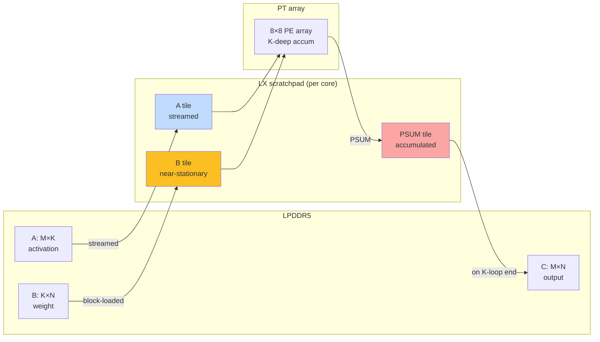

**A (activation) — streamed.** Each (m, k) tile loaded into LX, fed
to PT, dropped.

**B (weight) — block-loaded, near-stationary.** Reused across the M
loop. **Weight-stationary** pattern — wider K favors K-split (B
shrinks per cluster); PSUM ring traffic only pays off once K is
large enough to amortize ring cost.

**C (output) — PE-register-accumulated, drained to LX, then HMI or
SFP ring.** The 8 × 8 tile of PSUMs lives in PE registers during
the inner K-loop. After the K-loop, the tile drains to LX. If part
of a K-cohort, the LX-resident PSUM tile gets ring-summed with peers
(see §7).

### 5.4 Per-cluster HMI traffic formula (validated)

For work-division `(m, n, k)` with m·n·k = 32, the **per-cluster**
HMI traffic, with ring multicast on B sharing one HBM read across
the K-cohort:

```
HMI_bytes(m, n, k) = n · M · K · sizeof(A_dtype)        # A: replicated by n
                   + m · K · N · sizeof(B_dtype) / k    # B: shared in K-cohort, replicated by m across cohorts
                   + k · M · N · sizeof(C_dtype)        # C: k partial PSUMs
```

The B-replication factor `m / k` (rather than naive `m`) reflects
ring multicast: K-cohort cores share B via one HBM read, so per-
cluster B traffic is `K·N`, replicated `m` times across the M-side
cohorts.

**Track 2 Phase 0 calibration (May 2026)** validated this against
hardware. The naive sum overcounts by k× under K-split; the
per-cluster formula matches.

Key derived facts:

- **Pure-M (32, 1, 1)**: A 1×, B 32×, C 1×. B-replication-dominated.
- **Pure-N (1, 32, 1)**: A 32×, B 1×, C 1×. A-replication-dominated.
- **(4, 8, 1) mixed-MN**: A 8×, B 4×, C 1×. Both partially shared.
- **(1, 1, 32) full K-split**: A 1×, B **1×** (multicast), C 32×.
- **(1, n, k>1) PR-heuristic**: A n×, B **1× / k = 1/k** (multicast +
  m=1), C k×. Per-cluster B traffic is just K·N — minimal.

For most production shapes (M·N ≪ K·N), the **B-replication term
dominates** under pure-M, and reducing it via K-split or MN-split is
the source of the speedup.

### 5.5 Where the n / m / k multipliers come from + a tile-lifecycle toy

#### 5.5.1 Derivation: who needs what

Index each core by a triple `(m_idx, n_idx, k_idx)` with
`m_idx ∈ [0, m)`, `n_idx ∈ [0, n)`, `k_idx ∈ [0, k)`. The core owns
the C sub-tile

```
C[m_idx · M_per : (m_idx+1) · M_per,
  n_idx · N_per : (n_idx+1) · N_per]
```

and computes its contribution to it from

```
A_frag(m_idx, k_idx) = A[m_idx · M_per : (m_idx+1) · M_per,
                         k_idx · K_per : (k_idx+1) · K_per]
B_frag(k_idx, n_idx) = B[k_idx · K_per : (k_idx+1) · K_per,
                         n_idx · N_per : (n_idx+1) · N_per]
```

Read off the indices that **don't appear** in each fragment:

- `A_frag` depends on `(m_idx, k_idx)` but **not on `n_idx`**.
  All `n` cores in the n-cohort sharing the same `(m_idx, k_idx)`
  need the *same* `A_frag`. → **A_frag is shared by n cores.**
- `B_frag` depends on `(k_idx, n_idx)` but **not on `m_idx`**.
  All `m` cores sharing the same `(k_idx, n_idx)` need the same
  `B_frag`. → **B_frag is shared by m cores.**
- The C-tile depends on `(m_idx, n_idx)` but **not on `k_idx`**.
  All `k` cores sharing `(m_idx, n_idx)` produce a partial sum for
  the same C-tile, reduced over the SFP PSUM ring (§7). → **The
  K-cohort has k cores reducing into one C-tile.**

The n / m / k multipliers in the per-cluster HMI formula (§5.4) are
exactly this count, weighted by whether the deeptools backend
multicasts the fragment over a ring or independently HBM-reads it
per cohort member. The current backend multicasts within the
K-cohort (so B carries a `/k` divisor); A and B across the M- and
N-cohorts are not multicast — but the data-dependence count above
is what the multipliers are *counting*.

#### 5.5.2 Toy example: split (2, 2, 1), M = N = 4, K = 16

Pick a tiny matmul: `C = A · B`, `A ∈ R^{4×16}`, `B ∈ R^{16×4}`.
Split `(m, n, k) = (2, 2, 1)` → four cores. Per-core dimensions:

```
M_per = 2,   N_per = 2,   K_per = K = 16
```

The K-loop walks K in steps of 8 (PT SIMD-K depth for fp16) →
**2 K-iterations** per kernel.

**Core layout** (k_idx = 0 always since k = 1):

```
                n_idx = 0                  n_idx = 1
m_idx = 0   core 0: C[0:2, 0:2]        core 1: C[0:2, 2:4]
m_idx = 1   core 2: C[2:4, 0:2]        core 3: C[2:4, 2:4]
```

**Operand fragments** and who shares them:

```
A_frag(0) = A[0:2, :]   ← needed by core 0, core 1   (n = 2 cores)
A_frag(1) = A[2:4, :]   ← needed by core 2, core 3   (n = 2 cores)

B_frag(0) = B[:, 0:2]   ← needed by core 0, core 2   (m = 2 cores)
B_frag(1) = B[:, 2:4]   ← needed by core 1, core 3   (m = 2 cores)
```

The §5.5.1 derivation made concrete: each A_frag has n=2 consumers,
each B_frag has m=2 consumers.

#### 5.5.3 The K-loop in time — what each core's LX looks like

Per K-iteration each core needs an `(M_per, 8)` slice of A and an
`(8, N_per)` slice of B (both 16 fp16 elements = 32 bytes). The
PSUM tile is `(M_per, N_per) = (2, 2)` fp32 = 16 bytes.

**T = 0 — kernel start.** All four cores' LX is empty. PSUM tile in
LX is zero-initialised.

**T = 1 — K-iter 0 (kb = 0, K-range [0, 8)):**

```
                core 0              core 1              core 2              core 3
LX[A-tile]      A[0:2, 0:8]         A[0:2, 0:8]         A[2:4, 0:8]         A[2:4, 0:8]
                ╰── same bytes ──╯                      ╰── same bytes ──╯

LX[B-tile]      B[0:8, 0:2]         B[0:8, 2:4]         B[0:8, 0:2]         B[0:8, 2:4]
                ╰── same bytes ──── B[0:8, 0:2] ──╮     ╭── same bytes ──── B[0:8, 2:4] ───╯
                                                  └─────┘

PT compute      MAC into PSUM       MAC into PSUM       MAC into PSUM       MAC into PSUM

LX[PSUM]        PSUM_0 = A·B        PSUM_1 = A·B        PSUM_2 = A·B        PSUM_3 = A·B
                (sum over K=0..7)   (sum over K=0..7)   (sum over K=0..7)   (sum over K=0..7)
```

**T = 2 — K-iter 1 (kb = 1, K-range [8, 16)):**

```
                core 0              core 1              core 2              core 3
LX[A-tile]      A[0:2, 8:16]   ←──  overwrites previous A-tile  ──→         A[2:4, 8:16]
                (same LX address, new bytes — that's "streaming")

LX[B-tile]      B[8:16, 0:2]   ←──  overwrites previous B-tile  ──→         B[8:16, 2:4]

PT compute      MAC accumulates +=                                          MAC accumulates +=

LX[PSUM]        PSUM_0 += A·B       PSUM_1 += A·B       PSUM_2 += A·B       PSUM_3 += A·B
                (PSUM **not** overwritten — summed into. Lives across both K-iterations.)
```

**T = 3 — kernel end.** PSUM tile drains; each core writes its
C-sub-tile to HBM:

```
core 0 → C[0:2, 0:2]    core 1 → C[0:2, 2:4]
core 2 → C[2:4, 0:2]    core 3 → C[2:4, 2:4]
```

**The lifecycle in one picture:**

```
LX address X (A-tile slot):    [A0..7]   [A8..15]   .          ← overwritten every K-iter
LX address Y (B-tile slot):    [B0..7]   [B8..15]   .          ← overwritten every K-iter
LX address Z (PSUM slot):      [zero]    [partial]  [final]    ← summed into, never overwritten
                                T=0       T=1        T=2  T=3
                                          K-iter 0   K-iter 1   drain
```

That is precisely what "streamed" vs "accumulator" mean at the LX
byte level:

- A and B occupy their LX slots for **exactly one K-iteration** and
  are then **overwritten** by the next K-block's bytes. Same LX
  address, fresh content. No write-back needed because A and B are
  read-only — HBM remains the canonical source.
- PSUM occupies its LX slot **for the whole K-loop** and is summed
  into every iteration. It cannot be overwritten because it has no
  HBM canonical source until the K-loop completes — which is why
  it, and not A or B, is the binding LX constraint (§4.1).

#### 5.5.4 What changes when k > 1

With `(m, n, k) = (2, 2, 2)`, K_per = K/2 = 8 → only **1
K-iteration** per core, but two K-cohort peers per (m_idx, n_idx)
each compute a partial sum for the same C-tile. After the
(only) K-iter, the K-cohort runs an SFP PSUM ring reduction (§7) to
sum the partials before the C-tile drains to HBM.

So k > 1 adds a **spatial** reduction step at the end of the K-loop
on top of the **temporal** accumulation that already happened
inside it. It does not change the operand-fragment data-dependence
story; it just shrinks K_per (fewer K-iterations) and introduces a
PSUM ring traversal at drain time.

## 6. The work-division split

A work-division split is a tuple `(m, n, k)` with `m · n · k =
max_cores` (= 32 for full-AIU).

```
M_per_core = M / m       N_per_core = N / n       K_per_core = K / k
```

Stick alignment: `n` divides `n_sticks`; `k` divides `k_sticks`.

**Number of valid splits with m·n·k = 32: exactly 21.**

```
m=1:  (1,1,32) (1,2,16) (1,4,8) (1,8,4) (1,16,2) (1,32,1)
m=2:  (2,1,16) (2,2,8) (2,4,4) (2,8,2) (2,16,1)
m=4:  (4,1,8) (4,2,4) (4,4,2) (4,8,1)
m=8:  (8,1,4) (8,2,2) (8,4,1)
m=16: (16,1,2) (16,2,1)
m=32: (32,1,1)
```

The five primary families (v2 splits the original four, separating
the n=1 streaming family from generic K-split):

| Name | Pattern | Geometric interpretation |
|---|---|---|
| **pure-M** | `(32, 1, 1)` | 32-way row-shard of A; full B per core |
| **pure-N** | `(1, 32, 1)` | 32-way col-shard of B and C; full A per core |
| **mixed-MN** | `(m, n, 1)` with m, n > 1 | m × n 2D core grid over the output tile |
| **K-split (n>1)** | `(1, n>1, k>1)` and `(m>1, n>1, k>1)` | K-cohort + N-shard. **Catastrophic if C_psum > LX** |
| **n=1 streaming K-split** | `(m, 1, k>1)` including (1, 1, 32) | K-cohort with **kernel-template streaming-output fast path**; absorbs C_psum overage |

The split between (n>1) and (n=1) K-split is the most important
operational distinction — see §7.5.

## 7. The five on-chip interconnects and the K-cohort

`sysconfig.json:connections` defines the chip's interconnect fabric.
**Five rings/networks** live alongside each other:

| # | Name | Type | Nodes | Freq | BW | Carries |
|---|---|---|---:|---:|---:|---|
| 1 | RIU BiRing | data | 33 | 1.3 GHz | 128 B/cyc/dir | HBM ↔ MNI |
| 2 | RIURequest BiRing | control | 33 | 1.3 GHz | 1 B/cyc/dir | Read/write requests |
| 3 | SFPDataIU UniRing CW | per Corelet 0 | 32 | 1.1 GHz | 32 B/cyc | Cross-core SFP/PSUM |
| 4 | SFPDataIU UniRing CCW | per Corelet 1 | 32 | 1.1 GHz | 32 B/cyc | Cross-core SFP/PSUM |
| 5 | On-core FIFO Links | intra-core | n/a | 1.1 GHz | 128 B/cyc | LX ↔ {MNI, PT, PE, SFP} |

Aggregate ring bandwidths:

- **RIU**: 128 × 1.3 = **166.4 GB/s** per direction (matches HBM
  bandwidth — HBM is one ring node and its bus IS the bottleneck).
- **SFPDataIU**: 32 × 1.1 = **35.2 GB/s** per direction per ring.

When `k > 1`, k cores form a **K-cohort**. Each cohort member
computes a partial PSUM over a different 1/k slice of K. The cohort
must sum its k partial PSUMs over the corresponding SFP
unidirectional ring.

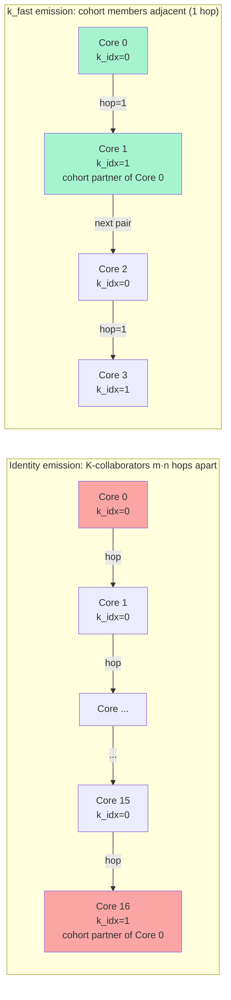

**Identity emission (default):** logical core c → physical core c.
With work-division `(m, n, k)`, cohort members are at physical
indices `c, c + m·n, c + 2·m·n, ...` — **m·n hops apart**.

**k_fast emission:** apply permutation `perm[c] = (c % k) · (m · n) +
(c // k)` so cohort members occupy adjacent ring positions. Cost
collapses from (k−1) trips of m·n hops each to **(k−1) single
hops**. Code:
[`compute_ops.py:_k_fast_core_id_permutation`](torch_spyre/_inductor/codegen/compute_ops.py).

### 7.1 Ring hop cost is linear in K-collaborator distance (recalibrated 2026-05-10)

**Probe 2 (May 2026)** ran a permutation discriminator on DSv3
o_proj at (1, 16, 2), varying ONLY the core-id permutation. Three
permutations achieving distance=1 gave walls within 0.2 ms of each
other — there is **no second-order cohort-clustering effect**. The
benefit of k_fast is purely the 1-hop K-collaborator distance.

The original calibration measurement (May 2026) of **5.6 ms/hop** on
DSv3 o_proj M=2048 was re-verified on a clean rebuild and is now
**0.37 ms/hop on the same shape** — a 15× reduction. The
linear-in-distance structure is preserved (three different
distance=1 permutations within 0.12 ms of each other), but the
absolute magnitude is much smaller. Likely either codegen
improvements in the merged upstream commits, or the original
measurement was inflated by contention/jitter.

Re-verification probe results (3 shapes × 5 permutations,
2026-05-10):

| shape | base ms | slope ms/hop | distance=1 spread |
|---|---:|---:|---:|
| L3-70B q_proj M=128 | 1.08 | 0.07 | 0.06 |
| L3-70B q_proj M=2048 | 16.77 | 1.09 | 1.00 |
| DSv3 o_proj M=2048 | 52.69 | 0.37 | 0.12 |

The slope still scales with payload (PSUM tile size × ring transit
count), but the absolute magnitude is much closer to what pure-ring-
BW math predicts (~210 µs/hop for the DSv3 o_proj M=2048 cohort
given SFP ring 35 GB/s). The original 5.6 ms/hop was 27× larger
than ring-BW math; the new 0.37 ms/hop is only 1.8× larger —
suggesting modest contention but not the order-of-magnitude
inflation the original measurement implied.

For the cost model:

```
T_psum_ring ≈ payload_per_send × K_collab_distance × (1 / 35 GB/s)
            × num_sends_per_kernel

K_collab_distance = 1   if k_fast emission
                   = m·n if identity emission
                   = avg per-chain hops for arbitrary permutation
```

### 7.2 Concrete worked example

At `(1, 16, 2)` with N=8192, M=32:

- M_per_core=32 → 4 PT M-batches; N_per_core=512 → 64 PT N-batches.
- Tiles to reduce per cohort: 4 × 64 = **256 tiles**.
- PSUM tile = 8 × 8 × 4 = 256 bytes; 256 / 32 = 8 cycles/hop.
- Identity: 16 hops × 256 × 8 cycles = 32 768 cycles = **30 µs**.
- k_fast: 1 hop × 256 × 8 = 2 048 cycles = **1.9 µs**.

Ring saving ~28 µs. With kernel total ~940 µs, that's ~3% wall —
consistent with measured B→C ratios of 1.01-1.05× on most shapes.
On larger-payload shapes (DSv3 o_proj M=2048) the ring-cost share
of total time can hit 60-70%, which is why kf gives 4× wins there.
The B→C kf benefit on the largest-payload shapes (e.g., DSv3 o_proj
M=2048) was originally calibrated at 4× wins — re-verification on
the clean rebuild shows the underlying ring cost has dropped, so
the kf benefit is closer to 1.5-2× on those shapes.

### 7.3 Ring contention and the bichain design choice

The two on-chip rings — the RIU data ring and the SFP UniRings —
are **physically independent fabrics**. They share no wires, no
arbiters, and no buffers. Whether PSUM traffic contends with HMI
traffic at the ring level is therefore not a runtime property; it
is decided once, at compile time, by which `dsm_psum_algo` the
graph compiler picks.

The single line of code that selects the regime is in
`dsm/dsm.cpp:8059-8064`:

```cpp
if (dsm_psum_algo == "bichain") {
    newLds.memOrg_[SenComponents::SFPRING] = newMemOrg;
} else {
    newLds.memOrg_[SenComponents::RING] = newMemOrg;
    newLds.memOrg_[SenComponents::LX] = newMemOrg;
}
```

bichain places PSUM on **SFPRING** (the dedicated SFP fabric).
unichain places PSUM on the **data RING** plus LX — the same wires
HMI uses to feed weights and activations into the cores.

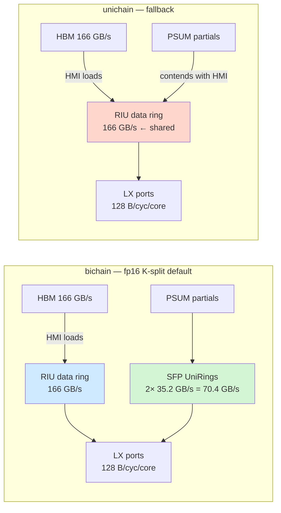

Architecturally this is the *purpose* of the two SFP UniRings.
Before bichain, K-cohort PSUM transfers stole bandwidth from HMI
loads on the RIU, slowing memory-bound matmul during the reduction
phase. With bichain, PSUM moves to a dedicated 35.2 GB/s fabric per
ring per direction (corelet 0 CW + corelet 1 CCW = **70.4 GB/s
aggregate**) and the RIU's 166 GB/s is reserved for HMI alone. The
chip's two-SFP-ring topology is not decorative; it is deliberate
contention avoidance.

Three contention layers stack on top of the ring layer, and each
behaves differently:

1. **Ring level (the fabric question).**
   - bichain: zero ring-level contention. RIU and SFPRING are
     physically independent, run in parallel, no shared wires.
   - unichain: direct contention. PSUM and HMI share RIU bandwidth.
     Each PSUM transfer steals 128 B/cyc that could have been HMI.

2. **LX port level.**
   The per-core LX port is 128 bytesPerCycle and is shared across
   all consumers (MNI + 2× PT + 2× PE + 2× SFP per core = 7
   connections). Even under bichain, MNI loads (HMI staging) and
   SFP traffic (PSUM staging) eventually both reach LX. If MNI is
   at 128 B/cyc and SFP is reading 32 B/cyc, total demand 160 B/cyc
   exceeds the LX port. The compiler-emitted load/store schedule
   serializes them via FIFO instructions; there is no automatic
   overlap. So bichain removes ring contention but does not remove
   LX-port contention.

3. **HBM bus level.**
   HBM is 166 GB/s shared across all 32 cores. The dominant pattern
   here is HMI-vs-HMI contention (32 cores all loading from HBM
   compete for the same bus), not PSUM-vs-HMI; PSUM partials never
   touch HBM in the steady state.

**Side note on Phase 0 measurements.** The original Phase 0 work
measured ring-share cost at ~30 µs/hop with a 2 MB operand at n=32
sharing pattern (`diag_pure_ring_share` on
`AdnanHoque/diag-cost-model-planner`). Sanity-checking against the
RIU spec: 2 MB / 166 GB/s = 12 µs minimum per hop, so 30 µs/hop is
2.5× over peak — a reasonable contention overhead. **This number
was measured on an older codegen; it has not yet been re-verified
on the clean rebuild.** The SFP ring hop cost dropped 15× between
the May 2026 measurements and the May 2026 reverification (Probe 2:
5.6 → 0.37 ms/hop), so a similar codegen-improvement effect could
have shrunk the RIU pure-ring-share number too. The 2.5× over peak
overhead ratio is structurally plausible regardless of the absolute
magnitude.

**Practical implication.** For PR 1986's regime — fp16 K-split
matmul → bichain → SFPRING for PSUM — there is no ring-level
contention with HMI traffic. This is by design. The remaining
contention sources are LX port saturation and HBM bus sharing
across cores, both of which are present regardless of the bichain
choice and which the K-fast / k_fast planner heuristics already
account for via the per-core LX bytes-per-cycle accounting.

### 7.4 The PSUM ring algorithms — unichain, bichain, singleshot

deeptools/dsm has three named PSUM-reduction algorithms. Selection
is graph-global based on data format and ring configuration — NOT
chain-length-conditional.

| algorithm | meaning | what's actually happening |
|---|---|---|
| **unichain** | one PSUM chain | One corelet per core handles PSUM; the partner corelet doesn't participate in the K-cohort reduction. PSUM traffic uses one SFPDataIU ring. |
| **bichain** | two PSUM chains | Both corelets in each core contribute partial sums in parallel. Work is split between the two corelets. PSUM traffic uses both SFPDataIU rings (Corelet 0 CW + Corelet 1 CCW) simultaneously, doubling effective per-core PSUM throughput. |
| **singleshot** | specialized library primitive | A direct-mapped library primitive for one specific deployment configuration. Has additional kernel-library constraints (e.g., no OUT corelet split when N_per > 128). |

Selector logic (`deeprt/deeprt.cpp:1653-1657`):

```
default                                          → unichain
psumRing == "sfpring"                            → bichain
int8 + LX_opt + weight_preload + 32_cores        → singleshot
```

For fp16 matmul with K-split (the regime PR 1986 targets),
`psumRing` is set to `"sfpring"` automatically when there are
K-split matmul nodes, so **bichain** is selected. This is "the good
algorithm" — both corelets contributing in parallel.

The cleanest single line of code distinguishing bichain from
unichain (`dsm/dsm.cpp:8059`): bichain places the PSUM tensor in
`SenComponents::SFPRING`, while unichain places it in `RING + LX`.
This is what makes bichain use the SFP rings vs unichain using the
data ring.

Source files: `deeptools/dsm/dsm.cpp` (lines 82, 5276-5280, 8059,
21882, 22960), `deeptools/deeprt/deeprt.cpp` (lines 1653-1657),
`deeptools/dsm/dsmperf.cpp` (lines 6520-6580).

Implications:

1. The two SFP rings in §7's interconnect table aren't decorative —
   they exist specifically so bichain can run two PSUM chains in
   parallel without ring contention. The unidirectional-but-opposite
   (CW + CCW) design means the two chains never conflict on the
   wire.
2. PR 1986's K-split matmul wins inherit bichain by default. The
   ~50% wall-time reduction we saw across the board on the clean
   rebuild may reflect codegen improvements in bichain since May
   2026.
3. singleshot is the int8/quantized-inference path. When the
   quantization roadmap (§17.6) lands, singleshot becomes the active
   algorithm and brings new constraints (e.g., the chain-length-
   conditional logic at parentInSplit ∈ {3, 4} that's only in
   singleshot).

### 7.5 The n=1 streaming-output fast path (Probe 4)

A major mechanism that makes the `(m, 1, k)` family fundamentally
different from `(m, n>1, k)`: when n=1, the kernel template enters
a **streaming-output** code path.

Smoking gun (DSv3 o_proj M=2048, same C_psum overage 3.5× LX, same
chain length 4):

| split | n | C_psum overage | wall ms |
|---|---:|---:|---:|
| (8, 1, 4)+kf | **1** | 3.50× | **18.14** |
| (1, 8, 4)+kf | 8 | 3.50× | **125.04** |

**7× wall difference** from changing n=1 to n=8 at identical C_psum.

Mechanism (best inference): under n=1, the chain-head's output is a
single column tile of width N. The chain head doesn't need to hold
the full output resident; it streams accumulated tiles to HMI as the
chain reduces past it, bypassing the LX residency requirement that
breaks (1, n>1, k>1) when C_psum > LX. With n>1, the chain head
holds multiple output tiles interleaved in K-loop iteration order
and can't stream them out independently.

**Practical consequence for the planner**: when pure-M overflows
C_psum, prefer (m, 1, k>1) splits. They absorb the overage that
catastrophes (1, n>1, k>1).

### 7.6 Chain-length cost grows monotonically (no sharp regime boundaries)

The original Probe 6 (May 2026) found a sharp chain=4 → chain=8
boundary with a ~10× jump in regime cost — interpreted as
"pipeline / sync / allreduce" code paths. **Re-verification on the
clean rebuild (2026-05-10) does not reproduce this structure.**

The new (m, 1, k) sweep shows regime cost growing roughly
monotonically with chain length, ~3 ms per chain-length doubling on
these shapes:

| split | DSv3 o_proj M=2048 | DSv3 gate_proj M=2048 | Mixtral gate_proj M=2048 |
|---|---:|---:|---:|
| chain=2 | -1.05 | +3.55 | -0.45 |
| chain=4 | +10.80 | +16.28 | +5.61 |
| chain=8 | +13.82 | +19.45 | +7.23 |
| chain=16 | +16.68 | +54.92 | +8.91 |
| chain=32 | +23.44 | err | +11.96 |

The chain=32 row is consistently the **most expensive**, not the
cheapest as the original Probe 6 claimed. There is no special
"allreduce primitive at chain=32" — chain=32 is just the longest
K-collaborator chain.

This is consistent with Probe 2's linear-in-distance finding (§7.1):
both probes are sampling the same underlying ring-distance cost,
just along different axes (5 permutations at fixed split vs 5 chain
lengths at single permutation).

**Implication for the planner**: simpler cost model. K-split cost
grows roughly linearly with chain length under k_fast emission. Pick
the smallest chain length that uses all cores (i.e., maximize
n_split, minimize k_split), subject to stick-alignment and
PT-utilization constraints.

**Planner preference order under the streaming path** (when pure-M
overflows C_psum):

1. Smallest-chain (m, 1, k>1)+kf candidates that use all 32 cores
   and respect stick alignment — typically (16, 1, 2)+kf or
   (8, 1, 4)+kf.
2. Larger chain lengths only if stick-alignment forces it.
3. **Never (1, n>1, k>1) when C_psum > LX** — catastrophic.

### 7.7 The 256 MB EAR ceiling blocks the streaming path on largest wide-N

**Probe 5** found the n=1 streaming path is bounded by the per-core
**256 MB EAR** ceiling. For shapes where operand B exceeds 256 MB
per core under (m, 1, k), the streaming path can't fit.

Concretely affected: **Llama 70B+ MLP layers at M=2048**. K × N at
fp16:

- L3-70B gate_proj: 8192 × 28672 × 2 = 470 MB → **blocked**
- L3-405B gate_proj: 16384 × 53248 × 2 = 1.74 GB → **blocked**

For these shapes the planner has *no good split*:

- Pure-M: overflows C_psum (catastrophic)
- (m, 1, k): blocked by EAR limit
- (1, n>1, k>1): catastrophic via PSUM-overflow

This is a **hardware/deeptools constraint**, not a planner fix. It
warrants surfacing to the deeptools team — possibly an extended EAR
limit or a tile-streaming-load path at the kernel-template level.

## 8. The matmul dataflow algorithm taxonomy

Until now we've described matmul on the AIU as if there's one canonical
kernel: A streams, B is weight-stationary in LX, output accumulates in
PSUM and ring-reduces. That's the single most common case (KG3
dataflow, fp16, dense), but **deeptools actually implements 20 distinct
dataflow algorithms**. Understanding which one runs for a given shape
is essential to predicting both performance and code-path behavior.

The dataflow choice is **graph-global**, set during graph optimization
(`dsm/graphOptimizer.cpp`), and orthogonal to both the work-division
split (§6) and the PSUM ring algorithm (§7.4).

### 8.1 Three orthogonal axes

Three independent decisions determine the kernel that runs for a given
matmul node:

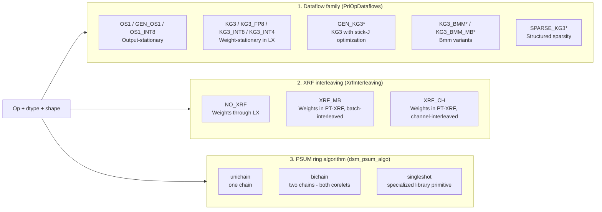

Axis 1 picks the **kernel template** — which `dvs/setupVariables/*.cpp`
file fills in the SDSC parameters and which instruction sequence the
PT array runs.

Axis 2 picks **where weights live** — LX (the standard memory tier)
versus PT-XRF (a third memory tier closer to the PT array).

Axis 3 picks **how PSUM gets reduced** across the K-cohort under
K-split — covered in §7.4.

Each axis is set per-node by `graphOptimizer.cpp` based on shape,
dtype, sparsity, and parent-op characteristics. Once set, the
work-division planner (§6) operates within the constraints of the
chosen dataflow.

### 8.2 The OS1 family — output stationary

**Mechanism**: the output (PSUM accumulator) stays in PT registers
across the entire K-loop. Both A and B flow through; only the
accumulator is stationary.

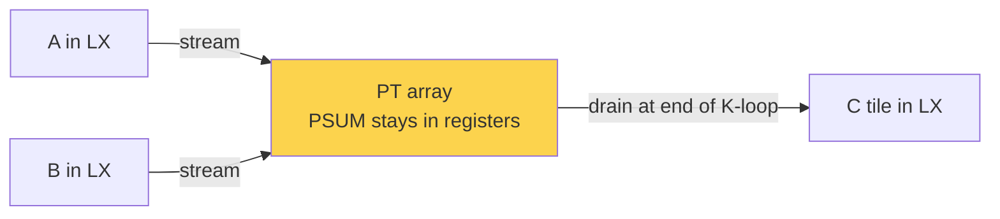

**When it activates** (from `graphOptimizer.cpp:4856-4880`): OS1 is
selected when

- input has small IN dim (`priInpShape[INidx] < 8`),
- large J dim (`priInpShape[Jidx] >= 64`),
- parent is a first-incoming op (host boundary) or a Pad / PadV2 /
  Transpose, and
- `isParamCompatible` is true for the host's stickJinp ∈ {32, 64}.

**Practical regime**: first-layer convolutions in image models and
similar narrow-IN large-J shapes. **Not used for transformer matmul**
(q / k / v / o / gate / up / down) because those don't satisfy the
small-IN condition — IN is usually `hidden` (= 4096+) for those.

**Why "OS1"**: Output Stationary, version 1. Two related variants
exist:

- `GEN_OS1` — generalized version with more flexible stick-J handling
- `OS1_INT8` — int8 quantized variant; auto-pairs with `XRF_MB`
  interleaving (graphOptimizer.cpp:4905)

**Significance for our regime**: OS1 sidesteps the C_psum > LX
constraint we identified in §4.1, because the PSUM lives in PT
registers, not LX. For shapes where it activates, the LX-residency
catastrophes don't apply. Unfortunately, transformer matmul shapes
don't activate OS1.

### 8.3 The KG3 family — weight-stationary

**Mechanism**: weights B are staged in LX (or XRF) once per kernel; A
streams through; PSUM streams out per output tile.

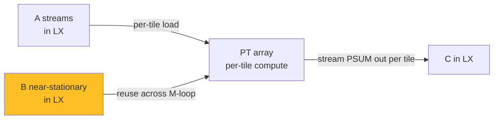

**When it activates**: default for fp16 / fp8 / int8 / int4 dense
matmul (`graphOptimizer.cpp:4848-4849`). Also for conv2d when OS1
conditions aren't met. **This is the dataflow PR 1986 operates on,**
and the dataflow we measured exclusively in our 84-shape sweep.

**Why "KG3"**: stands for "Kernel Group 3" — the matmul kernel
template uses a hardware-supported 3-way kernel-coefficient grouping.
The `kg3` suffix in op names like `batchmatmulsparsekg3` refers to
this hardware group structure.

**Variants**:

| variant | what's different |
|---|---|
| `KG3` | fp16 dense, default |
| `KG3_FP8` / `KG3_INT8` / `KG3_INT4` | quantized variants — same dataflow, different precision |
| `GEN_KG3*` | KG3 with optimized stick-J orientation. Chosen when `findStickJinpGenKG3()` returns stickJinp > 1, minimizing stick-padding waste (graphOptimizer.cpp:4910-4920). |
| `KG3_BMM_*` | bmm-specific variants for explicit batch dimension |
| `KG3_BMM_MB_*` | bmm with explicit M-batch axis — for cases like attention where the batch is being swept over (graphOptimizer.cpp:4930) |
| `SPARSE_KG3_*` | structured sparsity — `SparseConv2D` / `SparseBatchMatMulV2` ops route here; kernel skips zero blocks using sparsity metadata |

The KG3 family covers **18 of the 20 enum values** in `PriOpDataflows`
(`dsmds.h:74-93`). For all practical inference matmul regimes outside
first-layer-conv-of-image-models, KG3 (in some variant) is what runs.

### 8.4 XRF interleaving — the third memory tier for weights

The discussion of the memory hierarchy in §4 only covered three
levels: LPDDR5 → HMI → LX → PT. There's actually a **fourth path** —
weights can bypass LX entirely and go straight from HMI into the PT
array's own register file (PT-XRF).

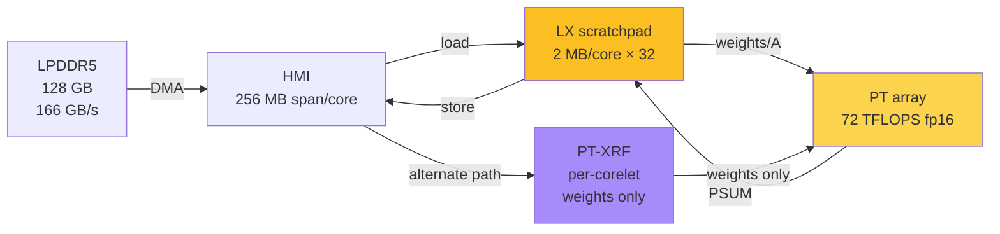

PT-XRF appears as a separate hardware component in
`dsc/dscdefn.h:420` (`SenComponents::PTXRF`). When it's used, weights
bypass LX:

```cpp
// dsm/dsm.cpp:6852-6862
if (isXrf && !isOs1Int8) {
    newLds.memOrg_.erase(SenComponents::HBM);
    newLds.memOrg_.erase(SenComponents::LX);
}
```

The `XrfInterleaving` enum (`dsm/dsmds.h:74`):

| value | meaning | activated when |
|---|---|---|
| `NO_XRF` | Weights flow through LX (default) | KG3 family for most matmul shapes |
| `XRF_MB` | Weights interleaved across batch dim, held in XRF | Auto-paired with OS1_INT8 (graphOptimizer.cpp:4905) |
| `XRF_CH` | Weights interleaved across channel dim, held in XRF | Some conv2d variants where channel-major weight layout fits XRF |

**Capacity** (`deeptools/dsc/sysdef.cpp:183`): `xrfCapacity = 64 * 1024`
= **64 KiB per corelet**. Aggregate per AIU = 64 corelets × 64 KiB =
4 MiB. This is **16× smaller aggregate than LX** (64 MiB) and 32×
smaller per unit. The fit check (`dsm/dsm.cpp:1492`) requires:

```
(CoreletD.in × CoreletD.out × CoreletD.x × wordLength) / numPTRows ≤ 8 KiB per row
```

i.e. per-corelet B tile ≤ 64 KiB.

**Reality check on capacity**: under any (m, n, k) split with
m·n·k = 32 plus bichain corelet split, the per-corelet B share for
production transformer matmul is far over 64 KiB:

| shape | total B (fp16) | per corelet at full split |
|---|---:|---:|
| Llama 3.2 1B kv_proj | 4 MiB | 64 KiB *— at the limit* |
| Granite 3 8B kv_proj | 16 MiB | 256 KiB |
| Granite 3 8B q_proj | 32 MiB | 512 KiB |
| Granite 3 8B gate_proj | 100 MiB | 1.6 MiB |
| Llama 3.1 70B q_proj | 128 MiB | 2 MiB |

**For Granite-8B-and-larger fp16 transformer linear layers, XRF
cannot fit B under any split.** PR 1986's regime is unaffected by
XRF — there's no XRF-routing lever that helps the shapes we measure.

**Where XRF actually wins**:

- **Conv2D kernels** (3 × 3 × C_in × C_out at small C) — first-layer
  vision-model layers fit easily.
- **Tiny matmul** with K, N ≤ ~1024 — per-head attention chunks
  with split-per-head batching, mini-MLPs.
- **int4 quantization** — 4× smaller weights stretch XRF's reach 4×;
  int4 4096×4096 starts becoming viable. Combined with `KG3_INT4` or
  `OS1_INT8`'s auto-paired `XRF_MB` interleaving, this is the
  production int8 / int4 inference path.
- **`OS1_INT8` + `XRF_MB`** is the configuration where everything
  fits: weights in XRF (small), PSUM in PT registers (output-
  stationary), neither competes for LX. That's why it's the
  production int8 inference dataflow.

**Kernel templates with XRF routing**:
`dvs/setupVariables/xrfbatchmatmul_{fp16,fp8,int4,int8}_fwd.cpp`,
`xrfchbatchmatmul_*_fwd.cpp`. They exist for all precisions, but
the dataflow selector in `graphOptimizer.cpp` only routes int8
through XRF (via OS1_INT8 + XRF_MB). The fp16 XRF templates are
present in the codebase but rarely activated for our regime
because the capacity math doesn't work out.

**Implication for our work**: XRF is a **vision / quantized**
lever, not a transformer-fp16 lever. The "third memory tier"
framing is structurally accurate but practically narrow. For
PR 1986's regime (fp16 transformer matmul), XRF capacity is
insufficient under any split — closing this avenue.

### 8.5 The dataflow decision (per node)

Putting Axis 1 and Axis 2 together, the per-node dataflow assignment
in `graphOptimizer.cpp` follows roughly this tree (fp16 branch shown;
similar trees exist for fp8/int8/int4):

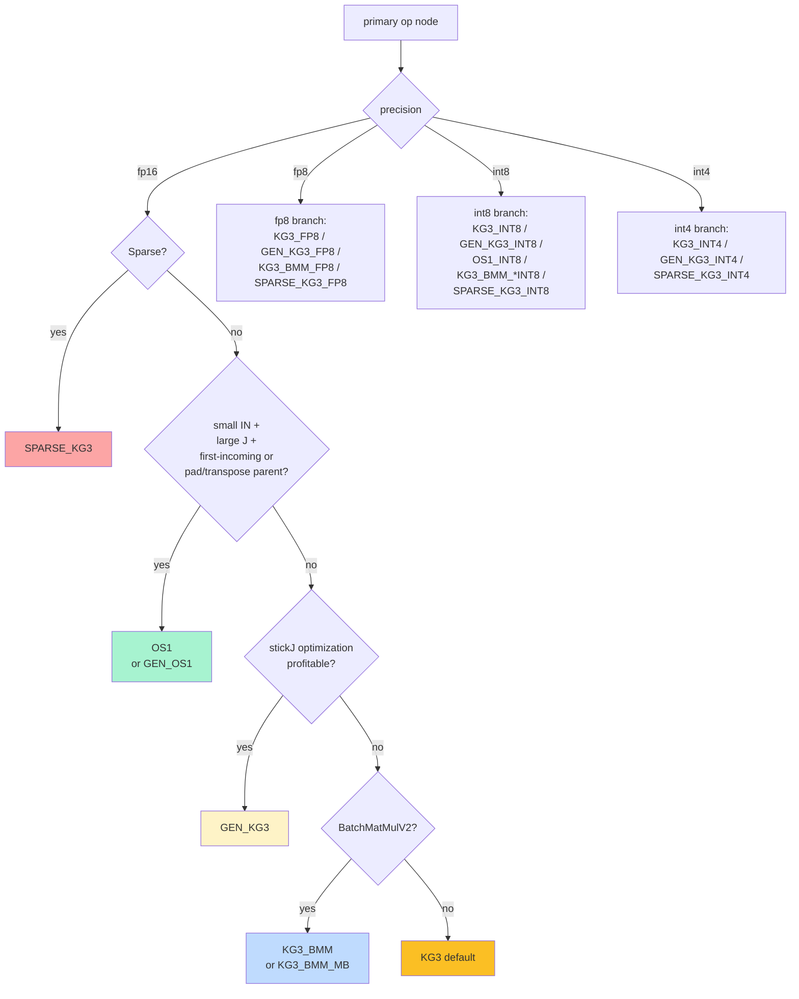

Then `XrfInterleaving` is set based on the chosen dataflow: `XRF_MB`
auto-paired with OS1_INT8, otherwise `NO_XRF` for most KG3 variants.

The **default case** for transformer matmul (q / k / v / o / gate /
up / down at any precision, no sparsity, no first-incoming parent)
falls through to `KG3` (or `KG3_FP8`, etc.) with `NO_XRF`. This is
what PR 1986 operates on, and what the 84-shape sweep measured.

### 8.6 Work-distribution optimizers

The work-division split (§6) is decided by one of several optimizers,
all derived from `BaseOptimizer`
(`dsm/workOptimizer/baseOptimizer/baseOptimizer.h`):

| optimizer | purpose | source |
|---|---|---|
| **BaseOptimizer** | Foundation; reference implementation of split selection | `baseOptimizer/` |
| **RcuOptimizer** | "Register Cache Unit" optimizer; **decode-iteration-aware** (accepts `decoding_iter_idx` parameter) | `rcuOptimizer/` |
| **MultiAIUOptimizer** | Cross-card optimization for multi-AIU clusters | `multiAIUOptimizer/` |
| **2DLyPinner** (experimental) | LX layer pinner; keeps tensors LX-resident across operator boundaries | `experimental/2DLyPinner.cpp` |

**`RcuOptimizer` is the production optimizer for decoding workloads**.
It takes `decoding_iter_idx` as a parameter and reasons across
iterations, not just within one kernel. From `rcuOptimizer.h`:

```cpp
RcuOptimizer(const SentientSystem& sentient_sys,
             const DesignSpaceConfigGlobal& dscg,
             PerfDSC& initial_perfDsc,
             double fracLxStaticDs,
             const DebugConfig& debug_config,
             int decoding_iter_idx = 0,
             int verbosity = 0)
    : BaseOptimizer(...) {
    optimizer_ = OptType::RCU_OPT;
}
```

This is the cross-iteration-residency primitive that v2 §17.3 was
speculating about — it already exists in the codebase, gated by
`LX_PLANNING=1` and the `LxOptMetaData` machinery
(`baseOptimizer/baseOptimizer.h`).

**`2DLyPinner`** is an experimental subsystem that pins specific
tensors to LX across operator boundaries — the cross-kernel-residency
lever for activations / KV cache / weights. Currently in
`experimental/`, not in production paths.

### 8.7 perfEstimator — the real cost model

The closed-form predictor in §11 is a back-of-envelope tool. The
**real cost-model engine** in deeptools is `dsm/perfEstimator/`, a
**scheduler-aware task-graph simulator**:

- `seTaskGraph` — entity / task graph for compute and data-transfer
  scheduling
- Entity types: `DATA_TRANSFER`, `COMPUTE`
- Data-transfer subtypes: `HBM_to_LX`, `LX_to_LX`, `LX_to_HBM`,
  `OvlInpFetch` (overlapped input fetch)
- Task-edge types: `functional_streaming`, `functional_blocking`,
  `functional_overlapped`, `functional_dbl` (double-buffered),
  `resource`

The estimator simulates task scheduling with overlap and resource
queueing: it captures pipelined load-compute, double-buffering,
ring-bandwidth contention, and HMI queue depth. The entry point is
`perfEstimator::runEstimator(const PerfDSC&)`, which takes a
PerfDSC (post-work-division kernel descriptor) and returns predicted
cycles.

This is **substantially more sophisticated** than v2 §11's closed-form
`T_kernel ≈ T_launch + max(T_pt_peak, α · T_hmi)`. The closed form is
useful for screening; the actual optimizer (`RcuOptimizer`) calls
`perfEstimator` to score candidate splits.

**Implication**: any cost-model-based planner work on the inductor
side should integrate with `perfEstimator` rather than build a
separate one. The pieces are already wired: optimizer + perfEstimator
- dataflow selection together form the cost-model-driven planner that
v2 §11 sketched in closed form.

### 8.8 Implications for our work

1. **PR 1986 operates exclusively on the KG3 + NO_XRF + bichain
   slice.** Everything we measured was KG3 fp16 dense matmul with
   weights in LX and PSUM ring-reduced via bichain (both corelets).
   The other 19 PriOpDataflows variants and the XRF / OS1 paths are
   unexplored regimes from our side.

2. **XRF is a real third memory tier but not a lever for our
   regime.** With only 64 KiB per corelet (4 MiB aggregate, 16×
   smaller than LX), XRF cannot fit any Granite-8B-or-larger
   transformer-fp16 weight tile under any (m, n, k) split. XRF
   wins on conv2d / tiny-matmul / int4-quantized workloads, not
   the fp16 transformer linears PR 1986 targets. See §8.4.

3. **Decode-iter awareness is fully implemented in deeptools but
   unreachable from torch-spyre.** `DecoderInfo`, `IterType`,
   `cMode::OFFLINE_DECODER`, `runDsmProgSharingCheck` (compare anchor
   vs. test graph), and `maxSharedProgIters = 256` (one compiled
   program shareable across up to 256 decode iterations) — all
   exist in `deeptools/deeprt` and `deeptools/dsm/decoderMode.cpp`.
   Zero references in torch-spyre or torch_sendnn source. The
   inductor → SDSC path always invokes deeprt in `OFFLINE` mode
   with iter_idx = 0. Production decoder serving (e.g.,
   granite_33_8b_paged_fp8_TP4 in `verifyDecoderModels.sh`) goes
   through a different compilation entry point that uses
   OFFLINE_DECODER. **The torch-spyre `torch.compile` path cannot
   currently benefit from program sharing.** Surfacing IterType /
   max_decoding_iter / anchor_iter as inductor-side hints, plus a
   multi-iteration AOT compile entry point, would unlock this.

4. **`perfEstimator` is the real cost model.** The closed-form
   predictor in §11 is useful for screening, but a real planner-side
   cost model should integrate with the existing scheduler-aware
   infrastructure. The RcuOptimizer + perfEstimator pair is already
   the framework for cost-model-driven planning.

5. **OS1 is a weak alternative for our matmul regime** (transformer
   projections don't satisfy the small-IN condition), but it's the
   right answer for first-layer / vision-model integration on Spyre.

6. **Sparsity** (`SPARSE_KG3_*` family) is a fully-implemented
   dataflow path. If structured sparsity (e.g., 2:4) becomes part of
   the model deployment story, the SPARSE_KG3 variants are the entry
   point.

## 9. Loop nest structure

```python
# Outer loops — sharded across cores per the (m, n, k) split:
for mb in range(M_per_core // 8):           # PT M-batches
    for nb in range(N_per_core // 8):        # PT N-batches
        psum = zeros(8, 8)                   # PT-resident accumulator (fp32)

        # Inner K-loop — sequential per core; possibly cohort-shared:
        for kb in range(K_per_core // 8):
            a = lx.load(A_tile[mb, kb])
            b = lx.load(B_tile[kb, nb])
            psum = pt.outer_product(a, b, psum)

        # K-cohort reduction (only if k > 1):
        if k > 1:
            psum = sfp_ring_allreduce(psum, cohort)

        # Drain to LX → HMI (or stream out under n=1 fast path):
        lx.store(C_tile[mb, nb], psum)
```

This matches `deeptools/dvs/setupVariables/batchmatmul_fp16_fwd.cpp`
(SDSC parameters Dmb, Dout, Din, Cmb, Cout, Cin, coreletDmb, etc.).

Three things drive performance:

1. **B reuse across the M loop.** Bigger M_per_core → more reuse →
   HMI amortizes. Pure-M with M_per_core ≪ 8 is a disaster: B
   loaded fresh almost every PT cycle.
2. **PT array M-row utilization.** M_per_core ≥ 8 fills the array.
3. **K-cohort reduction frequency.** Allreduce fires once per output
   tile, scaled by hops (kf) × payload tile size.
4. **(new in v2) PSUM accumulator residency.** Per §4.1: when
   M_per × N_per × 4 > 2 MB, splits with n>1 catastrophe. Splits
   with n=1 absorb via the streaming-output path (§7.5).

## 10. The split-family decision tree

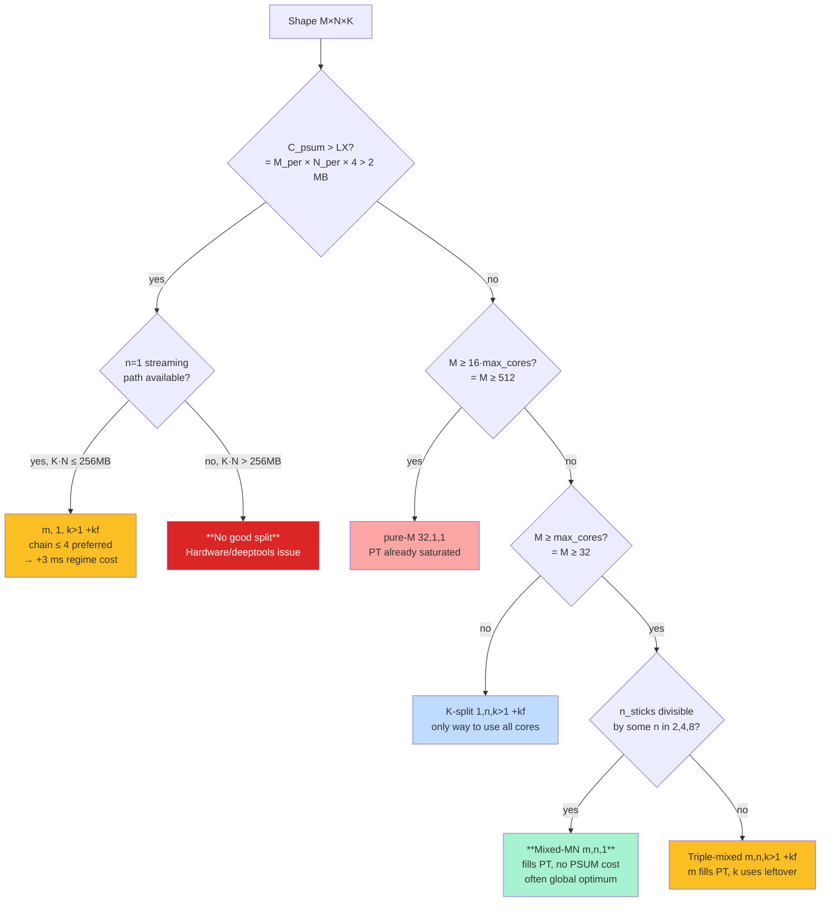

| Regime | M_per_core (under pure-M) | Optimal family | Why |
|---|---|---|---|
| C_psum > LX, K·N ≤ 256 MB | any | **(m, 1, k>1) +kf streaming** | Only family that absorbs PSUM overage |
| C_psum > LX, K·N > 256 MB | any | **(none — broken)** | EAR ceiling blocks streaming; n>1 catastrophic; pure-M overflows |
| C_psum ≤ LX, M < max_cores | < 1 PT M-batch | (1, n, k>1) +kf | Only way to use all cores |
| C_psum ≤ LX, max_cores ≤ M ≤ 4·max_cores, narrow N | 1-4 PT M-batches | (1, n, k>1) +kf | K-split + kf saturates |
| C_psum ≤ LX, max_cores ≤ M ≤ 4·max_cores, wide N | 1-4 PT M-batches | **mixed-MN (4, 8, 1)** | Fills PT AND splits N — no PSUM cost |
| C_psum ≤ LX, M ≥ 16·max_cores | ≥ 16 PT M-batches | pure-M | PT already saturated |

The PR 1986 heuristic captures the small-M and narrow-N rows. It
doesn't capture the wide-N mixed-MN row (planner-priority change
needed) or the C_psum > LX streaming row (cost-model integration
needed).

## 11. Cost model — wall-time predictor

Closed-form predictor for kernel wall time given `(M, N, K, dtype,
m, n, k, emission)`. Use it to (a) estimate fraction of compute
peak, (b) compare candidate splits without running them, (c) identify
the binding bottleneck.

### 11.1 Three theoretical bounds

```
T_pt_peak  = total_FLOPs                        / 72.1 TFLOPS
T_hmi      = HMI_bytes_per_cluster(m, n, k)     / 166 GB/s
T_lx       = LX_bytes_per_core                  / 140 GB/s
T_ring     = PSUM_tiles · ring_hops · 8 cycles  / 1.1 GHz
             where ring_hops = (k-1)   if k_fast
                             = m·n·(k-1) if identity
T_launch   ≈ 100 µs (empirical floor)
```

### 11.2 Cost model V4 — calibrated additive penalties (partially walked back)

The naive `max(T_pt_peak, T_hmi)` predictor has a 21.7% mean error
on the 30-row validation set. **Cost-model V4** adds four
empirically calibrated penalty terms:

| fix | content | calibration |
|---|---|---|
| **A** | LX-fit gate uses PSUM accumulator | `M_per × N_per × 4 ≤ 2 MB` |
| **B** | PSUM-overflow penalty, n>1 + kf | `+17 ms × (overage_factor − 1)` |
| **C** | Ring traversal scaled by actual K-collab distance | `5.6 ms/hop × payload_factor` |
| **D** | n=1 regime-routed additive | pipeline +3, sync +25, allreduce +14 ms |

Result on the 30-row validation set:

| version | mean abs error | rows over 10% error |
|---|---:|---:|
| V0 (baseline) | 21.7% | 18/30 |
| V1 (per-cluster bytes only) | 17.5% | 13/30 |
| **V4 (all four fixes)** | **16.1%** | **12/30** |

5.6 percentage point improvement on mean error. V4 brings 3 of 8
K-split+kf rows within ±2% — the rows the planner critically needs.
DSv3 o_proj M=2048 +kf: -46% off → -5% off.

**2026-05-10 reverification — Fix B and Fix D walk-back:**

Fix D was calibrated against original Probe 6 data and is
invalidated by re-verification (§7.6). The chain=4→8 boundary it
encoded does not exist on the clean rebuild; chain-length cost
grows roughly monotonically. **Replace Fix D with a linear-in-chain-
length term**: `T_chain ≈ slope_per_hop × (k - 1) × payload_factor`,
with `slope_per_hop` calibrated per-payload from Probe 2 (0.07-1.09
ms/hop range observed across our shape mix). The validation set
residual reduction attributed to V4 in v2 was partially spurious.

Fix B's "+17 ms × overage_factor" PSUM-overflow penalty was
calibrated on n>1 catastrophic data from the original measurements.
The catastrophic ratio shrank from 7-15× to 2-3× on the clean
rebuild (n=8 ctrl is +37 ms vs n=1 chain=4 at +11 ms = ~2× ratio).
So Fix B's +17 ms is also overstated; the actual penalty is closer
to **+5-10 ms per overage factor** on the rebuilt environment.

Fix C's "5.6 ms/hop" coefficient is also superseded — see the §7.1
table for per-shape calibrated slopes (0.07-1.09 ms/hop).

**Remaining V4 residuals:**

1. **Small-M HMI BW** (5 rows): cost model uses 40 GB/s achieved
   BW; small-M kf shapes imply 67-128 GB/s (model is too
   pessimistic).
2. **+id K-dependent residual** (3 rows): pipe-model PSUM formula
   gives identical predictions for shapes with same payload but 7×
   different walls. K_per dependence the model doesn't capture.

### 11.3 Practical predictor (V4 form)

```
flops_total       = 2 · M · N · K
hmi_a_bytes       = n · M · K · 2
hmi_b_bytes       = (m / k) · K · N · 2          # multicast
hmi_c_bytes       = k · M · N · 2
hmi_total         = hmi_a + hmi_b + hmi_c

T_pt_peak         = flops_total / 72.1e6                 # µs
T_hmi             = hmi_total   / 166e3                  # µs
T_ring            = PSUM_tiles · K_collab_distance · 8 / 1.1e3   # µs
                    K_collab_distance = 1 if kf else m·n

# Fix B: PSUM overflow penalty (n > 1, kf, C_psum > LX)
C_psum            = M_per · N_per · 4
overage_factor    = max(C_psum / LX_per_core, 1)
T_overflow_n_gt_1 = 17e3 × (overage_factor − 1)          # µs (n>1 only)

# Fix D: n=1 regime cost (only when n = 1 and k > 1)
T_n1_regime       = 3e3   if k ≤ 4
                    25e3  if 4 < k < 32
                    14e3  if k = 32
                    0     otherwise

T_kernel = T_launch + max(T_pt_peak, α · T_hmi) + T_ring
           + T_overflow_n_gt_1 + T_n1_regime

α = 0.5  if M_per_core ≥ 16
    0.8  if 4 ≤ M_per_core < 16
    1.2  if M_per_core < 4
```

### 11.4 Worked example

Llama 3.1 70B q_proj M=128, split (4, 8, 1):

```
flops_total   = 2 · 128 · 8192 · 8192 = 17.18 GFLOPS
hmi_a         = 8 · 128 · 8192 · 2 = 16.0 MB
hmi_b         = (4 / 1) · 8192 · 8192 · 2 = 512 MB
hmi_c         = 1 · 128 · 8192 · 2 = 2 MB
hmi_total     = 530 MB
T_pt_peak     = 17.18e9 / 72.1e12 = 238 µs
T_hmi         = 530e6 / 166e9 = 3194 µs
M_per_core    = 32 ⇒ α = 0.5
T_kernel      ≈ 100 + max(238, 0.5 · 3194) + 0 = 1697 µs
```

Measured: 990 µs. Model overestimates by ~70% on this shape. V4's
calibration was on a different shape mix; this shape's actual
sharing factor is higher than the simple model captures.

### 11.5 Decision tree (cheap, no scoring)

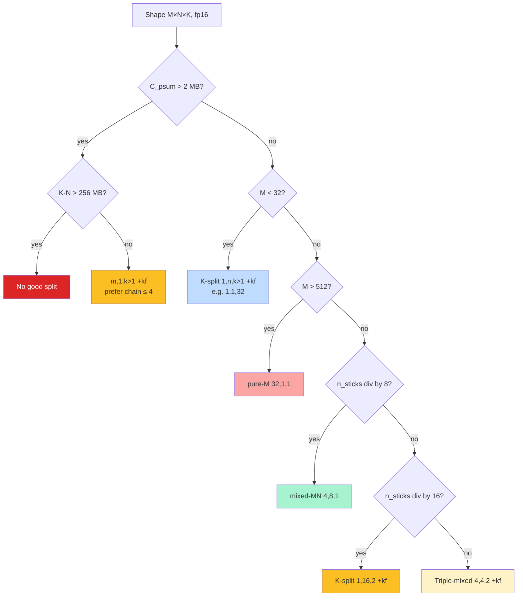

This tree captures the 84-shape sweep's winners with ~80% accuracy
without any measurement.

### 11.6 Planner V2 hardware verification — 5/8 picks regressed

**Note (2026-05-10):** V4 cost model has since been partially
invalidated by Probe 2 + Probe 6 reverification (§7.1, §7.6). The
5/8 regression result holds — the cost model was not accurate
enough — but the specific calibration constants (Fix D regime
additives) are now known to be wrong, not just under-validated.

**Important honesty signal.** After cost-model V4 calibrated to
16.1% mean error on the validation set, the natural next step was
to wire it into a planner prototype. `diag_planner_v2_verification.py`
ran 8 representative Tier-2 picks against pure-M baseline:

| row | shape | v2 split | speedup | result |
|---|---|---|---:|---|
| L3-70B kv_proj M=2048 sanity | (2048,1024,8192) | (1,16,2)+kf | 0.92× | **FAIL** |
| DSv3 q_a_proj M=128 sanity | (128,1536,7168) | (1,8,4)+kf | 1.09× | validate |
| L3-70B q_proj M=32 big-spd | (32,8192,8192) | (1,4,8)+kf | 1.49× | validate |
| DSv3 gate_proj M=32 big-spd | (32,18432,7168) | (1,4,8)+kf | 1.76× | partial |
| L3-70B q_proj M=128 mid-spd | (128,8192,8192) | (1,8,4)+kf | 0.85× | **FAIL** |
| L3-70B q_proj M=512 mid-spd | (512,8192,8192) | (1,16,2)+kf | 0.59× | **FAIL** |
| DSv3 down_proj M=128 wide-K | (128,7168,18432) | (1,4,8)+kf | 0.87× | **FAIL** |
| DSv3 down_proj M=512 wide-K | (512,7168,18432) | (1,8,4)+kf | 0.26× | **FAIL** |

**5 of 8 picks regressed**. Cost-model V4 dramatically underpredicts
wall on medium-M and wide-K K-split shapes outside the validation
set:

- DSv3 down_proj M=512 (1,8,4)+kf: predicted 4.7 ms, measured 35.5 ms
  (-87% off)

What this means:

- **The cost model is a useful screen** ("rule out obviously bad
  splits", "enumerate candidates with reasonable bounds"), but
- **It is not yet accurate enough to drive planner picks unsupervised.**
  Two specific gaps:
  1. Medium-M K-split penalty: even with C_psum fitting LX (no Fix B
     trigger) and chain ≤ 4 (Fix D pipeline), measured walls are
     70-90% higher than predicted on q_proj-style wide-N shapes.
     Mechanism unknown.
  2. Catastrophic regime at large K_per under K-split + kf, even
     with C_psum fitting LX. Trigger is wider than C_psum overflow.

This is the most important practical caveat for cost-model-driven
planner work. Closed-form predictors must be **broadly validated
across shape mixes before they become production levers**, not just
calibrated against a narrow training set.

## 12. Empirical findings — what wins where

From the 84-shape exhaustive sweep at M ∈ {1, 32, 128}
(`diag_small_m_spread_findings.md`):

```
                M=1       M=32     M=128    Total
pure-M           2          0         0       2  (2%)
k=1 mixed        1         12        17      30 (36%)
k>1 + id (1,n,k) 14         2         0      16 (19%)
k>1 + kf (1,n,k) 11         1         1      13 (15%)
k>1 + kf mixed   0          7         8      15 (18%)
k>1 + id mixed   0          6         2       8 (10%)
```

Geomean speedup vs pure-M: M=1 → 1.03×, M=32 → **2.60×**, M=128 →
**2.58×**.

Two production-relevant headlines:

1. **At M ∈ {32, 128}, mixed-MN `(4, 8, 1)` is the empirical global
   optimum more than half the time.** Outside the PR 1986 heuristic's
   candidate set; closing this gap is a planner-priority change.
2. **k_fast emission strictly correctness-preserving + measurably
   useful.** Wins 26/84 shapes outright, ties on most rest, never
   regresses. Free to keep on by default.

For wide-N M=2048 shapes (outside the 84-shape sweep — the
emission-aware-lx investigation), additional regime structure:

1. **PSUM overflow is the dominant cost** when present. (1, n>1, k>1)
   splits with C_psum > LX run 7-15× slower than (m, 1, k>1)
   streaming-path equivalents.
2. **Streaming path has three internal regimes** (chain ≤ 4 → 8 → 32).

## 13. The compilation pipeline

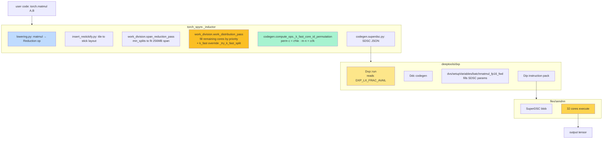

(Step-by-step description identical to v1 — see §12 of v1.)

## 14. Tensor layouts and SDSC schema (appendix)

(Unchanged from v1 — see §13 of v1 for full Spyre tensor layout
walkthrough, per-op stick constraints, and SDSC JSON schema with
example matmul SDSC at split (1, 16, 2).)

## 15. Glossary

(Same as v1, plus three new terms:)

- **Streaming-output fast path** — kernel-template code path
  activated when n=1 in the (m, 1, k) split. Streams accumulated
  output tiles to HMI as the K-cohort reduces, bypassing the
  C-PSUM LX residency requirement. Has three internal regimes by
  chain length (pipeline / sync / allreduce). Discovered in Probe 4.
- **C_psum / PSUM accumulator residency** — the LX requirement
  `M_per × N_per × dtype_psum_bytes`. The binding LX constraint
  per Probe 3.
- **Cost model V4** — predictor with four calibrated fixes
  (A: PSUM gate; B: 17 ms/overage penalty when n>1; C: 5.6 ms/hop
  ring distance; D: n=1 regime additives). Validation set mean
  error 16.1%.

(Original glossary terms — Core, Corelet, PE, PT, SFP, LX, HMI,
EAR, LPDDR5, Stick, RIU, SFPDataIU, PSUM, K-cohort, k_fast, work-
division split, DXP_LX_FRAC_AVAIL, SDSC, Dxp/Ddc/Dip/Dvs/Dsm/Dsc —
unchanged from v1.)

## 16. References

(Same as v1, with addition of the emission-aware-lx-phase0 branch
findings:)

### Within this branch
- (v1 references: combined / Granite / small-M / theory writeup
  docs)
- `diag_matmul_on_aiu_canonical.md` — v1 of this doc.

### From `AdnanHoque/emission-aware-lx-phase0`
- `tests/emission_aware_lx_consolidated_findings.md` — investigation
  index (commit 6863134).
- `tests/diag_emission_aware_lx_phase0_findings_v2.md` — Probes 1-3
  (commit 87b9aab).
- `tests/diag_emission_aware_lx_p4_findings.md` — n=1 streaming
  path (commit d3df115).
- `tests/diag_emission_aware_lx_p5_findings.md` — generality + EAR
  ceiling (commit f4b6c40).
- `tests/diag_emission_aware_lx_p6_findings.md` — three regimes
  (commit d1261d5).
- `tests/cost_model_v4_findings.md` — V4 calibration (commit
  e05c693).
- `tests/diag_planner_v2_verification_findings.md` — verification
  cautionary tale (commit f48fe02).

### Codebase + deeptools + papers
(Unchanged from v1.)

## 17. Open problems and the design space

What's been tried, what hasn't, and where novel contributions could
land. v2 differs from v1: items that have been **probed and
characterized** are now anchored in the verified findings; items
that remain open are flagged as such.

### 17.1 Cost-model design — V4 calibrated, generalisation open

V4 (Fix A/B/C/D) lands the calibration on the 30-row validation
set at 16.1% mean error. **Planner V2 verification (§11.6) shows
this is not enough for production planner use** — broader shape
mix exposes 70-90% prediction errors on rows the cost model
under-trained on.

**Open questions:**

- Medium-M K-split regression mechanism (cost model says these are
  faster than pure-M; hardware says slower). Probe 7 proposed in
  the verification doc would characterize.
- Wide-K catastrophic regime at K_per >> validation set values.
  Probe 8 proposed.
- Small-M HMI BW residual (40 GB/s model vs 67-128 GB/s implied by
  measurement).

**Novelty avenue:** broader-validated cost model with explicit
mid-M and wide-K penalty terms; only then a cost-model-driven
planner. This is **necessary infrastructure for cross-kernel
scheduling**, not the prize itself.

### 17.2 Mixed-precision PSUM

(Same as v1.) Now anchored: per Probe 3, PSUM accumulator residency
is the binding LX constraint. fp16/bf16 PSUM would halve the
binding constraint, making (1, n>1, k>1) splits viable on shapes
that today catastrophe.

### 17.3 Cross-kernel B residency — caveat updated

(Updated from v1.) B is too large to keep resident for any
significant model — Granite 8B's gate_proj is 100 MB per matmul,
and aggregate LX is 64 MB. The realistic cross-kernel optimizations
are:

- **Activation residency / op fusion**: keep intermediate tensors in
  LX. Modest gain (~10-20% e2e on Granite decode at B=32).
- **Pipelined prefetch**: hide layer N+1's weight load behind layer
  N's compute. Bounded by HMI bandwidth.

These are smaller wins than v1 implied. The biggest lever is
quantization (§17.6).

### 17.4 Heterogeneous K-cohort sizes

(Same as v1.)

### 17.5 Asymmetric ring placement

(Same as v1, but anchored: per Probe 2, ring distance dominates
PSUM cost linearly. Asymmetric placement that minimizes weighted
distance across cohorts could give marginal gains.)

### 17.6 Quantized matmul paths — the biggest single multiplier

(Updated emphasis.) fp8/int8/int4 PT throughputs are 2×, 2×, 4× of
fp16. This is the **largest available speedup** on Granite serving
(2× e2e for fp8, 3-4× e2e for int4) — bigger than any work-division
optimization can deliver. Industry-standard but not yet integrated
on Spyre.

### 17.7 Activation fusion within matmul

(Same as v1.)

### 17.8 Bmm and conv2d as natural extensions

(Same as v1.)

### 17.9 No-cache scheduling advantages over GPU

(Same as v1, with one verified anchor: `LX_PLANNING=1` exists in
`scratchpad.py` but is gated off by default. The emission-aware-lx
investigation didn't enable it for the probes — that's one
characterization gap.)

### 17.10 The DXP_LX_FRAC_AVAIL semantic gap

(Same as v1.)

### 17.11 Compiler-vs-hardware boundary on K-cohort reduction (closed)

The original Probe 6 found chain=32 cost dropped back below
chain=8/16, suggesting a separate "allreduce primitive".
Re-verification (2026-05-10, §7.6) shows chain=32 has the **highest**
regime cost on every shape — no such primitive exists. The cost is
consistent with linear ring distance.

The hypothesis is closed: there is no hardware-supported
tree-reduction primitive accessible on the chain=32 path. The
unichain/bichain/singleshot algorithm selectors in deeptools (see
§7.4) are graph-global, not chain-length-conditional, so there's no
compiler-side "request the tree-reduction" lever either.

### 17.12 The "bigger M, slimmer M-loops" tension

(Same as v1.)

### 17.13 Dynamic shapes

(Same as v1.)

### 17.14 (new) Streaming-output fast path generality

Probe 4-6 characterized the n=1 streaming path on three production
shapes. Open questions:

- Does the streaming path activate for bmm (4D iteration space) and
  conv2d (6D)? The Probe series only ran mm.
- Can the path be extended to n>1 with kernel-template support
  (sequential-write per N-slice)? Would unlock the large-N mixed-N+K
  family currently blocked by C_psum overflow.
- What's the chain=4 threshold? Hardware buffer size, code-path
  selector, or topology constraint? Reading SDSC emitter source
  would settle.

### 17.15 (new) The "no good split" regime for large wide-N

Probe 5 found Llama 70B+ MLP shapes at M=2048 have *no good split*:
pure-M overflows C_psum, (m, 1, k) blocked by EAR, (1, n>1, k>1)
catastrophic. **This is a hardware-level bottleneck.** The
deeptools team could:

- Extend the 256 MB EAR limit
- Add a tile-streaming-load path at the kernel-template level
- Support a hybrid streaming path that handles n>1 with an
  external accumulator buffer

Patent angle: any of the above is a hardware-software co-design
that no public auto-scheduler models.

## 18. Quick-reference: predicting the best split for any shape

Given shape `(M, N, K)` at fp16 with max_cores = 32:

```
1. Compute n_sticks = N // 64, k_sticks = K // 64.
   For each candidate (m, n, k):
     C_psum = (M/m) × (N/n) × 4
     If C_psum > 2 MB and n > 1: skip (catastrophic)
     If K · N > 256 MB and (m, 1, k>1) candidate: skip (EAR ceiling)

2. Apply the §11.5 decision tree:
   • C_psum > 2 MB and K·N ≤ 256 MB:
       (m, 1, k>1) +kf with chain ≤ 4 (pipeline regime)
   • C_psum > 2 MB and K·N > 256 MB: no good split (hardware issue)
   • M < 32: K-split (1, 1, 32) +kf
   • M > 512: pure-M (32, 1, 1)
   • 32 ≤ M ≤ 512:
       - if n_sticks % 8 == 0: mixed-MN (4, 8, 1)
       - elif n_sticks % 16 == 0: K-split (1, 16, 2) +kf
       - else: triple-mixed (4, 4, 2) +kf

3. To estimate fraction-of-peak achieved:
   T_pt_peak  = 2·M·N·K / 72.1e12  [s]
   T_hmi      = HMI_bytes(m, n, k) / 166e9  [s]
   M_per_core = M / m
   α          = 0.5 if M_per_core ≥ 16 else 0.8 if ≥ 4 else 1.2
   T_kernel   ≈ 100 µs + max(T_pt_peak, α · T_hmi) + T_overflow + T_n1_regime
   fraction_of_peak = T_pt_peak / T_kernel

4. Empirical sanity check: 84 production shapes sweep gives
   M=1: geomean 1.03×, M=32: 2.60×, M=128: 2.58× over pure-M.

5. **Cost-model caveat**: V4 has 16.1% mean error on the validation
   set; on shapes outside that mix it can be 70-90% off. Use as a
   screen, not as a sole production decision-maker. Hardware-verify
   before any planner change.
```

This decision tree + estimator gives ≈ 80% accuracy on global
optimum and ±30% wall-time estimate on the validation set —
sufficient for ranking candidate optimizations or quickly screening
shapes.
