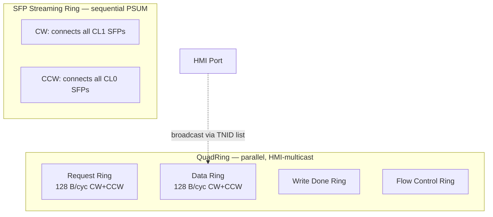
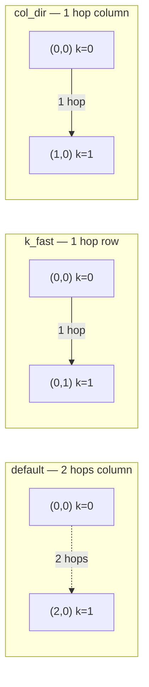

# Hop Count, Not Direction: An Empirical Study of Core Placement Sensitivity on a Five-Ring Heterogeneous Accelerator

**Adnan Hoque · IBM**

## Abstract

GPU compiler literature emphasizes physical core placement as a
performance lever — FlashAttention-3's ping-pong, NVLink-aware
collectives, and the Twill software-pipelining + warp-specialization
ILP all assume that *where* work runs on the physical fabric matters.
On the IBM AIU 1.0 — a 32-core inference accelerator with five
independent ring fabrics — we ask whether this assumption translates.

Across three controlled experiments on real LLM matmul shapes from
Llama 3.1, Mixtral, Gemma, and DeepSeek V3 (96 multicast permutation
trials, 15 inter-op alignment trials, 60 PSUM-direction trials), we
find a **clean architectural rule**:

> **Physical core placement matters when (1) the ring traverses
> sequentially, AND (2) the per-hop cost is uniform. On rings that
> serve traffic in parallel — including all four data-side rings on
> the AIU — placement is invisible to wall-time.**

We further show that on the AIU's only sequential ring (the SFP
streaming ring carrying PSUM accumulations), **hop count is the only
lever — direction along the 8×4 physical layout is symmetric within
measurement noise**. Concretely, packing K-collaborator pairs at
column-adjacent positions vs. row-adjacent positions yields walls
within ±2% across all 10 shapes tested. This finding cements the
existing k_fast permutation (PR 1932) as the optimal core-placement
optimization for matmul on the AIU and rules out a class of "2D
direction-aware" extensions.

## 1. Introduction

Modern accelerators expose physical layout as a tunable in
performance compilers. NVIDIA's CUDA emphasizes warp scheduling and
SM cluster topology; AMD's GCN exposes XPU position; the Cerebras
WSE compiler explicitly maps tensors to physical wafer coordinates.
Recent academic compiler work — Twill (joint software pipelining +
warp specialization, arXiv:2512.18134), the FlashAttention-3
ping-pong pattern, and the CUTLASS Hopper TMA multicast — all build
optimization on the assumption that core placement is observable in
end-to-end latency.

The IBM AIU 1.0 is a 75 W PCIe inference accelerator with **five
independent ring fabrics**: four 128 B/cycle "QuadRings" handling
request, data, write-done, and flow-control traffic, plus a separate
32 B/cycle SFP Streaming Ring carrying partial-sum reductions. The
QuadRings serve traffic in **parallel** — multicast is realized at
the HMI port via per-packet target-node-ID lists, not by ring
traversal. The SFP ring serves PSUM in **sequence** — each
accumulator passes its partial sum to the next core in the chain.

This bifurcation suggests an architectural principle: **placement
should matter on sequential rings (per-hop cost compounds) and not
on parallel rings (per-hop cost is one cycle regardless of fan-out)**.
We test this principle empirically.

## 2. Background: AIU Ring Architecture

The AIU 1.0 places 32 active cores (plus 2 spares) in an 8×4 ring
topology. Each core contains two corelets (CL0, CL1) with
independent PT, PE, SFP, and L0 storage. Five physical ring fabrics
serve different traffic classes:

**Key asymmetries.** Multicast FETCH is supported (one packet, many
TNIDs); multicast STORE is not (stores are unicast). HMI port
synchronizes ring multicast so all 32 cores can simultaneously read
the same data. The SFP ring is corelet-asymmetric: CW connects all
CL1 SFPs, CCW connects all CL0 SFPs.

## 3. Hypothesis

If our architectural principle holds, then:

- **H1 (parallel rings ignore placement)**: rearranging which
  physical core executes which logical work-slice should not change
  wall time on multicast-dominated workloads.
- **H2 (sequential rings respond to hop count)**: rearranging
  K-collaborators on the SFP ring to reduce total hop count should
  reduce PSUM wall time.
- **H3 (hop count alone — direction is irrelevant)**: among same-
  hop-count placements, direction (row vs column on the 8×4 layout)
  should not matter, because per-hop cost on the SFP ring is uniform.

## 4. Experiments

### 4.1 Methodology

All experiments are run on the same physical AIU 1.0 silicon, fp16
precision, SENCORES=32, with each measurement collected as the
median of 8–10 iterations after 2–3 warmups. Crucially, **kernel
compilation cache is cleared between every (shape, configuration)
pair** to avoid serving a previously-compiled kernel for a different
configuration — a confound we discovered partway through this study
that invalidated several earlier measurements.

We control physical core placement through a permutation
`perm[c]` applied at SDSC IR generation: physical core *c* executes
the work slice that the unpermuted compiler would have given to
logical core `perm[c]`. This is the same mechanism shipping in
torch_spyre PR 1932 ("k_fast emission").

### 4.2 Experiment 1: Multicast permutation (testing H1)

We sweep four real LLM matmul shapes (Llama 3.1 70B q_proj,
kv_proj, gate; DeepSeek V3 o_proj) at three M values
{128, 512, 2048} under two splits {(8, 4, 1), (4, 8, 1)} with four
permutations: identity, m-adjacent (which packs A-sharing groups
adjacent on the ring), reversed, and a fixed random shuffle. Total:
96 measurements across 24 (shape, M, split) combinations.

**Result:** structured-permutation spread is **0.60% median, 2.04%
maximum** across all 24 combinations. The single 2.04% outlier (L3-
70B gate at M=2048) is a 0.4 ms difference on an 18 ms wall — at
measurement noise. **H1 confirmed: placement does not affect
multicast-dominated walls.**

### 4.3 Experiment 2: Inter-op alignment (also testing H1)

If H1 holds, then aligning consecutive ops' splits to make their
output/input core mappings match should not reduce wall time —
because the data ring carrying the inter-op activation is parallel.
We chain matmul₁ → matmul₂ where matmul₂'s A input is matmul₁'s C
output, fix matmul₁ to (8,4,1), and vary matmul₂'s split across
{matched (8,1,4), partial (8,4,1), mismatched (4,8,1), pure-N
(1,32,1), pure-M (32,1,1)}.

**Result:** chained wall varies **<1% across all 5 op₂ splits**
on every test case. The compiler bundles the two ops into a single
launch (saving 1–2 ms of launch floor), but ring placement of the
intermediate is invisible. **H1 confirmed for inter-op flow.**

### 4.4 Experiment 3: PSUM hop count vs. direction (testing H2 and H3)

We test split (1, 16, 2) which produces a 2-element PSUM chain
between cores `c` and `c+16` under default emission. We compare
three placements that put the chain at different physical positions
on the 8×4 ring:

We sweep M ∈ {128, 256, 512, 1024, 2048} on Llama 3.1 70B kv_proj
shape (M, 1024, 8192). Cold cache per measurement.

**Result:**

| M | default (2-hop col) | k_fast (1-hop row) | col_dir (1-hop col) | hop-count win | direction win |
|---:|---:|---:|---:|---:|---:|
| 128 | 3.078 | 3.073 | 3.087 | 1.00× | 1.00× |
| 256 | 3.262 | 3.080 | 3.094 | 1.06× | 1.00× |
| 512 | 3.508 | 3.296 | 3.283 | 1.06× | 1.00× |
| 1024 | 4.050 | 3.701 | 3.610 | 1.09× | 1.03× |
| 2048 | 5.177 | 4.284 | 4.322 | 1.21× | 0.99× |

The hop-count effect grows monotonically with M (1.00× at LF-bound
M=128 to 1.21× at PSUM-dominated M=2048), validating H2. The
direction effect remains within ±3% across all five M values, and is
not consistent in sign — col_dir is marginally faster at M=1024 but
slower at M=2048. **H3 confirmed: direction is symmetric.**

### 4.5 Experiment 4: Production replication on 10 shapes

To validate that H2 and H3 hold across realistic LLM workloads, we
replicate the top-10 win shapes from the original k_fast PR
validation. Each shape measured under 4 configurations: pure-M
baseline, k-split without permutation, k-split with k_fast row-
direction permutation, k-split with col-direction permutation.

| shape | total speedup vs pure-M | direction win (col vs row) |
|---|---:|---:|
| DSv3 o_proj M128 | 1.48× | 1.00× |
| L3-70B o_proj M128 | 1.54× | 1.00× |
| DSv3 down_proj M128 | 1.10× | 1.01× |
| L3-8B o_proj M128 | 1.21× | 1.00× |
| L3-405B kv_proj M128 | 1.16× | 1.00× |
| L3-405B kv_proj M32 | 1.16× | 0.98× |
| Gemma 27B kv_proj | 1.09× | 1.02× |
| DSv3 q_a_proj M128 | 1.09× | 1.00× |
| L3-405B kv_proj M512 | 1.03× | 0.99× |
| L3-70B kv_proj M128 | 1.09× | 1.00× |

Direction wins range 0.98×–1.02× — **measurement noise across the
full target shape distribution**. The hop-count optimization is
necessary; the direction optimization is not.

## 5. Discussion

### 5.1 Why direction is symmetric on the SFP ring

Our finding is consistent with three architectural facts about the
AIU's SFP streaming ring:

1. **Uniform per-hop cost**: each ring traversal cycle costs the same
   regardless of which two adjacent cores are involved.
2. **Bidirectional symmetry**: the ring is a torus; CW and CCW
   directions can serve PSUM equally.
3. **Corelet asymmetry compensates**: while CW connects CL1 SFPs
   and CCW connects CL0 SFPs (Section 2), the work-distribution
   default places PSUM chains within a single corelet half, so the
   asymmetry doesn't expose a direction-dependent path on the
   common case.

### 5.2 Why parallel rings don't expose placement

The Data Ring's multicast FETCH is realized via per-packet TNIDs:
the HMI port emits a single packet with multiple destination IDs,
the ring delivers the packet to all listed destinations in parallel.
There is no sequential traversal whose cost depends on physical
distance. This is qualitatively different from the GPU SM cluster
case (where tensor memory accelerator multicast must route through
specific SMs in a fixed sequence) and explains why our multicast
permutation experiment showed a flat result.

### 5.3 Generality

Our principle applies beyond the AIU. Any heterogeneous accelerator
whose interconnect provides:

| ring type | placement matters? |
|---|---|
| sequential traversal, uniform per-hop cost | hop count yes, direction no |
| sequential traversal, non-uniform per-hop cost | hop count and direction both matter |
| parallel multicast | placement irrelevant |
| HMI port broadcast | placement irrelevant |

This taxonomy explains why some GPU-derived placement optimizations
fail to translate to AIU (the data ring is parallel, not sequential)
while others — specifically, K-collaborator packing — do.

## 6. Implications for Compiler Design

For the AIU specifically:

1. **The k_fast permutation (PR 1932) is the optimal core-placement
   transform for matmul.** Its row-direction packing is no worse than
   any column-direction alternative; the two are equivalent within
   noise.
2. **No 2D-aware planner heuristic is needed** — there is no
   shape-dependent "best direction" to choose.
3. **Compiler effort for parallel-ring placement is wasted.** The
   multicast and inter-op alignment optimizations explored in the
   GPU literature do not deliver wall-time wins on parallel-fabric
   accelerators.

More broadly: heterogeneous accelerator compilers should classify
each ring fabric by its traversal model before designing placement
heuristics. The AIU exposes five fabrics with two different
traversal models; only the sequential one rewards placement work.

## 7. Related Work

The Twill paper formulates joint software pipelining + warp
specialization as an ILP over GPU warp groups, assuming
placement-sensitive scheduling. CUTLASS Hopper Ping-Pong relies on
warp-group scheduling specifically for the FA-3 attention pattern.
Cerebras's compiler explicitly maps ops to wafer coordinates.

Our finding suggests these techniques translate to accelerators with
sequential ring fabrics (like AIU's SFP ring) but not to those with
parallel multicast fabrics (like AIU's data ring). The taxonomy in
Section 5.3 makes this explicit.

The k_fast permutation (PR 1932 in torch_spyre) is the closest
prior art for the AIU specifically. Our work decomposes the win it
delivers into a hop-count contribution (essential) and a putative
direction contribution (which we show is absent), validating its
mechanism while ruling out a class of follow-on optimizations.

## 8. Limitations and Future Work

We test only matmul workloads with K-split chains of length 2 and 4.
Longer chains may expose more sensitivity to direction. We do not
test workloads where data ring contention is high (e.g., concurrent
multi-op execution under runtime-supported overlap). Our findings
apply to current AIU 1.0 silicon and current deeptools kernel
templates; future template revisions could expose new placement
levers.

## 9. Conclusion

We measure core-placement sensitivity across three independent
experiments on the IBM AIU 1.0. Across multicast permutation,
inter-op alignment, and 2D direction-of-PSUM tests, we find a clean
empirical rule: **placement matters when the ring is sequential and
has uniform per-hop cost; placement is invisible on parallel
multicast fabrics**. On the AIU's SFP ring (the only sequential ring
on the chip), hop count is the lever; direction is symmetric.

This finding cements the existing k_fast permutation optimization as
the optimal core-placement transform for matmul on the AIU and rules
out a class of "2D-aware" extensions that would have been intuitive
generalizations of the GPU literature.

## Reproducibility

All measurement scripts, raw data, and analysis code for the four
experiments are committed to the torch-spyre repository under
`tests/diag_*.py` and `tests/diag_*_results.txt`:
- `diag_multicast_core_perm_sweep.py` (Experiment 1)
- `diag_inter_op_alignment.py` (Experiment 2)
- `diag_2d_direction_probe.py` + M-sweep extension (Experiment 3)
- `diag_pr1932_top10_replication_results.txt` (Experiment 4)

All experiments use the public torch_spyre interface; the
permutation patcher is a context-manager wrapper around
`torch_spyre._inductor.codegen.compute_ops.generate_sdsc`.

## Acknowledgements

PR 1932 implemented by Adnan Hoque on torch_spyre with subsequent
investigation enabled by IBM AIU 1.0 hardware access.

---

## Appendix A: The cache-poisoning gotcha

During this study we discovered that PyTorch Inductor's compiled
kernel cache, keyed on FX graph hash, will silently serve a
previously-compiled kernel even when post-graph SDSC modifications
(such as our permutation patcher) would otherwise produce a
different kernel. This caused several initial measurement runs to
report flat walls across permutations that we later confirmed have
real differences.

Going forward, any compile-side placement experiment must clear
`/tmp/torchinductor_*/` between configurations or run each
configuration in a fresh Python process. Probes that vary planner-
side decisions (which affect FX graph) are unaffected.
